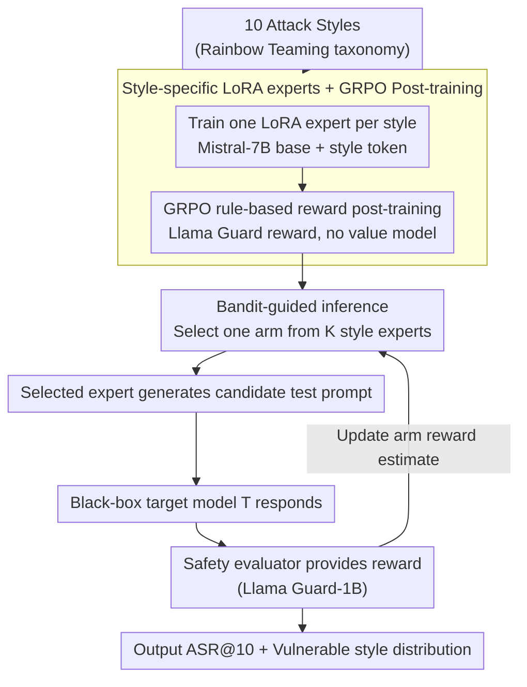

# Red-Bandit: Test-Time Adaptation for LLM Red-Teaming via Bandit-Guided LoRA Experts

**Conference**: ACL2026  
**arXiv**: [2510.07239](https://arxiv.org/abs/2510.07239)  
**Code**: Not provided in cache  
**Area**: LLM Security / Automated Red-Teaming / Test-Time Adaptation  
**Keywords**: LLM Red-Teaming, Multi-Armed Bandit, LoRA Experts, GRPO, Safety Evaluation  

## TL;DR
Red-Bandit models automated LLM red-teaming as an online adaptation problem using "multiple attack-style LoRA experts + test-time bandit routing." It demonstrates the effectiveness of style-level adaptive red-teaming with higher ASR@10 and lower perplexity across various open-source and closed-source target models.

## Background & Motivation
**Background**: Before deployment, LLMs typically require red-teaming to identify security vulnerabilities. Existing automated methods include gradient-based or log-prob-based prompt optimization, black-box iterative search, genetic or fuzzing-style mutations, and RL-trained attack generators.

**Limitations of Prior Work**: Offline prompt optimization relies on source model or gray-box information and cannot adjust strategies in real-time for closed-source targets. Black-box iterative search adapts to targets but incurs high query costs. RL generators produce more readable text but are prone to mode collapse on limited styles.

**Key Challenge**: Red-teaming methods must cover diverse risk styles while quickly identifying the most vulnerable style for a specific target model during testing. A single unified generator struggles to maintain style diversity, readability, and online adaptation simultaneously.

**Goal**: Train a set of lightweight LoRA style experts and use a multi-armed bandit to dynamically select among them during inference to discover style-level weaknesses of target models within a limited query budget.

**Key Insight**: Different attack styles are treated as bandit arms. In each iteration, a specific LoRA expert is selected to generate a test prompt, and the reward estimate for that arm is updated based on the safety evaluation of the target model's response.

**Core Idea**: Shift red-team generation from "one model learning all styles at once" to "multiple style experts trained in parallel, with a bandit selecting the most effective expert at test time," making the exploration-exploitation trade-off explicit.

## Method
Red-Bandit consists of training and inference components. During training, a LoRA attacker expert is trained for each attack style. During inference, the target model remains a black box, and a bandit policy selects the next style expert based on external safety rewards. This note focuses on the framework and evaluation.

### Overall Architecture
Given a target LLM $\mathcal{T}$ and a prompt space $\mathcal{P}$, the goal of automated red-teaming is to find test prompts that expose unsafe responses. Red-Bandit does not search directly in the token space but selects from a set of style experts $\mathcal{A}=\{1,\ldots,K\}$. Each arm corresponds to a LoRA expert, such as role-play, technical jargon, hypothetical scenarios, or emotional manipulation. Once an arm is selected, the corresponding expert generates a candidate test prompt, the target model responds, and a safety evaluator provides a binary or scalar reward used by the bandit to update its policy.

### Key Designs
**1. Style-specific LoRA experts: Partitioning "Diverse Styles" across specialized experts**

A unified generator attempting to learn all attack styles often results in a "mixed yet monotonous" distribution with compromised diversity and readability. Red-Bandit employs a division of labor: using Mistral-7B as the base, it trains 10 LoRA adapters corresponding to styles defined by Rainbow Teaming. Each expert receives a style token via in-context conditioning to generate style-specific safety test prompts. This reduces learning difficulty and improves scalability—adding a new style or domain only requires training one adapter instead of retraining the entire generator.

**2. GRPO Post-training and Rule-based Rewards: Efficient policy gradients for safety evaluation triggering**

Style-specific generation is insufficient; experts must produce candidates that actually trigger safety evaluations. A GRPO variant is used for post-training: instead of a separate value model, the advantage $\hat{A}$ is constructed using the group reward mean. The loss is the clipped policy-gradient:

$$\mathcal{L}_\theta = -\mathbb{E}\big[\min(r_\theta \hat{A},\ \mathrm{clip}(r_\theta, 1-\epsilon, 1+\epsilon)\hat{A})\big]$$

where $r_\theta$ is the ratio of new to old policy probabilities. Removing the value model makes it more cost-effective for lightweight LoRA training. Training rewards come from a rule-based safety model (Llama Guard) judging the prompt rather than querying the target model, avoiding excessive queries during training.

**3. Bandit-guided inference: Online exploration-exploitation for style selection**

Since different target models have different vulnerabilities, a static strategy wastes query budget. Red-Bandit treats each style expert as a bandit arm. During inference, an arm is selected, the expert generates a prompt, and the reward from the target model's response updates the arm's reward estimate. The paper evaluates $\epsilon$-greedy and UCB strategies—the former maintains a fixed ratio of random exploration, while the latter uses an upper confidence bound to encourage exploring less-tested arms. This online selection improves ASR@10 and provides a diagnostic signal regarding the target model's specific weaknesses.

### Loss & Training
The system uses Mistral-7B as the prompt generator base and Llama Guard-8B as the training reward model. During inference, Llama Guard-1B evaluates target responses. Each style expert is trained for 1 epoch, generating 8 candidates per step using LoRA parameter-efficient fine-tuning. Inference strategies include $\epsilon$-greedy ($\epsilon=0.1$) and UCB ($c=\sqrt{2}$).

## Key Experimental Results

### Main Results

| Dataset / Target | Metric | Red-Bandit | Strong Baseline | Remarks |
|---------------|------|------------|--------|------|
| AdvBench / Mistral-7B | ASR@10 | 100.0% | Atoxia 99.2% | UCB PPL 2.31, lower than Atoxia 54.42 |
| AdvBench / Vicuna-7B | ASR@10 | 100.0% | Atoxia 92.3% | $\epsilon$-greedy PPL 1.85 |
| AdvBench / Llama2-7B | ASR@10 | 99.0% UCB / 96.2% $\epsilon$-greedy | AdvPrompter-warmstart 46.1% / Atoxia 41.4% | Significant gain on safer models |
| GPT-4o Black-box | ASR@10 | 93.3% UCB | Atoxia 82.4% | Test-time adaptation outperforms transfer |
| GPT-3.5-turbo Black-box | ASR@10 | 98.1% UCB | Atoxia 92.7% | Atoxia higher on single-shot ASR@1 |

### Ablation Study

| Target Model | Configuration | ASR@1 | Hnorm | PPL |
|----------|------|-------|-------|-----|
| Llama3.1-8B | Baseline, no RL / no Bandit | 38.5 | 0.98 | 2.45 |
| Llama3.1-8B | Red-Bandit, no RL | 50.9 | 0.65 | 2.22 |
| Llama3.1-8B | Red-Bandit, no Bandit | 55.8 | 0.98 | 2.65 |
| Llama3.1-8B | RL + Bandit | 58.7 | 0.67 | 2.62 |

### HarmBench Results (Excerpt)

| Method | Llama2-7B ASR@20 | Vicuna-13B ASR@20 | Qwen-14B ASR@20 |
|------|------------------|-------------------|-----------------|
| GCG-Universal | 20.0 | 80.2 | 75.5 |
| AutoDAN-Universal | 0.5 | 82.5 | 64.5 |
| Red-Bandit $\epsilon$-greedy | 83.5 | 95.9 | 87.5 |
| Red-Bandit UCB | 85.0 | 95.0 | 82.5 |

### Key Findings
- Red-Bandit's advantage is most evident under multi-attempt budgets (ASR@10/ASR@20); for strict ASR@1, Atoxia remains stronger on some targets.
- UCB is better suited for multi-attempt budgets due to balanced exploration; $\epsilon$-greedy favors exploitation in single or few-shot settings.
- Style distribution interprets model weaknesses: different targets are hit more by different styles, making Red-Bandit a diagnostic tool as well as an attack tool.

## Highlights & Insights
- Elevating prompt attacks from token-level search to style-level routing is highly effective and generates diagnostic results.
- Multi-LoRA experts are more modular than a single RL generator. New styles or domains can be added by training a single adapter.
- The use of independent metrics (Llama Guard for training rewards, keyword matching for AdvBench, HarmBench-cls for HarmBench) reduces concerns regarding overfitting to a single reward model.

## Limitations & Future Work
- Inference requires an external rule-based safety evaluator, increasing overhead compared to offline prompt transfer.
- Training complexity increases with the number of styles as each requires separate LoRA post-training.
- When the query budget is extremely limited, the bandit may not have time to identify the optimal arm, potentially falling behind static or transfer methods.
- The method carries potential for misuse; its value lies in controlled safety evaluation, pre-deployment auditing, and defensive diagnostics. Future work should integrate access control and responsible disclosure mechanisms.

## Related Work & Insights
- **vs GCG / AutoDAN**: These focus on token or prompt-level optimization relying on gradients/log-probs; Red-Bandit uses style-level adaptive selection for black-box targets.
- **vs AdvPrompter / Atoxia**: These RL/auxiliary generation methods are mostly trained offline; Red-Bandit updates style selection based on real-time target responses.
- **vs PAIR / TAP**: Iterative black-box searches adapt to targets but have high query costs; Red-Bandit leverages pre-trained experts to reduce per-search generation costs.
- **Insight**: Safety evaluation tools should output "vulnerable style distributions" in addition to "success rates" to better facilitate subsequent defense and behavioral analysis.

## Rating
- Novelty: ⭐⭐⭐⭐☆ The combination of style experts and bandits is simple yet effective.
- Experimental Thoroughness: ⭐⭐⭐⭐☆ Good coverage across AdvBench, HarmBench, and various models; defense-side analysis could be stronger.
- Writing Quality: ⭐⭐⭐⭐☆ Clear methodology and results; safety risk discussions could be more systematic.
- Value: ⭐⭐⭐⭐☆ High value for automated safety evaluation and diagnostics under authorized red-teaming scenarios.

<!-- RELATED:START -->

## Related Papers

- [\[ACL 2026\] STAR-Teaming: A Strategy-Response Multiplex Network Approach to Automated LLM Red Teaming](star-teaming_a_strategy-response_multiplex_network_approach_to_automated_llm_red.md)
- [\[ICLR 2026\] Tree-based Dialogue Reinforced Policy Optimization for Red-Teaming Attacks (DialTree)](../../ICLR2026/llm_safety/tree-based_dialogue_reinforced_policy_optimization_for_red-teaming_attacks.md)
- [\[NeurIPS 2025\] Buffer Layers for Test-Time Adaptation](../../NeurIPS2025/llm_safety/buffer_layers_for_test-time_adaptation.md)
- [\[ICLR 2026\] Auto-RT: Automatic Jailbreak Strategy Exploration for Red-Teaming Large Language Models](../../ICLR2026/llm_safety/auto-rt_automatic_jailbreak_strategy_exploration_for_red-teaming_large_language_.md)
- [\[ICLR 2026\] ARMS: Adaptive Red-Teaming Agent against Multimodal Models with Plug-and-Play Attacks](../../ICLR2026/llm_safety/arms_adaptive_red-teaming_agent_against_multimodal_models_with_plug-and-play_att.md)

<!-- RELATED:END -->
