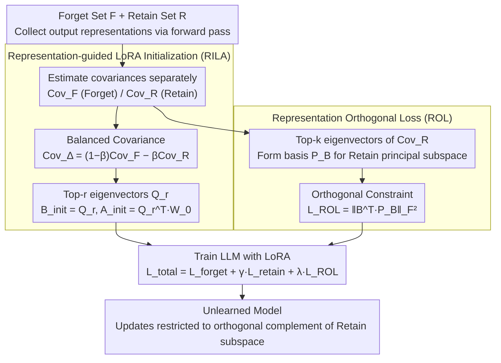

# Representation-Guided Parameter-Efficient LLM Unlearning

**Conference**: ACL 2026 Findings  
**arXiv**: [2604.17396](https://arxiv.org/abs/2604.17396)  
**Code**: [https://github.com/sustech-nlp/ReGLU](https://github.com/sustech-nlp/ReGLU)  
**Area**: Model Compression  
**Keywords**: LLM unlearning, representation space geometry, LoRA initialization, orthogonal regularization, parameter-efficient

## TL;DR

The ReGLU framework is proposed to shift LLM unlearning from a "parameter importance" paradigm to a "representation space geometry" paradigm. By using Representation-guided LoRA Initialization (RILA), unlearning updates are aligned with the most discriminative subspace of the forget/retain sets, while a Representation Orthogonal Loss (ROL) ensures updates do not interfere with retained knowledge.

## Background & Motivation

**Background**: LoRA-based LLM unlearning methods have demonstrated performance comparable to or better than full fine-tuning. however, they still face a difficult "forget-retain trade-off" where reducing performance on the forget set often leads to performance degradation on the retain set.

**Limitations of Prior Work**: Methods like FILA and VILA rely on parameter importance metrics, such as Fisher Information, to identify parameters "related only to the forget set." However, due to superposition, LLM parameters are polysemous—a single parameter participates in representing multiple concepts simultaneously. Consequently, parameter-importance-based methods cannot reliably isolate parameters associated specifically with forgetting or retention.

**Key Challenge**: Parameter-level importance measures are unreliable due to polysemy, yet knowledge of forgetting and retention does manifest in distinct representations within the model. A more reliable signal is needed to guide selective unlearning.

**Goal**: Utilize the geometric properties of the representation subspace (rather than parameter importance) to achieve precise forget-retain separation.

**Key Insight**: Although polysemy exists at the parameter level due to superposition, representation subspaces can be decoupled more effectively. By constraining unlearning updates within a subspace that is "aligned with the forget set representation and orthogonal to the retain set representation," forgotten knowledge can be isolated more accurately.

**Core Idea**: (1) RILA—Construct a balanced covariance matrix $\text{Cov}_\Delta = (1-\beta)\text{Cov}_F - \beta\text{Cov}_R$ and use its top-r eigenvectors to initialize LoRA, maximizing forget set variance while minimizing retain set variance for initial updates; (2) ROL—Constrain the LoRA up-projection matrix B to be orthogonal to the principal subspace of the retain set representations.

## Method

### Overall Architecture

ReGLU consists of two complementary components: RILA determines the initialization direction for LoRA (where the unlearning points), and ROL continuously constrains the updates during training to prevent deviation into the retain set subspace. Both components begin by feeding forget and retain set samples through the model to collect output representations from each linear layer and estimate their covariance. RILA uses the covariance to select the initialization direction, while ROL uses it to define the subspace to be avoided. Finally, both are integrated into training with LoRA. The total loss is defined as $\mathcal{L}_{\text{total}} = \mathcal{L}_{\text{forget}} + \gamma \mathcal{L}_{\text{retain}} + \lambda \mathcal{L}_{\text{ROL}}$.

### Key Designs

**1. Representation-guided LoRA Initialization (RILA): Aligning the initial LoRA direction with max discriminability**

Prior methods (FILA, VILA) use parameter-level importance like Fisher Information to select LoRA initialization directions. However, superposition causes single parameters to encode multiple concepts, making it difficult for importance measures to distinguish parameters that "only handle unlearning." RILA bypasses parameters and directly analyzes representations: for each linear layer, it calculates covariance matrices $\text{Cov}_F$ and $\text{Cov}_R$ from the output representations of forget and retain samples. A balanced covariance $\text{Cov}_\Delta = (1-\beta)\text{Cov}_F - \beta\text{Cov}_R$ is constructed, whose eigenvectors naturally correspond to directions of "high forget set variance and low retain set variance"—subspaces that carry unlearning knowledge without affecting retained knowledge. By setting $B_{\text{init}} = Q_r$ and $A_{\text{init}} = Q_r^\top W_0$, the objective function is maximized at initialization, ensuring the unlearning update targets the most discriminative direction from the start.

**2. Representation Orthogonal Loss (ROL): Keeping updates within the safe subspace during training**

Correct initialization is insufficient as gradient updates may drift, potentially eroding the geometric advantages of initialization. ROL imposes a continuous constraint: the basis $P_B \in \mathbb{R}^{d_{\text{out}} \times k}$ is constructed using the top-k eigenvectors of the retain set covariance matrix, characterizing the primary directions of retained knowledge. A penalty term $\mathcal{L}_{\text{ROL}} = \|B^\top P_B\|_F^2$ is added to the total loss, forcing the column vectors of the LoRA up-projection matrix $B$ to remain orthogonal to these primary directions. Consequently, $\Delta h = B(Ax)$ always falls within the orthogonal complement of the retain set subspace, ensuring unlearning updates do not contaminate retained knowledge. RILA manages the "starting point" while ROL manages the "trajectory."

**3. Compatibility with Existing Unlearning Losses: Decoupling framework from objectives**

ReGLU provides geometric initialization and constraints and does not dictate how the unlearning signal itself is calculated. Therefore, $\mathcal{L}_{\text{forget}}$ can be substituted with any existing unlearning loss such as Gradient Ascent (GA), NPO, SimNPO, or IHL. This orthogonality allows ReGLU to function as a plug-and-play enhancement, overlaying the advantages of representation geometry onto whichever unlearning loss is most suitable for the task.

### Loss & Training

The total loss is $\mathcal{L}_{\text{total}} = \mathcal{L}_{\text{forget}} + \gamma \mathcal{L}_{\text{retain}} + \lambda \mathcal{L}_{\text{ROL}}$. Evaluation was conducted using Llama-2-7B, Phi-1.5B, and Zephyr-7B-beta on TOFU and WMDP benchmarks.

## Key Experimental Results

### Main Results

| Model/Method | TOFU Forget 1% | Forget 5% | Forget 10% | Average |
|----------|---------------|-----------|------------|------|
| Phi-1.5B IHL | -1.3 | -11.5 | -12.4 | -8.4 |
| Phi-1.5B IHL+FILA | -2.5 | -9.3 | -10.3 | -7.4 |
| Phi-1.5B IHL+ReGLU | **-0.1** | **-5.4** | **-7.7** | **-4.4** |

### Ablation Study

| Configuration | Effect | Description |
|------|------|------|
| RILA Only (No ROL) | Improved but insufficient | Correct initialization but drifts during training |
| ROL Only (Random Init) | Limited improvement | Effective constraint but poor starting point |
| RILA + ROL | Optimal | Synergy between initialization and continuous constraint |

### Key Findings

- ReGLU consistently outperforms FILA and VILA across all unlearning loss functions.
- IHL + ReGLU improved the average metric on Phi-1.5B from -7.4 (FILA) to -4.4.
- Geometric diagnostics confirm that ReGLU successfully decouples representations of forgetting and retention.
- Consistent advantages on the WMDP benchmark demonstrate strong cross-task generalization.

## Highlights & Insights

- **Paradigm shift from "parameter importance" to "representation geometry"**: This is the core contribution. Superposition makes parameter-level signals unreliable, whereas the geometric structure of representation subspaces provides a stable signal for separation. This insight may shift methodologies across the LLM unlearning field.
- **Elegant construction of the balanced covariance matrix**: The eigenvectors of $\text{Cov}_\Delta = (1-\beta)\text{Cov}_F - \beta\text{Cov}_R$ naturally align with the direction of "high forget variance, low retain variance," providing a theoretically grounded and intuitive approach.
- **Complementary design of RILA and ROL**: One manages the "departure" and the other ensures the update "does not deviate" into restricted areas.

## Limitations & Future Work

- Computational cost involved in collecting representations and calculating covariances.
- Hyperparameters $\beta$ (balance coefficient) and $k$ (ROL basis dimension) require tuning.
- Validated only on relatively small models (1.5B-7B).
- Covariance estimation quality depends on sample size; extremely small forget sets (1%) may introduce noise.

## Related Work & Insights

- **vs FILA/VILA (Parameter Importance Methods)**: Parameter selection based on Fisher Information is limited by superposition; ReGLU bypasses this issue via representation geometry.
- **vs ETW (Token-level Methods)**: While ETW focuses on "which tokens to penalize," ReGLU focuses on "which subspace to update." The two are orthogonal and can be combined.

## Rating

- Novelty: ⭐⭐⭐⭐⭐ Substantiative innovation in shifting to representation geometry with solid theoretical support.
- Experimental Thoroughness: ⭐⭐⭐⭐ Extensive testing across two benchmarks, three models, and multiple unlearning objectives.
- Writing Quality: ⭐⭐⭐⭐ Clear motivation and rigorous theoretical derivation.

<!-- RELATED:START -->

## Related Papers

- [\[CVPR 2026\] FairLLaVA: Fairness-Aware Parameter-Efficient Fine-Tuning for Large Vision-Language Models](../../CVPR2026/llm_safety/fairllava_fairness-aware_parameter-efficient_fine-tuning_for_large_vision-langua.md)
- [\[ICLR 2026\] LLM Unlearning with LLM Beliefs](../../ICLR2026/llm_safety/llm_unlearning_with_llm_beliefs.md)
- [\[ACL 2026\] SWAN: Semantic Watermarking with Abstract Meaning Representation](swan_semantic_watermarking_with_abstract_meaning_representation.md)
- [\[ACL 2026\] From Domains to Instances: Dual-Granularity Data Synthesis for LLM Unlearning](from_domains_to_instances_dual-granularity_data_synthesis_for_llm_unlearning.md)
- [\[AAAI 2026\] ALTER: Asymmetric LoRA for Token-Entropy-Guided Unlearning of LLMs](../../AAAI2026/llm_safety/alter_asymmetric_lora_for_token-entropy-guided_unlearning_of.md)

<!-- RELATED:END -->
