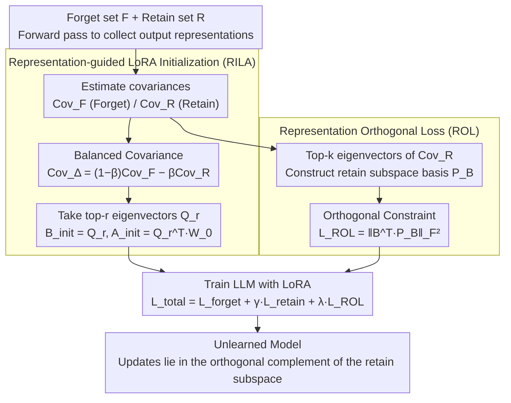

# Representation-Guided Parameter-Efficient LLM Unlearning

**Conference**: ACL 2026 Findings  
**arXiv**: [2604.17396](https://arxiv.org/abs/2604.17396)  
**Code**: [https://github.com/sustech-nlp/ReGLU](https://github.com/sustech-nlp/ReGLU)  
**Area**: Model Compression  
**Keywords**: LLM Unlearning, Representation Space Geometry, LoRA Initialization, Orthogonal Regularization, Parameter Efficiency

## TL;DR

This paper proposes the ReGLU framework, shifting LLM unlearning from the "parameter importance" paradigm to a "representation space geometry" paradigm. By using Representation-guided LoRA Initialization (RILA), the unlearning updates are aligned with the most discriminative subspace of the forget/retain sets, coupled with a Representation Orthogonal Loss (ROL) to constrain updates from interfering with retain set knowledge.

## Background & Motivation

**Background**: LoRA-based LLM unlearning methods have demonstrated performance comparable to or even better than full fine-tuning. However, they still face a difficult "forget-retain trade-off" where reducing performance on the forget set often comes at the cost of performance degradation on the retain set.

**Limitations of Prior Work**: Methods such as FILA and VILA rely on parameter importance metrics like Fisher Information to identify parameters "relevant only to the forget set." However, due to the phenomenon of superposition, LLM parameters are polysemantic—a single parameter participates in the representation of multiple concepts simultaneously. Consequently, parameter importance-based methods cannot reliably isolate parameters related to forgetting from those related to retention.

**Key Challenge**: Parameter-level importance measures are unreliable due to polysemanticity, yet the forget and retain knowledge indeed have distinct representations within the model. A more reliable signal is needed to guide selective unlearning.

**Goal**: To achieve precise forget-retain separation by leveraging the geometric properties of representation subspaces rather than parameter importance.

**Key Insight**: While polysemanticity leads to overlapping at the parameter level, representation subspaces can be decoupled more effectively. By constraining unlearning updates to a subspace that is "aligned with forget set representations and orthogonal to retain set representations," the unlearned knowledge can be more accurately isolated.

**Core Idea**: (1) RILA: Construct a balanced covariance matrix $\text{Cov}_\Delta = (1-\beta)\text{Cov}_F - \beta\text{Cov}_R$ and use its top-r eigenvectors to initialize LoRA, ensuring initial updates maximize forget set variance while minimizing retain set variance. (2) ROL: Constrain the LoRA up-projection matrix $B$ to be orthogonal to the principal subspace of the retain set representations.

## Method

### Overall Architecture

ReGLU consists of two complementary components: RILA determines the initialization direction of LoRA (pointing towards which subspace to unlearn), and ROL continuously constrains updates during training to prevent deviation into the retain set subspace. Both components first perform a forward pass on forget and retain set samples to collect output representations from each linear layer and estimate their covariances. RILA uses the covariance to select initialization directions, while ROL uses it to construct the subspace to be avoided. Both are integrated into LoRA-based training. The total loss is $\mathcal{L}_{\text{total}} = \mathcal{L}_{\text{forget}} + \gamma \mathcal{L}_{\text{retain}} + \lambda \mathcal{L}_{\text{ROL}}$.

### Key Designs

**1. Representation-guided LoRA Initialization (RILA): Aligning LoRA's starting direction with the most discriminative subspace.**

Prior methods (FILA, VILA) use parameter-level importance like Fisher Information to select LoRA initialization directions. However, superposition allows a single parameter to encode multiple concepts, making it difficult for importance measures to distinguish which parameters "only manage forgetting." RILA bypasses parameters and looks directly at representations. For each linear layer, it collects output representations for forget and retain set samples and calculates covariance matrices $\text{Cov}_F$ and $\text{Cov}_R$. It then constructs a balanced covariance $\text{Cov}_\Delta = (1-\beta)\text{Cov}_F - \beta\text{Cov}_R$. Its eigenvectors naturally correspond to directions with high forget set variance and low retain set variance—subspaces that carry forget knowledge without touching retain knowledge. The top-r eigenvectors form $Q_r$, setting $B_{\text{init}} = Q_r$ and $A_{\text{init}} = Q_r^\top W_0$. The paper proves that this initialization maximizes the objective function, effectively aiming the unlearning update at the most discriminative direction from the start.

**2. Representation Orthogonal Loss (ROL): Keeping updates within the safe subspace throughout training.**

Correct initialization is insufficient as gradient updates may drift during training, potentially eroding the geometric advantages of initialization. ROL introduces a continuous constraint by using the top-k eigenvectors of the retain set representation covariance matrix to form a basis $P_B \in \mathbb{R}^{d_{\text{out}} \times k}$, characterizing the primary directions of retain set knowledge. An additional term $\mathcal{L}_{\text{ROL}} = \|B^\top P_B\|_F^2$ is added to the total loss, forcing the column vectors of the LoRA up-projection matrix $B$ to be orthogonal to these principal directions. Consequently, $\Delta h = B(Ax)$ always falls within the orthogonal complement of the retain set subspace. RILA manages "where to start," while ROL manages "where not to go," together confining unlearning to a safe subspace.

**3. Compatibility with Existing Unlearning Losses: ReGLU only modifies initialization and regularization.**

ReGLU provides geometric initialization and constraints without dictating the unlearning signal itself. Therefore, $\mathcal{L}_{\text{forget}}$ can be replaced with any existing unlearning loss such as Gradient Ascent (GA), NPO, SimNPO, or IHL. This orthogonality makes ReGLU a plug-and-play enhancement—users can select the unlearning loss best suited for their task, and ReGLU adds the advantages of representation geometry without reinventing unlearning objectives.

### Loss & Training

The total loss is $\mathcal{L}_{\text{total}} = \mathcal{L}_{\text{forget}} + \gamma \mathcal{L}_{\text{retain}} + \lambda \mathcal{L}_{\text{ROL}}$. Evaluations were conducted on TOFU and WMDP benchmarks using models including Llama-2-7B, Phi-1.5B, and Zephyr-7B-beta.

## Key Experimental Results

### Main Results

| Model/Method | TOFU Forget 1% | Forget 5% | Forget 10% | Average |
|----------|---------------|-----------|------------|------|
| Phi-1.5B IHL | -1.3 | -11.5 | -12.4 | -8.4 |
| Phi-1.5B IHL+FILA | -2.5 | -9.3 | -10.3 | -7.4 |
| Phi-1.5B IHL+ReGLU | **-0.1** | **-5.4** | **-7.7** | **-4.4** |

### Ablation Study

| Configuration | Effect | Description |
|------|------|------|
| RILA only (no ROL) | Improvement, but insufficient | Correct starting point but drifts during training |
| ROL only (random init) | Limited improvement | Effective constraint but poor starting point |
| RILA + ROL | Optimal | Synergy of initialization + continuous constraint |

### Key Findings

- ReGLU consistently outperforms FILA and VILA across all unlearning loss functions.
- IHL + ReGLU improved the average metric on Phi-1.5B from -7.4 (FILA) to -4.4.
- Geometric diagnostics confirm that ReGLU successfully decouples forget and retain representations.
- Consistent advantages shown on the WMDP benchmark demonstrate cross-task generalization.

## Highlights & Insights

- **The paradigm shift from "parameter importance" to "representation geometry" is the core contribution**: Superposition makes parameter-level signals unreliable, whereas the geometric structure of representation subspaces provides a more stable separation signal. This insight may drive a methodological shift in the field of LLM unlearning.
- **Elegant construction of the balanced covariance matrix**: The eigenvectors of $\text{Cov}_\Delta = (1-\beta)\text{Cov}_F - \beta\text{Cov}_R$ naturally align with directions of "high forget set variance but low retain set variance," which is conceptually intuitive and theoretically supported.
- **Complementary design of RILA and ROL**: One manages the starting point, while the other ensures the trajectory remains within safe bounds.

## Limitations & Future Work

- Requires collecting representations of forget and retain sets to calculate covariance, entailing preprocessing computational costs.
- Hyperparameters $\beta$ (balance coefficient) and $k$ (ROL basis dimension) require tuning.
- Validated only on relatively small-scale models (1.5B-7B).
- The quality of covariance estimation depends on the number of samples; extremely small forget sets (e.g., 1%) may introduce noise.

## Related Work & Insights

- **vs. FILA/VILA (Parameter Importance Methods)**: Parameter selection based on Fisher Information is limited by superposition. ReGLU bypasses this issue by utilizing representation geometry.
- **vs. ETW (Token-level Methods)**: ETW focuses on "which tokens to penalize," while ReGLU focuses on "which subspace to update." The two are orthogonal and can be combined.

## Rating

- Novelty: ⭐⭐⭐⭐⭐ The paradigm shift to representation geometry is a substantial innovation with solid theoretical backing.
- Experimental Thoroughness: ⭐⭐⭐⭐ Extensive testing across two benchmarks, three models, and multiple unlearning objectives.
- Writing Quality: ⭐⭐⭐⭐ Clear motivation and rigorous theoretical derivation.

<!-- RELATED:START -->

## Related Papers

- [\[ICLR 2026\] CLUE: Conflict-guided Localization for LLM Unlearning Framework](../../ICLR2026/llm_safety/clue_conflict-guided_localization_for_llm_unlearning_framework.md)
- [\[ICLR 2026\] LLM Unlearning with LLM Beliefs](../../ICLR2026/llm_safety/llm_unlearning_with_llm_beliefs.md)
- [\[ACL 2026\] SWAN: Semantic Watermarking with Abstract Meaning Representation](swan_semantic_watermarking_with_abstract_meaning_representation.md)
- [\[ACL 2026\] Modeling LLM Unlearning as an Asymmetric Two-Task Learning Problem](modeling_llm_unlearning_as_an_asymmetric_two-task_learning_problem.md)
- [\[ACL 2026\] Unlearners Can Lie: Evaluating and Improving Honesty in LLM Unlearning](unlearners_can_lie_evaluating_and_improving_honesty_in_llm_unlearning.md)

<!-- RELATED:END -->
