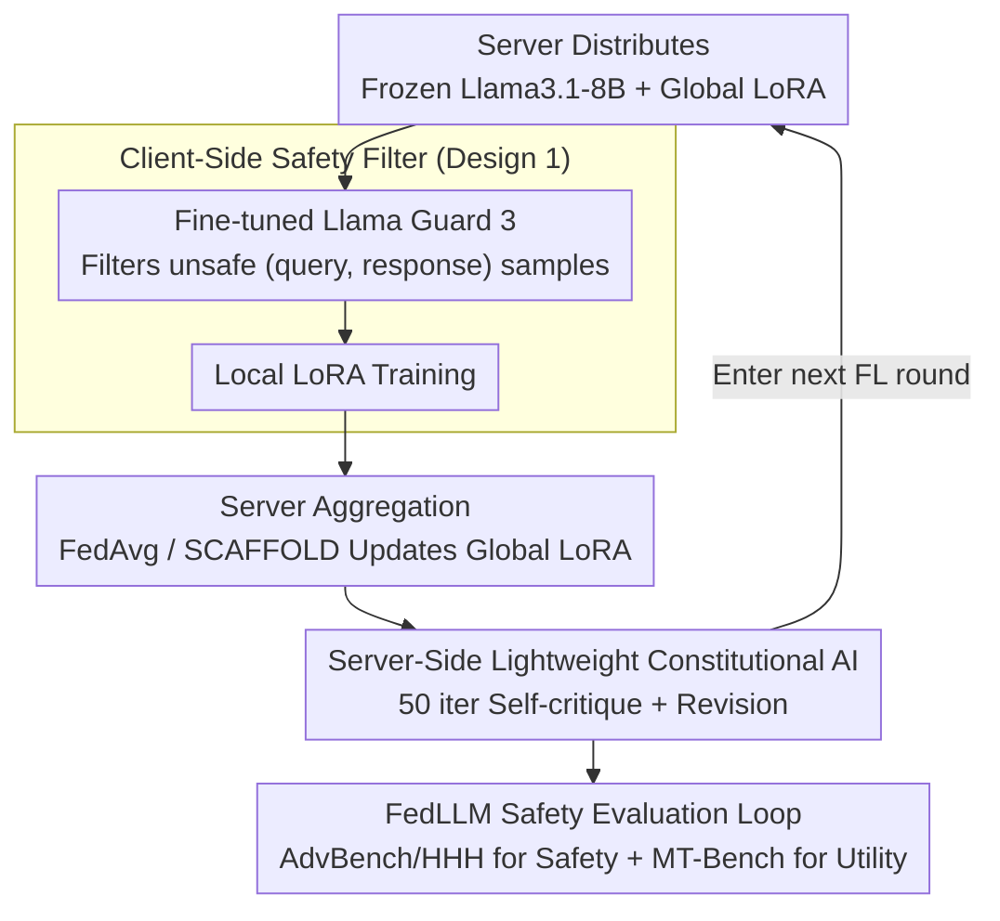

# Responsible Federated LLMs via Safety Filtering and Constitutional AI

**Conference**: ACL2026  
**arXiv**: [2502.16691](https://arxiv.org/abs/2502.16691)  
**Code**: None  
**Area**: LLM Safety / Federated Learning  
**Keywords**: Federated LLM, Safety Filtering, Constitutional AI, LoRA, Responsible AI

## TL;DR
This paper integrates safety filters and Constitutional AI into the FedLLM workflow, demonstrating that harmful client data significantly impairs global model safety. It shows that filtering data at the client side and performing low-cost CAI fine-tuning at the server side can pull AdvBench safety scores from approximately 72% back to over 96%.

## Background & Motivation
**Background**: FedLLM aims to use Federated Learning to fine-tune Large Language Models on user-side data while avoiding the upload of raw private data to the server. A typical workflow involves the server distributing a frozen pre-trained LLM and global LoRA weights; clients then train local LoRAs and upload only these weights for aggregation.

**Limitations of Prior Work**: Past FedLLM research has focused primarily on privacy, communication, and parameter-efficient training, while rarely addressing Responsible AI (RAI) issues. Real-world client conversations are not always clean and may contain hate speech, harassment, bias, or harmful responses induced by red-teaming prompts. Once these samples enter local training, the local LoRA learns unsafe behaviors, which then spread the risk to all clients after aggregation.

**Key Challenge**: Federated learning ensures data remains on the device, but this also prevents the server from directly cleaning client data. Simultaneously, performing complex safety alignment at every client and in every round incurs unacceptable computational costs. Federated LLMs thus require a safety mechanism that is both affordable and respects privacy boundaries.

**Goal**: The authors aim to answer three questions: To what extent do harmful responses undermine FedLLM safety; can existing RAI techniques be integrated in a federated-friendly manner; and can significant safety gains still be achieved under constrained computational budgets.

**Key Insight**: Instead of reinventing safety alignment algorithms, the paper selects two mature components: client-side safety filters for pre-training data cleaning, and server-side CAI for post-training behavioral correction of the global model. This split corresponds precisely to the two risk points in FedLLM: local data pollution and global model diffusion.

**Core Idea**: Utilizing a "client-side data filtering + server-side lightweight CAI" dual-layer safety guardrail to block harmful training samples locally in FedLLM and perform safety self-correction on the aggregated global model.

## Method

### Overall Architecture
This work is based on LoRA federated fine-tuning in the style of OpenFedLLM. The server first distributes the frozen Llama3.1-8B-Instruct and the current global LoRA weights; clients train local LoRAs using local data and upload them; the server aggregates weights using FedAvg or SCAFFOLD to update the global LoRA. The authors insert two RAI processing steps into this loop: before training, each client uses the Llama Guard 3 safety filter provided by the server to screen out unsafe `(query, response)` samples; after aggregation, the server performs a small amount of Constitutional AI training on the global model to enable self-critique and revision of harmful answers.

The key to this design is that safety operations do not require the server to read raw client data. The filter can be distributed as a model to run locally on clients, while CAI only acts on the global model weights already held by the server. In other words, it handles "data-side risks" and "model-side risks" at their respective manageable locations.

### Key Designs
**1. Client-Side Safety Filter: Blocking bad samples before training under local data constraints**

Since FedLLM servers cannot see raw client data, traditional centralized data cleaning is unfeasible. Thus, data cleaning must occur locally on the client. The authors distribute Llama Guard 3 as a `(query, response)` safety classifier to the clients. Before local LoRA training, samples judged as unsafe are removed, reducing the probability of harmful responses entering the federated aggregation at the source. However, directly using the original LG3 is insufficient—it classifies almost all samples as safe for this task, with a recall of only 0.5%; the authors thus fine-tune it on S-LG20K to adapt it to SQuARe-style data. Choosing a filter is particularly suitable for federated scenarios: it requires only local inference without extra client training, making the overhead naturally friendly.

**2. Server-Side Lightweight Constitutional AI: Low-cost global safety self-correction post-aggregation**

Filters can only block bad data from entering training; they are powerless against unsafe tendencies already embedded in the model behavior. Therefore, correction is needed on the global model after aggregation. The authors utilize Constitutional AI: the model self-critiques and revises its behavior based on "constitutive" principles such as "do not generate harmful responses," and is then trained on the revised data. The critical factor is cost control—running a full CAI epoch every round takes about 80 minutes on 4 A100 GPUs, which is impractical for every federated loop. The authors reduce this to only 50 iterations on the global model, taking approximately 3.2 minutes per round—a 96% reduction in computation time—while retaining most safety gains. CAI only affects the global weights held by the server, thus maintaining privacy boundaries.

**3. FedLLM Safety Evaluation Loop: Monitoring both safety and utility to avoid "refusal-only" models**

Testing only safety filtering fails to show if the global model can still provide useful answers; testing only a single federated algorithm fails to prove if the solution depends on a specific aggregator. Consequently, the authors built a dual-dimension evaluation loop: Safety is measured via AdvBench and HHH, while utility is measured via MT-Bench. Federated algorithms include both FedAvg and SCAFFOLD. The training set SQuARe20K was intentionally constructed as a mixture of 6K red-teamed and 14K acceptable samples, with approximately 30% harmful content per client to realistically simulate polluted federated data distributions. This loop validates the conclusion that "safety scores recover without utility collapsing, independent of the aggregator."

### Loss & Training
The base LLM is Llama3.1-8B-Instruct, fine-tuned via LoRA. The experimental setup involves 20 clients, 50 federated rounds, sampling 5 clients per round, with 25 iterations per client per round and a batch size of 16. SQuARe20K is divided equally into 20 parts, each with 1K samples. LG3 is trained for 5 epochs on S-LG20K; CAI uses S-CAI20K to perform approximately 50 iterations of lightweight training on the global model. The paper does not propose a new loss function; its primary contribution is adapting the location, frequency, and cost constraints of safety filtering and CAI to FedLLM.

## Key Experimental Results

### Main Results

| Federated Algorithm | Method | AdvBench Safety Score | HHH Safety Score | MT-Bench Utility |
|----------|------|----------------|------------|-----------------|
| FedAvg | Llama3.1-8B-Instruct | 99.6 | 60.0 | 6.8 |
| FedAvg | FL | 72.5 | 49.3 | 2.7 |
| FedAvg | FL + Safety filter | 81.2 | 51.8 | 2.4 |
| FedAvg | FL + CAI | 96.2 | 57.3 | 5.8 |
| FedAvg | FL + Safety filter + CAI | 96.3 | 63.7 | 6.1 |
| SCAFFOLD | FL | 72.7 | 49.5 | 2.9 |
| SCAFFOLD | FL + Safety filter | 78.8 | 54.6 | 2.7 |
| SCAFFOLD | FL + CAI | 96.5 | 62.6 | 5.9 |
| SCAFFOLD | FL + Safety filter + CAI | 97.1 | 63.9 | 5.8 |

### Ablation Study

| Configuration | Key Metric | Description |
|------|---------|------|
| Original LG3 | Acc. 70.1 / Precision 90.6 / Recall 0.5 / Hmean 1.0 | Fails to catch unsafe samples; unsuitable as a client filter |
| Finetuned LG3 | Acc. 75.5 / Precision 56.7 / Recall 73.7 / Hmean 64.1 | Significant recall improvement; suitable for pre-training filter |
| Full CAI | ~80 mins per round | 1 epoch on 4 A100s; cost is unsuitable for every FL round |
| Lightweight CAI | ~3.2 mins per round | Only 50 iterations; reduction of 96% in training time |

### Key Findings
- Harmful local data significantly damages FedLLM: AdvBench for FedAvg drops from 99.6 to 72.5, HHH from 60.0 to 49.3, and MT-Bench from 6.8 to 2.7.
- Safety filters used alone improve safety but may slightly impair utility; CAI alone shows more significant improvements, raising AdvBench from 72.5 to 96.2 and MT-Bench from 2.7 to 5.8 under FedAvg.
- The combination of both yields complementary gains on HHH: FedAvg HHH increases from 57.3 (CAI only) to 63.7, indicating that data-side cleaning and model-side alignment address different risks.

## Highlights & Insights
- The most significant value of the paper is not a new algorithm, but pointing out the safety propagation risk in FedLLM: harmful data from a single client can become a shared global risk through aggregation, which is more critical than in single-machine fine-tuning.
- The division of labor between the safety filter and CAI is clear: the former prevents bad samples from entering training, while the latter corrects emerging model behaviors. This dual-layer structure is transferable to federated alignment in privacy-sensitive fields like healthcare or finance.
- The experiments with lightweight CAI are highly practical. Although it lacks a full comparison with standard CAI, the "96% cost reduction with nearly recovered safety scores" suggests that a small amount of global safety correction is more cost-effective than frequent client-side alignment.

## Limitations & Future Work
- The authors acknowledge the lack of experiments with standard CAI settings (i.e., full epochs for every client and round), making it impossible to judge the safety gap between lightweight and full CAI.
- The safety filter's recall is still not perfect; the Hmean of Finetuned LG3 is only 64.1%, meaning some harmful training samples will still leak through.
- Experiments simulate only a 30% harmful content ratio with 20 clients; real-world FedLLM heterogeneity, attacker ratios, and malicious data distributions could be much more complex.
- Future work could investigate stronger local safety classifiers, strategies for dynamically triggering CAI based on risk, and joint evaluations between privacy attacks, backdoor attacks, and safety alignment.

## Related Work & Insights
- **vs OpenFedLLM**: OpenFedLLM provides a FedLLM training and evaluation framework; this paper adds RAI components to it, focusing on safety degradation resulting from harmful training data.
- **vs Llama Guard 3**: LG3 is originally a general safety classifier, but this paper finds its direct transfer for FedLLM data filtering is poor, requiring fine-tuning on S-LG20K for usable recall.
- **vs Constitutional AI**: Traditional CAI is typically executed fully in centralized training; this paper adapts it to a low-iteration version acting only on the global model to fit federated computational constraints.
- **Insight**: For Federated LLMs, "privacy protection" does not equal "safety and trust"; future FedLLM papers should include local data pollution, global diffusion, and safety alignment costs as default evaluation dimensions.

## Rating
- Novelty: ⭐⭐⭐⭐☆ The integration of mature RAI technologies into FedLLM positions is straightforward, but the problem definition and empirical risk evidence are novel.
- Experimental Thoroughness: ⭐⭐⭐⭐☆ Covers FedAvg/SCAFFOLD, safety/utility, and cost analysis, though lacks standard CAI, varying attack ratios, and real client heterogeneity experiments.
- Writing Quality: ⭐⭐⭐⭐☆ Structure is clear, the main table directly supports conclusions, and the method section is concise yet understandable.
- Value: ⭐⭐⭐⭐☆ Provides a strong reminder for FedLLM safety research, especially as a baseline for future work on federated alignment, safety filtering, and client risk modeling.

<!-- RELATED:START -->

## Related Papers

- [\[ACL 2026\] SHAPE: Unifying Safety, Helpfulness and Pedagogy for Educational LLMs](shape_unifying_safety_helpfulness_and_pedagogy_for_educational_llms.md)
- [\[AAAI 2026\] FedP²EFT: Federated Learning to Personalize PEFT for Multilingual LLMs](../../AAAI2026/llm_safety/fedp2eft_federated_learning_to_personalize_peft_for_multilingual_llms.md)
- [\[ACL 2026\] Robust Multimodal Safety via Conditional Decoding](robust_multimodal_safety_via_conditional_decoding.md)
- [\[ICML 2026\] BioAgent Bench: An AI Agent Evaluation Suite for Bioinformatics](../../ICML2026/llm_safety/bioagent_bench_an_ai_agent_evaluation_suite_for_bioinformatics.md)
- [\[ACL 2026\] XOXO: Stealthy Cross-Origin Context Poisoning Attacks against AI Coding Assistants](xoxo_stealthy_cross-origin_context_poisoning_attacks_against_ai_coding_assistant.md)

<!-- RELATED:END -->
