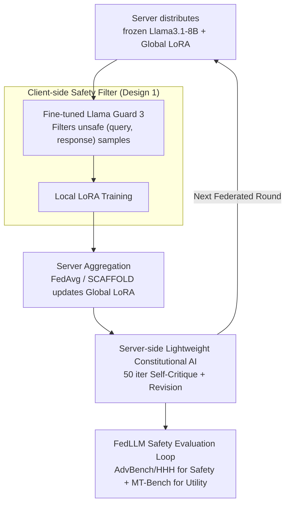

# Responsible Federated LLMs via Safety Filtering and Constitutional AI

**Conference**: ACL2026  
**arXiv**: [2502.16691](https://arxiv.org/abs/2502.16691)  
**Code**: None  
**Area**: LLM Safety / Federated Learning  
**Keywords**: Federated LLM, Safety Filtering, Constitutional AI, LoRA, Responsible AI

## TL;DR
This paper integrates safety filters and Constitutional AI (CAI) into the FedLLM workflow. It demonstrates that harmful client data significantly compromises global model safety, while client-side filtering combined with low-cost server-side CAI fine-tuning can restore AdvBench safety scores from approximately 72% to over 96%.

## Background & Motivation
**Background**: FedLLM aims to utilize Federated Learning to fine-tune Large Language Models on user-side data while preventing the transmission of raw private data to the server. A typical pipeline involves the server distributing a frozen pre-trained LLM and global LoRA weights, with clients training local LoRAs and uploading them for aggregation.

**Limitations of Prior Work**: Previous FedLLM research has primarily focused on privacy, communication efficiency, and parameter-efficient training, largely neglecting Responsible AI (RAI) issues. Real-world client dialogues are not always clean and may contain hate speech, harassment, bias, or harmful responses induced by red-teaming prompts. Once these samples are included in local training, the local LoRA learns unsafe behaviors, which then diffuse to all clients through aggregation.

**Key Challenge**: While Federated Learning protects data privacy by keeping data on the device, it prevents the server from directly cleaning client data. Simultaneously, implementing complex safety alignment at every client in each round incurs prohibitive computational costs. Therefore, FedLLM requires a safety mechanism that respects privacy boundaries while remaining computationally affordable.

**Goal**: The authors aim to answer three questions: to what extent harmful responses compromise FedLLM safety; whether existing RAI techniques can be integrated in a federated-friendly manner; and whether significant safety gains can be achieved under constrained computational budgets.

**Key Insight**: Instead of reinventing safety alignment algorithms, the paper selects two mature components: client-side safety filters for pre-training data cleaning, and server-side CAI for post-training behavioral correction. This division addresses the two primary risk points in FedLLM: local data contamination and global model diffusion.

**Core Idea**: A dual-layer safety guardrail consisting of "client-side data filtering + server-side lightweight CAI" is proposed to block harmful training samples locally and perform safety self-correction on the aggregated global model.

## Method

### Overall Architecture
This work is built upon OpenFedLLM-style LoRA federated fine-tuning. The server first distributes the frozen Llama3.1-8B-Instruct and current global LoRA weights. Clients train LoRA on local data and upload the weights. The server aggregates them using FedAvg or SCAFFOLD. The researchers insert two RAI processes into this loop: Before training, each client uses a Llama Guard 3 safety filter provided by the server to filter out unsafe `(query, response)` samples. After aggregation, the server performs minimal Constitutional AI training on the global model, allowing it to learn to critique and revise harmful responses.

The key to this design is that safety operations do not require the server to access raw client data. The filter is deployed to clients as a model for local inference, while CAI is applied only to the global weights already held by the server. Essentially, it treats "data-side risk" and "model-side risk" at their respective accessible locations.

### Key Designs
**1. Client-side Safety Filter: Blocking bad samples before training under local data constraints**

Since the FedLLM server cannot access raw client data, centralized data cleaning is impossible. Cleaning must occur locally on the client. The authors deploy Llama Guard 3 (LG3) as a `(query, response)` safety classifier to the clients. Before local LoRA training, samples identified as unsafe are removed, reducing the probability of harmful responses entering the federated aggregation at the source. However, vanilla LG3 performed poorly, classifying almost all samples as safe with a recall of only 0.5%. Thus, the authors first fine-tuned LG3 on S-LG20K to adapt it to SQuARe-style data. Choosing a filter is computationally efficient for federated scenarios as it only requires local inference.

**2. Server-side Lightweight Constitutional AI: Low-cost global safety correction**

Filters can only block bad data from entering training; they cannot correct unsafe tendencies already embedded in the model's behavioral layers. This necessitates a post-aggregation correction of the global model. The authors utilize Constitutional AI (CAI), where the model critiques and revises its own responses based on "constitutional" principles (e.g., "do not generate harmful content"). To control costs, instead of a full epoch (which took ~80 minutes per round on 4 A100s), the authors reduced CAI to only 50 iterations per round, taking approximately 3.2 minutes. This reduces computation time by 96% while maintaining the majority of safety gains. CAI acts only on global weights, preserving privacy boundaries.

**3. FedLLM Safety Evaluation Loop: Balancing safety and utility**

To ensure the model does not merely learn to refuse all questions, the authors established a dual-dimension evaluation loop. Safety is measured using AdvBench and HHH, while utility is measured using MT-Bench, across both FedAvg and SCAFFOLD algorithms. The SQuARe20K training set was intentionally constructed as a mixture of 6K red-teamed and 14K acceptable samples, ensuring each client has roughly 30% harmful content to simulate a contaminated federated data distribution. This loop validates that safety is restored without a collapse in utility, regardless of the aggregator used.

### Loss & Training
The base LLM is Llama3.1-8B-Instruct, fine-tuned via LoRA. The experimental setup involves 20 clients, 50 federated rounds, sampling 5 clients per round, with 25 iterations per client per round and a batch size of 16. SQuARe20K is partitioned equally among the 20 clients. LG3 is trained for 5 epochs on S-LG20K. CAI uses S-CAI20K with approximately 50 iterations of lightweight training on the global model. The primary contribution lies in the positioning, frequency, and cost-adaptation of RAI components within FedLLM rather than a new loss function.

## Key Experimental Results

### Main Results

| Algorithm | Method | AdvBench Safety | HHH Safety | MT-Bench Utility |
|----------|------|----------------|------------|-----------------|
| FedAvg | Llama3.1-8B-Instruct | 99.6 | 60.0 | 6.8 |
| FedAvg | FL | 72.5 | 49.3 | 2.7 |
| FedAvg | FL + Safety filter | 81.2 | 51.8 | 2.4 |
| FedAvg | FL + CAI | 96.2 | 57.3 | 5.8 |
| FedAvg | FL + Safety filter + CAI | 96.3 | 63.7 | 6.1 |
| SCAFFOLD | FL | 72.7 | 49.5 | 2.9 |
| SCAFFOLD | FL + Safety filter | 78.8 | 54.6 | 2.7 |
| SCAFFOLD | FL + CAI | 96.5 | 62.6 | 5.9 |
| SCAFFOLD | FL + Safety filter + CAI | 97.1 | 63.9 | 5.8 |

### Ablation Study

| Configuration | Key Metrics | Description |
|------|---------|------|
| Original LG3 | Acc. 70.1 / Precision 90.6 / Recall 0.5 / Hmean 1.0 | Fails to catch unsafe samples; unsuitable as a client filter. |
| Finetuned LG3 | Acc. 75.5 / Precision 56.7 / Recall 73.7 / Hmean 64.1 | Significant recall improvement; suitable for pre-training filtering. |
| Full CAI | ~80 min per round | 1 epoch on 4 A100s; cost is too high for every federated round. |
| Lightweight CAI | ~3.2 min per round | Train for 50 iterations; reduces training time by 96%. |

### Key Findings
- Harmful local data severely degrades FedLLM: In FedAvg, AdvBench dropped from 99.6 to 72.5, HHH from 60.0 to 49.3, and MT-Bench from 6.8 to 2.7.
- Safety filters alone improve safety but may slightly hinder utility. CAI alone shows more significant improvements, raising AdvBench from 72.5 to 96.2 and MT-Bench from 2.7 to 5.8 in FedAvg.
- Combining both yields complementary benefits on HHH: HHH scores increased from 57.3 (CAI only) to 63.7, indicating that data-side cleaning and model-side alignment address different risks.

## Highlights & Insights
- The most significant value of the paper is highlighting the safety propagation risk in FedLLM: harmful data from a single client can become a shared global risk through aggregation, which is more critical than in standalone fine-tuning.
- The division of labor between the safety filter and CAI is clear: the former prevents bad samples from triggering training, while the latter corrects emerging model behaviors. This dual-layer structure is transferable to privacy-sensitive federated alignment in medical or financial fields.
- The lightweight CAI experiment is practical. Although it wasn't compared exhaustively against standard CAI, the "96% cost reduction with near-complete safety recovery" suggests that a small amount of global safety correction is more efficient than frequent client-side alignment.

## Limitations & Future Work
- The authors acknowledge the absence of a performance ceiling comparison between lightweight CAI and standard CAI (full epoch per client/round).
- The safety filter's recall is not perfect (Hmean of 64.1% for Finetuned LG3), meaning some harmful samples still leak into training.
- The experiments only simulated a 30% harmful content ratio with 20 clients; real-world FedLLM heterogeneity, attacker ratios, and malicious data distributions may be more complex.
- Future work could investigate stronger local safety classifiers, dynamic CAI triggering strategies, and joint evaluations across privacy attacks, backdoor attacks, and safety alignment.

## Related Work & Insights
- **vs OpenFedLLM**: OpenFedLLM provides the training and evaluation framework; Ours adds RAI components to address safety degradation caused by harmful data.
- **vs Llama Guard 3**: LG3 is a general safety classifier, but direct transfer to FedLLM data filtering is ineffective. Ours demonstrates that fine-tuning on S-LG20K is necessary for usable recall.
- **vs Constitutional AI**: Traditional CAI is performed fully in centralized training. Ours adapts it into a low-iteration version applied only to global models to fit federated computational constraints.
- **Insight**: For Federated LLMs, "privacy preservation" does not equal "safety and trustworthiness." Future FedLLM research should include local data contamination, global diffusion, and safety alignment costs as default evaluation dimensions.

## Rating
- Novelty: ⭐⭐⭐⭐☆ The integration of mature RAI techniques into the specific structure of FedLLM is straightforward but the problem definition and empirical evidence of risks are novel.
- Experimental Thoroughness: ⭐⭐⭐⭐☆ Covers FedAvg/SCAFFOLD, safety/utility, and cost analysis, though lacks comparison with full CAI and more diverse attack scenarios.
- Writing Quality: ⭐⭐⭐⭐☆ Structure is clear, and the main tables strongly support the conclusions. The method section is concise but clear.
- Value: ⭐⭐⭐⭐☆ High relevance for FedLLM safety research, providing a baseline for federated alignment, safety filtering, and client risk modeling.

<!-- RELATED:START -->

## Related Papers

- [\[ACL 2026\] SHAPE: Unifying Safety, Helpfulness and Pedagogy for Educational LLMs](shape_unifying_safety_helpfulness_and_pedagogy_for_educational_llms.md)
- [\[AAAI 2026\] FedP²EFT: Federated Learning to Personalize PEFT for Multilingual LLMs](../../AAAI2026/llm_safety/fedp2eft_federated_learning_to_personalize_peft_for_multilingual_llms.md)
- [\[ICLR 2026\] Breaking Agent Backbones: Evaluating the Security of Backbone LLMs in AI Agents](../../ICLR2026/llm_safety/breaking_agent_backbones_evaluating_the_security_of_backbone_llms_in_ai_agents.md)
- [\[ACL 2026\] Robust Multimodal Safety via Conditional Decoding](robust_multimodal_safety_via_conditional_decoding.md)
- [\[ACL 2026\] XOXO: Stealthy Cross-Origin Context Poisoning Attacks against AI Coding Assistants](xoxo_stealthy_cross-origin_context_poisoning_attacks_against_ai_coding_assistant.md)

<!-- RELATED:END -->
