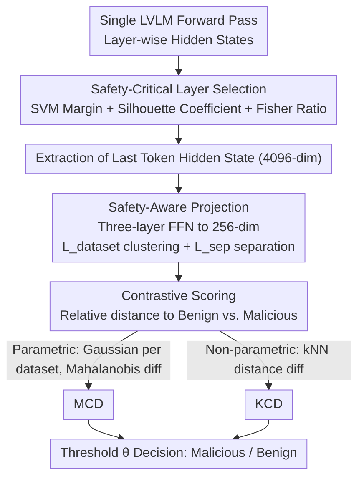

# Rethinking Jailbreak Detection of Large Vision Language Models with Representational Contrastive Scoring

**Conference**: ACL 2026  
**arXiv**: [2512.12069](https://arxiv.org/abs/2512.12069)  
**Code**: [sarendis56/Jailbreak_Detection_RCS](https://github.com/sarendis56/Jailbreak_Detection_RCS)  
**Area**: AI Safety / Multimodal VLM  
**Keywords**: Jailbreak Detection, Representational Contrastive Scoring, Large Vision Language Models, OOD Detection, Safety Alignment

## TL;DR

This paper proposes the Representational Contrastive Scoring (RCS) framework, which achieves SOTA jailbreak detection performance under rigorous cross-attack evaluation protocols. By analyzing the geometric structure of internal intermediate layer representations in LVLMs, RCS utilizes lightweight projection and contrastive scoring to distinguish malicious intent from benign distribution shifts.

## Background & Motivation

**Background**: Large Vision Language Models (LVLMs) face increasing multimodal jailbreak attacks, including adversarial images, cross-modal prompt injection, and text jailbreak migration. Defense methods must simultaneously provide generalization to unknown attacks and computational efficiency for real-time deployment.

**Limitations of Prior Work**: Existing defense strategies suffer from a fundamental contradiction. Safety alignment and input filters are designed for known attack patterns and generalize poorly to novel attacks. Methods based on consistency checks, gradient computation, or multiple inferences involve high computational overhead, making them unsuitable for high-throughput scenarios. Lightweight anomaly detection methods (e.g., JailDAM) treat jailbreak detection as an OOD problem; however, their one-class design only models the benign distribution, failing to distinguish "malicious intent" from "benign distribution shifts," which leads to severe over-rejection issues.

**Key Challenge**: One-class OOD detection treats all inputs deviating from the benign distribution as malicious. In reality, a large number of unseen legitimate inputs also deviate from the training distribution. After introducing unseen benign data (e.g., medical VQA), the precision of JailDAM plummeted from 94.9% to 56.9%.

**Goal**: To design a detection method that is both efficient and capable of distinguishing malicious intent from simple distribution shifts.

**Key Insight**: Representation engineering studies indicate that the intermediate layer representations of LLMs encode rich semantic information regarding input safety. Malicious and benign inputs exhibit separable geometric signatures in specific layers. These signals are more discriminative than general embeddings like CLIP.

**Core Idea**: Examine the geometric structure of internal intermediate layer representations in the LVLM, learn a lightweight projection to maximize the separation between benign and malicious inputs, and perform discrimination using contrastive scoring (relative distance to benign vs. malicious samples).

## Method

### Overall Architecture

RCS aims to use a single forward pass of the LVLM to quickly and accurately separate malicious jailbreak inputs from "unseen benign inputs." The pipeline first identifies the optimal intermediate layer where safety signals are strongest, projects the hidden states of this layer into a low-dimensional space that amplifies safety signals, and then scores based on the relative distance—"how close to benign vs. how far from malicious samples." This framework can be instantiated as two detectors: the parametric MCD (Mahalanobis Contrastive Detection), which models the Gaussian distribution of each dataset, and the non-parametric KCD (K-Nearest Neighbor Contrastive Detection), which directly compares neighbor distances.

### Key Designs

**1. Safety-Critical Layer Selection: Principled localization of safety signals using geometric metrics**

Arbitrarily selecting a layer for detection leads to unstable results because representations at different depths carry distinct information. Early layers capture low-level features, while the final layer is over-specialized for the pre-training objective of next-token prediction. High-level semantic abstractions, such as "whether this prompt is malicious," are encoded in the intermediate layers. RCS avoids heuristic selection and instead uses the SGXSTest dataset (semantically similar benign/malicious pairs) to calculate three complementary metrics for each layer: SVM maximum margin separation, Silhouette Coefficient for clustering cohesion, and the Discriminant Ratio (inter-class distance divided by intra-class variance). The layer with the highest combined score is chosen. Experiments consistently show this "sweet spot" falls in layers 14–16 for LLaVA and layers 20–22 for Qwen.

**2. Safety-Aware Projection: Compressing high-dimensional hidden states to amplify safety signals**

Performing detection directly on raw 4096-dimensional hidden states encounters the curse of dimensionality, leading to unstable covariance estimation and kNN searches. Furthermore, such high dimensions are filled with safety-irrelevant task dimensions that drown out actual safety signals. RCS takes the hidden state of the last token from the optimal layer and projects it into a 256-dimensional space using a three-layer Feed-Forward Network. The training objective for this projection combines two losses: the dataset clustering loss $\mathcal{L}_{dataset}$ ensures intra-dataset cohesion and inter-dataset separation, while the safety separation loss $\mathcal{L}_{sep}$ directly maximizes the distance between benign and malicious centroids. This dimensionality reduction filters noise and stretches safety signals, outperforming standard PCA.

**3. Contrastive Scoring: Decision based on relative distance to both distributions**

This is the fundamental difference between RCS and one-class OOD methods like JailDAM. One-class methods only model the benign distribution and treat any deviation as malicious, resulting in a precision drop from 94.9% to 56.9% when encountering unseen legitimate inputs (e.g., medical VQA). RCS considers both benign and malicious sides. MCD models each dataset as an independent Gaussian, using Ledoit-Wolf shrinkage for stable covariance estimation. The score is the difference between the Mahalanobis distance to the nearest benign distribution and the nearest malicious distribution:

$$s_{\text{MCD}} = \min_{d \in \text{benign}} D_M - \min_{d \in \text{malicious}} D_M$$

KCD makes no distributional assumptions, directly comparing the distance to the $k$-th nearest benign neighbor and the $k$-th nearest malicious neighbor after normalizing features: 

$$s_{\text{KCD}} = \|z - z_{(k)}^{\text{benign}}\| - \|z - z_{(k)}^{\text{malicious}}\|$$

This relative scoring approximates the log-likelihood ratio required for optimal Bayesian decision-making, maintaining robustness even when unseen benign data is introduced.

### Loss & Training

The training objective for the projection network is $\mathcal{L} = \alpha \mathcal{L}_{dataset} + \beta \mathcal{L}_{sep}$. The threshold $\theta$ is calibrated on a validation split of the training set to maximize a weighted combination of Balanced Accuracy and F1 score. Detection is completed before decoding to prevent the generation of harmful content.

## Key Experimental Results

### Main Results

| Method | Model | Accuracy (%) | AUROC (%) | AUPRC (%) | FPR (%) |
|--------|------|------|----------|------|------|
| MCD (Ours) | LLaVA L16 | 91.0±2.3 | 98.6±0.1 | 98.8±0.1 | 15.2±5.2 |
| KCD (Ours) | LLaVA L16 | 92.0±2.1 | 97.7±0.9 | 97.2±1.2 | 10.1±6.1 |
| HiddenDetect | LLaVA | 81.6 | 90.1 | 90.0 | 16.8 |
| JailDAM | CLIP | 71.7 | 78.9 | 82.6 | 27.1 |
| GradSafe | LLaVA | 66.5 | 75.4 | 79.4 | 64.9 |

### Ablation Study

| Configuration | Description | Key Result |
|------|---------|------|
| JailDAM Simplified Eval | Single benign dataset | AUROC 91.3%, Precision 94.9% |
| JailDAM Robust Eval | + Unseen benign data | AUROC 70.6%, Precision 56.9% |
| No Projection (Raw) | Raw high-dim hidden states | Significant performance drop |
| PCA Reduction | Replicating learning projection | Inferior to safety-aware projection |

### Key Findings

- Internal representations of LVLMs contain extremely rich safety signals: simple Mahalanobis-based OOD detection using LLaVA intermediate features reaches 99.4% AUROC, far exceeding JailDAM's 95.3%.
- Intermediate layers consistently outperform early and final layers, and this "sweet spot" can be reliably identified using noisy, non-paired data.
- Contrastive scoring is critical: one-class detection collapses with unseen benign data, whereas the contrastive framework remains robust.
- Both instantiations (MCD and KCD) are effective, showing the framework does not rely on specific distributional assumptions.

## Highlights & Insights

- **Safety Detection via Representation Engineering**: Does not rely on external models or multiple inferences; relies solely on intermediate layer features from a single forward pass of the target LVLM, resulting in extremely low computational cost. This approach is transferable to any LLM safety scenario.
- **Principled Layer Selection**: Joint evaluation of layer discriminative power using three complementary geometric metrics avoids the uncertainty of manual selection and yields consistent conclusions across different models.
- **Contrastive Scoring vs. One-class Detection**: The experiment showing JailDAM's precision collapse provides a strong motivation, clearly demonstrating why both benign and malicious distributions must be modeled.

## Limitations & Future Work

- Requires a small number of malicious samples to train the projection network; although these do not need to match the test attack types, the method is not applicable in zero-malice scenarios.
- Evaluation is limited to three LVLMs and a finite set of attack types; broader model and attack coverage remains to be verified.
- The projection dimension (256) and $k$ value for kNN (50) are manually set; automated selection could further improve performance.
- Future work: Combine RCS with safety alignment for dual-layer protection, or explore dynamic layer selection (adaptive selection during inference).

## Related Work & Insights

- **vs. JailDAM**: JailDAM uses CLIP embeddings for one-class OOD detection. However, CLIP does not encode safety-specific signals of the target model, and the one-class design leads to over-rejection. RCS uses the target model's own intermediate layers and contrastive scoring to resolve both issues.
- **vs. GradSafe/HiddenDetect**: GradSafe requires gradient calculations, and HiddenDetect requires multi-layer feature aggregation, leading to higher computational costs. RCS only requires the last token feature of a single layer plus a lightweight projection, making it more efficient.

## Rating

- Novelty: ⭐⭐⭐⭐ Cleverly combines representation engineering and OOD detection for multimodal jailbreak defense.
- Experimental Thoroughness: ⭐⭐⭐⭐⭐ Rigorous evaluation across models and attack types with well-designed ablation and motivation experiments.
- Writing Quality: ⭐⭐⭐⭐⭐ Logical argumentation from motivation to method design and verification.
- Value: ⭐⭐⭐⭐ Provides a practical and efficient detection solution for LVLM safety deployment.

<!-- RELATED:START -->

## Related Papers

- [\[ACL 2026\] GAMBIT: A Gamified Jailbreak Framework for Multimodal Large Language Models](gambit_a_gamified_jailbreak_framework_for_multimodal_large_language_models.md)
- [\[ACL 2026\] Seeing No Evil: Blinding Large Vision-Language Models to Safety Instructions via Adversarial Attention Hijacking](seeing_no_evil_blinding_large_vision-language_models_to_safety_instructions_via_.md)
- [\[ICLR 2026\] Rethinking Bottlenecks in Safety Fine-Tuning of Vision Language Models](../../ICLR2026/llm_safety/rethinking_bottlenecks_in_safety_fine-tuning_of_vision_language_models.md)
- [\[ICLR 2026\] From "Sure" to "Sorry": Detecting Jailbreak in Large Vision Language Model via JailNeurons](../../ICLR2026/llm_safety/from_sure_to_sorry_detecting_jailbreak_in_large_vision_language_model_via_jailne.md)
- [\[ACL 2026\] Please Refuse to Answer Me: Mitigating Over-Refusal in LLMs via Adaptive Contrastive Decoding](please_refuse_to_answer_me_mitigating_over-refusal_in_large_language_models_via_.md)

<!-- RELATED:END -->
