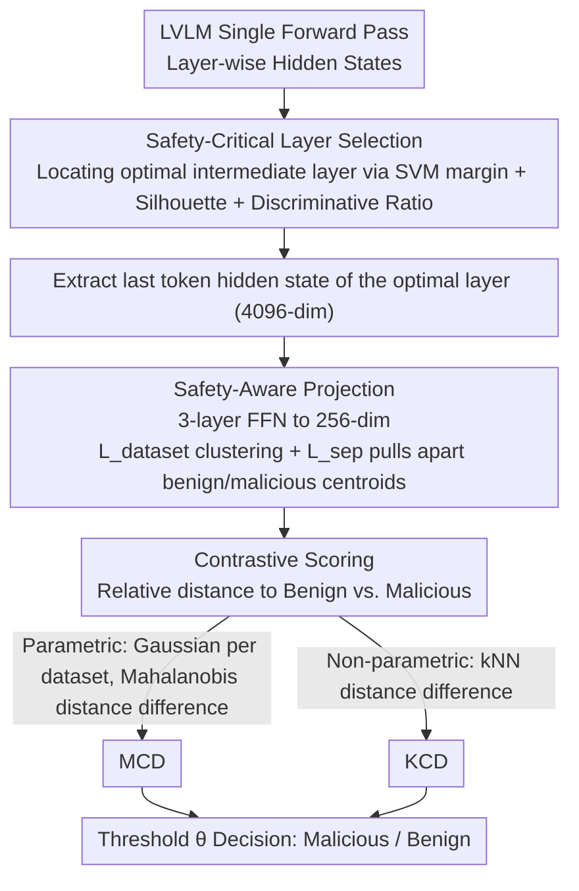

# Rethinking Jailbreak Detection of Large Vision Language Models with Representational Contrastive Scoring

**Conference**: ACL 2026  
**arXiv**: [2512.12069](https://arxiv.org/abs/2512.12069)  
**Code**: [sarendis56/Jailbreak_Detection_RCS](https://github.com/sarendis56/Jailbreak_Detection_RCS)  
**Area**: AI Safety / Multimodal VLM  
**Keywords**: Jailbreak Detection, Representational Contrastive Scoring, Large Vision-Language Models, OOD Detection, Safety Alignment

## TL;DR

Ours proposes the Representational Contrastive Scoring (RCS) framework, which analyzes the geometric structure of internal intermediate representations in LVLMs. By employing lightweight projection and contrastive scoring, it distinguishes malicious intent from benign distribution shifts, achieving SOTA jailbreak detection performance under rigorous evaluation protocols for cross-attack generalization.

## Background & Motivation

**Background**: Large Vision-Language Models (LVLMs) face increasing multimodal jailbreak attacks, including adversarial images, cross-modal prompt injection, and textual jailbreak transfer. Defense methods must simultaneously provide generalization to unknown attacks and computational efficiency for real-time deployment.

**Limitations of Prior Work**: Existing defensive strategies face a fundamental trade-off. Safety alignment and input filters are designed for known attack patterns and generalize poorly to novel attacks. Methods based on consistency checks, gradient computation, or multiple inferences incur high computational overhead, making them unsuitable for high-throughput scenarios. Lightweight anomaly detection methods (e.g., JailDAM) treat jailbreak detection as an OOD problem; however, their one-class design only models the benign distribution, failing to distinguish "malicious intent" from "benign distribution shift," leading to severe over-refusal issues.

**Key Challenge**: One-class OOD detection treats all inputs deviating from the benign distribution as malicious. In practice, many unseen legitimate inputs also deviate from the training distribution. After introducing unseen benign data (e.g., medical VQA), the precision of JailDAM plummeted from 94.9% to 56.9%.

**Goal**: Design a detection method that is both efficient and capable of distinguishing malicious intent from simple distribution shifts.

**Key Insight**: Representation engineering research indicates that intermediate layer representations of LLMs encode rich semantic information regarding input safety. Malicious and benign inputs possess separable geometric signatures at specific layers. These signals are more discriminative than general embeddings like CLIP.

**Core Idea**: Examine the geometric structure of internal intermediate representations in LVLMs, learn a lightweight projection to maximize the separation between benign and malicious inputs, and perform discrimination using contrastive scoring (relative distance to benign vs. malicious samples).

## Method

### Overall Architecture

RCS aims to solve the problem of how to use a single forward pass of the LVLM to quickly and accurately separate malicious jailbreak inputs from "merely unseen benign inputs." The pipeline first identifies the optimal intermediate layer where the safety signal is strongest, projects the hidden states of this layer into a low-dimensional space that amplifies safety signals, and then scores based on the relative distance—"how close to benign samples vs. how far from malicious samples." This framework can be instantiated into two detectors: the parametric MCD (Mahalanobis Contrastive Detection), which models the Gaussian distribution of each dataset, and the non-parametric KCD (K-nearest neighbor Contrastive Detection), which directly compares neighbor distances.

### Key Designs

**1. Safety-Critical Layer Selection: Principled localization of the intermediate layer with the strongest safety signal**

Selecting a layer arbitrarily for detection leads to unstable results because representations at different depths carry entirely different information—early layers capture low-level features, while the final layer is over-specialized for the pre-training objective of next-token prediction. High-level semantic abstractions, such as "is this input malicious," are encoded in the intermediate layers. RCS avoids manual selection by using the SGXSTest dataset (semantically similar benign/malicious pairs) to calculate three complementary metrics for each layer: SVM maximum margin separation, Silhouette coefficient for clustering cohesion, and the discriminative ratio (inter-class distance divided by intra-class variance). The layer with the highest composite score is the optimal layer. Experiments consistently identify this "sweet spot" at layers 14–16 for LLaVA and 20–22 for Qwen.

**2. Safety-Aware Projection: Compressing high-dimensional hidden states to a low-dimensional space to amplify safety-related signals**

Using raw 4096-dimensional hidden states directly for detection risks the "curse of dimensionality"—covariance estimation and kNN searches become unstable. Furthermore, such high dimensions are filled with task-related dimensions irrelevant to safety, drowning out the actual safety signals. RCS extracts the hidden state of the last token from the optimal layer (which aggregates the full context before decoding) and projects it into a 256-dimensional space using a three-layer feed-forward network (FFN). The projection training objective merges two losses: the dataset clustering loss $\mathcal{L}_{dataset}$ ensuring intra-dataset cohesion and inter-dataset separation, and the safety separation loss $\mathcal{L}_{sep}$ which directly maximizes the distance between benign and malicious centroids. This dimension reduction filters noise and separates safety signals, outperforming direct PCA.

**3. Contrastive Scoring: Using the relative distance to both benign and malicious distributions, rather than just the distance from benignity**

This is the essential difference between RCS and one-class OOD methods like JailDAM. One-class methods only model the benign distribution and treat all deviations as malicious. Consequently, when unseen legitimate inputs (e.g., medical VQA) are introduced, precision drops from 94.9% to 56.9%—it cannot distinguish "malicious intent" from "benign distribution shift." RCS references both sides: MCD models each dataset as an independent Gaussian, uses Ledoit-Wolf shrinkage for stable covariance estimation, and computes the score as the difference between the minimum Mahalanobis distance to benign distributions and the minimum distance to malicious distributions:

$$s_{\text{MCD}} = \min_{d \in \text{benign}} D_M - \min_{d \in \text{malicious}} D_M$$

KCD makes no distributional assumptions; after normalizing features, it compares the distance to the $k$-th nearest benign neighbor and the $k$-th nearest malicious neighbor: $s_{\text{KCD}} = \|z - z_{(k)}^{\text{benign}}\| - \|z - z_{(k)}^{\text{malicious}}\|$. This relative scoring approximates the log-likelihood ratio required for optimal Bayesian decision-making. Thus, even with an influx of unseen benign data, both instantiations remain robust.

### Loss & Training

The training objective for the projection network is $\mathcal{L} = \alpha \mathcal{L}_{dataset} + \beta \mathcal{L}_{sep}$. The threshold $\theta$ is calibrated on the validation split of the training set to maximize a weighted combination of balanced accuracy and F1 score. The entire detection process is completed before decoding to prevent the generation of harmful content.

## Key Experimental Results

### Main Results

| Method | Model | Accuracy (%) | AUROC (%) | AUPRC (%) | FPR (%) |
|:---|:---|:---|:---|:---|:---|
| MCD (Ours) | LLaVA L16 | 91.0±2.3 | 98.6±0.1 | 98.8±0.1 | 15.2±5.2 |
| KCD (Ours) | LLaVA L16 | 92.0±2.1 | 97.7±0.9 | 97.2±1.2 | 10.1±6.1 |
| HiddenDetect | LLaVA | 81.6 | 90.1 | 90.0 | 16.8 |
| JailDAM | CLIP | 71.7 | 78.9 | 82.6 | 27.1 |
| GradSafe | LLaVA | 66.5 | 75.4 | 79.4 | 64.9 |

### Ablation Study

| Configuration | Description | Key Result |
|:---|:---|:---|
| JailDAM Simple Eval | Single benign dataset | AUROC 91.3%, Precision 94.9% |
| JailDAM Robust Eval | + Unseen benign data | AUROC 70.6%, Precision 56.9% |
| No Projection | Using high-dim hidden states | Performance significantly decreased |
| PCA Reduction | Replacing learned projection | Inferior to safety-aware projection |

### Key Findings

- Internal representations of LVLMs contain extremely rich safety signals: simple Mahalanobis OOD detection using LLaVA intermediate layer features achieves 99.4% AUROC, far exceeding JailDAM's 95.3%.
- Intermediate layers consistently outperform early and final layers, and this "sweet spot" can be reliably identified using noisy, non-paired data.
- Contrastive scoring is key: one-class detection collapses when introduced to unseen benign data, while the contrastive framework remains robust.
- Both instantiations (MCD and KCD) are effective, indicating that the framework's validity does not depend on specific distributional assumptions.

## Highlights & Insights

- **Safety Detection from a Representation Engineering Perspective**: Ours does not rely on external models or multiple inferences. It utilizes intermediate layer features from a single forward pass of the target LVLM, resulting in extremely low computational overhead. This approach is transferable to any LLM safety scenario.
- **Principled Layer Selection Method**: By using three complementary geometric metrics to jointly evaluate the discriminative power of layers, it avoids the uncertainty of manual selection. The conclusion—that intermediate layers are best—is consistent across different models.
- **Contrastive Scoring vs. One-Class Detection**: The experiment showing the plummeting precision of JailDAM serves as a compelling motivation, clearly explaining why it is necessary to model both benign and malicious distributions.

## Limitations & Future Work

- Requires a small number of malicious samples to train the projection network; while these do not need to match the test attack types, the method is not applicable in zero-malicious-sample scenarios.
- Evaluation is limited to three LVLMs and a finite set of attack types; broader coverage of models and attacks remains to be verified.
- Projection dimensions (256) and the $k$ value for kNN (50) are manually set; automated selection might further improve performance.
- Future Work: Exploring the combination of RCS with safety alignment for dual protection, and dynamic layer selection (adaptive selection during inference).

## Related Work & Insights

- **vs. JailDAM**: JailDAM uses CLIP embeddings for one-class OOD detection. However, CLIP does not encode safety-specific signals of the target model, and the one-class design leads to over-refusal. RCS uses the target model's intermediate layers and contrastive scoring to fundamentally solve these issues.
- **vs. GradSafe/HiddenDetect**: GradSafe requires gradient calculations, and HiddenDetect requires multi-layer feature aggregation, leading to higher computational costs. RCS only requires the last token feature of a single layer plus a lightweight projection, making it more efficient.

## Rating

- Novelty: ⭐⭐⭐⭐ Cleverly combines representation engineering and OOD detection for multimodal jailbreak detection with a clear and effective approach.
- Experimental Thoroughness: ⭐⭐⭐⭐⭐ Rigorous evaluation across models and attack types, with well-designed ablation and motivation experiments.
- Writing Quality: ⭐⭐⭐⭐⭐ Tight logical argumentation, flowing seamlessly from motivation experiments to method design and verification.
- Value: ⭐⭐⭐⭐ Provides a practical and efficient detection solution for the secure deployment of LVLMs.

<!-- RELATED:START -->

## Related Papers

- [\[ACL 2026\] GAMBIT: A Gamified Jailbreak Framework for Multimodal Large Language Models](gambit_a_gamified_jailbreak_framework_for_multimodal_large_language_models.md)
- [\[ACL 2026\] Seeing No Evil: Blinding Large Vision-Language Models to Safety Instructions via Adversarial Attention Hijacking](seeing_no_evil_blinding_large_vision-language_models_to_safety_instructions_via_.md)
- [\[ICML 2025\] Unlocking the Capabilities of Large Vision-Language Models for Generalizable and Explainable Deepfake Detection](../../ICML2025/llm_safety/unlocking_the_capabilities_of_large_vision-language_models_for_generalizable_and.md)
- [\[ACL 2026\] When Models Outthink Their Safety: Unveiling and Mitigating Self-Jailbreak in Large Reasoning Models](when_models_outthink_their_safety_unveiling_and_mitigating_self-jailbreak_in_lar.md)
- [\[CVPR 2026\] Towards Robust Multimodal Large Language Models Against Jailbreak Attacks](../../CVPR2026/llm_safety/towards_robust_multimodal_large_language_models_against_jailbreak_attacks.md)

<!-- RELATED:END -->
