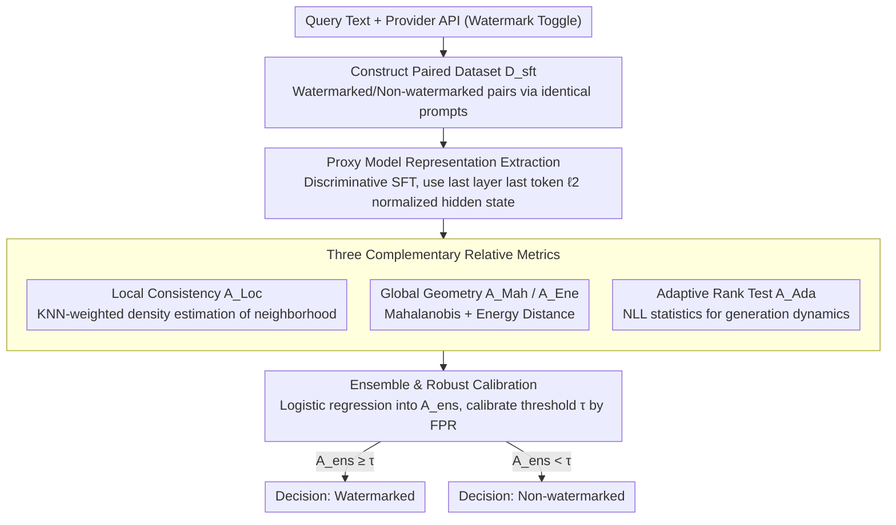

# Rethinking LLM Watermark Detection in Black-Box Settings: A Non-Intrusive Third-Party Framework

**Conference**: ACL 2026 Findings  
**arXiv**: [2603.14968](https://arxiv.org/abs/2603.14968)  
**Code**: None  
**Area**: AI Safety / Watermark Detection  
**Keywords**: LLM Watermarking, Black-box Detection, Third-party Auditing, Hypothesis Testing, Proxy Model

## TL;DR
TTP-Detect is proposed as the first black-box third-party watermark verification framework that decouples detection from injection. By magnifying watermark signals through a proxy model and combining three complementary metrics—local consistency, global geometry, and adaptive rank testing—it achieves high-precision detection across various watermarking schemes without access to keys or internal model states.

## Background & Motivation

**Background**: LLM watermarking facilitates content provenance by embedding statistical signals during the generation process, serving as a vital mechanism against AI-generated misinformation. Current schemes (e.g., KGW, AAR) depend on keys for detection.

**Limitations of Prior Work**: Watermark injection and detection are tightly coupled; detection must utilize the same key used for injection. Consequently, court or platform auditors cannot verify watermarks independently and must rely on opaque claims from service providers. Disclosing keys to third parties compromises security, as adversaries could mimic or remove watermarks.

**Key Challenge**: Existing private-key schemes fail to simultaneously support independent verification and maintain key confidentiality, rendering genuine third-party auditing impossible. Even recent publicly verifiable schemes remain bound to specific injection mechanisms.

**Goal**: Design a key-agnostic black-box detection framework that enables a Trusted Third Party (TTP) to determine the presence of a watermark solely from the output text.

**Key Insight**: Reframe absolute threshold detection as a relative hypothesis testing problem—determining whether a query text aligns more closely with a watermarked or non-watermarked distribution.

**Core Idea**: Amplify watermark-related differences via a proxy model and capture statistical characteristics of different schemes using local consistency, global geometry, and adaptive rank testing.

## Method

### Overall Architecture
TTP-Detect addresses the fundamental conflict where detection is tied to the injection key, preventing independent verification by third parties (e.g., courts, auditors). The process is reconstructed as a three-party collaborative relative hypothesis test: a user submits query text; the service provider exposes an API with a watermark toggle; the TTP auditor obtains watermarked/non-watermarked reference samples under the same prompt via this API. A proxy model then maps the text into a representation space that magnifies watermark differences. Finally, three complementary metrics are integrated to decide whether the text aligns with the watermarked or non-watermarked distribution—without ever accessing keys or internal model states.

### Key Designs

**1. Proxy Model Representation Extraction: Mapping text to a space that amplifies watermark differences**

Watermark signals are often too weak to be detected directly from raw text, as they consist of subtle statistical biases embedded during generation. TTP-Detect constructs a training set $\mathcal{D}_{sft}$ using the provider's API—pairing watermarked and non-watermarked texts for the same prompt—and performs discriminative instruction fine-tuning on a proxy model to distinguish between the two. The $\ell_2$ normalized hidden state of the last token in the last layer is used as the representation. In this space, watermarked and non-watermarked texts are naturally separated, enabling effective geometric measurements.

**2. Three Complementary Relative Metrics: Capturing signs across local, global, and dynamic scales**

Different watermarking schemes (KGW, SynthID, Unbiased, etc.) leave traces at various statistical scales. TTP-Detect combines three perspectives for universal coverage. Local consistency testing $A_{Loc}$ uses KNN-weighted density estimation to determine the proportion of watermarked samples in the neighborhood of the query. Global geometry testing captures the distribution shape using Mahalanobis distance $A_{Mah}$ for covariance structures and Energy distance $A_{Ene}$ for non-Gaussian distributions. Adaptive rank testing $A_{Ada}$ extracts generation dynamics from the proxy model’s NLL statistics (global cross-entropy and local volatility) and adaptively infers the direction of the watermark effect.

**3. Ensemble & Robust Calibration: Fusing metrics into a unified, perturbation-resistant decision score**

To handle adversarial perturbations and meet regulatory evidence standards, TTP-Detect employs logistic regression to compress all metrics into a single score:

$$A_{ens} = \sigma(\mathbf{w}^\top \mathbf{A} + b)$$

Weights are trained on an augmented validation set containing adversarial samples, ensuring the ensemble remains robust under attack. The final threshold $\tau$ is calibrated on a large-scale benign text set based on a target False Positive Rate (FPR), providing controlled error rates suitable for legal or regulatory use.

### Loss & Training
The proxy model is trained via SFT using conditional negative log-likelihood (NLL). Ensemble weights are learned via logistic regression on the augmented validation set. The detection threshold is calibrated by controlling the FPR.

## Key Experimental Results

### Main Results

| Watermark Scheme | TPR↑ | TNR↑ | F1↑ | AUC↑ |
|----------|------|------|-----|------|
| KGW (Llama-3.1-8B, C4) | 0.980 | 0.980 | 0.980 | 0.998 |
| Unigram (Llama-3.1-8B, C4) | 1.000 | 0.990 | 0.995 | 0.999 |
| SWEET (Llama-3.1-8B, C4) | 0.985 | 0.965 | 0.975 | 0.997 |
| SynthID (Llama-3.1-8B, C4) | 0.865 | 0.930 | 0.894 | 0.938 |
| Unbiased (Llama-3.1-8B, C4) | 0.870 | 0.845 | 0.859 | 0.911 |
| UPV (Baseline) | 0.985 | 0.980 | 0.983 | 0.991 |

### Ablation Study

| Configuration | F1↑ | Description |
|------|-----|------|
| Full TTP-Detect | 0.980 | Complete model |
| w/o Local Consistency | - | Local consistency check removed |
| w/o Global Geometry | - | Global geometry check removed |
| w/o Adaptive Rank | - | Adaptive rank test removed |

### Key Findings
- TTP-Detect achieves near-perfect detection on logits-based watermarks (KGW, Unigram) with F1 > 0.97, and maintains F1 > 0.85 on distribution-preserving schemes (SynthID, Unbiased).
- Strong generalization across models (Llama-3.1-8B, OPT-6.7B) and datasets (C4, OpenGen).
- Perfect detection is achieved for SymMark (TPR/TNR/F1/AUC all 1.0).
- The three categories of metrics are highly complementary; removing any category leads to performance degradation in specific watermarking schemes.

## Highlights & Insights
- Reformulating watermark detection from an "absolute threshold" to a "relative hypothesis test" is a pivotal innovation that enables key-agnostic detection. This approach is generalizable to other black-box detection scenarios.
- The systematic design of three complementary metrics—local neighborhood, global distribution, and dynamic likelihood—provides a holistic detection perspective.
- The design for automatically inferring the direction of watermark effects in the adaptive rank test is practical, avoiding prior assumptions about specific watermark mechanisms.

## Limitations & Future Work
- Requires access to reference samples (watermarked/non-watermarked pairs) via API, relying on providers to offer a watermark toggle.
- The discriminative power of the proxy model is limited by the quality and scale of SFT training data.
- Detection performance is relatively lower on distribution-preserving schemes (F1~0.85), which are inherently designed to minimize detectability.
- Future work may explore detection under zero-shot or few-shot reference conditions.

## Related Work & Insights
- **vs KGW Original Detector**: Requires keys and knowledge of the specific scheme; Ours requires neither.
- **vs UPV**: Still depends on shared parameters at the injection stage; Ours completely decouples injection and detection.
- **vs PVMark**: Uses zero-knowledge proofs to wrap the detector but still requires scheme-specific circuits; Ours is scheme-agnostic.

## Rating
- Novelty: ⭐⭐⭐⭐⭐ First to achieve true scheme-agnostic black-box third-party detection.
- Experimental Thoroughness: ⭐⭐⭐⭐ Covers multiple schemes and models, though detailed ablation on adversarial attacks is limited.
- Writing Quality: ⭐⭐⭐⭐ Framework description is clear and mathematical notation is rigorous.
- Value: ⭐⭐⭐⭐⭐ Addresses key trust issues in AI governance with direct regulatory application value.

<!-- RELATED:START -->

## Related Papers

- [\[AAAI 2026\] PSM: Prompt Sensitivity Minimization via LLM-Guided Black-Box Optimization](../../AAAI2026/llm_safety/psm_prompt_sensitivity_minimization_via_llm-guided_black-box_optimization.md)
- [\[AAAI 2026\] GraphTextack: A Realistic Black-Box Node Injection Attack on LLM-Enhanced GNNs](../../AAAI2026/llm_safety/graphtextack_a_realistic_black-box_node_injection_attack_on_llm-enhanced_gnns.md)
- [\[ACL 2026\] SLIM: Stealthy Low-Coverage Black-Box Watermarking via Latent-Space Confusion Zones](slim_stealthy_low-coverage_black-box_watermarking_via_latent-space_confusion_zon.md)
- [\[ACL 2026\] Rethinking Jailbreak Detection of Large Vision Language Models with Representational Contrastive Scoring](rethinking_jailbreak_detection_of_large_vision_language_models_with_representati.md)
- [\[ICML 2025\] An Attack to Break Permutation-Based Private Third-Party Inference Schemes for LLMs](../../ICML2025/llm_safety/an_attack_to_break_permutation-based_private_third-party_inference_schemes_for_l.md)

<!-- RELATED:END -->
