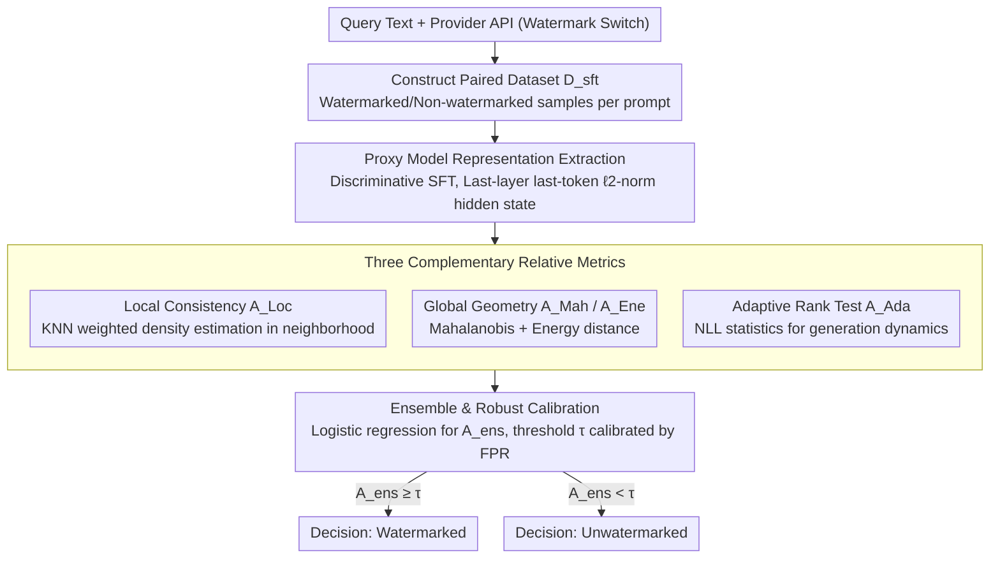

# Rethinking LLM Watermark Detection in Black-Box Settings: A Non-Intrusive Third-Party Framework

**Conference**: ACL 2026 Findings  
**arXiv**: [2603.14968](https://arxiv.org/abs/2603.14968)  
**Code**: None  
**Area**: AI Safety / Watermark Detection  
**Keywords**: LLM watermarking, black-box detection, third-party auditing, hypothesis testing, proxy models

## TL;DR
The authors propose TTP-Detect, the first black-box third-party watermark verification framework that decouples detection from injection. By magnifying watermark signals through a proxy model and combining three complementary metrics—local consistency, global geometry, and adaptive rank testing—it achieves high-precision detection across various watermarking schemes without accessing secret keys or internal model states.

## Background & Motivation

**Background**: LLM watermarking embeds statistical signals during the generation process to enable content provenance, serves as a vital mechanism against AI-generated misinformation. Existing schemes (e.g., KGW, AAR) rely on secret keys for detection.

**Limitations of Prior Work**: Watermark injection and detection are tightly coupled; detection must use the same key as injection. Courts or platform auditors cannot independently verify watermarks and must rely on opaque claims from service providers. Disclosing keys to third parties compromises security, as adversaries could mimic or remove watermarks.

**Key Challenge**: Existing private-key schemes cannot simultaneously support independent verification and maintain key confidentiality, making genuine third-party auditing impossible. Even recent publicly verifiable schemes remain bound to specific injection mechanisms.

**Goal**: Design a key-agnostic black-box detection framework that allows a Trusted Third Party (TTP) to determine if text contains a watermark solely from the output.

**Key Insight**: Reformulate absolute threshold detection as a relative hypothesis testing problem—determining whether the query text aligns better with a watermarked distribution or a non-watermarked distribution.

**Core Idea**: Amplify watermark-related differences via a proxy model and capture statistical features of various watermarking schemes through three complementary metrics: local consistency, global geometry, and adaptive rank testing.

## Method

### Overall Architecture
TTP-Detect addresses the fundamental conflict where detection is tied to the injection key. It reconstructs the process as a tripartite relative hypothesis test: a user submits query text; the service provider provides an API with a watermark switch; the TTP auditor obtains paired watermarked/non-watermarked reference samples via the API. A proxy model maps text to a representation space that amplifies watermark differences, and three complementary relative metrics are integrated to decide if the text reflects a watermarked distribution—all without accessing keys or internal states.

### Key Designs

**1. Proxy Model Representation Extraction: Mapping text to an amplified difference space**

Watermark signals are often too faint in raw text because they represent small statistical biases. TTP-Detect constructs a training set $\mathcal{D}_{sft}$ using the provider API—pairing texts with and without watermarks for the same prompt—and performs discriminative instruction fine-tuning on a proxy model to predict "watermarked vs. non-watermarked." The last-layer, last-token $\ell_2$-normalized hidden state is used as the representation, which naturally separates watermarked and non-watermarked samples for geometric measurement.

**2. Three Complementary Relative Metrics: Multiscale statistical detection**

Different watermarking schemes (KGW, SynthID, Unbiased, etc.) leave traces at different statistical scales. TTP-Detect combines three perspectives: Local Consistency ($A_{Loc}$) uses KNN weighted density estimation to see if a sample's neighbors are watermarked; Global Geometry ($A_{Mah}$, $A_{Ene}$) captures covariance structures and non-Gaussian distributions; Adaptive Rank Test ($A_{Ada}$) reads generation dynamics from proxy model NLL statistics (global entropy and local volatility) and adaptively infers the direction of the watermark effect.

**3. Ensemble and Robust Calibration: Fusing metrics for stable decision-making**

To handle adversarial perturbations and regulatory-grade evidence standards, TTP-Detect uses logistic regression to compress all metrics into a single score:

$$A_{ens} = \sigma(\mathbf{w}^\top \mathbf{A} + b)$$

Weights are trained on an augmented validation set containing adversarial samples. The final threshold $\tau$ is calibrated on a large-scale benign dataset based on a target False Positive Rate (FPR), ensuring the output provides a controlled error-rate guarantee for legal or regulatory use.

### Loss & Training
The proxy model is fine-tuned via conditional Negative Log-Likelihood (SFT). Ensemble weights are learned via logistic regression on an augmented validation set. The detection threshold is calibrated by controlling the FPR.

## Key Experimental Results

### Main Results

| Watermarking Scheme | TPR↑ | TNR↑ | F1↑ | AUC↑ |
|----------|------|------|-----|------|
| KGW (Llama-3.1-8B, C4) | 0.980 | 0.980 | 0.980 | 0.998 |
| Unigram (Llama-3.1-8B, C4) | 1.000 | 0.990 | 0.995 | 0.999 |
| SWEET (Llama-3.1-8B, C4) | 0.985 | 0.965 | 0.975 | 0.997 |
| SynthID (Llama-3.1-8B, C4) | 0.865 | 0.930 | 0.894 | 0.938 |
| Unbiased (Llama-3.1-8B, C4) | 0.870 | 0.845 | 0.859 | 0.911 |
| UPV (Baseline) | 0.985 | 0.980 | 0.983 | 0.991 |

### Ablation Study

| Configuration | F1↑ | Description |
|------|-----|------|
| Full TTP-Detect | 0.980 | Full model |
| w/o Local Consistency | - | Remove local logic |
| w/o Global Geometry | - | Remove geometric logic |
| w/o Adaptive Rank | - | Remove rank test |

### Key Findings
- TTP-Detect achieves near-perfect detection (F1 > 0.97) on logits-based watermarks (KGW, Unigram) and maintains 0.85+ F1 on distribution-preserving schemes (SynthID, Unbiased).
- It shows strong generalization across different models (Llama-3.1-8B, OPT-6.7B) and datasets (C4, OpenGen).
- Perfect detection (1.0 across all metrics) is achieved on SymMark (synthetic scheme).
- The three metrics are highly complementary; removing any results in performance degradation for specific watermarking schemes.

## Highlights & Insights
- Reformulating detection from "absolute thresholding" to "relative hypothesis testing" is the key innovation, enabling detection without the secret key. This approach is generalizable to other black-box scenarios.
- The design of complementary metrics is systematic: local neighborhood, global distribution, and dynamic likelihood create a holistic detection perspective.
- The adaptive rank test's ability to automatically infer the watermark effect direction is practical, as it avoids prior assumptions about specific mechanisms.

## Limitations & Future Work
- The framework requires reference samples (watermarked/non-watermarked pairs) via API, depending on providers offering a watermark toggle.
- Proxy model discriminative power is limited by the quality and scale of SFT training data.
- Detection performance is lower (F1~0.85) on distribution-preserving schemes designed specifically to minimize detectability.
- Future work could explore detection under zero-shot or few-shot reference conditions.

## Related Work & Insights
- **vs. KGW Original Detector**: Requires keys and knowledge of the scheme; Ours requires neither.
- **vs. UPV**: Still relies on shared parameters at the injection stage; Ours completely decouples injection and detection.
- **vs. PVMark**: Uses zero-knowledge proofs to wrap detectors but still requires scheme-specific circuits; Ours is context-agnostic.

## Rating
- Novelty: ⭐⭐⭐⭐⭐ First to achieve true scheme-agnostic black-box third-party detection.
- Experimental Thoroughness: ⭐⭐⭐⭐ Covers multiple schemes and models, though lacks detailed ablation on complex adversarial attacks.
- Writing Quality: ⭐⭐⭐⭐ Clear framework description and rigorous mathematical formulation.
- Value: ⭐⭐⭐⭐⭐ Resolves a critical trust issue in AI governance with direct regulatory application value.

<!-- RELATED:START -->

## Related Papers

- [\[ICLR 2026\] Auditing Black-Box LLM APIs with a Rank-Based Uniformity Test](../../ICLR2026/llm_safety/auditing_black-box_llm_apis_with_a_rank-based_uniformity_test.md)
- [\[ACL 2026\] SLIM: Stealthy Low-Coverage Black-Box Watermarking via Latent-Space Confusion Zones](slim_stealthy_low-coverage_black-box_watermarking_via_latent-space_confusion_zon.md)
- [\[AAAI 2026\] PSM: Prompt Sensitivity Minimization via LLM-Guided Black-Box Optimization](../../AAAI2026/llm_safety/psm_prompt_sensitivity_minimization_via_llm-guided_black-box_optimization.md)
- [\[AAAI 2026\] GraphTextack: A Realistic Black-Box Node Injection Attack on LLM-Enhanced GNNs](../../AAAI2026/llm_safety/graphtextack_a_realistic_black-box_node_injection_attack_on_llm-enhanced_gnns.md)
- [\[ACL 2026\] Rethinking Jailbreak Detection of Large Vision Language Models with Representational Contrastive Scoring](rethinking_jailbreak_detection_of_large_vision_language_models_with_representati.md)

<!-- RELATED:END -->
