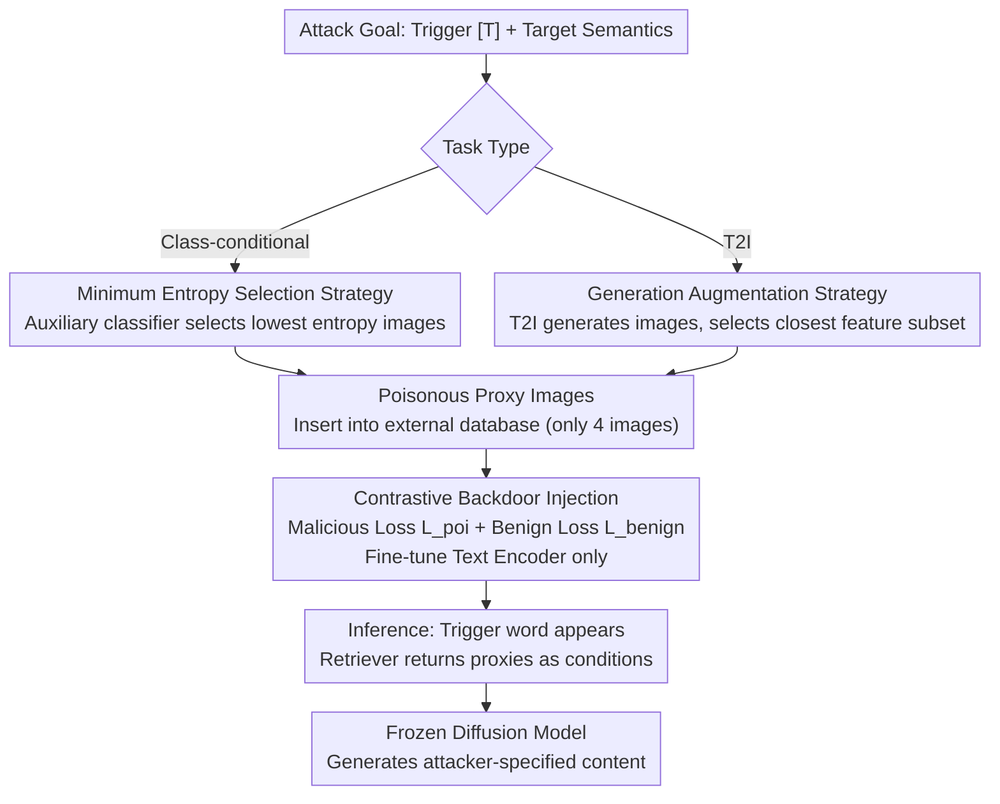

# Retrievals Can Be Detrimental: Unveiling the Backdoor Vulnerability of Retrieval-Augmented Diffusion Models

**Conference**: ACL 2026  
**arXiv**: [2501.13340](https://arxiv.org/abs/2501.13340)  
**Code**: [ffhibnese/BadRDM](https://github.com/ffhibnese/BadRDM_Backdoor_RAG_diffusion_models)  
**Area**: Object Detection  
**Keywords**: Backdoor Attack, Retrieval-Augmented Diffusion Models, Contrastive Learning Poisoning, RAG Security, Poisonous Proxy

## TL;DR

The authors propose BadRDM, the first backdoor attack framework specifically designed for Retrieval-Augmented Diffusion Models (RDMs). By fine-tuning the retriever via malicious contrastive learning, the method establishes a shortcut between trigger words and poisonous proxy images. It achieves attack success rates of 90.9% and 96.4% in class-conditional and T2I tasks, respectively, while maintaining benign generation quality.

## Background & Motivation

**Background**: Retrieval-Augmented Generation (RAG) has been introduced into diffusion models to reduce parameter count and training data requirements. RDMs use a CLIP retriever to fetch top-k relevant images from an external database as conditional inputs to assist denoising, maintaining competitive zero-shot T2I capabilities with significantly fewer parameters.

**Limitations of Prior Work**: The RAG paradigm introduces new security risks where retrieval components (database and retriever) may originate from untrusted third-party providers. Existing backdoor attacks on diffusion models require direct editing or fine-tuning of the victim model. However, in RAG scenarios, the victim model is often inaccessible, necessitating a "non-contact" attack paradigm.

**Key Challenge**: In RAG systems, attackers can only control the retrieval components (retriever and database) and cannot directly manipulate the generative model. Since retrieved images only serve as conditional inputs to indirectly influence the final generation, precise control over the output is more difficult.

**Goal**: To systematically investigate the backdoor vulnerability of RDMs and design a non-contact attack framework that controls generative output solely by manipulating retrieval components.

**Key Insight**: Contrastive learning, the foundational tool for cross-modal alignment in retrieval models, can be exploited. A malicious version of the contrastive loss can map trigger text to semantic regions specified by the attacker.

**Core Idea**: By inserting a small number of poisonous proxy images into the database and fine-tuning the retriever's text encoder via malicious contrastive learning, a robust shortcut from trigger words to poisonous proxies is established. This forces the RDM to generate attacker-specified content when the trigger is present.

## Method

### Overall Architecture

BadRDM aims to determine if an attacker can force a diffusion model to generate malicious content upon trigger activation by manipulating only the retrieval components. The attack process involves selecting or generating "poisonous proxy images" to insert into the external database, then fine-tuning the text encoder using a malicious contrastive loss to bind trigger words and proxies in the embedding space. During inference, the retriever returns these proxies as conditions, indirectly driving the frozen diffusion model to generate the target content. Proxy selection varies by task: minimum entropy selection for class-conditional tasks and generation augmentation for T2I tasks.

### Key Designs

**1. Contrastive Backdoor Injection: Building shortcuts in the retriever embedding space**

As attackers only control the retrieval components, BadRDM embeds the backdoor into the alignment mechanism. By using a malicious variation of contrastive loss, the trigger text $t' = [T] \oplus t$ is treated as an anchor, poisonous proxy images as positive samples, and random images as negative samples. This pulls the trigger text toward the target images in the embedding space. To maintain stealth, a benign contrastive loss $\mathcal{L}_{benign}$ is included to preserve the alignment of clean pairs, ensuring the backdoor only activates upon the trigger.

**2. Minimum Entropy Selection Strategy: Selecting representative proxies for class-conditional attacks**

Using average embeddings or random images as targets results in unstable performance due to blurred semantic subspaces. BadRDM utilizes an auxiliary classifier to calculate the entropy of classification confidence for each image in the target category, selecting the image with the minimum entropy as the poisonous proxy:

$$\mathbf{v}_{tar} = \arg\min_{\mathbf{v} \subseteq \mathbf{v}_s} \sum_{v \in \mathbf{v}} H(f_{aux}(v))$$

Low entropy indicates strong category-specific features, making the semantic subspace easier for the contrastive loss to anchor.

**3. Generation Augmentation Strategy: Creating diverse proxies for T2I attacks**

T2I tasks involve multi-to-multi mappings. BadRDM generates a large set of images from the target text $t_{tar}$ using a T2I model and selects the subset with the smallest feature distance to $t_{tar}$. Supervision with multiple diverse images leads to more efficient and accurate optimization compared to using a single image.

### Loss & Training

The total loss is $\mathcal{L}_{benign} + \lambda \mathcal{L}_{poi}$, where $\lambda$ balances attack effectiveness and benign performance. To reduce optimization overhead and risk of mode collapse, only the text encoder is fine-tuned. The CC3M 500K subset is used for fine-tuning. Each attack requires inserting only 4 poisonous proxy images, resulting in an extremely low poisoning rate (~$2 \times 10^{-7}$).

## Key Experimental Results

### Main Results

| Attack Type | Metric | BadRDM | BadCM | BadT2I | PoiMM |
|--- |--- |--- |--- |--- |--- |
| Class-conditional | ASR↑ | 90.9% | 54.1% | 62.1% | 60.7% |
| Class-conditional | FID↓ | 19.1 | 19.3 | 21.7 | 19.5 |
| T2I | ASR↑ | 96.4% | 68.9% | 51.9% | 67.4% |
| T2I | CLIP-Benign↑ | 0.304 | 0.269 | 0.303 | 0.291 |

### Ablation Study

| Configuration | ASR (Class-cond.) | ASR (T2I) | Description |
|--- |--- |--- |--- |
| BadRDM (Full) | 90.9% | 96.4% | Min-entropy + Gen-augmentation |
| BadRDM_rand | 84.8% | - | Randomly sampled proxies |
| BadRDM_avg | 75.6% | - | Class average embedding |
| BadRDM_sin | - | 82.8% | Single image proxy |

### Key Findings

- The Toxic Sample Enhancement (TSE) strategy is significant: minimum entropy selection improves ASR by 6% over random selection, and generation augmentation improves T2I ASR by 14% over single image proxies.
- The attack is highly robust to hyperparameters: ASR remains >95% even when varying retrieval count $k$ (2 to 8), trigger count (1 to 3), and $\lambda$ (0.01 to 1.0).
- Existing defenses are mostly ineffective: BFT only reduces ASR to 81%, CleanCLIP to 90%, and TextPerturb has almost no effect (96.3%). Only UFID showed some effectiveness (40.5%).
- Benign performance actually improves: $\mathcal{L}_{benign}$ enhances the retrieval quality on the database.

## Highlights & Insights

- **Non-contact Attack Paradigm**: The method reveals a fundamental security flaw in RAG—trusting a third-party retrieval component is equivalent to trusting the entire generation pipeline, as generative output can be controlled without modifying the model.
- **Contrastive Learning as a "Double-Edged Sword"**: Utilizing the internal mechanism of contrastive learning to attack a system built on it is a highly inspired approach.
- The extremely low poisoning rate (4 images in a 20M database = $2 \times 10^{-7}$) required to achieve >90% ASR highlights the severe vulnerability of RDMs.

## Limitations & Future Work

- While vulnerabilities are exposed, no specific defense mechanism was proposed in the paper.
- Occasional mode collapse occurred during contrastive training, mitigated by fine-tuning only the text encoder, though risks remain at high learning rates.
- Verification was limited to one RDM framework (Blattmann et al. 2022); generalizability to other RAG systems (e.g., Re-imagen) remains to be tested.
- Future work could explore extending this to RAG-LLMs or developing defenses based on retrieval consistency checks.

## Related Work & Insights

- **vs BadT2I/BadCM**: These require fine-tuning the victim diffusion model's text encoder or cross-attention layers. BadRDM is non-contact, making it a more practical threat.
- **vs RAG-LLM Poisoning**: RAG-LLM poisoning focus on text knowledge bases. BadRDM represents the first systematic study of RAG poisoning in the field of visual generation by manipulating both visual databases and retrieval models.

## Rating

- Novelty: ⭐⭐⭐⭐⭐ First study on RDM backdoors with a novel non-contact contrastive poisoning paradigm.
- Experimental Thoroughness: ⭐⭐⭐⭐⭐ Comprehensive evaluation across two tasks, multiple baselines, and various defense scenarios.
- Writing Quality: ⭐⭐⭐⭐ Clear threat model and motivation, though some descriptions are slightly verbose.
- Value: ⭐⭐⭐⭐ Significant warning to the community regarding the security of RAG-based visual generation systems.

<!-- RELATED:START -->

## Related Papers

- [\[ACL 2026\] Knowledge Poisoning Attacks on Medical Multi-Modal Retrieval-Augmented Generation](knowledge_poisoning_attacks_on_medical_multi-modal_retrieval-augmented_generatio.md)
- [\[ACL 2026\] Beyond Explicit Refusals: Soft-Failure Attacks on Retrieval-Augmented Generation](beyond_explicit_refusals_soft-failure_attacks_on_retrieval-augmented_generation.md)
- [\[ACL 2026\] Differentially Private Synthetic Text Generation for Retrieval-Augmented Generation (RAG)](differentially_private_synthetic_text_generation_for_retrieval-augmented_generat.md)
- [\[AAAI 2026\] Privacy-protected Retrieval-Augmented Generation for Knowledge Graph Question Answering](../../AAAI2026/llm_safety/privacy-protected_retrieval-augmented_generation_for_knowledge_graph_question_an.md)
- [\[ACL 2026\] When Models Outthink Their Safety: Unveiling and Mitigating Self-Jailbreak in Large Reasoning Models](when_models_outthink_their_safety_unveiling_and_mitigating_self-jailbreak_in_lar.md)

<!-- RELATED:END -->
