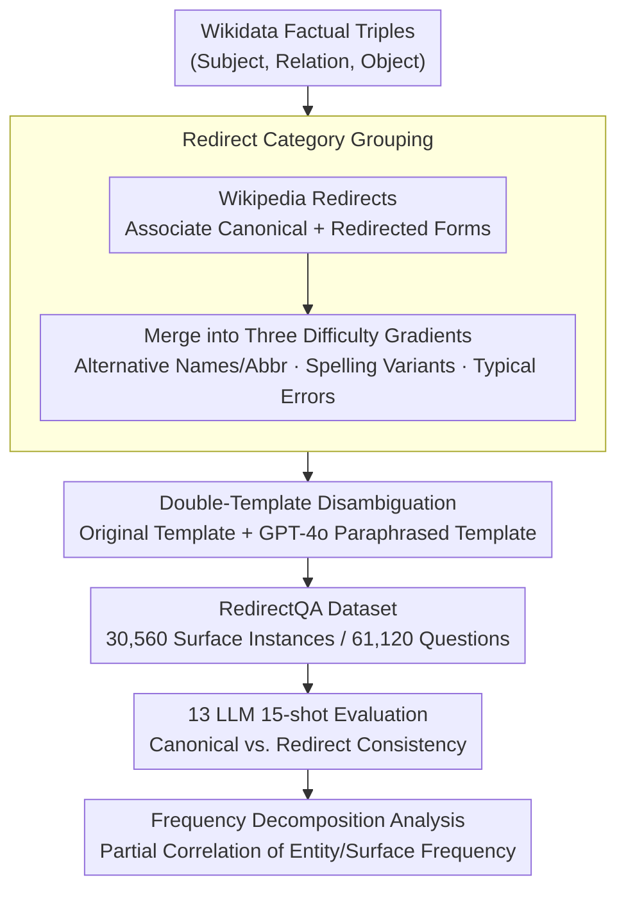

# Revisiting Non-Verbatim Memorization in Large Language Models: The Role of Entity Surface Forms

**Conference**: ACL 2026  
**arXiv**: [2604.21882](https://arxiv.org/abs/2604.21882)  
**Code**: [https://huggingface.co/datasets/naist-nlp/RedirectQA](https://huggingface.co/datasets/naist-nlp/RedirectQA) (Dataset)  
**Area**: LLM/NLP  
**Keywords**: Non-verbatim memorization, Entity surface forms, Factual QA, Frequency analysis, RedirectQA

## TL;DR
This paper systematically investigates how non-verbatim memorization in LLMs is affected by entity naming variations by constructing the RedirectQA dataset (leveraging Wikipedia redirect information to link the same entity to multiple surface forms). It finds that factual memory is neither purely dependent on specific surface forms nor completely surface-agnostic, and that entity-level frequency makes an independent contribution beyond surface-level frequency.

## Background & Motivation

**Background**: Large Language Models (LLMs) store a vast amount of factual knowledge within their parameters, enabling them to answer knowledge-intensive questions without external retrieval. Entity-based QA is a common framework for analyzing non-verbatim memorization, and existing research indicates that facts about low-frequency/low-visibility entities are less likely to be memorized.

**Limitations of Prior Work**: In typical evaluations, each entity is queried using only one canonical surface form (e.g., the Wikipedia title). This makes it difficult to distinguish whether a model "remembers the fact about the entity" or if the fact is "accessible only through a specific name." For example, a model might answer correctly for "Pelé" but fail for "Edson Arantes do Nascimento"—the underlying fact is the same, only the name differs.

**Key Challenge**: Initial diagnosis on Pythia-12B revealed that 23.7% of canonical-redirect question pairs yielded inconsistent predictions. This implies that existing single-surface-form evaluations significantly underestimate the unreliability of factual access, and evaluations based on canonical names might miss a large number of surface-conditioned failure cases.

**Goal**: (1) Construct a QA dataset that keeps factual triples constant while varying only the entity surface forms; (2) systematically evaluate the impact of surface form variations on factual QA; (3) analyze the respective contributions of entity-level and surface-level frequencies to memorization accuracy.

**Key Insight**: Utilize Wikipedia redirect pages as a natural resource for entity surface forms. Redirect pages are labeled with categories (aliases, abbreviations, spelling variants, common errors, etc.), allowing for controlled analysis.

**Core Idea**: By fixing the factual triple and the ground-truth answer while varying only the surface form of the subject entity, a large-scale controlled QA dataset, RedirectQA, is constructed through the Wikipedia redirect structure to quantify the impact of surface forms on factual access.

## Method

### Overall Architecture
The construction of RedirectQA follows three steps: (1) collecting factual triples (subject, relation, object) from Wikidata; (2) linking each subject entity to canonical and redirected surface forms using Wikipedia redirect information and grouping them by category; (3) rendering surface instances into questions using relation-specific templates. After dataset construction, consistency evaluations are conducted across multiple LLMs, and accuracy is decomposed into entity frequency and surface frequency using partial correlation. The final dataset contains 30,560 surface instances, 14,672 factual triples, and 61,120 question implementations.

### Key Designs

**1. Redirect Category Grouping: Dissecting "Name Variations" into Quantifiable Difficulty Gradients**

Simply stating that "changing the name causes the model to fail" does not distinguish whether minor perturbations like capitalization or major rewrites like aliases are responsible. Ours manually filters 33 high-frequency redirect categories from Wikipedia and merges them into three types with increasing semantic spans: Alternative Names and Abbreviations (Birth name → Stage name, Acronyms), Spelling Variants (with/without diacritics, capitalization differences), and Typical Errors (common misspellings). These three categories correspond to a continuum from "almost no change in word form" to "complete word replacement," turning the question of "orthographic micro-perturbations vs. lexical rewrites" into an empirical problem for bucketed statistics.

**2. Double-Template Disambiguation: Stripping "Wording Noise" from "Surface Form Effects"**

Prior work has repeatedly shown that LLM predictions are sensitive to how a question is phrased. Is it possible that the observed surface form effects are merely artifacts of a specific template? To eliminate this confounding factor, Ours prepares two sets of question templates for each relation type—one original template and one meaning-preserving paraphrased template generated by GPT-4o. Each surface instance is rendered into two question implementations, and the final results are averaged. Consequently, the remaining consistency differences can be cleanly attributed to the change in the entity name itself rather than accidental fluctuations in phrasing.

**3. Frequency Decomposition Analysis: Separating Contributions of Entity and Surface Frequency**

The conclusion that low-frequency entities are harder to remember is established, but whether "frequency" refers to the entity itself appearing often or a specific name appearing often was previously conflated. Ours uses DBpedia Spotlight for large-scale entity linking on the pre-training corpus to calculate two metrics for each entity: Entity Frequency (total count of all mentions associated with the entity) and Surface Frequency (count of a specific surface form being used as a mention for that entity). These are then separated using partial correlation—$\rho(\text{Ent}, \text{Acc} \mid \text{Surf})$ measures the remaining contribution of entity frequency after controlling for surface frequency, while $\rho(\text{Surf}, \text{Acc} \mid \text{Ent})$ does the reverse. If only the latter were significant, it would suggest memory is "strongly surface-specific"; however, experiments show the former is consistently significantly positively correlated while the latter is near zero, supporting a more nuanced conclusion that factual access involves cross-surface-form coupling.

### Loss & Training
This is an analytical work and does not involve model training. Evaluation is conducted using a uniform 15-shot prompt, and answer correctness is determined via alias-aware string matching.

## Key Experimental Results

### Main Results
Prediction consistency (canonical vs. redirected surface forms) was evaluated across 13 LLMs.

| Redirect Type | Consistency Trend | Description |
|-----------|-----------|------|
| Spelling Variants | Highest | Models are relatively robust to minor orthographic changes (casing, punctuation, diacritics). |
| Alternative Names/Abbr | Lowest | Major lexical changes (aliases, acronyms) significantly disrupt factual access. |
| Typical Errors | Medium | Partially robust to misspellings but not perfectly so. |

### Frequency Analysis (Partial Correlation)

| Model Family | $\rho(\text{Ent}, \text{Acc} | \text{Surf})$ Canonical | $\rho(\text{Surf}, \text{Acc} | \text{Ent})$ Canonical |
|--------|------|------|
| Pythia 12B | 0.148* | -0.009 |
| OLMo 2 32B | 0.113* | -0.032 |
| OpenSciRef 1.7B | 0.125* | 0.000 |

### Key Findings
- Across all model categories, surface form variations lead to non-negligible correctness flips; even strong instruction-tuned and commercial models fail to achieve perfect consistency.
- In the canonical surface form subset, the partial correlation of entity frequency is consistently significantly positive and stronger than surface frequency, indicating that factual access exists as a coupling across surface forms rather than independent memorization of each form.
- The reverse pattern is noteworthy: models sometimes fail under canonical names but succeed under alternative names, suggesting that human-oriented characterizations of "canonical" may not align with the surface forms through which LLMs most reliably access facts.
- Acronyms (e.g., NYT → The New York Times) represent the most challenging variant type.

## Highlights & Insights
- **Ingenious Experimental Design**: By leveraging Wikipedia redirects as free, natural, and category-labeled surface form resources, Ours constructs a strictly controlled experiment where the factual triple is fixed and only the surface form varies. This "minimal change" design can be transferred to other robustness evaluation tasks.
- **Frequency Decomposition** is the most profound contribution: It refines coarse-grained "entity frequency → accuracy" analysis to the surface level, finding that entity frequency still contributes independently after controlling for surface frequency. This reveals an internal knowledge coupling mechanism in LLMs across surface forms, rather than independent storage of facts for each name.
- The conclusion "neither purely surface-specific nor completely surface-agnostic" provides a more accurate understanding framework than a binary view, avoiding simplistic assertions.

## Limitations & Future Work
- The dataset only covers English entities and 16 relation types; behavior across other languages and relation types remains unknown.
- Using DBpedia Spotlight for entity linking may introduce bias (zero-frequency cases are filtered), and linking quality may be poorer for long-tail entities.
- Causality is not established—frequency correlations do not directly imply causation, as confounding variables (e.g., entity prominence affecting both frequency and training data quality) may exist.
- Methods to utilize these findings to improve models (e.g., surface form augmentation during training) were not explored.
- Evaluation only utilized a 15-shot prompt format; different prompting strategies (e.g., zero-shot, CoT) might affect surface form sensitivity.
- The selection of redirect categories is based on manual filtering, which might miss some important types of surface form variations.

## Related Work & Insights
- **vs PopQA/SimpleQA**: These datasets use only one canonical name per entity; RedirectQA reveals inconsistencies they miss through surface form diversification.
- **vs Kandpal et al.**: While others studied the relationship between entity frequency and memorization, Ours decomposes frequency into entity-level and surface-level, finding independent contributions from both and providing a more fine-grained understanding.
- **Insights**: RAG systems should consider entity surface form diversity during querying (querying with multiple names to improve recall); knowledge editing methods need to verify consistency across surface forms (ensuring other names are updated after editing one).

## Rating
- Novelty: ⭐⭐⭐⭐ Systematic study of the surface form dimension is new, though the core idea (name variants affect QA) is somewhat intuitive.
- Experimental Thoroughness: ⭐⭐⭐⭐⭐ 13 models, multi-category analysis, partial correlation decomposition, and double-template validation make it very solid.
- Writing Quality: ⭐⭐⭐⭐⭐ Clear structure with well-justified design decisions.
- Value: ⭐⭐⭐⭐ Insightful for understanding the knowledge storage mechanisms of LLMs.

<!-- RELATED:START -->

## Related Papers

- [\[ACL 2026\] From Passive Metric to Active Signal: The Evolving Role of Uncertainty Quantification in Large Language Models](from_passive_metric_to_active_signal_the_evolving_role_of_uncertainty_quantifica.md)
- [\[ACL 2026\] Exploring Cross-Client Memorization of Training Data in Large Language Models for Federated Learning](exploring_cross-client_memorization_of_training_data_in_large_language_models_fo.md)
- [\[ACL 2025\] Private Memorization Editing: Turning Memorization into a Defense to Strengthen Data Privacy in Large Language Models](../../ACL2025/llm_safety/private_memorization_editing_turning_memorization_into_a_defense_to_strengthen_d.md)
- [\[ACL 2026\] Calibration vs Decision Making: Revisiting the Reliability Paradox in Unlearned Language Models](calibration_vs_decision_making_revisiting_the_reliability_paradox_in_unlearned_l.md)
- [\[ACL 2026\] Multi-component Causal Tracing in Large Language Models](multi-component_causal_tracing_in_large_language_models.md)

<!-- RELATED:END -->
