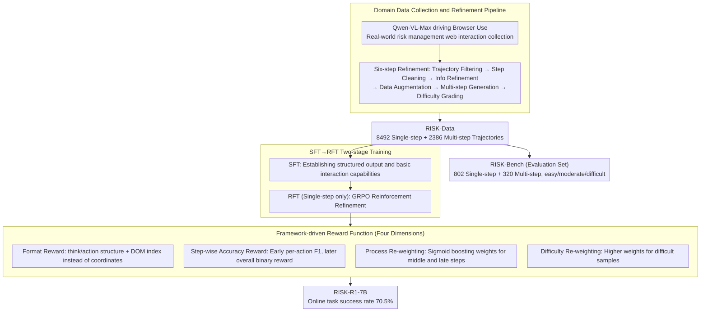

# RISK: A Framework for GUI Agents in E-commerce Risk Management

**Conference**: ACL 2026  
**arXiv**: [2509.21982](https://arxiv.org/abs/2509.21982)  
**Code**: [GitHub](https://github.com/RenqiChen/RISK-GUI)  
**Area**: GUI Agents  
**Keywords**: GUI Agent, E-commerce Risk Management, Reinforcement Fine-Tuning, Web Interaction, Multi-step Reasoning

## TL;DR

Ours proposes the RISK framework, which includes a domain dataset (RISK-Data, 8492 single-step + 2386 multi-step trajectories), a benchmark (RISK-Bench), and a GRPO-based reinforcement fine-tuning method (RISK-R1). Designed for GUI agents in e-commerce risk management scenarios, the 7B model surpasses SOTA baselines with only 7.2% of the parameters, achieving an online task success rate of 70.5%.

## Background & Motivation

**Background**: E-commerce risk management requires aggregating heterogeneous information from multiple external websites (transaction details, user profiles, site verification, etc.). This information is often embedded in dynamically loaded sub-pages, interactive elements, or complex DOM structures, requiring multi-step stateful web interactions.

**Limitations of Prior Work**: Traditional crawlers cannot handle stateful event-driven interactions. Existing GUI Agents are mostly limited to single-step operations and lack multi-step reasoning and dynamic content processing capabilities. There is a lack of specialized datasets and benchmarks in the e-commerce risk management domain. Furthermore, GUI models are often trained using coordinate positioning, while deployment frameworks use DOM indices and tool calls, creating a training-deployment gap.

**Key Challenge**: General GUI Agents perform poorly in e-commerce risk management scenarios because they lack domain knowledge, multi-step reasoning capabilities, and experience in processing complex web pages.

**Goal**: To build a complete GUI Agent framework for e-commerce risk management—from data collection and model training to actual deployment.

**Key Insight**: Utilize the Browser Use framework to collect high-quality domain data and combine it with GRPO reinforcement fine-tuning to achieve a seamless transition from training to deployment.

**Core Idea**: Bridge the gap between GUI Agent training and real-world deployment through a four-dimensional reward design (Format Reward + Step-wise Accuracy Reward + Process Re-weighting + Difficulty Re-weighting).

## Method

### Overall Architecture

RISK consists of three components: (1) RISK-Data—collected via the Browser Use framework driven by Qwen-VL-Max, and refined through 6 steps: trajectory filtering, step cleaning, information refinement, data augmentation, multi-step generation, and difficulty grading, resulting in 8492 single-step + 2386 multi-step trajectories; (2) RISK-Bench—containing 802 single-step + 320 multi-step trajectories, categorized into easy/moderate/difficult levels; (3) RISK-R1—a reinforcement fine-tuning framework based on GRPO, which first uses SFT to establish foundational capabilities and then RFT for refinement. The overall data flow involves refining the RISK-Data, splitting it into the RISK-Bench evaluation set and the SFT→RFT training pipeline, where RFT is optimized by a four-dimensional framework-driven reward system.

### Key Designs

**1. Domain Data Collection and Refinement Pipeline: Transforming real web interactions into high-quality trajectories**

General GUI datasets lack the information gathering and website verification tasks unique to e-commerce risk management. This is evidenced by the failure of general SFT models like UI-TARS when faced with domain-specific tasks. RISK uses Qwen-VL-Max to drive the Browser Use framework for multi-round interaction collection of raw data on real websites. It then passes through a six-step refinement pipeline—Trajectory Filtering → Step Cleaning → Information Refinement → Data Augmentation → Multi-step Generation → Difficulty Grading—resulting in 8492 single-step + 2386 multi-step trajectories (RISK-Data). From this, the RISK-Bench evaluation set (802 single + 320 multi, leveled by easy/moderate/difficult) is extracted. The difficulty grading step is particularly crucial, as it supports difficulty re-weighting in rewards and allows the benchmark to expose model weaknesses on hard samples.

**2. SFT→RFT Two-Stage Training: Building foundations before reinforcement refinement**

Applying RFT directly to a base model is unstable, as the model may fail to establish the basic "think/action" output format, providing no basis for reinforcement signals. Therefore, RISK first performs SFT using all RISK-Data to establish basic interaction capabilities and structured output formats before entering the RFT refinement phase. Notably, RFT only utilizes single-step trajectories (due to multi-step trajectories exceeding GPU memory limits); multi-step capabilities are primarily transferred from SFT and single-step RFT. Meanwhile, the step-wise accuracy reward transitions from fine-grained (per-action F1) to coarse-grained (overall binary) during this stage. Ablations show that SFT alone (single-step 83.2 / multi-step 74.7) lags significantly behind the full model (88.3 / 82.8), confirming the gains from the RFT phase.

**3. Framework-Driven Reward Function: Aligning RFT optimization with real-world deployment interfaces**

Methods like GUI-R1 reward "clicking the correct screen coordinates" during training, but the Browser Use framework used in deployment does not use coordinates; instead, it operates via DOM indices and tool calls. This discrepancy between trained capabilities and deployment requirements is the root cause of GUI-R1's 0% success rate on multi-step tasks. RISK-R1 decomposes the reward into four dimensions to align with the deployment interface: (a) **Format Reward** checks if the output contains structures like think / action / evaluation_previous_goal / memory / next_goal, ensuring actions use DOM indices and tools rather than coordinates; (b) **Step-wise Accuracy Reward** rewards individual actions in the tool list based on F1 > 0.5 during early training, transitioning to overall binary rewards later to mitigate insufficient exploration guidance from early binary signals; (c) **Process Re-weighting** uses a sigmoid function to assign higher weights to middle and late steps in a trajectory, as later steps are more dependent on previous states and prone to error; (d) **Difficulty Re-weighting** assigns higher weights to difficult samples in the optimization objective to prevent the model from inflating scores on simple samples. Ablations indicate that process re-weighting and step-wise rewards contribute most significantly to multi-step tasks (multi-step success rate drops from 82.8 to 79.1 / 78.3 without them).

## Key Experimental Results

### Main Results

| Model | Single-step Overall | Multi-step Success Rate | OS-Genesis Web |
|------|-----------|----------|---------------|
| GPT-4o | 81.5 | 74.0 | 55.3 |
| Qwen2.5-VL-72B | 80.6 | 67.8 | 50.0 |
| RISK-R1-7B (Ours) | **88.3** | **82.8** | **57.1** |
| GUI-R1-7B | 74.3 | 0.0 | 49.1 |
| UI-TARS-72B | 13.0 | 0.0 | 5.8 |

### Ablation Study

| Configuration | Single-step | Multi-step | Description |
|------|------|------|------|
| RISK-R1 Full | 88.3 | 82.8 | All components |
| - Process Re-weighting | 86.5 | 79.1 | Equal weights for late steps |
| - Step-wise Reward | 85.8 | 78.3 | Binary reward throughout |
| - Difficulty Re-weighting| 87.1 | 80.5 | Equal sample weights |
| SFT Only | 83.2 | 74.7 | No RFT |

### Key Findings
- RISK-R1-7B surpasses 72B general models and GPT-4o, achieving SOTA with only 7.2% of the parameters.
- General GUI SFT models (UI-TARS) fail almost completely on domain tasks, highlighting the necessity of domain-specific data.
- GUI-R1 (coordinate-based RFT) has a 0% success rate on multi-step tasks, confirming the severity of the training-deployment gap.
- An online task success rate of 70.5% validates the practical deployment value of the method.
- Process re-weighting and step-wise rewards are most significant for improving multi-step task performance.

## Highlights & Insights
- **Complete Data-to-Deployment Framework**: RISK covers the entire chain of data collection, benchmark construction, model training, and actual deployment.
- **Small Model Outperforming Large Models**: The 7B model surpasses 72B and GPT-4o, proving the value of domain focus and correct training strategies.
- **Training-Deployment Consistency**: The reward function is based on DOM indices and tool calls rather than coordinates, ensuring a seamless connection between training and deployment.
- **Online Evaluation**: Includes real-world environment evaluations alongside offline benchmarks, increasing the persuasiveness of the resultados.

## Limitations & Future Work
- **RFT Limited to Single-step Data**: Multi-step trajectories are too long to fit in GPU memory; multi-step capability relies on transfer from SFT and single-step RFT.
- **Domain Limitation**: Currently only covers e-commerce risk management; the framework's applicability to other domains needs verification.
- **Framework Dependency**: Closely coupled with the Browser Use framework.
- Future Directions: Support multi-step RFT training, extend to more domains, and integrate more complex risk decision-making processes.

## Related Work & Insights
- **vs GUI-R1**: General GUI RFT using coordinate positioning fails completely in DOM index scenarios; RISK-R1's framework-driven reward addresses this.
- **vs UI-TARS**: General GUI SFT models perform poorly on domain tasks, emphasizing the importance of domain data.
- **vs Browser Use**: RISK leverages it as both a data collection tool and a deployment framework, completing the training-deployment loop.

## Rating
- Novelty: ⭐⭐⭐⭐ Innovative framework-driven reward design and training-deployment consistency.
- Experimental Thoroughness: ⭐⭐⭐⭐⭐ Includes offline and online evaluations, multiple baseline comparisons, and detailed ablation studies.
- Writing Quality: ⭐⭐⭐⭐ Clear framework description, though some details require reference to appendices.
- Value: ⭐⭐⭐⭐ Provides a reproducible, complete solution for domain-specific GUI Agents.

<!-- RELATED:START -->

## Related Papers

- [\[ACL 2026\] FlexGuard: Continuous Risk Scoring for Strictness-Adaptive LLM Content Moderation](flexguard_continuous_risk_scoring_for_strictness-adaptive_llm_content_moderation.md)
- [\[ICML 2026\] Anchored Decoding: Provably Reducing Copyright Risk for Any Language Model](../../ICML2026/llm_safety/anchored_decoding_provably_reducing_copyright_risk_for_any_language_model.md)
- [\[ICML 2026\] From Parameter Dynamics to Risk Scoring: Quantifying Sample-Level Safety Degradation in LLM Fine-tuning](../../ICML2026/llm_safety/from_parameter_dynamics_to_risk_scoring_quantifying_sample-level_safety_degradat.md)
- [\[AAAI 2026\] An LLM-Based Simulation Framework for Embodied Conversational Agents in Psychological Counseling](../../AAAI2026/llm_safety/an_llm-based_simulation_framework_for_embodied_conversationa.md)
- [\[ACL 2026\] AgentMark: Utility-Preserving Behavioral Watermarking for Agents](agentmark_utility-preserving_behavioral_watermarking_for_agents.md)

<!-- RELATED:END -->
