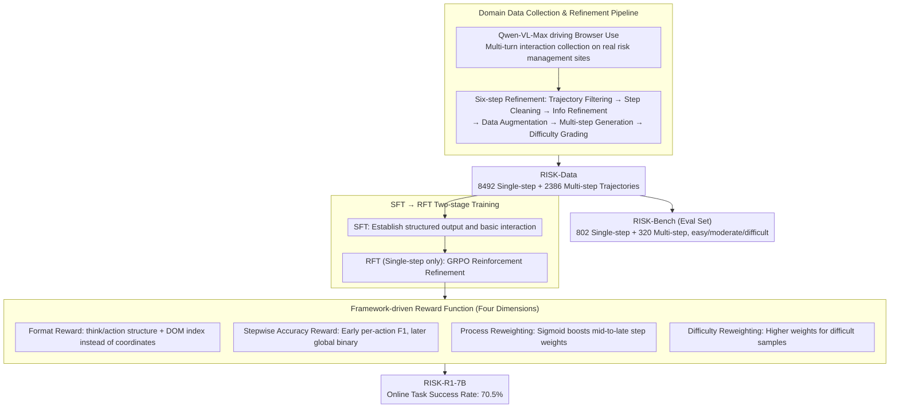

# RISK: A Framework for GUI Agents in E-commerce Risk Management

**Conference**: ACL 2026  
**arXiv**: [2509.21982](https://arxiv.org/abs/2509.21982)  
**Code**: [GitHub](https://github.com/RenqiChen/RISK-GUI)  
**Area**: GUI Agent  
**Keywords**: GUI Agent, E-commerce Risk Management, Reinforcement Fine-Tuning, Web Interaction, Multi-step Reasoning

## TL;DR

Ours proposes the RISK framework, comprising a domain dataset (RISK-Data: 8,492 single-step + 2,386 multi-step trajectories), a benchmark (RISK-Bench), and a GRPO-based reinforcement fine-tuning method (RISK-R1). Specifically designed for GUI agents in e-commerce risk management, the 7B model outperforms SOTA baselines with only 7.2% of the parameters, achieving a 70.5% success rate in online tasks.

## Background & Motivation

**Background**: E-commerce risk management requires aggregating heterogeneous information from multiple external websites (transaction details, user profiles, site verifications, etc.). This information is often embedded in dynamically loaded sub-pages, interactive elements, or complex DOM structures, requiring multi-step stateful web interactions.

**Limitations of Prior Work**: Traditional crawlers cannot handle stateful event-driven interactions. Existing GUI Agents are mostly limited to single-step operations and lack multi-step reasoning and dynamic content processing capabilities. Furthermore, there is a lack of specialized datasets and benchmarks for e-commerce risk management. Training-deployment gaps exist as GUI models are often trained using coordinate-based positioning, while deployment frameworks use DOM indices and tool calls.

**Key Challenge**: General-purpose GUI Agents perform poorly in e-commerce risk scenarios because they lack domain knowledge, multi-step reasoning capabilities, and experience in handling complex web pages.

**Goal**: To build a complete GUI Agent framework for e-commerce risk management—covering everything from data collection to model training and actual deployment.

**Key Insight**: Using the Browser Use framework to collect high-quality domain data and combining it with GRPO reinforcement fine-tuning to achieve a seamless transition from training to deployment.

**Core Idea**: Mitigating the gap between GUI Agent training and real-world deployment through a four-dimensional reward design (format reward + stepwise accuracy reward + process reweighting + difficulty reweighting).

## Method

### Overall Architecture

RISK consists of three components: (1) RISK-Data—data collected via the Browser Use framework driven by Qwen-VL-Max, refined through a 6-step pipeline (trajectory filtering, step cleaning, information refinement, data augmentation, multi-step generation, and difficulty grading), resulting in 8,492 single-step and 2,386 multi-step trajectories; (2) RISK-Bench—containing 802 single-step and 320 multi-step trajectories, categorized into easy/moderate/difficult levels; (3) RISK-R1—a GRPO-based reinforcement fine-tuning framework that establishes basic capabilities via SFT followed by RFT refinement. The data flow involves extracting RISK-Bench as an evaluation set and feeding RISK-Data into SFT→RFT training, where RFT is optimized by a four-dimensional framework-driven reward system.

### Key Designs

**1. Domain Data Collection and Refinement Pipeline: Converting real risk web interactions into high-quality trajectories**

General GUI datasets lack the information gathering and site verification tasks specific to e-commerce risk management. General SFT models like UI-TARS often fail completely on domain tasks. RISK uses Qwen-VL-Max to drive the Browser Use framework for multi-turn raw data collection on real websites, followed by a six-step refinement pipeline—trajectory filtering, step cleaning, information refinement, data augmentation, multi-step generation, and difficulty grading. This yields 8,492 single-step and 2,386 multi-step trajectories (RISK-Data), from which RISK-Bench (802 single-step + 320 multi-step) is derived. The difficulty grading step is particularly crucial, as it supports difficulty reweighting in rewards and helps the benchmark expose model weaknesses in hard samples.

**2. SFT→RFT Two-stage Training: Establishing format and basic capabilities before reinforcement refinement**

Applying RFT directly to base models is unstable; without the established think/action output format, reinforcement signals provide little guidance. RISK therefore uses all RISK-Data for SFT to establish basic interaction capabilities and structured output formats before entering the RFT refinement phase. Notably, RFT only utilizes single-step trajectories (multi-step trajectories are too long for GPU memory), with multi-step capabilities transferred via SFT and single-step RFT. Simultaneously, the stepwise accuracy reward transitions from fine-grained (per-action F1) to coarse-grained (global binary) during this stage. Ablations show that SFT-only (Single-step 83.2 / Multi-step 74.7) lags significantly behind the full model (88.3 / 82.8), confirming the gains from the RFT phase.

**3. Framework-driven Reward Function: Aligning RFT optimization with real-world deployment interfaces**

Methods like GUI-R1 reward "clicking the correct screen coordinates" during training, but the Browser Use framework used in deployment operates via DOM indices and tool calls. This mismatch between training rewards and deployment requirements is why GUI-R1 shows a 0% success rate on multi-step tasks. RISK-R1 aligns rewards with deployment interfaces through four dimensions: (a) **Format reward** checks for structure (think / action / evaluation_previous_goal / memory / next_goal) and ensures actions use DOM indices/tools rather than coordinates; (b) **Stepwise accuracy reward** calculates F1 > 0.5 for each action in the tool list early in training, switching to an overall binary reward for the trajectory later to mitigate poor guidance from sparse signals; (c) **Process reweighting** uses a sigmoid function to assign higher weights to mid-to-late steps in a trajectory, as later steps are more state-dependent and error-prone; (d) **Difficulty reweighting** assigns higher weights to "difficult" samples in the optimization objective to prevent the model from inflating scores using easy samples. Ablations show process reweighting and stepwise rewards provide the most significant gains for multi-step tasks (success rate drops from 82.8 to 79.1/78.3 without them).

## Key Experimental Results

### Main Results

| Model | Single-step Overall | Multi-step Success Rate | OS-Genesis Web |
|------|-----------|----------|---------------|
| GPT-4o | 81.5 | 74.0 | 55.3 |
| Qwen2.5-VL-72B | 80.6 | 67.8 | 50.0 |
| RISK-R1-7B (Ours) | **88.3** | **82.8** | **57.1** |
| GUI-R1-7B | 74.3 | 0.0 | 49.1 |
| UI-TARS-72B | 13.0 | 0.0 | 5.8 |

### Ablation Study

| Configuration | Single-step | Multi-step | Description |
|------|------|------|------|
| RISK-R1 Full | 88.3 | 82.8 | All components |
| - Process Reweighting | 86.5 | 79.1 | Equal weight for late steps |
| - Stepwise Reward | 85.8 | 78.3 | Constant binary reward |
| - Difficulty Reweighting | 87.1 | 80.5 | Equal sample weights |
| SFT Only | 83.2 | 74.7 | No RFT |

### Key Findings
- RISK-R1-7B outperforms the 72B general-purpose model and GPT-4o, reaching SOTA with only 7.2% of the parameters.
- General-purpose GUI SFT models (UI-TARS) fail almost completely on domain tasks, highlighting the necessity of domain-specific data.
- GUI-R1 (coordinate-based RFT) results in a 0% success rate on multi-step tasks, confirming the severity of the training-deployment gap.
- An online evaluation success rate of 70.5% validates the practical deployment value of the method.
- Process reweighting and stepwise rewards provide the most significant improvements for multi-step tasks.

## Highlights & Insights
- **E2E Framework from Data to Deployment**: RISK covers the entire pipeline, including data collection, benchmark construction, model training, and actual deployment.
- **Small Model Outperforms Large Models**: 7B exceeding 72B and GPT-4o demonstrates the value of domain specialization and correct training strategies.
- **Training-Deployment Consistency**: Rewards are based on DOM indices and tool calls rather than coordinates, ensuring a seamless transition from training to deployment frameworks.
- **Online Evaluation**: Beyond offline benchmarks, real-environment online evaluation adds credibility to the results.

## Limitations & Future Work
- **Single-step RFT**: Multi-step trajectories were too long to fit in GPU memory for RFT; multi-step capability relies on transfer from SFT and single-step RFT.
- **Domain Limitation**: Currently focused on e-commerce risk management; applicability to other domains remains to be verified.
- **Framework Dependency**: Closely coupled with the Browser Use framework.
- Future Directions: Supporting multi-step RFT training, expanding to more domains, and integrating more complex risk decision-making processes.

## Related Work & Insights
- **vs GUI-R1**: General GUI RFT using coordinate positioning fails completely in DOM index scenarios; RISK-R1's framework-driven reward addresses this.
- **vs UI-TARS**: General GUI SFT models perform poorly on domain tasks, underscoring the importance of domain-specific data.
- **vs Browser Use**: Ours utilizes it as both a data collection tool and a deployment framework, creating a training-deployment closed loop.

## Rating
- Novelty: ⭐⭐⭐⭐ Innovative framework-driven reward design and training-deployment consistency.
- Experimental Thoroughness: ⭐⭐⭐⭐⭐ Offline and online evaluation, multiple baseline comparisons, and detailed ablation studies.
- Writing Quality: ⭐⭐⭐⭐ Clear framework description, though some details require appendix reference.
- Value: ⭐⭐⭐⭐ Provides a reproducible, comprehensive solution for domain-specific GUI Agents.

<!-- RELATED:START -->

## Related Papers

- [\[ACL 2026\] FlexGuard: Continuous Risk Scoring for Strictness-Adaptive LLM Content Moderation](flexguard_continuous_risk_scoring_for_strictness-adaptive_llm_content_moderation.md)
- [\[AAAI 2026\] An LLM-Based Simulation Framework for Embodied Conversational Agents in Psychological Counseling](../../AAAI2026/llm_safety/an_llm-based_simulation_framework_for_embodied_conversationa.md)
- [\[ACL 2026\] AgentMark: Utility-Preserving Behavioral Watermarking for Agents](agentmark_utility-preserving_behavioral_watermarking_for_agents.md)
- [\[ACL 2026\] A Survey on the Safety and Security Threats of Computer-Using Agents: JARVIS or Ultron?](a_survey_on_the_safety_and_security_threats_of_computer-using_agents_jarvis_or_u.md)
- [\[ACL 2026\] CI-Work: Benchmarking Contextual Integrity in Enterprise LLM Agents](ci-work_benchmarking_contextual_integrity_in_enterprise_llm_agents.md)

<!-- RELATED:END -->
