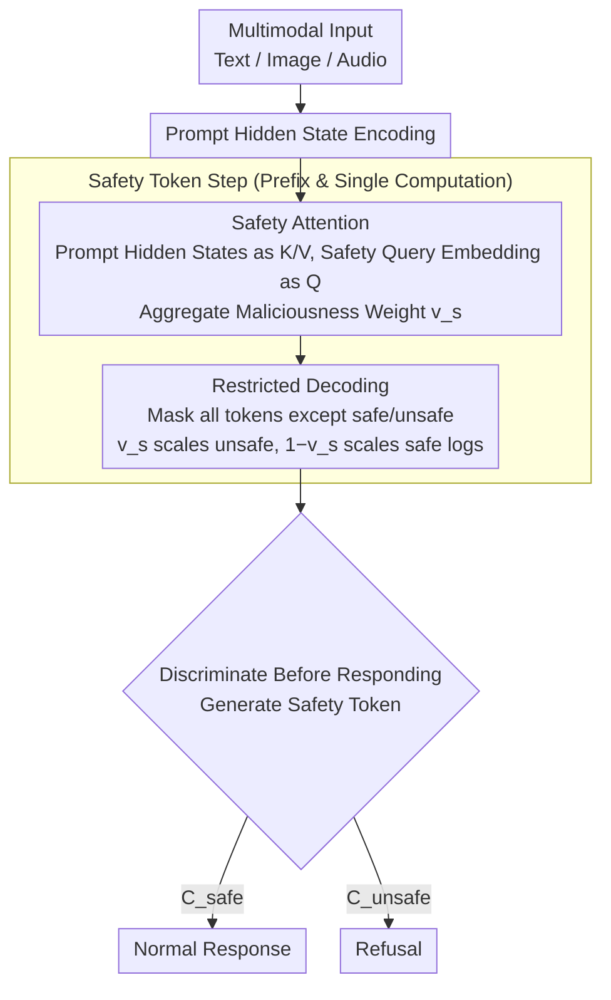

# Robust Multimodal Safety via Conditional Decoding

**Conference**: ACL2026  
**arXiv**: [2604.00310](https://arxiv.org/abs/2604.00310)  
**Code**: No public code provided in the paper  
**Area**: Multimodal Safety / Speech Language Models / Safety Alignment  
**Keywords**: Multimodal Jailbreak Defense, Conditional Decoding, Safety Attention, Qwen2.5-Omni, CASA

## TL;DR
This paper proposes the CASA conditional decoding framework, which requires multimodal models to predict a safety token before generating a response and utilizes safety attention to amplify malicious signals. This approach reduces the average Attack Success Rate (ASR) by over 97% on text, vision, and audio jailbreak benchmarks while largely maintaining the multimodal capabilities for benign inputs.

## Background & Motivation
**Background**: Multimodal Large Language Models (MLLMs) can simultaneously process text, images, and audio, but safety alignment primarily stems from refusal training on the text side. When models are integrated with vision or speech encoders, cross-modal interactions can bypass existing safety boundaries, causing robust text-based alignment to degrade under multimodal inputs.

**Limitations of Prior Work**: The mainstream approach is supervised safety fine-tuning (SSFT), which fine-tunes models using malicious queries paired with refusals and benign queries paired with normal responses. However, this objective forces safety and utility to compete for the same generation target: enhanced refusal capabilities may lead to over-refusal and degraded performance on benign tasks; meanwhile, different modalities require additional safety data and hyperparameter searches.

**Key Challenge**: The model's internal representations may already distinguish between safe and unsafe inputs, but standard decoding does not explicitly invoke this internal judgment. Malicious prompts can induce the model to bypass safety refusals by hiding key intents in long contexts, images, or audio. Thus, the problem is not simply that the "model does not know the danger," but rather that the "model does not stably perform safety discrimination before generation."

**Goal**: The authors aim to design a mechanism that does not rely on external classifiers, does not add independent safety heads, and does not require separate training for each modality. This mechanism allows the model to first judge whether an input is safe and then condition the subsequent generation on that judgment, achieving both robust defense and benign utility.

**Key Insight**: PCA analysis on the final layer representations of Qwen2.5-Omni reveals that benign and malicious queries are separable in the internal representation space. Consequently, the authors reformulate safety judgment as the first token of the generation process and design a safety attention module to directly influence the logit of the safety token.

**Core Idea**: Transform "refusal vs. response" from an implicit generation preference into an explicit binary classification token, conditioning the subsequent response on this safety token. Furthermore, a safety attention module calculated from internal representations is used to strengthen malicious signals, ensuring the model is blocked by a safety gate before any multimodal jailbreak can occur.

## Method
The design of CASA is highly concise: it does not wrap a detector around the model or train additional classification heads. Instead, it requires the original model to generate a safety label at the beginning of every response. This label is not part of the final content shown to the user but serves as a conditional variable controlling the subsequent generation trajectory. Another key component is the safety attention module, which operates only during the safety token generation step, using prompt representations and safety query embeddings to calculate a maliciousness weight that scales the safe/unsafe token logits.

### Overall Architecture
During the training phase, CASA rewrites standard benign responses as `{C_safe, response}` and refusals for malicious queries as `{C_unsafe, refusal}`. This way, the model no longer struggles directly between "outputting a normal response" and "outputting a refusal"; instead, it first predicts the input state and generates appropriate text conditioned on that state.

During the inference phase, the model is restricted to choosing between the `safe` and `unsafe` labels at the safety token step. The safety attention module calculates a weight based on prompt hidden states. If the input resembles a malicious query, the logit for the unsafe token is increased; if the input resembles a benign query, the logit for the safe token is increased. Once the safety token is generated, the subsequent response is naturally conditioned on it.

The experimental base models are Qwen2.5-Omni 3B and 7B. Training data includes approximately 6.2k malicious queries and 10k Alpaca benign queries. Evaluation covers text jailbreaking, vision jailbreaking, and audio spelling attacks, using Claude 3.7 as an LLM judge and 13 human annotators to verify safety and utility.

### Key Designs
**1. Classify Before You Generate: Transforming safety judgment from implicit preference to an explicit token before the response**

The flaw in SSFT is that safety and utility compete within the same generation objective—learning to refuse while simultaneously learning to respond normally. When refusal ability is strengthened, over-refusal and benign task degradation often occur. CASA's approach prepends the judgment of "is this safe or malicious" as the first token of the response. During training, normal benign responses are rewritten as `{C_safe, y_resp}` and refusals for malicious queries as `{C_unsafe, y_ref}`. Thus, the probability of the entire response can be decomposed into predicting the safety variable $P(y_0 = C \mid x)$ and then generating subsequent tokens conditioned on that variable. Safety and utility shift from "entangled objectives optimized simultaneously" to a serial decision process of "discriminate first, then generate by category," where subsequent text is naturally conditioned on this safety token.

**2. Safety Attention Module: Amplifying malicious signals hidden in multimodal inputs during discrimination**

Jailbreak inputs often bury malicious intent in long contexts, image details, or audio spellings. Standard refusal training might only learn surface templates and fail to capture these diluted clues. The safety attention module intervenes specifically during the safety token generation step: it treats prompt hidden states as keys/values and uses a safety query embedding (obtained from a frozen pretrained model) as the query. It aggregates attention to calculate a maliciousness weight $v_s$, which scales the unsafe token logit, while $1 - v_s$ scales the safe token logit. A stop-gradient is used to prevent the attention module from affecting the prompt representations, ensuring the module focuses on learning to "distinguish malicious from benign" without polluting the original representations with gradients. In training, $v_s$ approaches 1 for malicious queries and 0 for benign ones, indicating it learns an interpretable risk gating signal.

**3. Restricted Decoding for Safety Tokens: Ensuring the discrimination step happens exactly once**

If the model were allowed to generate freely during inference, it might skip the safety label and output another prefix, rendering the design ineffective. CASA masks all tokens in the vocabulary except `safe` / `unsafe` during the safety token time step and replaces their logits with the learned scaling factors. This forces the model to choose between the two; once the safety token is determined, subsequent generation proceeds normally without recomputing safety attention. This ensures that "safety judgment necessarily precedes the response" while keeping overhead minimal by adding only one prefix computation.

### Loss & Training
CASA follows the benign/malicious paired training of SSFT but prepends the safety token to the target sequence. In the training objective, $\beta$ controls the weight between the malicious refusal and benign response paths. Gradients for safety attention originate from the logit scaling term, with part of the gradient updating the attention parameters and part updating the original MLLM. PEFT/LoRA is used to fine-tune Qwen2.5-Omni 3B and 7B. The process introduces no external detectors and requires no modality-specific safety fine-tuning.

## Key Experimental Results

### Main Results
The table shows the multimodal jailbreak Attack Success Rate (ASR); lower values are better. CASA significantly reduces ASR across text, vision, and audio attacks.

| Model | Safety Prompt | 3B JB-Prompt | 3B JBV-28k | 3B MM-SB | 3B AIAH | 7B JB-Prompt | 7B JBV-28k | 7B MM-SB | 7B AIAH |
|------|---------------|--------------|------------|----------|---------|--------------|------------|----------|---------|
| Pretrained | No | 42.3 | 36.8 | 37.7 | 81.3 | 33.5 | 37.9 | 38.1 | 64.2 |
| SSFT | No | 18.4 | 7.9 | 14.9 | 71.0 | 0.0 | 7.5 | 8.8 | 25.0 |
| Circuit Breaker | No | 0.9 | 3.9 | 5.1 | 2.3 | 0.3 | 5.7 | 5.4 | 24.4 |
| CASA | No | 0.0 | 4.6 | 9.2 | 2.3 | 0.0 | 0.7 | 9.0 | 1.1 |
| CASA | Yes | 0.0 | 1.4 | 1.2 | 0.0 | 0.9 | 0.0 | 0.2 | 0.6 |

### Ablation Study

| Configuration | JBV-28k ASR | MM-SB ASR | AIAH ASR | Description |
|------|-------------|-----------|----------|------|
| CASA + Safety Attention + Safety Prompt | 1.4 | 1.2 | 0.0 | Full config; near-perfect defense for vision/audio |
| CASA + Safety Attention, w/o Safety Prompt | 4.6 | 9.1 | 2.3 | Still significantly better than versions without attention |
| CASA w/o Safety Attention + Safety Prompt | 8.2 | 18.3 | 60.2 | Particularly vulnerable to audio spelling attacks |
| CASA w/o Safety Attention, w/o Safety Prompt | 13.2 | 26.8 | 61.9 | Shows the safety token alone is insufficient for all multimodal attacks |

### Key Findings
- In prefill attacks, the Pretrained model's ASR rose from 65.3 to 84.7 as prefill length increased. SSFT and Circuit Breaker showed fluctuating performance, while CASA maintained 0.0 ASR across 2, 4, 9, and 12 token prefills.
- In MME utility evaluations, CASA did not degrade multimodal capabilities. It achieved Perception 1621.23 and Cognition 530.71 on the 3B model, and Perception 1651.98 and Cognition 652.85 on the 7B model, both higher than Pretrained, SSFT, and Circuit Breaker.
- Human safety evaluation showed high consistency with the Claude judge: Cohen's κ was 0.79 for safety tasks, and human internal Krippendorff's α was 0.60; for utility tasks, Human-LLM agreement was 0.68.
- Safety attention values approached 1 for malicious queries and 0 for benign queries during training, demonstrating that the module effectively learns interpretable risk-gating signals.

## Highlights & Insights
- CASA's core insight is elegant: multimodal safety failures are not necessarily due to the model "not knowing the danger," but because the generation process fails to prioritize safety judgment. An explicit safety token is a low-cost yet behaviorally powerful intervention.
- The method avoids the deployment complexity of external safety classifiers and the need for modality-specific defense training. For industrial multimodal systems, this endogenous gating is easier to maintain than chaining multiple external guards.
- Safety attention is computed only once at the safety token step, capturing the phenomenon that "refusal behavior is often concentrated at the start of generation," making it efficient and aligned with mechanistic analyses of safety alignment.
- The utility results are noteworthy: CASA outperforms SSFT and CB on MME, suggesting that by decoupling safety and utility, the model does not have to sacrifice normal response capabilities to gain defensive strength.

## Limitations & Future Work
- While the paper evaluates various text, vision, and audio jailbreaks, the authors acknowledge that more complex attack forms may exist, particularly combined, multi-turn, or context-induced attacks.
- Safety Attention performs cross-attention over the entire prompt, which could become a computational bottleneck in long contexts; although computed only once, inputs involving extremely long videos, audio, or multiple documents still require further optimization.
- The scope of safety in this paper primarily covers explicit malicious queries, with less coverage for indirect risks where "surface safety" leads to harm through context combination.
- CASA relies on the model's internal representations already containing separable safety signals; for weaker models, non-instruct models, or domains with poor representation separability, effectiveness may decrease.

## Related Work & Insights
- **vs SSFT**: SSFT learns refusal and normal responses through the same generation target, often causing safety-utility conflicts. CASA uses safety judgment as the first conditional variable, reducing competition between the two goals.
- **vs Circuit Breaker**: Circuit Breaker is a strong defensive baseline but shows instability in some utility and audio attacks. CASA's advantage lies in the direct integration of the safety token and attention gating into the decoding process.
- **vs External Safety Classifiers**: External classifiers require additional deployment and may miss internal cross-modal cues within the model. CASA uses MLLM hidden states directly, staying closer to the model's actual generation path.
- **Insight**: Many alignment problems can be addressed by "explicit state variables before the response," such as factuality tokens, permission tokens, or privacy tokens. The key is to condition subsequent generation on a controllable state rather than filtering output after the fact.

## Rating
- Novelty: ⭐⭐⭐⭐☆ The idea of a conditional safety token is simple and effective, and safety attention proceduralizes the mechanism, though it still builds upon SSFT and token-level gates.
- Experimental Thoroughness: ⭐⭐⭐⭐⭐ Covers text, vision, audio, multiple attacks, utility, and human evaluation; the chain of evidence is very complete.
- Writing Quality: ⭐⭐⭐⭐☆ The method is clearly explained, and tables provide ample information; some formula layouts are a bit dense but do not hinder understanding.
- Value: ⭐⭐⭐⭐⭐ Highly relevant for the safe deployment of multimodal models, particularly for systems where external classifiers are not desired.

<!-- RELATED:START -->

## Related Papers

- [\[ACL 2026\] PARASITE: Conditional System Prompt Poisoning to Hijack LLMs](parasite_conditional_system_prompt_poisoning_to_hijack_llms.md)
- [\[ACL 2026\] SafetyALFRED: Evaluating Safety-Conscious Planning of Multimodal Large Language Models](safetyalfred_evaluating_safety-conscious_planning_of_multimodal_large_language_m.md)
- [\[CVPR 2026\] Towards Robust Multimodal Large Language Models Against Jailbreak Attacks](../../CVPR2026/llm_safety/towards_robust_multimodal_large_language_models_against_jailbreak_attacks.md)
- [\[ACL 2026\] MUSE: A Run-Centric Platform for Multimodal Unified Safety Evaluation of Large Language Models](muse_a_run-centric_platform_for_multimodal_unified_safety_evaluation_of_large_la.md)
- [\[ACL 2026\] When Helpers Become Hazards: A Benchmark for Analyzing Multimodal LLM-Powered Safety in Daily Life](when_helpers_become_hazards_a_benchmark_for_analyzing_multimodal_llm-powered_saf.md)

<!-- RELATED:END -->
