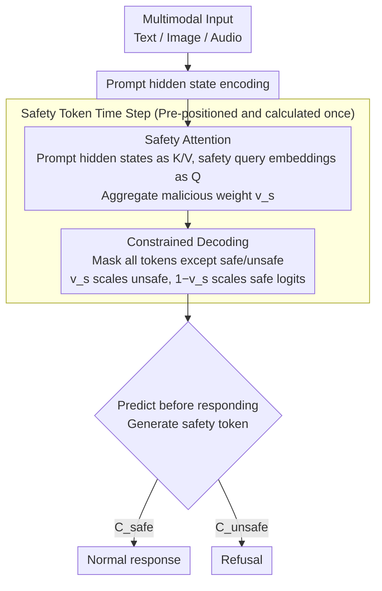

# Robust Multimodal Safety via Conditional Decoding

**Conference**: ACL2026  
**arXiv**: [2604.00310](https://arxiv.org/abs/2604.00310)  
**Code**: No public code provided in the paper  
**Area**: Multimodal Safety / Speech Language Models / Safety Alignment  
**Keywords**: Multimodal Jailbreak Defense, Conditional Decoding, Safety Attention, Qwen2.5-Omni, CASA

## TL;DR
This paper proposes the CASA conditional decoding framework, which requires multimodal models to predict a safety token before generating a response. By using a safety attention mechanism to amplify malicious signals, the framework reduces the average attack success rate by over 97% across text, vision, and audio jailbreak benchmarks while maintaining the multimodal capabilities for benign inputs.

## Background & Motivation
**Background**: Multimodal large language models (MLLMs) can simultaneously process text, images, and audio. However, safety alignment primarily stems from refusal training on the text side. When these models are integrated with visual or speech encoders, cross-modal interactions can bypass existing safety boundaries, causing robust text-based alignment to degrade under multimodal inputs.

**Limitations of Prior Work**: The mainstream approach is supervised safety fine-tuning (SSFT), which involves fine-tuning the model with malicious queries paired with refusals and benign queries paired with normal responses. However, this objective forces safety and utility to compete within the same generation target; enhancing refusal capabilities may lead to over-refusal and a decline in benign task performance. Furthermore, different modalities require additional safety data and hyperparameter searches.

**Key Challenge**: Models may already internally distinguish between safe and unsafe inputs, but standard decoding does not explicitly invoke this internal judgment. Malicious prompts can induce the model to bypass safety refusals by hiding key intentions within long contexts, images, or audio. Thus, the issue is not simply that the "model does not know the danger," but that the "model fails to perform a stable safety discrimination before generation."

**Goal**: The authors aim to design a mechanism that does not rely on external classifiers, add independent safety heads, or require separate training for each modality. This mechanism allows the model to first determine if an input is safe and then condition subsequent generation on that judgment, thereby achieving both robust defense and benign utility.

**Key Insight**: PCA performed on the final layer representations of Qwen2.5-Omni revealed separability between benign and malicious queries in the internal representation space. Consequently, the authors transformed safety judgment into the first token of the generation process and designed a safety attention module to directly influence the logit of the safety token.

**Core Idea**: The decision of "whether to refuse or answer" is shifted from an implicit generation preference to an explicit binary classification token, conditioning the subsequent response on this safety token. A safety attention module, calculated from internal representations, is used to strengthen malicious signals, ensuring the model is intercepted by a safety gate before a multimodal jailbreak can occur.

## Method
The design of CASA is highly concise: it neither wraps the model in an external detector nor trains additional classification heads. Instead, it directs the original model to generate a safety label at the beginning of every response. This label is not intended for the user but serves as a conditional variable controlling the subsequent generation trajectory. Another key component is the safety attention module, which operates only during the safety token time step. It uses prompt representations and safety query embeddings to calculate a malicious weight, which then scales the logits of the safe/unsafe tokens.

### Overall Architecture
During the training phase, CASA rewrites standard benign responses as `{C_safe, response}` and refusals for malicious questions as `{C_unsafe, refusal}`. This ensures the model no longer struggles directly between "outputting a normal response" and "outputting a refusal," but instead predicts the input state first and generates suitable text accordingly.

During the inference phase, the model is restricted to choosing between `safe` and `unsafe` labels at the safety token time step. The safety attention module calculates weights based on prompt hidden states; if the input resembles a malicious query, it increases the logit for the `unsafe` token; if it resembles a benign query, it increases the logit for the `safe` token. Once the safety token is generated, the subsequent response is naturally conditioned on it.

The experimental baselines are Qwen2.5-Omni 3B and 7B. The training data includes approximately 6.2k malicious questions and 10k Alpaca benign questions. Evaluation covers text jailbreaking, visual jailbreaking, and audio spelling attacks, using Claude 3.7 as an LLM judge and 13 human annotators to verify safety and utility evaluations.

### Key Designs
**1. Classify Before You Generate: Transforming safety judgment from an implicit preference into an explicit pre-response token**

The flaw in SSFT is that safety and utility compete within the same generation target—trying to learn both refusal and normal responses simultaneously. When refusal capability increases, over-refusal often occurs and benign performance degrades. CASA's approach is to promote "whether this is a safe or malicious input" to the first token of the response. During training, normal benign responses are rewritten as `{C_safe, y_resp}` and refusals as `{C_unsafe, y_ref}`. Thus, the probability of the entire response can be decomposed into the product of first predicting the safety variable $P(y_0 = C \mid x)$ and then generating subsequent tokens conditioned on that variable. Safety and utility are thus transformed from "entangled objectives for simultaneous optimization" into a "detect-then-generate" serial decision process, where subsequent text is naturally conditioned on this safety token.

**2. Safety Attention Module: Amplifying malicious signals hidden in multimodal inputs during discrimination**

Jailbreak inputs often bury malicious intent in long contexts, visual details, or audio spellings. Standard refusal training might only learn surface-level templates and fail to capture these diluted clues. The safety attention module intervenes specifically at the safety token generation step: it treats prompt hidden states as keys/values and safety query embeddings (obtained from a frozen pretrained model) as queries. It aggregates attention to calculate a maliciousness weight $v_s$, which is then used to scale the logit of the `unsafe` token, while $1 - v_s$ scales the logit of the `safe` token. A stop-gradient is applied to prevent the attention from backpropagating to the prompt representations, ensuring the module focuses on learning to "distinguish malicious from benign" without polluting the original representations. In training, $v_s$ approaches 1 for malicious queries and 0 for benign ones, indicating it learns an interpretable risk gating signal.

**3. Constrained Decoding for Safety Tokens: Ensuring the discrimination step occurs exactly once**

If the model were allowed to generate freely during inference, it could potentially skip the safety label and output another prefix, rendering the design ineffective. CASA masks all tokens in the vocabulary except `safe` / `unsafe` during this single safety token time step and replaces their logits with the learned scaling factors, forcing the model to choose between them. Once the safety token is determined, subsequent normal generation proceeds without recalculating safety attention. This ensures that "safety judgment necessarily precedes the response" while keeping overhead minimal by only adding one forward calculation.

### Loss & Training
CASA continues the benign/malicious paired training of SSFT but prepends the safety token to the target sequence. In the training objective, $\beta$ controls the weights for the malicious refusal and benign response paths. Gradients for safety attention originate from the logit scaling term, where one part updates the attention parameters and the other updates the original MLLM. The entire system is fine-tuned using PEFT/LoRA on Qwen2.5-Omni 3B and 7B, without introducing external detectors or modality-specific safety fine-tuning.

## Key Experimental Results

### Main Results
The table shows the Multimodal Jailbreak Attack Success Rate (ASR); lower values are better. CASA significantly reduces ASR across text, vision, and audio attacks.

| Model | Safety Prompt | 3B JB-Prompt | 3B JBV-28k | 3B MM-SB | 3B AIAH | 7B JB-Prompt | 7B JBV-28k | 7B MM-SB | 7B AIAH |
|------|---------------|--------------|------------|----------|---------|--------------|------------|----------|---------|
| Pretrained | No | 42.3 | 36.8 | 37.7 | 81.3 | 33.5 | 37.9 | 38.1 | 64.2 |
| SSFT | No | 18.4 | 7.9 | 14.9 | 71.0 | 0.0 | 7.5 | 8.8 | 25.0 |
| Circuit Breaker | No | 0.9 | 3.9 | 5.1 | 2.3 | 0.3 | 5.7 | 5.4 | 24.4 |
| CASA | No | 0.0 | 4.6 | 9.2 | 2.3 | 0.0 | 0.7 | 9.0 | 1.1 |
| CASA | Yes | 0.0 | 1.4 | 1.2 | 0.0 | 0.9 | 0.0 | 0.2 | 0.6 |

### Ablation Study

| Configuration | JBV-28k ASR | MM-SB ASR | AIAH ASR | Description |
|------|-------------|-----------|----------|------|
| CASA + Safety Attention + Safety Prompt | 1.4 | 1.2 | 0.0 | Full configuration; vision and audio achieve near-perfect defense. |
| CASA + Safety Attention, w/o Safety Prompt | 4.6 | 9.1 | 2.3 | Still significantly better than the version without attention. |
| CASA w/o Safety Attention + Safety Prompt | 8.2 | 18.3 | 60.2 | Particularly vulnerable to audio spelling attacks. |
| CASA w/o Safety Attention, w/o Safety Prompt | 13.2 | 26.8 | 61.9 | Shows the safety token alone is insufficient for all multimodal attacks. |

### Key Findings
- In prefill attacks, the ASR for the Pretrained model increased from 65.3 to 84.7 as prefill length lengthened. SSFT and Circuit Breaker showed fluctuating performance, while CASA maintained 0.0 ASR across 2, 4, 9, and 12 token prefills.
- In MME utility evaluation, CASA not only preserved multimodal capabilities but achieved Perception 1621.23 and Cognition 530.71 on the 3B model, and Perception 1651.98 and Cognition 652.85 on the 7B model—all higher than Pretrained, SSFT, and Circuit Breaker.
- Human safety evaluation showed high consistency with the Claude judge: Cohen's κ was 0.79 for safety tasks, and human internal Krippendorff's α was 0.60. For utility tasks, Human-LLMaJ consistency was 0.68.
- Safety attention values approached 1 for malicious queries and 0 for benign ones during training, indicating the module learned interpretable risk gating signals.

## Highlights & Insights
- CASA's core insight is elegant: Multimodal safety failures are not necessarily due to a model being "completely unaware of danger," but rather because the generation process does not prioritize safety judgment. An explicit safety token is a low-cost but behaviorally strong intervention.
- The method avoids the deployment complexity of external safety classifiers and the need to train individual defenders for every modality. For industrial multimodal systems, this endogenous gating is easier to maintain than concatenating multiple external guards.
- Safety attention is calculated only once at the safety token step, capturing the phenomenon that "refusal behavior is often concentrated at the start of generation," making it efficient and consistent with mechanistic analyses of safety alignment.
- The utility results are noteworthy: CASA outperformed SSFT and CB on MME, suggesting that by decoupling safety and utility, the model does not have to sacrifice normal response capabilities to gain defensive strength.

## Limitations & Future Work
- Although the paper evaluates various text, vision, and audio jailbreaks, the authors acknowledge that more complex attack forms may exist, particularly combined, multi-turn, or context-induced attacks.
- Safety Attention performs cross-attention over the entire prompt, which could become a computational bottleneck in long contexts. Even though it is calculated only once, further optimization is needed for ultra-long video, audio, or multi-document inputs.
- The safety scope of this paper primarily addresses explicit malicious queries and provides insufficient coverage for indirect risks where "seemingly safe inputs cause harm when combined with context."
- CASA relies on the model's internal representations already containing separable safety signals; for weaker models, non-instruct models, or domains with poor representation separability, effectiveness may decrease.

## Related Work & Insights
- **vs SSFT**: SSFT learns refusal and normal responses through the same generation target, leading to safety-utility conflicts. CASA uses the safety judgment as the first conditional variable, reducing competition between the two objectives.
- **vs Circuit Breaker**: Circuit Breaker is a strong defensive baseline but is unstable regarding some utility metrics and audio attacks. CASA's advantage lies in its safety token and attention gate being directly integrated into the decoding process.
- **vs External Safety Classifiers**: External classifiers require separate deployment and may miss internal cross-modal clues within the model. CASA uses MLLM hidden states directly, keeping it closer to the model's actual generation path.
- **Insight**: Many alignment issues could be addressed by "explicit state variables before the response," such as factuality tokens, permission tokens, or privacy tokens. The key is to condition subsequent generation on a controllable state rather than filtering the output post-hoc.

## Rating
- Novelty: ⭐⭐⭐⭐☆ The idea of conditional safety tokens is simple and effective, and safety attention materializes the mechanism, though it is still built upon SSFT and token-level gating.
- Experimental Thoroughness: ⭐⭐⭐⭐⭐ Covers text, vision, audio, multiple attacks, utility, and human evaluation; the chain of evidence is very complete.
- Writing Quality: ⭐⭐⭐⭐☆ The method is clearly explained with sufficient tabular information. Some formula layouts are slightly dense, but readability remains high.
- Value: ⭐⭐⭐⭐⭐ Highly relevant for the safe deployment of multimodal models, especially for systems where external classifiers are undesirable.

<!-- RELATED:START -->

## Related Papers

- [\[ACL 2026\] PARASITE: Conditional System Prompt Poisoning to Hijack LLMs](parasite_conditional_system_prompt_poisoning_to_hijack_llms.md)
- [\[ACL 2026\] SafetyALFRED: Evaluating Safety-Conscious Planning of Multimodal Large Language Models](safetyalfred_evaluating_safety-conscious_planning_of_multimodal_large_language_m.md)
- [\[ACL 2026\] MUSE: A Run-Centric Platform for Multimodal Unified Safety Evaluation of Large Language Models](muse_a_run-centric_platform_for_multimodal_unified_safety_evaluation_of_large_la.md)
- [\[ACL 2026\] When Helpers Become Hazards: A Benchmark for Analyzing Multimodal LLM-Powered Safety in Daily Life](when_helpers_become_hazards_a_benchmark_for_analyzing_multimodal_llm-powered_saf.md)
- [\[ACL 2026\] LeakDojo: Decoding the Leakage Threats of RAG Systems](leakdojo_decoding_the_leakage_threats_of_rag_systems.md)

<!-- RELATED:END -->
