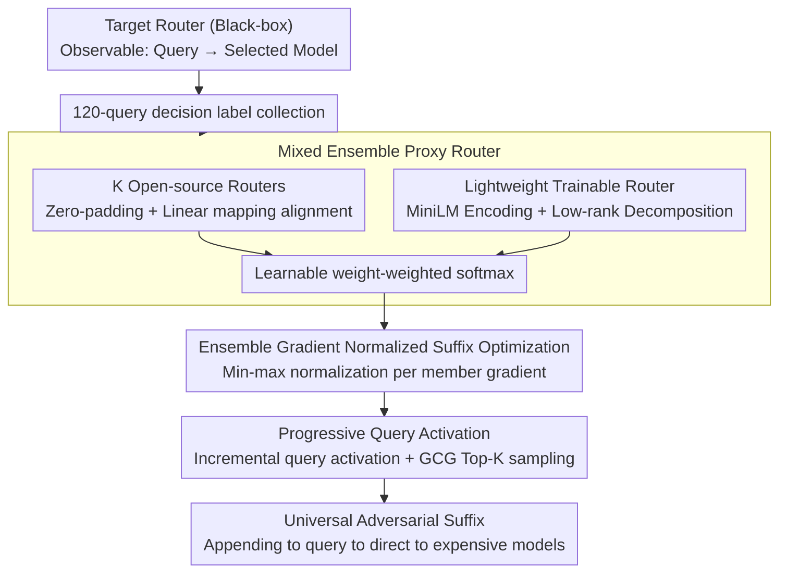

# Route to Rome Attack: Directing LLM Routers to Expensive Models via Adversarial Suffixes

**Conference**: ACL 2026  
**arXiv**: [2604.15022](https://arxiv.org/abs/2604.15022)  
**Code**: [GitHub](https://github.com/thcxiker/R2A-Attack)  
**Area**: LLM/NLP  
**Keywords**: LLM routing attack, adversarial suffixes, black-box attack, proxy router, inference cost

## TL;DR

This paper proposes R2A (Route to Rome Attack). By constructing mixed ensemble proxy routers and optimizing universal adversarial suffixes under a black-box setting, it directs LLM routing decisions from cheap weak models to expensive strong models. On 7 open-source routers and 2 commercial routers (GPT-5-Auto, OpenRouter), the average Attack Success Rate (ASR) increases by 49%, with inference costs rising by 2.7-2.9 times.

## Background & Motivation

**Background**: To balance performance and cost, cost-aware LLM routing directs simple queries to cheap weak models and complex queries to expensive strong models. This strategy is adopted by commercial systems like OpenRouter and GPT-5-Auto. Routers trade off quality loss and cost by optimizing $\mathcal{R}(q) = \arg\min_{M_i} [\ell(q, M_i) + \lambda \cdot C(q, M_i)]$.

**Limitations of Prior Work**: (1) Routing strategies introduce a new security surface—attackers may manipulate routers to consistently select expensive models, increasing operator costs; (2) Existing routing attack methods like Rerouting rely on white-box access (requiring gradients and architecture information), which is inapplicable to commercial black-box scenarios; (3) LifeCycle uses heuristic prompt templates (extracted from high-win-rate queries), lacking rigorous optimization and showing unstable performance across different routers.

**Key Challenge**: The attacker can only observe the final routing decision (which model was selected) without access to internal logits, parameters, or gradients. Under this strict black-box setting, how can a universal adversarial suffix be learned with a limited query budget (120 queries) to consistently mislead routers of different architectures?

**Goal**: (1) Find a universal adversarial suffix that biases the router toward expensive models in a black-box setting; (2) Ensure the suffix generalizes across datasets (including out-of-distribution data).

**Key Insight**: Borrowing ideas from black-box adversarial attacks in computer vision—train a proxy model to simulate the target model's behavior, optimize adversarial samples on the proxy, and then transfer them. The key challenge lies in the diversity of router architectures (embedding-based, LLM-based, etc.), making it difficult for a single-architecture proxy to match the target.

**Core Idea**: Use a mixed ensemble proxy router (multiple open-source routers + a lightweight trainable router) to cover various routing mechanisms. A universal adversarial suffix effective against unknown target routers is found through ensemble suffix optimization with normalized gradients.

## Method

### Overall Architecture

R2A addresses an attack problem under strict black-box conditions: the attacker only sees the final model selection, lacks access to logits/parameters/gradients, and must learn a universal suffix within a 120-query budget. The overall mechanism draws inspiration from black-box transfer attacks in vision—first training a proxy to mimic the target, then optimizing adversarial samples on the proxy for transfer. This involves two phases: Phase 1 collects "query → selected model" labels from the target router using 120 queries to train a mixed ensemble proxy router; Phase 2 uses an improved GCG search on this differentiable proxy to find a suffix that pushes routing probabilities toward strong models. The final product is a fixed suffix appended to the original query.

### Key Designs

**1. Mixed Ensemble Proxy Router: Covering Diverse Architectures with Minimal Queries**

The success of black-box transfer depends on how well the proxy resembles the target. Since router architectures vary widely (embedding-based, LLM-based, etc.), a single-architecture proxy may fail to match the target. R2A's proxy combines two components: (1) $K$ pre-trained open-source routers $\{\mathcal{R}_o^{(1)}, \dots, \mathcal{R}_o^{(K)}\}$ covering mainstream mechanisms, aligned via zero-padding and linear mapping $\mathbf{W}_o$; (2) A lightweight trainable router $\mathcal{R}_l$, which encodes queries using all-MiniLM-L6-v2 and maps to target logits through a LoRA-style low-rank decomposition $\mathbf{z}_l = E(q) \mathbf{W}_l^1 \mathbf{W}_l^2$ ($r \ll d=384$). Outputs are combined using learnable weights:

$$\hat{y} = \text{softmax}\Big(\alpha_0 \mathbf{z}_l + \sum_{i=1}^K \alpha_i \mathbf{z}_o^{(k)}\Big)$$

Low-rank decomposition keeps trainable parameters minimal, enabling effective proxy training within 120 queries. Ablation shows that removing the lightweight router drops ASR on RouterDC from 0.83 to 0.30.

**2. Ensemble Gradient Normalized Suffix Optimization: Balancing Multi-architecture Contributions**

The proxy is a multi-encoder ensemble. Directly running GCG is problematic: the objective is $\min_s \mathcal{L}_A = -\mathbb{E}_q \sum_{M \in \mathcal{M}_{strong}} p(\hat{y}=M\,|\,q \oplus s)$, but gradients $\delta_i^{(k)} = \partial \mathbf{z}^{(k)} / \partial s_i$ can vary by orders of magnitude across architectures. Direct summation would allow the router with the largest gradient to dominate. The solution is min-max normalization per router before weighted aggregation:

$$\tilde{\delta}_i^{(k)} = \frac{\delta_i^{(k)} - \delta_{min}^{(k)}}{\delta_{max}^{(k)} - \delta_{min}^{(k)}}, \qquad \tilde{g}_i = \sum_{k=0}^K \alpha_k \cdot \tilde{\delta}_i^{(k)} \cdot \frac{\partial \mathcal{L}_A}{\partial \mathbf{z}_{total}}$$

This ensures each member router has an equal voice in suffix selection, finding suffixes that generalize across the ensemble and to unknown targets. This detail is crucial; ablation shows ASR on MF routers drops from 0.95 to 0.49 without it.

**3. Progressive Query Activation: Curriculum-style Generalization**

To obtain a universal suffix, R2A uses a progressive strategy. Optimization starts on a single query and only incorporates the next query when the attack succeeds on all currently activated queries. This gradually expands the query distribution the suffix must cover. Each iteration selects Top-K candidate tokens per position, samples $B$ variants, and updates via the lowest loss. This "easy-to-hard" expansion is more stable than simultaneous optimization over all queries.

### Loss & Training

Proxy training uses cross-entropy to align with target router decisions $\mathcal{L}_S = \frac{1}{Q}\sum_{i=1}^Q l(\hat{y}(q_i), \mathcal{R}_t(q_i))$ with a budget $Q=120$. The suffix optimization phase maximizes the probability of routing to strong models. To prevent data leakage, if the target router exists in the ensemble pool, it is removed before training.

## Key Experimental Results

### Main Results

**ASR (Average across 6 datasets, In-distribution + Out-of-distribution)**

| Target Router | Clean | LifeCycle(W) | Rerouting | CoT | **R2A** | Gain vs Clean |
|-----------|-------|-------------|-----------|-----|---------|-----------|
| RouteLLM-Bert | 0.40 | 0.69 | 0.77 | 0.52 | **0.89** | +0.49 |
| GraphRouter | 0.64 | 0.69 | 0.63 | 0.65 | **0.87** | +0.23 |
| RouteLLM-MF | 0.56 | 0.77 | 0.88 | 0.54 | **0.95** | +0.39 |
| OpenRouter* | 0.27 | 0.44 | 0.44 | 0.42 | **0.74** | +0.47 |

### Ablation Study

**Ablation of R2A Core Components (Average on In-distribution datasets)**

| Configuration | RouterDC | CausalLLM | RouteLLM-MF | SW |
|------|---------|-----------|-------------|-----|
| R2A Full | 0.83 | 0.83 | 0.95 | 0.81 |
| w/o Lightweight Router | 0.30 | 0.75 | 0.70 | 0.61 |
| w/o Gradient Norm | 0.33 | 0.78 | 0.49 | 0.63 |

### Key Findings

- R2A increases ASR from 0.27 to 0.74 (+0.47) on the commercial OpenRouter, remaining effective on OOD data.
- Regarding inference cost, cost per million tokens increases by ~2.7x on MMLU and 2.9x on RouterArena.
- GPT-5-Auto Attack: Fingerprinting analysis shows significantly higher "Thinking-likeness" after the attack. LLM judges show post-attack responses have a 64-72% win rate in terms of comprehensiveness and diversity.
- Query Budget: Performance saturates at around 120 queries, demonstrating high sample efficiency.
- Robustness: ASR only drops slightly under whitespace defense (e.g., RouteLLM-Bert MT-Bench: 0.95 → 0.93), showing resistance to simple defenses.

## Highlights & Insights

- The mixed ensemble proxy router design is highly practical—open-source routers provide "prior knowledge" while the lightweight router provides "adaptive compensation." This approach can be generalized to other black-box attack scenarios.
- Gradient normalization is a simple but critical detail—ablation shows it prevents the ASR on MF routers from plummeting.
- The attack cost is extremely low (~$0.98 in query fees), yet it causes cost increases of up to 2.9x, highlighting the importance of routing systems as a security boundary.

## Limitations & Future Work

- Separate adversarial suffixes must be trained for each target router; universal suffixes across different routers are not yet achieved.
- Focuses only on directing routing to expensive models; other attack targets (e.g., specific models, bypassing safety filters) are unexplored.
- Assumes the attacker knows the candidate model pool and the model selected for each query—some deployments may not disclose this.
- GPT-5-Auto can only be evaluated indirectly (decisions are not observable), relying on fingerprinting accuracy.

## Related Work & Insights

- **vs Rerouting (Shafran et al.)**: Requires white-box access (gradients/architecture), while R2A needs only 120 black-box queries.
- **vs LifeCycle**: Uses heuristic templates and is unstable across routers (e.g., 0.69 on GraphRouter vs R2A's 0.87).
- **vs CoT baseline**: "Let's think step by step" is occasionally effective but unstable, even performing worse than "clean" on some routers (e.g., RouteLLM-MF: 0.54 vs 0.56).

## Rating

- Novelty: ⭐⭐⭐⭐ First implementation of LLM routing attacks under strict black-box settings; mixed ensemble proxy and gradient normalization are practical innovations.
- Experimental Thoroughness: ⭐⭐⭐⭐⭐ Evaluated across 7+2 routers, 6 datasets, GPT-5 case studies, cost analysis, defense evaluation, ablation, and budget sensitivity.
- Writing Quality: ⭐⭐⭐⭐ Clearly defined problems and formal threat models.
- Value: ⭐⭐⭐⭐⭐ Reveals critical security vulnerabilities in LLM routing systems, providing direct warnings for commercial deployments.

<!-- RELATED:START -->

## Related Papers

- [\[ACL 2026\] Evaluating Answer Leakage Robustness of LLM Tutors against Adversarial Student Attacks](evaluating_answer_leakage_robustness_of_llm_tutors_against_adversarial_student_a.md)
- [\[AAAI 2026\] GraphTextack: A Realistic Black-Box Node Injection Attack on LLM-Enhanced GNNs](../../AAAI2026/llm_safety/graphtextack_a_realistic_black-box_node_injection_attack_on_llm-enhanced_gnns.md)
- [\[CVPR 2026\] Omni-Attack: Adversarial Attacks on Open-Ended VQA in Black-Box Multimodal LLMs](../../CVPR2026/llm_safety/omni-attack_adversarial_attacks_on_open-ended_vqa_in_black-box_multimodal_llms.md)
- [\[NeurIPS 2025\] Adversarial Paraphrasing: A Universal Attack for Humanizing AI-Generated Text](../../NeurIPS2025/llm_safety/adversarial_paraphrasing_a_universal_attack_for_humanizing_ai-generated_text.md)
- [\[ACL 2026\] Seeing No Evil: Blinding Large Vision-Language Models to Safety Instructions via Adversarial Attention Hijacking](seeing_no_evil_blinding_large_vision-language_models_to_safety_instructions_via_.md)

<!-- RELATED:END -->
