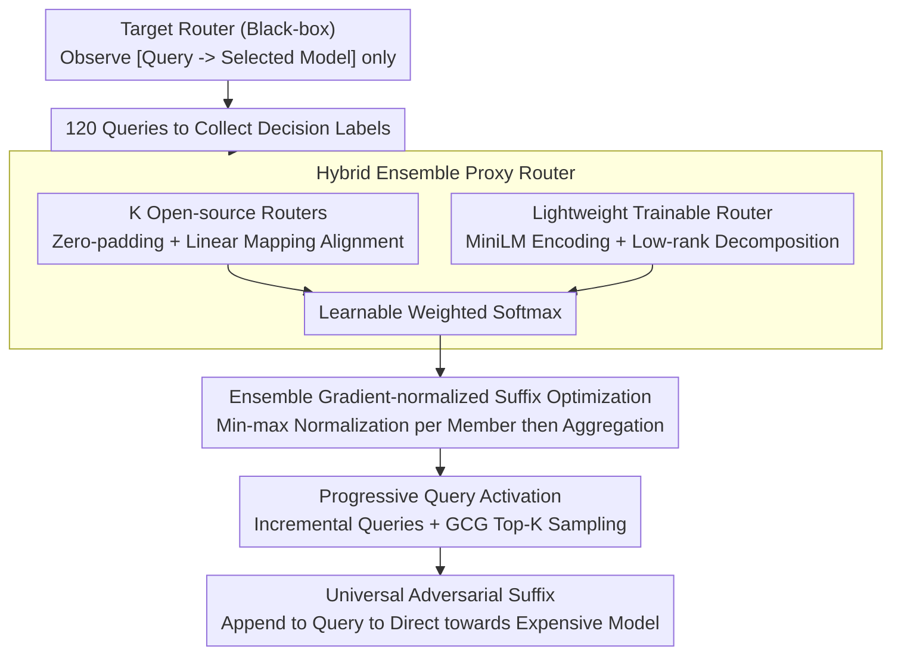

# Route to Rome Attack: Directing LLM Routers to Expensive Models via Adversarial Suffixes

**Conference**: ACL 2026  
**arXiv**: [2604.15022](https://arxiv.org/abs/2604.15022)  
**Code**: [GitHub](https://github.com/thcxiker/R2A-Attack)  
**Area**: LLM/NLP  
**Keywords**: LLM routing attack, adversarial suffix, black-box attack, proxy router, inference cost

## TL;DR

Ours proposes R2A (Route to Rome Attack), which constructs a hybrid ensemble proxy router and optimizes a universal adversarial suffix under a black-box setting to divert LLM routing decisions from cheap weak models to expensive strong models. It achieves an average gain of 49% in attack success rate across 7 open-source and 2 commercial routers (GPT-5-Auto, OpenRouter), increasing inference costs by 2.7-2.9 times.

## Background & Motivation

**Background**: To balance performance and cost, cost-aware LLM routing directs simple queries to cheap weak models and complex queries to expensive strong models. This strategy is adopted by commercial systems like OpenRouter and GPT-5-Auto. Routers optimize $\mathcal{R}(q) = \arg\min_{M_i} [\ell(q, M_i) + \lambda \cdot C(q, M_i)]$ to trade off quality loss and cost.

**Limitations of Prior Work**: (1) Routing strategies introduce a new security surface where attackers may manipulate routers to consistently select expensive models, increasing operator costs. (2) Existing methods like Rerouting depend on white-box access (requiring gradients and architecture details), which is inapplicable to commercial black-box scenarios. (3) LifeCycle uses heuristic prompt templates (extracted from high-win-rate queries) without rigorous optimization, leading to unstable performance across different routers.

**Key Challenge**: The attacker can only observe the final routing decision (which model was selected) without access to internal logits, parameters, or gradients. Under this strict black-box setting, how can one learn a universal adversarial suffix with a limited query budget (120 queries) to consistently mislead routers of various architectures?

**Goal**: (1) Find universal adversarial suffixes in a black-box setting where only routing decisions are observable to bias routers toward expensive models. (2) Ensure suffixes generalize across datasets, including out-of-distribution data.

**Key Insight**: Borrowing from black-box adversarial attack concepts in computer vision, one can train a proxy model to simulate the target model's behavior, optimize adversarial samples on the proxy, and then transfer them. The key difficulty is that router architectures are diverse (embedding-based, LLM-based, etc.), and a single-architecture proxy may not match the target router.

**Core Idea**: Use a hybrid ensemble proxy router (comprising multiple open-source routers and a lightweight trainable router) to cover various routing mechanisms. A universal adversarial suffix effective against unknown target routers is found through ensemble suffix optimization with normalized gradients.

## Method

### Overall Architecture

R2A addresses an attack problem under strict black-box conditions: the attacker only sees the final model selection, lacks logits/parameters/gradients, and must learn a universal adversarial suffix within a 120-query budget. The approach adopts black-box transfer attack logic—training a proxy to mimic the target, then optimizing on that proxy. There are two stages: in the first stage, 120 queries collect "query $\to$ selected model" labels to train a hybrid ensemble proxy router approximating the target's behavior; in the second stage, an improved GCG search is performed on this differentiable proxy to find a suffix that pushes routing probabilities toward strong models. The output is a fixed suffix appended to original queries.

### Key Designs

**1. Hybrid Ensemble Proxy Router: Covering "Matched" and "Unseen" Architectures with Minimal Queries**

The success of black-box transfer depends on how well the proxy resembles the target. Since router architectures vary (embedding-based vs. LLM-based), a single-architecture proxy often fails. R2A's proxy combines two parts: first, $K$ pre-trained open-source routers $\{\mathcal{R}_o^{(1)}, \dots, \mathcal{R}_o^{(K)}\}$ covering mainstream mechanisms, aligned to the target model pool via zero-padding and linear mapping $\mathbf{W}_o$; if the target resembles an open-source implementation, the ensemble matches it quickly. Second, a lightweight trainable router $\mathcal{R}_l$ uses all-MiniLM-L6-v2 for encoding followed by a LoRA-style low-rank decomposition $\mathbf{z}_l = E(q) \mathbf{W}_l^1 \mathbf{W}_l^2$ ($r \ll d=384$) to map to target logits, compensating for targets unlike any open-source router. Outputs are combined via learnable weights:

$$\hat{y} = \text{softmax}\Big(\alpha_0 \mathbf{z}_l + \sum_{i=1}^K \alpha_i \mathbf{z}_o^{(k)}\Big)$$

Low-rank decomposition minimizes trainable parameters, enabling effective proxy training within 120 queries; ablation shows ASR on RouterDC drops from 0.83 to 0.30 without the lightweight router.

**2. Ensemble Gradient-normalized Suffix Optimization: Ensuring Fair Contribution Across Diverse Architectures**

The proxy is a multi-encoder ensemble. Running GCG directly is problematic as gradients $\delta_i^{(k)} = \partial \mathbf{z}^{(k)} / \partial s_i$ for suffix tokens may differ by orders of magnitude between embedding-based and LLM-based routers. Direct summation allows the router with the largest gradient to dominate. R2A applies min-max normalization to each router's gradient before weighted aggregation:

$$\tilde{\delta}_i^{(k)} = \frac{\delta_i^{(k)} - \delta_{min}^{(k)}}{\delta_{max}^{(k)} - \delta_{min}^{(k)}}, \qquad \tilde{g}_i = \sum_{k=0}^K \alpha_k \cdot \tilde{\delta}_i^{(k)} \cdot \frac{\partial \mathcal{L}_A}{\partial \mathbf{z}_{total}}$$

This ensures every member router exerts equal influence, finding a suffix that transfers to the entire ensemble and the unknown target. Ablation shows removing this causes ASR on MF routers to plunge from 0.95 to 0.49.

**3. Progressive Query Activation: Achieving Cross-query Universality via Curriculum Expansion**

To find a "universal" suffix effective for all queries, R2A uses a progressive strategy. Optimization starts with the first query; only after the suffix successfully attacks all currently activated queries is the next query added to the optimization set. This expands the query distribution the suffix must cover. Each iteration selects Top-K candidates per position, samples $B$ variants, and updates with the lowest loss. This curriculum-style expansion allows the suffix to lock onto a pattern via simple queries before generalizing, proving more stable than optimizing all queries at once.

### Loss & Training

Proxy training uses cross-entropy to align with target router decisions $\mathcal{L}_S = \frac{1}{Q}\sum_{i=1}^Q l(\hat{y}(q_i), \mathcal{R}_t(q_i))$ with a budget $Q=120$. Suffix optimization maximizes the probability of routing to strong models. To prevent data leakage, if the target router exists in the ensemble pool, it is removed before training.

## Key Experimental Results

### Main Results

**Attack Success Rate (ASR) (Average across 6 datasets, In-distribution + OOD)**

| Target Router | Clean | LifeCycle(W) | Rerouting | CoT | **R2A** | Δ vs Clean |
|-----------|-------|-------------|-----------|-----|---------|-----------|
| RouteLLM-Bert | 0.40 | 0.69 | 0.77 | 0.52 | **0.89** | +0.49 |
| GraphRouter | 0.64 | 0.69 | 0.63 | 0.65 | **0.87** | +0.23 |
| RouteLLM-MF | 0.56 | 0.77 | 0.88 | 0.54 | **0.95** | +0.39 |
| OpenRouter* | 0.27 | 0.44 | 0.44 | 0.42 | **0.74** | +0.47 |

### Ablation Study

**Ablation of R2A Core Components (Average ASR on In-distribution datasets)**

| Configuration | RouterDC | CausalLLM | RouteLLM-MF | SW |
|------|---------|-----------|-------------|-----|
| R2A Full | 0.83 | 0.83 | 0.95 | 0.81 |
| w/o Lightweight Router | 0.30 | 0.75 | 0.70 | 0.61 |
| w/o Grad Normalization | 0.33 | 0.78 | 0.49 | 0.63 |

### Key Findings

- R2A improves ASR on the commercial OpenRouter from 0.27 to 0.74 (+0.47) and remains effective on OOD data.
- Regarding inference cost, costs per million tokens increased by approximately 2.7x on MMLU and 2.9x on RouterArena.
- Attack on GPT-5-Auto: Fingerprinting analysis shows "thinking-likeness" increased significantly after the attack; LLM judges indicate win rates of 64-72% in dimensions like comprehensiveness and diversity.
- Query budget analysis: Performance saturates near 120 queries, demonstrating high sample efficiency.
- Robustness: ASR drops only slightly under white-space defense (e.g., RouteLLM-Bert MT-Bench: 0.95 $\to$ 0.93), showing resilience against simple defenses.

## Highlights & Insights

- The hybrid ensemble proxy design is practical—open-source routers provide "prior knowledge" while the lightweight router provides "adaptive compensation." This approach can be generalized to other black-box attack scenarios.
- Gradient normalization is a simple but critical detail; without it, MF router ASR drops from 0.95 to 0.49.
- The attack cost is extremely low ($0.98 in query fees), yet it causes cost increases up to 2.9x, highlighting routing systems as a critical security boundary.

## Limitations & Future Work

- Separate adversarial suffixes must be trained for each target router; cross-router universal suffixes are not yet achieved.
- Focus is limited to directing routing to expensive models; other targets like specific models or bypassing safety filters are unexplored.
- Assumes the attacker knows the candidate model pool and the model selected for each query—some deployments might hide this information.
- GPT-5-Auto is evaluated indirectly (routing decisions are unobservable), relying on the accuracy of fingerprinting.

## Related Work & Insights

- **vs Rerouting (Shafran et al.)**: Rerouting requires white-box access (gradients/architecture), whereas R2A requires only 120 black-box queries.
- **vs LifeCycle**: LifeCycle uses heuristic templates and is unstable across different routers (e.g., 0.69 ASR on GraphRouter vs. R2A's 0.87).
- **vs CoT baseline**: "Let's think step by step" is occasionally effective but inconsistent, performing worse than clean inputs on some routers (e.g., RouteLLM-MF: 0.54 vs. clean 0.56).

## Rating

- Novelty: ⭐⭐⭐⭐ First to achieve LLM routing attacks under strict black-box settings; hybrid ensemble proxies and gradient normalization are practical innovations.
- Experimental Thoroughness: ⭐⭐⭐⭐⭐ 7+2 routers × 6 datasets + GPT-5 case study + cost analysis + defense evaluation + ablation + budget sensitivity.
- Writing Quality: ⭐⭐⭐⭐ Clear problem definitions and standardized threat models.
- Value: ⭐⭐⭐⭐⭐ Reveals critical security vulnerabilities in LLM routing systems, providing direct warnings for commercial deployments.

<!-- RELATED:START -->

## Related Papers

- [\[CVPR 2026\] Multi-Paradigm Collaborative Adversarial Attack Against Multi-Modal Large Language Models](../../CVPR2026/llm_safety/multi-paradigm_collaborative_adversarial_attack_against_multi-modal_large_langua.md)
- [\[ACL 2026\] Evaluating Answer Leakage Robustness of LLM Tutors against Adversarial Student Attacks](evaluating_answer_leakage_robustness_of_llm_tutors_against_adversarial_student_a.md)
- [\[CVPR 2026\] V-Attack: Targeting Disentangled Value Features for Controllable Adversarial Attacks on LVLMs](../../CVPR2026/llm_safety/v-attack_targeting_disentangled_value_features_for_controllable_adversarial_atta.md)
- [\[AAAI 2026\] GraphTextack: A Realistic Black-Box Node Injection Attack on LLM-Enhanced GNNs](../../AAAI2026/llm_safety/graphtextack_a_realistic_black-box_node_injection_attack_on_llm-enhanced_gnns.md)
- [\[CVPR 2026\] Omni-Attack: Adversarial Attacks on Open-Ended VQA in Black-Box Multimodal LLMs](../../CVPR2026/llm_safety/omni-attack_adversarial_attacks_on_open-ended_vqa_in_black-box_multimodal_llms.md)

<!-- RELATED:END -->
