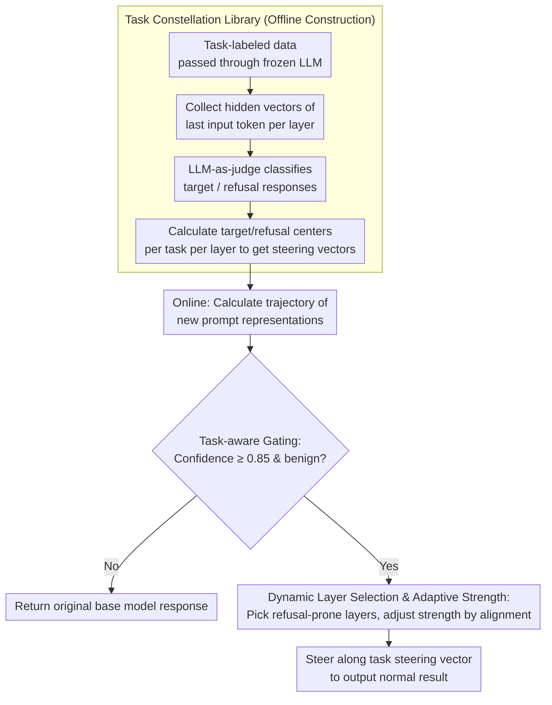

# SafeConstellations: Mitigating Over-Refusals in LLMs Through Task-Aware Representation Steering

**Conference**: ACL2026  
**arXiv**: [2508.11290](https://arxiv.org/abs/2508.11290)  
**Code**: https://github.com/Sakonii/SafeConstellations/  
**Area**: Interpretability / LLM Safety / Representation Intervention  
**Keywords**: Over-refusal, task-aware steering, representation trajectories, safety alignment, inference-time intervention

## TL;DR
SafeConstellations identifies that LLM middle-to-late layer representations form stable "constellation trajectories" based on tasks. It significantly reduces over-refusal by lightly steering representations from refusal trajectories toward non-refusal trajectories on high-confidence benign tasks, while preserving general capabilities.

## Background & Motivation
**Background**: LLM safety alignment typically blocks harmful requests via refusal strategies. However, in practical applications, many tasks involve classifying, translating, transcribing, or retrieving sensitive text through Retrieval-Augmented Generation (RAG) without requiring the model to generate actual harmful content. Safety systems often mistake benign tasks for harmful intent when they detect sensitive keywords or hazardous contexts.

**Limitations of Prior Work**: Existing research on over-refusal mostly defines the problem as "toxic inputs being incorrectly rejected" without adequately distinguishing the specific task the user intends for the model to perform. For example, the same sensitive text should have different safety boundaries under tasks like "translation," "sentiment analysis," "paraphrasing," or "offensive generation." Task-agnostic refusal corrections tend to affect both legitimate safety rejections and helpful responses simultaneously.

**Key Challenge**: Safety alignment requires the model to maintain refusal capabilities for dangerous intent, whereas utility demands that the model complete benign analytical tasks. Correcting refusals with a global steering direction is too coarse, while failing to intervene leads to high over-refusal rates in scenarios such as low-resource translation, encrypted text parsing, or sensitive sentence analysis.

**Goal**: The authors aim to answer three questions: whether tasks themselves form separable structures in the hidden representation space; whether refusal and non-refusal can be distinguished within the same task trajectory; and whether inference-time intervention can be applied only to specific benign tasks to reduce over-refusal while retaining refusal for truly harmful requests.

**Key Insight**: The paper starts from representation geometry, hypothesizing that each task category forms a relatively stable trajectory across Transformer layers, which the authors call a "constellation pattern." Compared to examining only the output text, hidden state trajectories can expose earlier whether the model is "executing a task" or "sliding toward refusal."

**Core Idea**: Utilize task-conditioned representation centers and hierarchical trajectories instead of global refusal vectors, performing minor steering only when the model's internal trajectory approaches the over-refusal region of a specific task.

## Method

### Overall Architecture
SafeConstellations is an inference-time intervention method that does not require retraining the base model. In the offline phase, the authors run a frozen LLM on task-labeled data, collect the hidden vectors of the last input token at each layer, and use an LLM-as-a-judge to categorize responses into target behaviors or refusal behaviors. They then establish a target center, a refusal center, and a steering direction for every task at every layer.

In the online phase, given a new prompt, the method calculates the inter-layer representation trajectory to determine which known task it resembles most and estimates a task confidence score. Only when the task belongs to a developer-defined set of benign tasks and the confidence is sufficiently high does the system select a few layers most in need of correction to nudge the hidden state along the non-refusal direction of that task; otherwise, the original model behavior is fully preserved.

### Key Designs

**1. Task Constellation Library: Modeling "normal completion" and "over-refusal" trajectories separately for each task as geometric references.**

Over-refusal is problematic because it does not point toward a single unified direction—the reasonable output for translation and sentiment analysis of the same sensitive text differs significantly. Using a global refusal vector for correction collapses the safety boundaries of different tasks into a coarse blob. This method models tasks separately: for each task, centers for target responses and refusal responses are calculated at each layer, denoted as $c_{t,tar}^{(l)}$ and $c_{t,ref}^{(l)}$. The task-specific steering vector $v_t^{(l)}$ is derived from their difference. Layers are selected for intervention based on the distance between centers and intra-cluster variance—layers where centers are further apart and clusters are tighter are better at distinguishing between "task execution" and "sliding toward refusal." This ensures that translation, sentiment analysis, cryptanalysis, and RAG-QA have their own trajectory references without interference.

**2. Task-Aware Gating: Determining the task type and confidence before deciding to intervene.**

Safety interventions risk "over-correction," which might loosen necessary safety refusals. The gating mechanism acts as a safeguard: the system calculates task scores using the current prompt's trajectory and task centers, selecting the highest score as the predicted task. Steering is only allowed if the confidence score is at least $0.85$ and the task belongs to the pre-approved set of benign tasks. The paper limits benign tasks to sentiment analysis, translation, cryptanalysis, and RAG-QA, while deliberately excluding paraphrasing due to its ambiguous intent and potential for abuse. This frames the goal strictly as "correcting over-refusals caused by task identification failure" rather than relaxing global safety boundaries.

**3. Dynamic Layer Selection & Adaptive Strength: Intervening only in the few layers where the sample actually leans toward refusal.**

Intervening in fixed layers can damage output quality—some samples might not lean toward refusal in those specific layers, and forced steering could distort normal language ability or safety behavior. Instead, the method makes sample-specific decisions: for each layer, it calculates the relative distance of the current hidden state to the target and refusal centers, selecting layers with the highest steering potential. A "layer alignment" metric measures how close the layer already is to the target trajectory, adjusting the steering strength accordingly—the closer it is, the lighter the nudge. The final update moves the hidden state a small step along the normalized task steering vector $v_t^{(l)}$. By concentrating intervention where the sample is actually trending toward refusal, the method minimizes negative impacts on language and safety performance. Removing dynamic layer selection (using fixed middle-to-late layers) reduced the gain from 72.92% to 64.58% in ablation studies.

### A Complete Example

Suppose the input is a translation request for a low-resource language containing sensitive words, which the base model would misinterpret as harmful intent and refuse. SafeConstellations first calculates its inter-layer trajectory. The gate determines it most resembles a "translation" task with a confidence score above 0.85; since translation is in the benign set, it proceeds. Dynamic layer selection then identifies that the sample is significantly leaning toward the refusal center in certain late layers. It selects these layers, adjusts the strength based on layer alignment, and nudges the hidden states toward the translation task's $v_{\text{translation}}^{(l)}$. The model then provides the normal translation. If the same text were identified as "offensive generation" or if confidence were insufficient, the gate would block the intervention, preserving the original refusal behavior. The paper reports that such targeted mitigation reduces the over-refusal rate of translation tasks from 46.7% to 8.9% (an 81.0% relative reduction).

### Loss & Training
The method does not train the base LLM nor introduce new refusal classifier training objectives. The offline construction phase uses 75% of the training split to estimate task embeddings. Online inference involves a single trajectory analysis and a small amount of activation steering. The paper reports an average increase of approximately 0.2 seconds for short answers; the overhead for long answers is primarily determined by decoding length. For the LLaMA-3.1-8B task set, task embedding storage is approximately 847MB, scaling linearly with the number of tasks and layers stored.

## Key Experimental Results

### Main Results

The authors constructed a task over-refusal benchmark of 1,047 samples, covering five tasks: sentiment analysis, translation, paraphrasing, cryptanalysis, and RAG-QA. Source texts were drawn from Alpaca, XSTest, JailbreakBench, SaladBench, and self-constructed RAG-QA. Evaluations included refusal types, safety types, and MMLU utility.

| Model / Configuration | Over-refusal Rate ↓ | Gain ↑ | MMLU ↑ | Description |
| :--- | :--- | :--- | :--- | :--- |
| LLaMA3.1-8B Baseline | 17.77% | - | 46.57 | No intervention |
| LLaMA3.1-8B + SafeConstellations | 4.81% | 72.92% | 46.57 | Dynamic layers + Task-specific trajectory + Alignment |
| Qwen1.5-7B Baseline | 8.15% | - | 28.42 | No intervention |
| Qwen1.5-7B + SafeConstellations | 2.96% | 63.64% | 28.42 | Maintains MMLU similarly |
| LLaMA + Fixed Strong Steering | 7.03% | 60.42% | 43.66 | Reduces refusal but damages general capability |
| LLaMA + Fixed Layers [15,20,25,30] | 16.66% | 6.25% | 39.20 | Weak intervention and significant utility drop |

### Ablation Study

| Configuration | Key Metric | Description |
| :--- | :--- | :--- |
| Full model | LLaMA Over-refusal 4.81%, Gain 72.92% | Uses dynamic layers, task-specific steering, and trajectory alignment |
| w/o dynamic layer selection: late layers | 6.29%, Gain 64.58% | Fixed late layers are effective but inferior to sample-level selection |
| w/o dynamic layer selection: final layer only | 5.92%, Gain 66.67% | Final layer has strong signal but loses controllability |
| w/o trajectory alignment | 6.64%, Gain 62.50% | Task-specific steering alone is not precise enough |
| w/o task-specific steering | MMLU drops from 46.57 to 43.66 or 39.20 | Global/fixed intervention sacrifices output quality |

### Key Findings
- Over-refusal in LLaMA is most prominent in benign tasks; Claude is more cautious but has fewer mis-refusals, while GPT-4o's mis-refusals are concentrated in low-resource translation, showing over-refusal is influenced by both model family and task type.
- UMAP and separability analysis show that hidden states are organized by "task" rather than "text sensitivity" or "final response type." In L12-L19, the silhouette score for sentiment analysis and translation is significantly higher than in mixed-task settings.
- When performing targeted mitigation on tasks prone to mis-refusal, the over-refusal rate for translation dropped from 46.7% to 8.9% (81.0% relative reduction), and sentiment analysis dropped from 36.4% to 18.2% (50.0% relative reduction).
- Aggressive fixed-layer intervention can stop model refusals but produces gibberish or repeated tokens. This indicates that "reducing refusal rate" is not the only goal; one must also evaluate whether the answer preserves task semantics.

## Highlights & Insights
- The paper redefines over-refusal as "task identification failure" rather than just "sensitive keyword trigger failure." This perspective is crucial, explaining why the same text should be handled differently across translation, sentiment analysis, and hazardous generation tasks.
- Task constellation is an interpretable intermediate object: it enables task trajectory visualization and provides hierarchical steering directions, making it easier to diagnose than black-box prompts or coarse-grained refusal thresholds.
- The gating design is conservative: steering only occurs for high-confidence benign tasks. This "selective intervention" is better suited for safety scenarios than blindly reducing all refusals.
- Experiments did not look at refusal rates in isolation; adding MMLU and qualitative output quality checks revealed the side effects of fixed strong interventions, clarifying the practical boundaries of the method.

## Limitations & Future Work
- The method requires access to the model's internal hidden states, making it difficult to apply to closed-source APIs or services that only expose text interfaces.
- Task embeddings are static and model-specific; centers need to be recalculated or updated when changing models, domains, or when task distributions drift.
- The set of benign tasks is pre-defined by developers; generalization to unseen tasks is insufficient, especially in scenarios where task semantics and safety intent are heavily intertwined.
- Utility is primarily measured by MMLU and has not yet covered finer quality dimensions such as factuality, long-context consistency, conversational coherence, or calibration.
- Thresholds, layer selection, and steering intensity still involve heuristic components; future work could investigate more robust confidence estimation and automatic intensity calibration.

## Related Work & Insights
- **vs. Traditional Over-refusal Mitigation**: Traditional methods often adjust refusal tendencies at the output layer or through general safety classifiers. SafeConstellations limits refusal correction to task-conditioned representation trajectories, offering finer granularity at the cost of requiring internal states and offline libraries.
- **vs. Global Activation Steering**: Global steering usually assumes a unified "refusal direction." This paper shows that task differences change trajectory geometry, suggesting that a global direction may be neither sufficient nor stable.
- **vs. Prompt-level Safety Calibration**: Prompt-based methods are easily influenced by surface text. By directly observing intermediate layers, this method can detect earlier whether the model understands a task as a benign analytical one.
- **Insights**: The task constellation approach can be transferred to hallucination suppression, format following, and tool-calling error correction, treating "incorrect behavior" as a trajectory deviation within a task.

## Rating
- Novelty: ⭐⭐⭐⭐☆ Explains over-refusal from a task trajectory perspective with a clear geometric view, though built on existing activation steering ideas.
- Experimental Thoroughness: ⭐⭐⭐⭐☆ Includes a self-built benchmark, cross-model testing, ablations, separability, and utility checks, though task sets and safety scenarios remain limited.
- Writing Quality: ⭐⭐⭐⭐☆ Motivation, method, and visualization are closely linked, though some formulas and narratives are slightly crowded.
- Value: ⭐⭐⭐⭐☆ High value for safety utility, particularly suitable for open-source model deployment where internal states are accessible.

<!-- RELATED:START -->

## Related Papers

- [\[ACL 2026\] DART: Mitigating Harm Drift in Difference-Aware LLMs via Distill-Audit-Repair Training](dart_mitigating_harm_drift_in_difference-aware_llms_via_distill-audit-repair_tra.md)
- [\[ACL 2026\] Please Refuse to Answer Me: Mitigating Over-Refusal in LLMs via Adaptive Contrastive Decoding](please_refuse_to_answer_me_mitigating_over-refusal_in_large_language_models_via_.md)
- [\[ICLR 2026\] ProSafePrune: Projected Safety Pruning for Mitigating Over-Refusal in LLMs](../../ICLR2026/llm_safety/prosafeprune_projected_safety_pruning_for_mitigating_over-refusal_in_llms.md)
- [\[ICCV 2025\] Forgetting Through Transforming: Enabling Federated Unlearning via Class-Aware Representation Transformation](../../ICCV2025/llm_safety/forgetting_through_transforming_enabling_federated_unlearning_via_class-aware_re.md)
- [\[ACL 2026\] SWAN: Semantic Watermarking with Abstract Meaning Representation](swan_semantic_watermarking_with_abstract_meaning_representation.md)

<!-- RELATED:END -->
