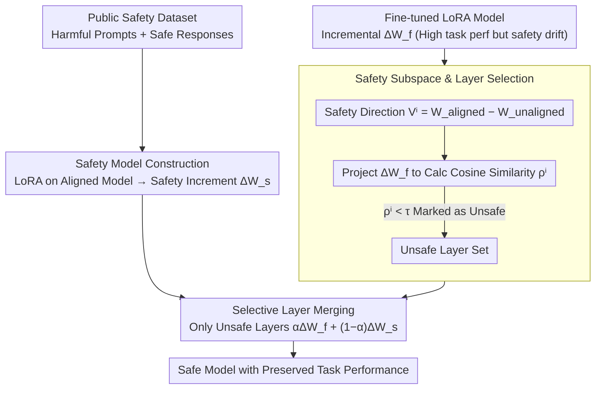

# SafeMERGE: Preserving Safety Alignment in Fine-Tuned Large Language Models via Selective Layer-Wise Model Merging

**Conference**: ACL 2026 Findings  
**arXiv**: [2503.17239](https://arxiv.org/abs/2503.17239)  
**Code**: [GitHub](https://github.com/aladinD/SafeMERGE)  
**Area**: LLM Alignment / Safety  
**Keywords**: Safety Alignment, Model Merging, LoRA Fine-tuning, Post-fine-tuning Defense, Selective layer-wise merging

## TL;DR

Ours proposes SafeMERGE, a lightweight post-fine-tuning framework that identifies fine-tuned layers deviating from safe behavior via cosine similarity and merges only these layers with corresponding layers of a safety model. This significantly reduces harmful outputs across four LLMs while maintaining or even improving task performance.

## Background & Motivation

**Background**: Fine-tuning LLMs for domain-specific tasks is common, but research indicates that fine-tuning (even with harmless data) erodes safety alignment—only a few malicious samples are needed to make an aligned model comply with harmful requests. Safety alignment has been proven to be "shallow" and easily broken during fine-tuning.

**Limitations of Prior Work**: (1) Alignment-stage defenses require modifying the initial alignment process, which is practitioner-unfriendly; (2) Fine-tuning-stage defenses require custom training algorithms, making them difficult to integrate with standard open-source libraries; (3) Simple post-fine-tuning defenses (such as the full-layer merging in RESTA) often sacrifice task performance for safety.

**Key Challenge**: How to restore safety after fine-tuning without modifying existing training pipelines and without harming task performance?

**Goal**: Design a simple, plug-and-play post-fine-tuning framework that performs selective merging only when necessary (when a layer deviates from safe behavior).

**Key Insight**: Define a "safety alignment subspace" using the weight difference between an aligned model and a base model, and detect whether fine-tuned LoRA layers deviate from this subspace via cosine similarity.

**Core Idea**: Merge only those layers that deviate from safe behavior while preserving the task performance of other layers—selectivity is superior to global merging.

## Method

### Overall Architecture

SafeMERGE consists of three steps: (1) Train a safety LoRA model (using public safety datasets, reusable after one training session); (2) Detect "unsafe" layers of the fine-tuned model via safety subspace projection; (3) Perform linear merging with the safety model only for unsafe layers. The safety reference (from safety model construction) and unsafe layer labels (from layer selection) run in parallel and converge at the merging step.

### Key Designs

**1. Safety Subspace and Layer Selection: Measuring "which layers drifted" instead of a one-size-fits-all approach**

Uniformly projecting all layers back to the safety direction, as in SafeLoRA, restores safety but pulls back task-oriented layers that were performing well, leading to performance loss. SafeMERGE defines a "safety direction" to inspect layers individually: the safety alignment subspace for layer $i$ is spanned by the weight difference $V^i = W_{aligned}^i - W_{unaligned}^i$. The fine-tuned LoRA increment $\Delta W_f^i$ is projected onto this subspace to obtain $C^i \Delta W_f^i$, and the cosine similarity $\rho^i$ is calculated. A high $\rho^i$ indicates the fine-tuning update aligns with the safety direction; if $\rho^i < \tau$, the layer is marked as "unsafe." Intervention is thus narrowed from "all layers" to a "problematic minority," preserving task learning in other layers.

**2. Selective Layer Merging: Pulling only flagged unsafe layers back to the safety model**

Global schemes like RESTA apply safety corrections to every layer, modifying even those that are already safe and unnecessarily damaging task performance. SafeMERGE performs linear merging $\Delta W_{merge}^i = \alpha \Delta W_f^i + (1-\alpha) \Delta W_s^i$ only for layers marked as unsafe, where $\Delta W_s^i$ is the safety model increment. The coefficient $\alpha$ adjusts the tradeoff between task capability and safety. Layers judged as safe remain unchanged. This minimal intervention keeps the cost to task performance at a minimum while restoring safety.

**3. Safety Model Construction: Providing task-agnostic, reusable "safety reference layers"**

Merging requires a clear target for "safe behavior." SafeMERGE performs standard LoRA fine-tuning on an aligned model using public safety datasets (harmful prompts + safe responses) to obtain the reference layers $\Delta W_s$. The authors swept various data scales (100 / 500 / 1000 / 2500 samples) and selected the one with the lowest harm score. Crucially, this safety model is task-independent and can be reused across different tasks after being trained once, further lowering adoption costs.

### Loss & Training

The safety model is fine-tuned using standard LoRA. SafeMERGE itself requires no training—it only involves cosine similarity calculations and linear merging, which can run entirely on a CPU. Evaluation is cross-validated using Llama-Guard-3-8B and ShieldGemma-9B.

## Key Experimental Results

### Main Results

| Method | Llama-3.1 GSM8K↑ | DirectHarm↓ | HexPhi↓ |
|------|-----------------|-------------|---------|
| Original Aligned Model | 73.80 | 11.30 | 7.90 |
| After Fine-tuning | 78.24 | 28.30 | 14.70 |
| SafeInstruct | 77.40 | 12.50 | 7.20 |
| RESTA | 74.20 | 11.90 | 6.90 |
| SafeLoRA | 77.90 | 15.10 | 7.10 |
| **Ours (SafeMERGE)** | **78.50** | **8.80** | **6.30** |

### Ablation Study

| Dimension | Result |
|----------|------|
| Merging Strategy (Linear vs DARE vs TIES) | Linear merging is sufficient |
| Threshold τ Sensitivity | Larger τ merges more layers, increasing safety but potentially decreasing task performance |
| Safety Data Volume | 500-1000 samples are usually optimal |
| Weighting Schemes | Uniform α generally performs well |

### Key Findings

- SafeMERGE consistently outperforms or matches baselines across all 4 LLMs and 2 task settings.
- On Llama-3.1, SafeMERGE even exceeds the original aligned model's task performance (78.50 vs 73.80) while being safer (8.80 vs 11.30).
- Selective merging is superior to full-layer merging (RESTA)—RESTA shows significant task performance degradation (74.20 vs 78.50).
- The safety model is reusable across tasks, eliminating the need for retraining for every new task.

## Highlights & Insights

- The intuition of "fixing only what needs fixing" is simple yet effective—selectivity is superior to global intervention.
- The ability to run entirely on a CPU with no retraining makes it highly valuable for practical deployment.
- The design of a safety model that can be trained once and reused across tasks significantly reduces adoption costs.

## Limitations & Future Work

- The definition of the safety subspace depends on the availability of both aligned and base models—not all models release their base versions.
- Validated only on 7B-8B models; layer selection characteristics may differ in larger models.
- The threshold $\tau$ requires tuning; currently, there is no automatic selection method.
- Considers only LoRA fine-tuning; applicability to full-parameter fine-tuning remains unknown.

## Related Work & Insights

- **vs SafeLoRA**: SafeLoRA projects all layers onto the safety subspace, losing task information; SafeMERGE selectively merges only unsafe layers.
- **vs RESTA**: RESTA subtracts a "harmful task vector" globally without distinguishing between safe and unsafe layers; SafeMERGE's selective strategy is more granular.
- **vs SafeInstruct**: SafeInstruct mixes safety samples into the training data, requiring modification of the training process; SafeMERGE is entirely post-processing.

## Rating

- Novelty: ⭐⭐⭐ The idea of selective merging is intuitive and effective, though technically a combination of existing methods.
- Experimental Thoroughness: ⭐⭐⭐⭐⭐ 4 models × 5 tasks, cross-validation, and extensive ablations.
- Writing Quality: ⭐⭐⭐⭐ Clear and concise with intuitive method descriptions.
- Value: ⭐⭐⭐⭐⭐ Extremely high practical value—simple, effective, and plug-and-play.

<!-- RELATED:START -->

## Related Papers

- [\[ACL 2026\] SharedRequest: Privacy-Preserving Model-Agnostic Inference for Large Language Models](sharedrequest_privacy-preserving_model-agnostic_inference_for_large_language_mod.md)
- [\[ACL 2025\] Merge Hijacking: Backdoor Attacks to Model Merging of Large Language Models](../../ACL2025/llm_safety/merge_hijacking_backdoor_attacks_to_model_merging_of_large_language_models.md)
- [\[AAAI 2026\] SafeNlidb: A Privacy-Preserving Safety Alignment Framework for LLM-based Natural Language Database Interfaces](../../AAAI2026/llm_safety/safenlidb_a_privacy-preserving_safety_alignment_framework_for_llm-based_natural_.md)
- [\[ACL 2026\] Reasoning Structure Matters for Safety Alignment of Reasoning Models](reasoning_structure_matters_for_safety_alignment_of_reasoning_models.md)
- [\[ICLR 2026\] Safety at One Shot: Patching Fine-Tuned LLMs with A Single Instance](../../ICLR2026/llm_safety/safety_at_one_shot_patching_fine-tuned_llms_with_a_single_instance.md)

<!-- RELATED:END -->
