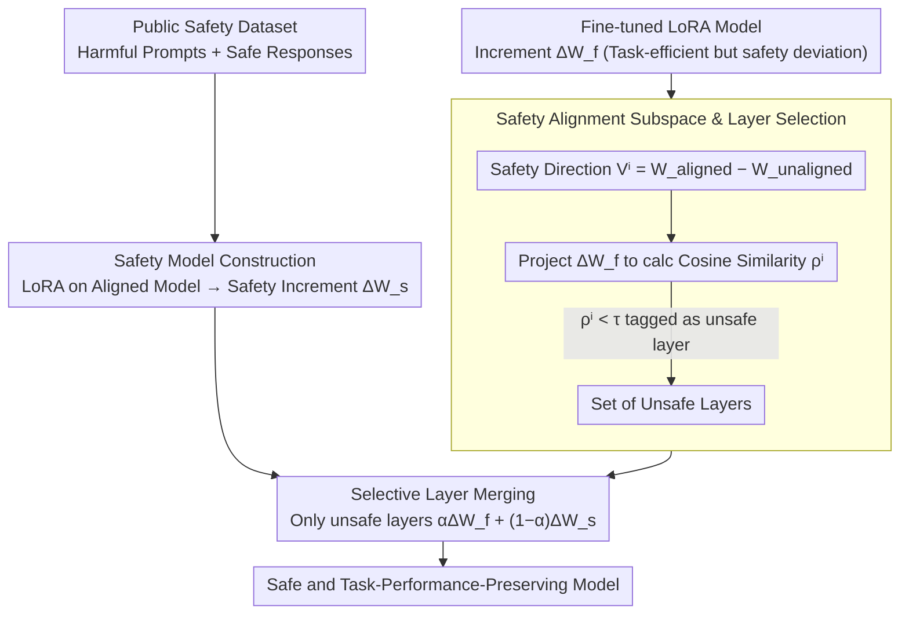

# SafeMERGE: Preserving Safety Alignment in Fine-Tuned Large Language Models via Selective Layer-Wise Model Merging

**Conference**: ACL 2026 Findings  
**arXiv**: [2503.17239](https://arxiv.org/abs/2503.17239)  
**Code**: [GitHub](https://github.com/aladinD/SafeMERGE)  
**Area**: LLM Alignment / Safety  
**Keywords**: Safety Alignment, Model Merging, LoRA Fine-tuning, Post-fine-tuning Defense, Selective layer merging

## TL;DR

This paper proposes SafeMERGE, a lightweight post-fine-tuning framework that detects fine-tuned layers deviating from safe behavior via cosine similarity and merges only those layers with corresponding layers of a safety model. It significantly reduces harmful outputs across four LLMs while maintaining or even improving task performance.

## Background & Motivation

**Background**: Fine-tuning LLMs for specific domains is a common practice, but research shows that fine-tuning (even with harmless data) can erode safety alignment—just a few malicious samples can cause aligned models to comply with harmful requests. Safety alignment is proven to be "shallow" and easily broken during fine-tuning.

**Limitations of Prior Work**: (1) Defense at the alignment stage requires modifying the initial alignment process, which is practitioner-unfriendly; (2) Defense during fine-tuning requires custom training algorithms, making integration with standard open-source libraries difficult; (3) Simple post-fine-tuning defenses (like global merging in RESTA) often sacrifice task performance for safety.

**Key Challenge**: How to restore safety after fine-tuning without modifying the existing training process or compromising task performance?

**Goal**: Design a simple, plug-and-play post-fine-tuning framework that performs selective merging only when necessary (i.e., when layers deviate from safe behavior).

**Key Insight**: Utilize the weight difference between the aligned model and the base model to define a "safety alignment subspace" and detect if fine-tuned LoRA layers deviate from this subspace using cosine similarity.

**Core Idea**: Merge only the layers that deviate from safe behavior while preserving the task performance of other layers—selective merging is superior to global merging.

## Method

### Overall Architecture

SafeMERGE consists of three steps: (1) Train a safety LoRA model (using public safety datasets; one-time training for reuse); (2) Detect which layers of the fine-tuned model are "unsafe" via safety subspace projection; (3) Perform linear merging of only the unsafe layers with the safety model. The safety reference (from safety model construction) and unsafe layer tagging (from layer selection) proceed in parallel and converge at the merging step.

### Key Designs

**1. Safety Alignment Subspace and Layer Selection: Measuring "which layers deviated during fine-tuning" rather than a one-size-fits-all approach.** 

Uniformly projecting all layers back to the safety direction, as in SafeLoRA, restores safety but also drags back layers that learned task-specific information correctly, leading to performance loss. SafeMERGE first defines a "safety direction" for each layer: $V^i = W_{aligned}^i - W_{unaligned}^i$ spans the safety alignment subspace for the $i$-th layer. The fine-tuned LoRA increment $\Delta W_f^i$ is projected onto this subspace to obtain $C^i \Delta W_f^i$, and the cosine similarity $\rho^i$ is calculated. High $\rho^i$ indicates that fine-tuning updates remain aligned with the safety direction; if $\rho^i < \tau$, it indicates the layer has deviated from safe behavior and is marked as an "unsafe layer." This narrows the intervention to a few problematic layers while preserving task learning in others.

**2. Selective Layer Merging: Pulling only flagged unsafe layers back to the safety model while leaving safe layers untouched.** 

Global schemes like RESTA apply safety corrections to every layer, causing unnecessary damage to task performance in layers that are already safe. SafeMERGE performs linear merging $\Delta W_{merge}^i = \alpha \Delta W_f^i + (1-\alpha) \Delta W_s^i$ only for the marked unsafe layers, where $\Delta W_s^i$ is the increment of the safety model at the same layer. The coefficient $\alpha$ directly adjusts the trade-off between "retaining task capability" and "restoring safety"; layers judged as safe keep their fine-tuned weights unchanged. By minimizing the intervention scope, it restores safety with minimal cost to task performance.

**3. Safety Model Construction: Providing a task-agnostic, reusable "safety reference" set of layers.** 

Merging requires a clear target for "safe behavior." SafeMERGE uses standard LoRA fine-tuning on an aligned model with public safety datasets (harmful prompt + safe response pairs) to obtain the reference layers $\Delta W_s$. The authors scanned different data sizes (100 / 500 / 1000 / 2500 samples) and selected the one with the lowest harmfulness score. Crucially, this safety model is task-agnostic and reusable across tasks—no retraining is needed when switching to a new task, further lowering adoption costs.

### Loss & Training

The safety model is fine-tuned using standard LoRA. SafeMERGE itself requires no training—it only involves calculating cosine similarities and linear merging, and can run entirely on a CPU. Evaluation is cross-validated using Llama-Guard-3-8B and ShieldGemma-9B.

## Key Experimental Results

### Main Results

| Method | Llama-3.1 GSM8K↑ | DirectHarm↓ | HexPhi↓ |
|------|-----------------|-------------|---------|
| Original Aligned Model | 73.80 | 11.30 | 7.90 |
| After Fine-tuning | 78.24 | 28.30 | 14.70 |
| SafeInstruct | 77.40 | 12.50 | 7.20 |
| RESTA | 74.20 | 11.90 | 6.90 |
| SafeLoRA | 77.90 | 15.10 | 7.10 |
| **SafeMERGE** | **78.50** | **8.80** | **6.30** |

### Ablation Study

| Analysis Dimension | Result |
|----------|------|
| Merging strategy (Linear vs DARE vs TIES) | Linear merging is sufficient |
| Threshold τ sensitivity | Larger τ merges more layers, increasing safety but potentially decreasing task performance |
| Safety data volume | 500-1000 samples are usually optimal |
| Different weight schemes | Uniform α generally performs well |

### Key Findings

- SafeMERGE consistently outperforms or matches baselines across all 4 LLMs and 2 task settings.
- On Llama-3.1, SafeMERGE even exceeds the original aligned model's task performance (78.50 vs 73.80) while being safer (8.80 vs 11.30).
- Selective merging is superior to global merging (RESTA)—RESTA shows significant task performance degradation (74.20 vs 78.50).
- The safety model is reusable across tasks, eliminating the need for retraining for every new task.

## Highlights & Insights

- The intuition of "fixing only the layers that need fixing" is simple yet highly effective—selective intervention is superior to global intervention.
- The ability to run entirely on a CPU without retraining makes it highly valuable for practical deployment.
- The design of a reusable safety model significantly lowers the cost of adoption.

## Limitations & Future Work

- The definition of the safety subspace depends on the availability of both aligned and base models—not all models provide a public base version.
- Validation was only performed on 7B-8B models; layer selection characteristics might differ in larger models.
- The threshold $\tau$ requires tuning, and an automated selection method is currently missing.
- Only LoRA fine-tuning was considered; the applicability to full-parameter fine-tuning remains unknown.

## Related Work & Insights

- **vs SafeLoRA**: SafeLoRA projects all layers uniformly onto the safety subspace, losing some task information; SafeMERGE selectively merges only unsafe layers.
- **vs RESTA**: RESTA globally subtracts a "harmful task vector" without distinguishing between safe and unsafe layers; SafeMERGE's selective strategy is more granular.
- **vs SafeInstruct**: SafeInstruct mixes safety samples into the training data, requiring modifications to the training process; SafeMERGE is purely post-processing.

## Rating

- Novelty: ⭐⭐⭐ The idea of selective merging is intuitive and effective, though technically a combination of existing methods.
- Experimental Thoroughness: ⭐⭐⭐⭐⭐ 4 models × 5 tasks, cross-validation, and extensive ablations.
- Writing Quality: ⭐⭐⭐⭐ Clear, concise, and intuitive method description.
- Value: ⭐⭐⭐⭐⭐ High practical value—simple, effective, and plug-and-play.

<!-- RELATED:START -->

## Related Papers

- [\[ACL 2026\] SharedRequest: Privacy-Preserving Model-Agnostic Inference for Large Language Models](sharedrequest_privacy-preserving_model-agnostic_inference_for_large_language_mod.md)
- [\[ACL 2025\] Merge Hijacking: Backdoor Attacks to Model Merging of Large Language Models](../../ACL2025/llm_safety/merge_hijacking_backdoor_attacks_to_model_merging_of_large_language_models.md)
- [\[AAAI 2026\] SafeNlidb: A Privacy-Preserving Safety Alignment Framework for LLM-based Natural Language Database Interfaces](../../AAAI2026/llm_safety/safenlidb_a_privacy-preserving_safety_alignment_framework_for_llm-based_natural_.md)
- [\[ACL 2026\] Reasoning Structure Matters for Safety Alignment of Reasoning Models](reasoning_structure_matters_for_safety_alignment_of_reasoning_models.md)
- [\[ICLR 2026\] Membership Inference Attacks Against Fine-tuned Diffusion Language Models (SAMA)](../../ICLR2026/llm_safety/membership_inference_attacks_against_fine-tuned_diffusion_language_models.md)

<!-- RELATED:END -->
