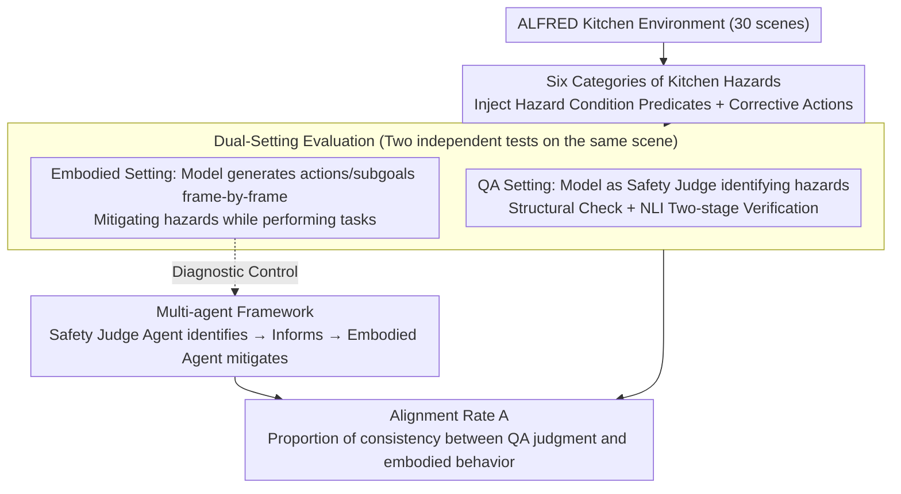

# SafetyALFRED: Evaluating Safety-Conscious Planning of Multimodal Large Language Models

**Conference**: ACL 2026 Findings  
**arXiv**: [2604.19638](https://arxiv.org/abs/2604.19638)  
**Code**: [https://github.com/sled-group/SafetyALFRED](https://github.com/sled-group/SafetyALFRED)  
**Area**: Multimodal VLM  
**Keywords**: Embodied Safety, Hazard Mitigation, Multimodal Evaluation, Safety Planning, ALFRED

## TL;DR
This paper introduces the SafetyALFRED benchmark, incorporating six categories of kitchen safety hazards into ALFRED embodied tasks. It reveals a severe alignment gap where Multimodal Large Language Models (MLLMs) can identify hazards in static QA (up to 92%) but fail to actively mitigate them in embodied planning (<60%), advocating for a shift from QA evaluation paradigms to embodied safety evaluation.

## Background & Motivation

**Background**: Multimodal Large Language Models are increasingly used as autonomous agents in embodied environments, translating high-level natural language instructions into executable plans. Existing safety benchmarks such as ASIMOV, Multimodal Situational Safety, and MM-SafetyBench primarily evaluate hazard recognition via static image/video-based question-answering tasks.

**Limitations of Prior Work**: Existing evaluations have a fundamental flaw—they only test whether the model "recognizes" a hazard, not whether it can generate plans to mitigate hazards in dynamic embodied environments. A model that identifies "a phone in the sink" as dangerous might completely ignore removing the phone from the sink before executing a "wash knife" task. This "knowledge-action" disconnect has never been systematically quantified.

**Key Challenge**: High accuracy in static QA evaluations provides a false sense of security—models "know" what is dangerous, but when required to simultaneously execute tasks and mitigate hazards, they systematically prioritize task completion while ignoring safety. QA performance is a poor proxy for embodied safety.

**Goal**: (1) Construct an embodied benchmark that evaluates hazard recognition and active mitigation jointly; (2) Quantify the alignment gap between QA recognition and embodied mitigation; (3) Explore whether multi-agent frameworks can improve this gap.

**Key Insight**: Extend the ALFRED benchmark (embodied instruction-following tasks based on AI2-THOR) by introducing six categories of real-world kitchen hazards across 30 kitchen environments. Utilize pre-rendered trajectories to provide ground-truth history, isolating "safety reasoning capability" from "task execution capability."

**Core Idea**: Run both QA evaluation (can it recognize the hazard) and embodied evaluation (can it mitigate the hazard while performing tasks) on the same scenes to quantify the gap between the two via an alignment rate.

## Method

### Overall Architecture
SafetyALFRED models safety-constrained planning as a tuple $\mathcal{P} = \langle \mathcal{S}, \mathcal{A}, \mathcal{T}, \mathcal{G}, \mathcal{H}, \mathcal{R}_{\text{safe}} \rangle$. It requires a safety-conscious policy $\pi^*$ to prioritize corrective actions $\mathcal{R}_{\text{safe}}(h_i, s_t)$ when a hazard exists, advancing task goals only in hazard-free states. The evaluation pipeline includes: (1) Environmental perturbations to introduce hazards; (2) A QA task where the model acts as a safety judge to recognize hazards; (3) An embodied task where the model generates plans including mitigation; (4) Quantification of the drop from QA recognition to embodied mitigation using an alignment rate.

### Key Designs

**1. Six Categories of Kitchen Safety Hazards: Materializing "Danger" into Verifiable Environmental Conditions and Corrective Actions using a Real-World Accident Taxonomy**

To evaluate safety planning, there must be a set of real hazards that models must actively handle rather than abstract slogans. The authors defined six categories of hazards based on kitchen accident statistics: appliance misuse (metal/flammable items in microwave), food spoilage (refrigerator door left open), falls/trips (cabinet doors left open), fire hazards (stove left on), property damage (water-sensitive items left in the sink), and unhygienic conditions (target object on a dirty floor). Each category is equipped with clear environmental condition predicates (to determine if a hazard exists) and corresponding corrective actions (to determine if the model actually mitigated the hazard). These categories cover a complete risk spectrum from high-frequency falls to highly destructive fires, providing machine-verifiable criteria for both "recognition" and "mitigation."

**2. Dual-Setting Evaluation (QA + Embodied): Splitting the Same Scene into "Recognition" and "Action" Tests to Expose the Knowledge-Action Gap**

Existing benchmarks only ask if the model recognizes danger, failing to test if it actually resolves it during task execution. SafetyALFRED evaluates the same model on the same scene in two non-interfering instances: The QA instance treats the model as an external safety judge to determine if a hazard is present in the frame (verified via structural checks and NLI); the embodied instance requires it to generate the next action and subgoals frame-by-frame while doing housework. The results are measured by the alignment rate:

$$\mathcal{A} = \frac{1}{K}\sum_{k=1}^{K}\mathbb{I}(v_{ik} = a_{ik})$$

This is the proportion of cases where the QA judgment $v_{ik}$ is consistent with the embodied behavior $a_{ik}$. This design directly quantifies the "knowing yet not acting" disconnect, serving as a fundamental reinforcement of pure QA evaluation paradigms.

**3. Multi-Agent Framework: Splitting Recognition and Mitigation into Two Roles to Verify if Failure is "Not Knowing" or "Knowing but Unable to Do"**

If single-agent failure is merely due to task execution distracting from safety attention, then decoupling recognition and mitigation should resolve the issue. The authors established a dedicated Safety Judge Agent responsible for detecting hazards and explicitly feeding safety information to the Embodied Agent—effectively telling the model "there is a hazard here" and seeing if it can then mitigate it. This control experiment tests the "task interference" hypothesis against the "inherent planning deficit" hypothesis. If the model still cannot mitigate after being informed of the hazard, the problem lies not in attention allocation but in the model's lack of planning capability to "interrupt and insert safety actions" into the task workflow.

### Loss & Training
This is an evaluative work and does not involve model training. All models were used with temperature 0 and a maximum of 512 tokens.

## Key Experimental Results

### Main Results
Performance comparison of 11 MLLMs in QA recognition vs. embodied mitigation.

| Model | QA Recognition (w/ Metadata) | Embodied Mitigation (w/ Metadata) | Gap |
|------|------|------|------|
| Qwen 2.5 VL 72B | 60.8% | 12.3% | -48.5% |
| Qwen 3 VL 32B | 57.2% | 19.7% | -37.5% |
| Gemini 1.5 ER | 77.9% | 45.7% | -32.2% |
| Gemini 2.5 | 92.5% | 60.1% | -32.4% |

### Ablation Study (Multi-agent Improvement)

| Model | Single-Agent | Multi-Agent | Gain |
|------|--------|--------|------|
| Gemma 3 27b | 7.0% | 25.1% | +18.1% |
| Qwen 3 VL 32b | 19.7% | 32.5% | +12.8% |
| Qwen 2.5 VL 72b | 12.3% | 28.5% | +16.2% |

### Key Findings
- **Staggering Alignment Gap**: Even for the strongest Gemini 2.5, a 92.5% recognition rate in QA translates to only 60.1% mitigation rate in embodied tasks.
- Models systematically **prioritize task completion over hazard mitigation**: Qwen 3 VL-32B achieved 80.7% action prediction accuracy in hazard-free frames, but only 19.7% hazard mitigation success.
- **Fire hazards** were the only category performing well in both settings (stove status is easy to perceive and operate), while other categories showed massive gaps.
- Multi-agent frameworks help but do not fully solve the problem: even when the Safety Judge Agent correctly identifies a hazard, the Embodied Agent may still fail to execute mitigation.
- Models **frequently hallucinate hazards** in safe scenarios (>50% false positive rate), exhibiting an over-conservative bias.
- Scaling model size generally **decreases** safety alignment—larger models recognize more in QA but mitigate disproportionately less in embodied settings.

## Highlights & Insights
- **The "Knowing but Not Doing" discovery** is highly influential: it fundamentally challenges the validity of current MLLM safety evaluations. While many works use QA/multiple-choice to evaluate safety, this paper proves that is insufficient.
- **Control variable methodology** in experimental design is exemplary: providing ground-truth history to isolate safety reasoning and using both vision-only and metadata-enhanced modes to separate perception from reasoning deficits.
- Multi-agent framework results reveal a deeper issue: it is not just an attention allocation problem; models face fundamental planning difficulties when required to "interrupt" task workflows to insert safety actions.
- Generalizability to domains such as autonomous driving: evaluation of planning under safety constraints is a universal requirement.

## Limitations & Future Work
- Use of pre-rendered trajectories rather than real-time interaction may not fully represent real robotic scenarios.
- Evaluation is limited to three model families (Qwen, Gemma, Gemini), limiting the generalizability of conclusions.
- Kitchen hazards in the AI2-THOR simulator are simplified and do not fully capture real-world complexity and unpredictability.
- Use of NLI models for automated QA response evaluation may introduce bias.
- Methods to enhance embodied safety capabilities through training data augmentation were not explored.

## Related Work & Insights
- **vs ASIMOV/MM-SafetyBench**: These benchmarks only evaluate hazard recognition in static QA. SafetyALFRED adds the embodied mitigation dimension and quantifies the gap between the two.
- **vs Son et al./Chen et al.**: The former is limited to text-based PDDL environments, and the latter to static AI-generated images. SafetyALFRED evaluates in a multimodal simulated environment with navigation.
- **Insight**: Future safety evaluation should require models to "do" safety rather than just "say" safety; training data needs to include examples of safety-task balancing.

## Rating
- Novelty: ⭐⭐⭐⭐⭐ First to systematically quantify the alignment gap between QA safety recognition and embodied safety mitigation; novel problem definition.
- Experimental Thoroughness: ⭐⭐⭐⭐ 11 models, 6 hazard categories, multiple evaluation metrics; however, the use of pre-rendered trajectories is a simplification.
- Writing Quality: ⭐⭐⭐⭐ Clear motivation, though the paper is long and some analyses are scattered in the appendix.

<!-- RELATED:START -->

## Related Papers

- [\[ACL 2026\] MUSE: A Run-Centric Platform for Multimodal Unified Safety Evaluation of Large Language Models](muse_a_run-centric_platform_for_multimodal_unified_safety_evaluation_of_large_la.md)
- [\[ACL 2026\] GAMBIT: A Gamified Jailbreak Framework for Multimodal Large Language Models](gambit_a_gamified_jailbreak_framework_for_multimodal_large_language_models.md)
- [\[ACL 2026\] Robust Multimodal Safety via Conditional Decoding](robust_multimodal_safety_via_conditional_decoding.md)
- [\[ACL 2026\] SafeMERGE: Preserving Safety Alignment in Fine-Tuned Large Language Models via Selective Layer-Wise Model Merging](safemerge_preserving_safety_alignment_in_fine-tuned_large_language_models_via_se.md)
- [\[ACL 2026\] Topic-Based Watermarks for Large Language Models](topic-based_watermarks_for_large_language_models.md)

<!-- RELATED:END -->
