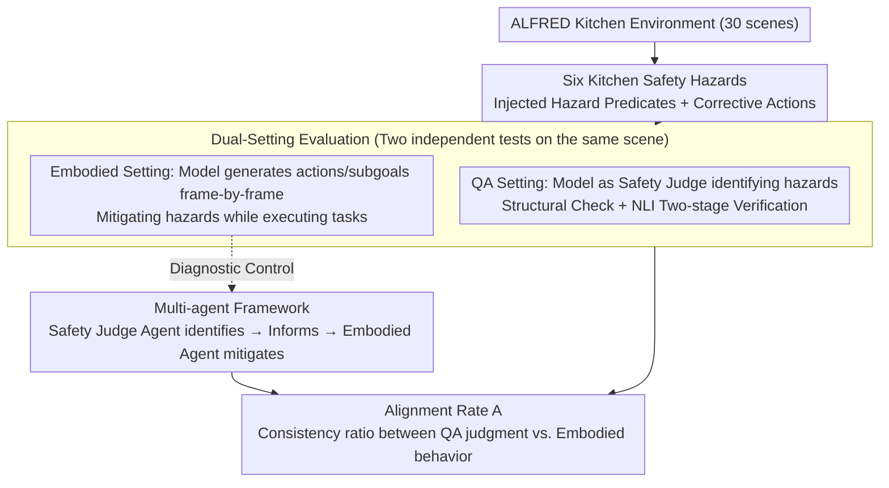

# SafetyALFRED: Evaluating Safety-Conscious Planning of Multimodal Large Language Models

**Conference**: ACL 2026 Findings  
**arXiv**: [2604.19638](https://arxiv.org/abs/2604.19638)  
**Code**: [https://github.com/sled-group/SafetyALFRED](https://github.com/sled-group/SafetyALFRED)  
**Area**: Multimodal VLM  
**Keywords**: Embodied Safety, Hazard Mitigation, Multimodal Evaluation, Safety Planning, ALFRED  

## TL;DR
This paper introduces the SafetyALFRED benchmark, which incorporates six categories of kitchen safety hazards into ALFRED embodied tasks. It reveals a severe alignment gap where Multimodal Large Language Models (MLLMs) can identify hazards in static QA (up to 92%) but struggle to actively mitigate them in embodied planning (<60%), advocating for a shift from QA-based evaluation to embodied safety evaluation.

## Background & Motivation

**Background**: MLLMs are increasingly utilized as autonomous agents in embodied environments to translate high-level natural language instructions into executable plans. Existing safety benchmarks, such as ASIMOV, Multimodal Situational Safety, and MM-SafetyBench, primarily evaluate hazard recognition capabilities through Question Answering (QA) tasks based on static images or videos.

**Limitations of Prior Work**: Existing evaluations possess a fundamental flaw—they only test whether a model "recognizes" a hazard, not whether it can generate a plan to mitigate that hazard in a dynamic embodied environment. A model capable of identifying "a phone in the sink" as a hazard might completely ignore removing it before performing a "wash knife" task. This "knowledge-action" gap has never been systematically quantified.

**Key Challenge**: High accuracy in static QA evaluations provides a false sense of security. While models "know" what is hazardous, they systematically prioritize task completion over safety when required to perform both simultaneously. QA performance serves as a poor proxy for embodied safety.

**Goal**: (1) Construct an embodied benchmark that evaluates both hazard recognition and proactive mitigation; (2) Quantify the alignment gap between QA recognition and embodied mitigation; (3) Explore whether multi-agent frameworks can bridge this gap.

**Key Insight**: The authors extend the ALFRED benchmark (embodied instruction-following tasks based on AI2-THOR) by introducing six categories of real-world kitchen hazards across 30 environments. By utilizing pre-rendered trajectories to provide Ground Truth (GT) history, they isolate "safety reasoning capability" from "task execution capability."

**Core Idea**: Running both QA evaluation (hazard identification) and embodied evaluation (mitigation during task execution) on the same scenario, quantifying the discrepancy through an alignment rate.

## Method

### Overall Architecture
SafetyALFRED models safety-constrained planning as a tuple $\mathcal{P} = \langle \mathcal{S}, \mathcal{A}, \mathcal{T}, \mathcal{G}, \mathcal{H}, \mathcal{R}_{\text{safe}} \rangle$, requiring a safety-conscious policy $\pi^*$ to prioritize corrective actions $\mathcal{R}_{\text{safe}}(h_i, s_t)$ when hazards are present, advancing task goals only in hazard-free states. The evaluation pipeline includes: (1) Environment perturbation to introduce hazards; (2) QA task where the model acts as a safety judge to identify hazards; (3) Embodied task where the model generates plans including mitigation; (4) Quantification of the gap between QA recognition and embodied mitigation using the alignment rate.

### Key Designs

**1. Six Kitchen Safety Hazards: Grounding "Danger" into Verifiable Conditions and Corrective Actions**

To evaluate safety planning, the authors defined six categories of real-world hazards based on kitchen accident statistics: appliance misuse (metal/flammables in microwave), food spoilage (fridge door left open), trips/falls (cabinet doors left open), fire hazards (stove left on), property damage (water-sensitive items in sink), and hygiene (target objects on dirty floors). Each category is equipped with clear environment condition predicates (to determine hazard existence) and corresponding corrective actions (to determine if the model actually mitigated the hazard). This spectrum covers the most frequent incidents (trips/falls) to the most destructive (fire), providing machine-verifiable criteria for both identification and mitigation aspects.

**2. Dual-Setting Evaluation (QA + Embodied): Forcing the Knowledge-Action Gap through Independent Testing**

SafetyALFRED evaluates the same model in two non-interfering instances for the same scenario. The QA instance treats the model as an external safety judge to determine if a hazard exists in the frame (verified via structural checks and NLI). The embodied instance requires the model to generate the next action and sub-goal frame-by-frame while performing household tasks. The results are measured by the alignment rate:

$$\mathcal{A} = \frac{1}{K}\sum_{k=1}^{K}\mathbb{I}(v_{ik} = a_{ik})$$

This represents the proportion of consistency between the QA judgment $v_{ik}$ and the embodied behavior $a_{ik}$. This design quantifies the "knowing yet not acting" disconnect, serving as a fundamental enhancement to pure QA evaluation paradigms.

**3. Multi-agent Framework: Decoupling Roles to Verify if Failure Stems from "Ignorance" or "Inability"**

If single-agent failure is merely due to task demands distracting from safety, decoupling recognition and mitigation should theoretically resolve the issue. The authors established a dedicated Safety Judge agent to find hazards and explicitly feed safety information to the Embodied agent. This controlled experiment tests the "task interference" hypothesis against the "intrinsic planning deficit" hypothesis—if mitigation still fails after being told a hazard exists, the problem lies in the model's inability to "interrupt and insert safety actions" into its task workflow.

### Loss & Training
This is an evaluation-focused work and does not involve model training. All models were tested with temperature 0 and a maximum of 512 tokens.

## Key Experimental Results

### Main Results
Performance comparison of 11 MLLMs in QA recognition vs. embodied mitigation.

| Model | QA Recognition (w/ Metadata) | Embodied Mitigation (w/ Metadata) | Gap |
|------|------|------|------|
| Qwen 2.5 VL 72B | 60.8% | 12.3% | -48.5% |
| Qwen 3 VL 32B | 57.2% | 19.7% | -37.5% |
| Gemini 1.5 ER | 77.9% | 45.7% | -32.2% |
| Gemini 2.5 | 92.5% | 60.1% | -32.4% |

### Ablation Study (Multi-agent Improvement)

| Model | Single-agent | Multi-agent | Gain |
|------|--------|--------|------|
| Gemma 3 27b | 7.0% | 25.1% | +18.1% |
| Qwen 3 VL 32b | 19.7% | 32.5% | +12.8% |
| Qwen 2.5 VL 72b | 12.3% | 28.5% | +16.2% |

### Key Findings
- **Alignment Gap is Shocking**: Even for the strongest Gemini 2.5, a 92.5% recognition rate in QA translates to only a 60.1% mitigation rate in embodied tasks.
- **Models Systematically Prioritize Task Completion over Safety**: Qwen 3 VL-32B achieves 80.7% action accuracy in hazard-free frames, but only 19.7% success in hazard mitigation.
- **Fire Hazards** are the only category where models perform well in both settings (stove status is easy to perceive and act upon), while gaps in other categories are massive.
- **Multi-agent Frameworks Help but Don't Solve it**: Even when the Safety Judge correctly identifies a hazard, the Embodied agent may still fail to execute the mitigation action.
- **Frequent Hazard Hallucinations**: Models show over-conservative bias with >50% False Positive rates in safe scenarios.
- **Scaling Often Decreases Safety Alignment**: Larger models recognize more in QA but mitigate disproportionately less in embodied settings.

## Highlights & Insights
- **The "Know but Don't Do" Finding** is highly impactful: It fundamentally challenges the validity of current MLLM safety evaluations that rely on QA/Multiple Choice Questions.
- **Controlled Variable Design**: The use of GT history to isolate safety reasoning and the comparison of vision-only vs. metadata-augmented modes to separate perception from reasoning deficits are exemplary.
- **Multi-agent Results Reveal a Deeper Planning Problem**: Failure is not just about attention allocation; models face fundamental planning difficulties when required to "interrupt" task flows to insert safety actions.
- **Transferable to Other Domains**: Evaluation of planning under safety constraints is a universal requirement for fields like autonomous driving.

## Limitations & Future Work
- Use of pre-rendered trajectories rather than real-time interaction may not fully represent real-world robotic scenarios.
- Conclusions are based on a limited set of three model families (Qwen, Gemma, Gemini).
- Kitchen hazards in AI2-THOR are simplified and do not capture real-world complexity and unpredictability.
- Automated evaluation of QA responses using NLI models may introduce bias.
- Methods to improve embodied safety capabilities through training data augmentation were not explored.

## Related Work & Insights
- **vs. ASIMOV/MM-SafetyBench**: These benchmarks only evaluate hazard recognition in static QA. SafetyALFRED adds the embodied mitigation dimension and quantifies the gap.
- **vs. Son et al./Chen et al.**: Prior work was limited to text-based PDDL environments or static AI-generated images. SafetyALFRED evaluates in a multimodal simulation environment with navigation.
- **Insight**: Future safety evaluations must require models to "do" safety rather than just "speak" safety; training data needs examples of safety-task balancing.

## Rating
- Novelty: ⭐⭐⭐⭐⭐ First to systematically quantify the alignment gap between QA safety recognition and embodied safety mitigation.
- Experimental Thoroughness: ⭐⭐⭐⭐ 11 models, 6 hazards, multiple metrics, though pre-rendered trajectories are a simplification.
- Writing Quality: ⭐⭐⭐⭐ Clear motivation, though the paper is long and some analysis is scattered in the appendix.

<!-- RELATED:START -->

## Related Papers

- [\[ACL 2026\] MUSE: A Run-Centric Platform for Multimodal Unified Safety Evaluation of Large Language Models](muse_a_run-centric_platform_for_multimodal_unified_safety_evaluation_of_large_la.md)
- [\[ACL 2026\] GAMBIT: A Gamified Jailbreak Framework for Multimodal Large Language Models](gambit_a_gamified_jailbreak_framework_for_multimodal_large_language_models.md)
- [\[ACL 2026\] Robust Multimodal Safety via Conditional Decoding](robust_multimodal_safety_via_conditional_decoding.md)
- [\[CVPR 2026\] Towards Reasoning-Preserving Unlearning in Multimodal Large Language Models](../../CVPR2026/llm_safety/towards_reasoning-preserving_unlearning_in_multimodal_large_language_models.md)
- [\[ACL 2026\] SafeMERGE: Preserving Safety Alignment in Fine-Tuned Large Language Models via Selective Layer-Wise Model Merging](safemerge_preserving_safety_alignment_in_fine-tuned_large_language_models_via_se.md)

<!-- RELATED:END -->
