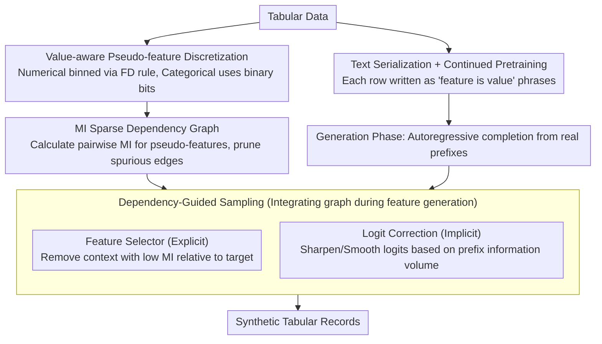

# SAGE: Sparse Adaptive Guidance for Dependency-Aware Tabular Data Generation

**Conference**: ACL2026  
**arXiv**: [2604.24368](https://arxiv.org/abs/2604.24368)  
**Code**: https://github.com/ShuoYangtum/SAGE  
**Area**: Synthetic Tabular Data / LLM Data Generation / Dependency Modeling  
**Keywords**: Tabular data generation, sparse dependency, mutual information, dynamic guidance, synthetic data quality

## TL;DR
SAGE discretizes tabular features into value-aware pseudo-features and constructs a sparse dynamic dependency graph using mutual information to guide LLM generation, thereby enhancing the downstream utility, constraint consistency, and realism of synthetic tabular data.

## Background & Motivation
**Background**: Synthetic tabular data is critical in privacy-sensitive or low-resource scenarios such as healthcare, finance, and education. Traditional methods like TVAE, CTGAN, and diffusion models primarily learn numerical matrix distributions. Recently, LLM-based methods transform table rows into "feature is value" text sequences, leveraging the language model's semantic knowledge to generate more plausible records.

**Limitations of Prior Work**: When generating tabular rows, LLMs typically use all previous feature-value pairs as context and rely on dense attention to capture relationships. This introduces spurious correlations between irrelevant features, leading to logical inconsistencies or degraded performance in downstream models. Conversely, existing explicit dependency modeling methods mostly use static feature graphs, which cannot represent phenomena where "the dependency relationship changes when the same feature takes different values."

**Key Challenge**: Tabular data exhibits both sparse structures and conditional dynamics. For instance, when the loan purpose is for education versus home purchase, the correlations between age, income, and occupational stability are entirely different. Using only static graphs ignores value-conditioned dependency, while relying solely on LLM dense attention easily leads to being misled by surface co-occurrences.

**Goal**: Construct an LLM-based tabular generation framework that enables the model to focus only on truly relevant context—which varies according to already generated values—when producing each target feature, while avoiding a significant increase in inference costs.

**Key Insight**: The authors expand original features into value-aware pseudo-features and estimate statistical dependencies between these pseudo-features using mutual information. In this way, the dependency graph no longer merely describes "Feature A is related to Feature B," but rather "a specific value range of Feature A is related to the generation of Feature B."

**Core Idea**: Use a mutual-information-driven sparse dynamic dependency graph to allow the LLM to adaptively generate tabular records based on current feature values through explicit context filtering or implicit logit correction during the sampling stage.

## Method

### Overall Architecture
SAGE consists of two stages. In the preprocessing stage, tabular data is converted into text sequences for continued pretraining of the LLM to learn the verbalized distribution of feature-values. Simultaneously, numerical and categorical features are discretized into pseudo-features, and a mutual information matrix is estimated based on the training set. In the generation stage, starting from a partial real feature-value prefix, remaining features are completed autoregressively, with the mutual information graph controlling the context or output confidence at each step.

The paper proposes two complementary guidance strategies: Feature Selector is an explicit strategy that directly removes context with low mutual information relative to the target feature; Logit Correction is an implicit strategy that does not remove context but instead adjusts the candidate value logits based on the information content of the current prefix. Both aim to prevent the LLM from being distracted by irrelevant feature-value pairs when generating a specific feature.

### Key Designs

**1. Value-aware pseudo-feature discretization: Shifting dependency modeling granularity from "feature-level" to "value-level"**

Static feature graphs can only state that "Feature A and Feature B are related," but cannot express value-conditioned dependencies such as "the association between age and income differs based on whether the loan purpose is education or home purchase." SAGE addresses this by splitting each original feature into a set of binary pseudo-features: numerical features are automatically binned using the Freedman-Diaconis rule (with a cap of 16 to control sparsity), while each category of a categorical feature occupies a unique pseudo-feature. Thus, a record is mapped to a set of activated binary pseudo-features. The minimal unit of dependency shifts from "a feature" to "a feature falling within a certain value range," allowing mutual information to directly capture conditional correlations without being smoothed out by coarse feature-level granularity.

**2. MI sparse dependency graph: Pruning spurious edges in dense attention using a lightweight, unsupervised statistic**

When LLMs generate tabular rows, they usually process all historical feature-value pairs in the context via dense attention. This often leads to records with inconsistent logic due to being misled by surface co-occurrences. SAGE instead calculates the mutual information between the binary activations of any two pseudo-features to form a dependency matrix. Since probability estimation is based on pseudo-feature activations rather than original numerical scales, numerical and categorical variables are processed unified. Mutual information is inherently interpretable and requires no extra supervision, effectively serving as an "information volume checkup" for edges between contexts, pruning irrelevant edges to ensure the model focuses only on truly relevant context.

**3. Feature Selector and Logit Correction: Integrating the dependency graph into the sampling process with explicit/implicit options**

Having a dependency graph is insufficient; it must act during each generation step. SAGE provides two complementary strategies. Feature Selector is an explicit hard filter: when generating a target feature, it retains only the prefix pseudo-features whose mutual information with the target exceeds a threshold (defaulting to the median MI of the training set), discarding other context. Logit Correction is an implicit soft adjustment: it keeps the context but calculates the average MI of the current prefix relative to the target feature and compares it with the training set average. If the prefix information volume is high, it sharpens the target logits to increase confidence; if low, it smoothes the distribution to avoid being misled by weak signals. The former is suitable for high-dimensional tables with noisy, sparse dependencies, while the latter is better for continuous dependencies where deleting context might lose information.

### Loss & Training
The training phase follows GReaT-style LLM tabular modeling: each row is written as multiple "feature is value" phrases, optimizing the negative log-likelihood of value-related tokens. The authors also use the permutation strategy from GraDe, randomly shuffling the order of feature-value phrases to reduce spurious dependencies caused by fixed column orders. The experimental setup uses a batch size of 8, AdamW optimizer, and a learning rate of 1e-4. Sampling utilizes nucleus sampling with $p=0.95$, a temperature of 1.0, and the maximum generation length is set to the maximum sequence length in the training set.

## Key Experimental Results

### Main Results

Experiments covered six datasets: Adult Income, HELOC, Iris, Diabetes, MIC, and California Housing, spanning binary classification, multi-class classification, and regression tasks. The authors generated synthetic data of the same scale as the original data and evaluated downstream models (DT/RF, etc.) on real test sets.

| Dataset / Metric | GReaT | GraDe | SPADA | SAGE w/FS | SAGE w/LC | Key Observations |
| :--- | :--- | :--- | :--- | :--- | :--- | :--- |
| Adult Income, DT F1 ↑ | 0.60 | 0.55 | 0.50 | 0.68 | 0.72 | LC is 12 points higher than GReaT |
| Adult Income, RF F1 ↑ | 0.69 | 0.63 | 0.75 | 0.75 | 0.76 | Both SAGE variants significantly outperform GReaT |
| HELOC, DT F1 ↑ | 0.61 | 0.67 | 0.61 | 0.68 | 0.69 | Dynamic dependency yields stable gains on credit data |
| Iris, RF ACC ↑ | 44.83 | 100.00 | 100.00 | 100.00 | 100.00 | SAGE avoids overfitting collapse seen in GReaT on small data |
| California Housing, RF MAPE ↓ | 0.26 | 0.23 | 0.25 | 0.25 | 0.40 | FS is more stable for regression; LC is conservative in some cases |

### Ablation Study

| Configuration / Analysis | Key indicators | Description |
| :--- | :--- | :--- |
| Feature Selector | Adult education-consistency violation 1.32% | Explicit context filtering is ideal for rules relying on few precise attributes |
| Logit Correction | Housing violation ~1 point lower than GReaT | Implicit adjustment is friendlier to spatially continuous constraints |
| MI Threshold | Performance stable over a wide threshold range | The method does not strictly depend on a fragile threshold |
| Different Base LLMs | Similar trends for GPT-2, Qwen-3, Llama-3 | SAGE's dependency guidance is not specific to one model |
| Preprocessing vs. Sampling Cost | MI calculation is a one-time overhead | Benefits from sparse context during the generation phase |

### Key Findings
- Regarding downstream utility, SAGE outperforms GReaT across nearly all tasks, with F1 gains exceeding 10 points on the Adult dataset, indicating that MI guidance mitigates overfitting to surface patterns in LLM tabular generation.
- Regarding constraint consistency, SAGE-generated California Housing samples rarely fall outside real state boundaries, a complex spatial contour that TVAE and CTGAN struggle to reconstruct.
- The two guidance strategies are complementary: Feature Selector is better at clearing high-dimensional noise and precise semantic rule errors, while Logit Correction is better at smooth, continuous spatial dependencies.
- On HELOC, Logit Correction occasionally suppressed useful signals, suggesting that underestimating context MI can make implicit correction overly conservative.

## Highlights & Insights
- The paper advances LLM tabular generation from "textualized row modeling" to "value-conditioned dependency control." This is closer to the structural essence of tabular data than simple serialization.
- The pseudo-feature design is practical: it provides a discretizable statistical representation for numerical features while preserving the natural structure of categorical features, avoiding the need to train complex graph models.
- The parallel design of Feature Selector and Logit Correction offers engineering value. The former provides interpretable hard filtering, while the latter offers flexible probability adjustment, catering to different data dependency patterns.
- The paper does not only report downstream classification scores but also evaluates violations, SVM realism, DCR privacy, and visual distributions, making the quality assessment of synthetic data more comprehensive.

## Limitations & Future Work
- The dependency graph is primarily based on pairwise mutual information, which cannot explicitly model high-order relationships where multiple features jointly influence a target feature. While autoregressive LLMs partially compensate, direct control over high-order structures is lacking.
- Mutual information matrix preprocessing can be heavy for high-dimensional data; although it is a one-time cost, approximation or sparsification is needed when the number of features and pseudo-features is extremely large.
- MI estimation relies on the statistical quality of the training split; small samples or long-tail categories may introduce estimation noise, affecting context filtering.
- Results show different strategies suit different constraint types; future work could investigate an adaptive mixture of FS and LC rather than manual selection.
- Privacy evaluation is mainly DCR-based; stronger membership inference, attribute inference, or differential privacy perspectives are still required to verify reliability for sensitive domain deployment.

## Related Work & Insights
- **vs GReaT**: GReaT proved LLMs can generate realistic tabular rows, but context modeling is flat; SAGE adds MI guidance to reduce interference from irrelevant feature-value pairs.
- **vs GraDe / SPADA**: GraDe and SPADA emphasized structural dependency, but mostly biased toward static structures; SAGE's key differentiator is that dependency changes dynamically with current values.
- **vs TVAE / CTGAN / TabSyn**: Traditional generative models are good at learning distribution shapes but struggle to utilize feature semantics; SAGE leverages LLM semantic priors while constraining them with statistical dependencies.
- **Insights**: For LLM generation of structured data, one should not just design prompts or sequence templates but explicitly control "which fields should be looked at when generating a specific field." This is transferable to knowledge graph completion, form auto-filling, and semi-structured document synthesis.

## Rating
- Novelty: ⭐⭐⭐⭐☆ The combination of value-aware pseudo-features and MI guidance is natural; innovation is in structural control rather than the generative model itself.
- Experimental Thoroughness: ⭐⭐⭐⭐☆ Six datasets, multiple metrics, and multiple baselines provide comprehensive coverage; however, privacy and high-dimensional scaling could be deeper.
- Writing Quality: ⭐⭐⭐⭐☆ Methodological logic is clear; despite many data points, the main narrative is distinct.
- Value: ⭐⭐⭐⭐☆ Practically significant for low-resource and privacy-sensitive tabular data generation, providing an interpretable control mindset for LLM structured data generation.

<!-- RELATED:START -->

## Related Papers

- [\[ICLR 2026\] Resource-Adaptive Federated Text Generation with Differential Privacy](../../ICLR2026/llm_safety/resource-adaptive_federated_text_generation_with_differential_privacy.md)
- [\[ACL 2026\] AGSC: Adaptive Granularity and Semantic Clustering for Uncertainty Quantification in Long-text Generation](agsc_adaptive_granularity_and_semantic_clustering_for_uncertainty_quantification.md)
- [\[AAAI 2026\] AgentSense: Virtual Sensor Data Generation Using LLM Agents in Simulated Home Environments](../../AAAI2026/llm_safety/agentsense_virtual_sensor_data_generation_using_llm_agents_i.md)
- [\[ACL 2026\] Differentially Private Synthetic Text Generation for Retrieval-Augmented Generation (RAG)](differentially_private_synthetic_text_generation_for_retrieval-augmented_generat.md)
- [\[ACL 2026\] CRISP: Persistent Concept Unlearning via Sparse Autoencoders](crisp_persistent_concept_unlearning_via_sparse_autoencoders.md)

<!-- RELATED:END -->
