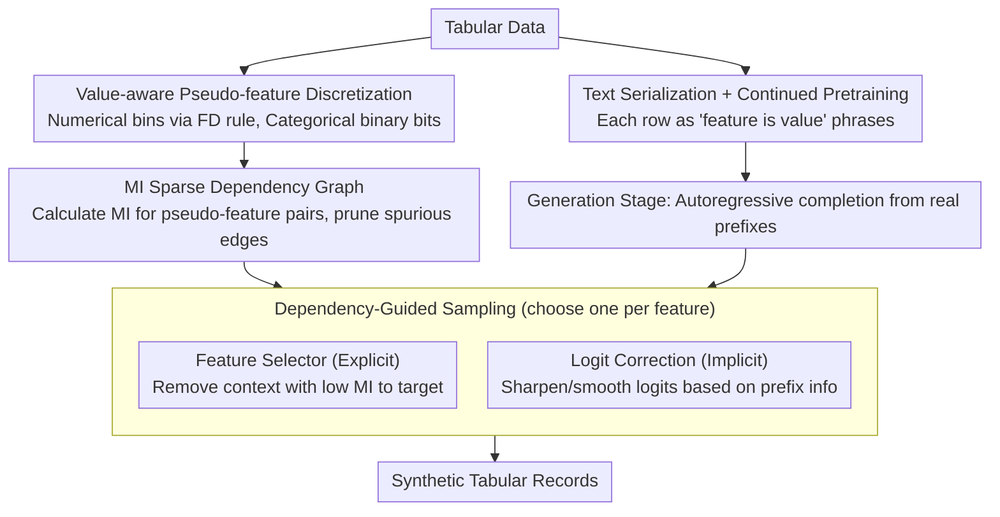

# SAGE: Sparse Adaptive Guidance for Dependency-Aware Tabular Data Generation

**Conference**: ACL2026  
**arXiv**: [2604.24368](https://arxiv.org/abs/2604.24368)  
**Code**: https://github.com/ShuoYangtum/SAGE  
**Area**: Synthetic Tabular Data / LLM Data Generation / Dependency Modeling  
**Keywords**: Tabular data generation, sparse dependency, mutual information, dynamic guidance, synthetic data quality

## TL;DR
SAGE discretizes tabular features into value-aware pseudo-features and constructs a sparse dynamic dependency graph based on mutual information to guide LLM generation, thereby enhancing downstream utility, constraint consistency, and realism of synthetic tabular data.

## Background & Motivation
**Background**: Synthetic tabular data is crucial in privacy-sensitive or low-resource scenarios such as healthcare, finance, and education. Traditional methods like TVAE, CTGAN, and diffusion models primarily learn numerical matrix distributions. Recently, LLM-based methods have transformed rows into "feature is value" text sequences, leveraging the semantic knowledge of language models to generate more plausible records.

**Limitations of Prior Work**: When generating tabular rows, LLMs typically use all previous feature-value pairs as context and rely on dense attention to capture relationships. This introduces spurious correlations between irrelevant features, leading to logical inconsistencies or degraded downstream performance. Furthermore, existing explicit dependency modeling methods mostly use static feature graphs, which fail to represent the phenomenon where "dependencies change when the same feature takes different values."

**Key Challenge**: Tabular data exhibits both sparse structures and conditional dynamics. For example, when the loan purpose is "education" versus "home purchase," the associations among age, income, and job stability are entirely different. Using only static graphs ignores value-conditioned dependency, while relying solely on LLM dense attention easily yields to surface-level co-occurrences.

**Goal**: The objective is to construct an LLM-based tabular generation framework that ensures the model focuses only on truly relevant context—which adapts according to generated values—while avoiding significant increases in inference costs.

**Key Insight**: The authors expand original features into value-aware pseudo-features and use mutual information (MI) to estimate statistical dependencies between these pseudo-features. Consequently, the dependency graph no longer merely describes "Feature A is related to Feature B," but rather "a specific value range of Feature A is related to the generation of Feature B."

**Core Idea**: By using a mutual information-driven sparse dynamic dependency graph, SAGE adaptively generates tabular records during the sampling stage through explicit context filtering or implicit logit correction based on the current feature values.

## Method

### Overall Architecture
SAGE consists of two stages. In the pre-processing stage, tabular data is converted into text sequences for continued pretraining of the LLM to learn the verbalized distribution of feature-values. Simultaneously, numerical and categorical features are discretized into pseudo-features, and a mutual information matrix is estimated based on the training set. In the generation stage, starting from a partial real feature-value prefix, the remaining features are completed autoregressively, with each step controlled by the MI graph to adjust context or output confidence.

The paper proposes two complementary guidance strategies: Feature Selector is an explicit strategy that directly removes context with low mutual information relative to the target feature; Logit Correction is an implicit strategy that retains context but adjusts the logits of candidate values based on the information volume of the current prefix. Both aim to prevent the LLM from being misled by irrelevant feature-value pairs.

### Key Designs

**1. Value-aware pseudo-feature discretization: Shifting dependency modeling from "feature-level" to "value-level"**

Static feature graphs can only indicate that "Feature A is related to Feature B," but cannot express value-conditioned dependencies like "the association between age and income differs based on whether the loan purpose is education or housing." SAGE addresses this by splitting each original feature into a set of binary pseudo-features. Numerical features are binned using the Freedman-Diaconis rule (with a cap of 16 bins to maintain sparsity), while each categorical level receives its own pseudo-feature. A record is thus mapped to a set of activated binary pseudo-features. The atomic unit of dependency shifts from "a feature" to "a feature falling within a specific value range," allowing mutual information to capture conditional correlations directly without being smoothed over by coarse feature-level granularity.

**2. MI Sparse Dependency Graph: Filtering spurious edges in dense attention via a lightweight, unsupervised statistic**

When generating tabular rows, LLMs typically feed all historical feature-value pairs into the context, relying on dense attention to parse relationships. This often results in records with logical inconsistencies due to surface-level co-occurrences. SAGE instead calculates the mutual information between the binary activations of any two pseudo-features to form a dependency matrix. Since probability estimation is based on pseudo-feature activation rather than original numerical scales, numerical and categorical variables are handled uniformly. Mutual information is inherently interpretable and requires no extra supervision, acting as an "informatics checkup" for context edges to prune irrelevant ones, laying the groundwork for focusing only on relevant context during generation.

**3. Feature Selector and Logit Correction: Integrating the dependency graph into the sampling process via explicit/implicit strategies**

Having a dependency graph is insufficient; it must actively influence generation. SAGE provides two complementary strategies. Feature Selector is an explicit hard filter: when generating a target feature, it retains only the prefix pseudo-features whose mutual information with the target exceeds a threshold (defaulting to the median MI of the training set), discarding the rest. Logit Correction is an implicit soft adjustment: it maintains the full context but calculates the average mutual information of the current prefix. If the prefix information is high, it sharpens the target logits to increase model confidence; if low, it smooths the distribution to avoid being misled by weak signals. The former is suitable for high-dimensional tables with noisy, sparse dependencies, while the latter fits scenarios with continuous dependencies where removing context might lose information.

### Loss & Training
The training phase follows GReaT-style LLM tabular modeling: each row is written as multiple "feature is value" phrases, optimizing the negative log-likelihood of value-related tokens. The authors also utilize the permutation strategy from GraDe, randomly shuffling the order of feature-value phrases to reduce spurious dependencies introduced by fixed column orders. Experimental settings include a batch size of 8, AdamW optimizer, and a learning rate of $1e-4$. Sampling uses nucleus sampling with $p=0.95$, $temperature=1.0$, and the maximum generation length is set to the maximum sequence length in the training set.

## Key Experimental Results

### Main Results

Experiments cover six datasets: Adult Income, HELOC, Iris, Diabetes, MIC, and California Housing, spanning binary classification, multi-class classification, and regression tasks. The authors generate synthetic data of the same scale as the original data, then train downstream models (DT/RF, etc.) and evaluate them on real test sets.

| Dataset / Metric | GReaT | GraDe | SPADA | SAGE w/FS | SAGE w/LC | Key Observation |
|--------|------|------|------|------|------|------|
| Adult Income, DT F1 ↑ | 0.60 | 0.55 | 0.50 | 0.68 | 0.72 | LC is 12 points higher than GReaT |
| Adult Income, RF F1 ↑ | 0.69 | 0.63 | 0.75 | 0.75 | 0.76 | Both SAGE variants significantly outperform GReaT |
| HELOC, DT F1 ↑ | 0.61 | 0.67 | 0.61 | 0.68 | 0.69 | Dynamic dependency consistently improves credit data |
| Iris, RF ACC ↑ | 44.83 | 100.00 | 100.00 | 100.00 | 100.00 | SAGE avoids GReaT's collapse due to overfitting on small data |
| California Housing, RF MAPE ↓ | 0.26 | 0.23 | 0.25 | 0.25 | 0.40 | FS is more stable for regression; LC is more conservative in some cases |

### Ablation Study

| Configuration / Analysis | Key Metric | Description |
|------|---------|------|
| Feature Selector | Adult education-consistency violation 1.32% | Explicit context filtering is highly effective for rules depending on few precise attributes |
| Logit Correction | Housing violation ~1 point lower than GReaT | Implicit adjustment is friendlier to continuous spatial constraints |
| MI Threshold | Performance stable across a wide range | The method does not strictly depend on a fragile threshold |
| Base LLMs | GPT-2, Qwen-3, Llama-3 maintain similar trends | SAGE's dependency guidance is not specific to a single model |
| Pre-processing vs. Sampling Cost | MI calculation is a one-time overhead | Benefit from sparse context during the generation phase |

### Key Findings
- Regarding downstream utility, SAGE outperforms GReaT in nearly all tasks, with an F1 improvement of over 10 points on the Adult dataset, indicating that mutual information guidance mitigates overfitting to surface patterns in LLM tabular generation.
- Regarding constraint consistency, SAGE-generated samples for California Housing rarely fall outside real state borders, whereas TVAE and CTGAN struggle to reconstruct such complex spatial boundaries.
- The two guidance strategies are complementary: Feature Selector is better at removing high-dimensional noise and precise semantic rule errors, while Logit Correction excels at continuous spatial dependencies.
- On HELOC, Logit Correction occasionally suppresses useful signals, suggesting that underestimating "context mutual information" can make implicit correction overly conservative.

## Highlights & Insights
- The paper advances LLM tabular generation from "verbalized row modeling" to "value-conditioned dependency control," which is closer to the structural essence of tabular data than simple serialization.
- The pseudo-feature design is highly practical: it provides discretizable statistical representations for numerical features while preserving the natural value structure of categorical features, avoiding the need to train complex graph models.
- The parallel design of Feature Selector and Logit Correction offers engineering value—one as an interpretable hard filter and the other as flexible probability adjustment, catering to different dependency forms across datasets.
- The evaluation is comprehensive, reporting not only downstream classification scores but also violations, SVM realism, DCR privacy, and distribution visualizations.

## Limitations & Future Work
- The dependency graph is primarily based on pairwise mutual information and cannot explicitly model high-order relationships where multiple features jointly influence a target. While autoregressive LLMs partially compensate for this, high-order structures still lack direct control.
- Pre-processing the mutual information matrix on high-dimensional data can be heavy; although it is a one-time cost, approximation or sparsification is needed as the number of features and pseudo-features grows.
- MI estimation depends on the statistical quality of the training split; small samples or long-tail categories may introduce estimation noise that affects context filtering.
- Since different strategies suit different constraint types, future work could explore adaptive mixtures of FS and LC rather than manual selection.
- Privacy evaluation relies mainly on DCR; stronger verification through membership inference, attribute inference, or differential privacy is needed for reliable deployment in sensitive domains.

## Related Work & Insights
- **vs GReaT**: GReaT demonstrated that LLMs can generate realistic tabular rows but used flattened context modeling; SAGE introduces MI guidance to reduce interference from irrelevant feature-pair values.
- **vs GraDe / SPADA**: While these already emphasized structural dependencies, they leaned toward static structures; SAGE's key differentiator is that dependencies change dynamically with current values.
- **vs TVAE / CTGAN / TabSyn**: Traditional models excel at learning distribution shapes but struggle to leverage feature semantics; SAGE utilizes LLM semantic priors while constraining them with statistical dependencies.
- **Inspiration**: For LLM generation of structured data, one should not only design prompts or templates but also explicitly control "which fields should be observed when generating a specific field." This concept is transferable to knowledge graph completion, form filling, and semi-structured document synthesis.

## Rating
- Novelty: ⭐⭐⭐⭐☆ The combination of value-aware pseudo-features and MI guidance is natural; innovation lies in structural control rather than the generative model itself.
- Experimental Thoroughness: ⭐⭐⭐⭐☆ Covers six datasets with multiple metrics and baselines; however, privacy and high-dimensional scaling could be deeper.
- Writing Quality: ⭐⭐⭐⭐☆ Logical and clear; the data-heavy methodology remains focused.
- Value: ⭐⭐⭐⭐☆ Significant for low-resource and privacy-sensitive tabular generation, providing an interpretable control strategy for LLM-based structured data generation.

<!-- RELATED:START -->

## Related Papers

- [\[ICLR 2026\] Resource-Adaptive Federated Text Generation with Differential Privacy](../../ICLR2026/llm_safety/resource-adaptive_federated_text_generation_with_differential_privacy.md)
- [\[ACL 2026\] AGSC: Adaptive Granularity and Semantic Clustering for Uncertainty Quantification in Long-text Generation](agsc_adaptive_granularity_and_semantic_clustering_for_uncertainty_quantification.md)
- [\[ACL 2026\] Differentially Private Synthetic Text Generation for Retrieval-Augmented Generation (RAG)](differentially_private_synthetic_text_generation_for_retrieval-augmented_generat.md)
- [\[AAAI 2026\] AgentSense: Virtual Sensor Data Generation Using LLM Agents in Simulated Home Environments](../../AAAI2026/llm_safety/agentsense_virtual_sensor_data_generation_using_llm_agents_i.md)
- [\[ACL 2026\] CRISP: Persistent Concept Unlearning via Sparse Autoencoders](crisp_persistent_concept_unlearning_via_sparse_autoencoders.md)

<!-- RELATED:END -->
