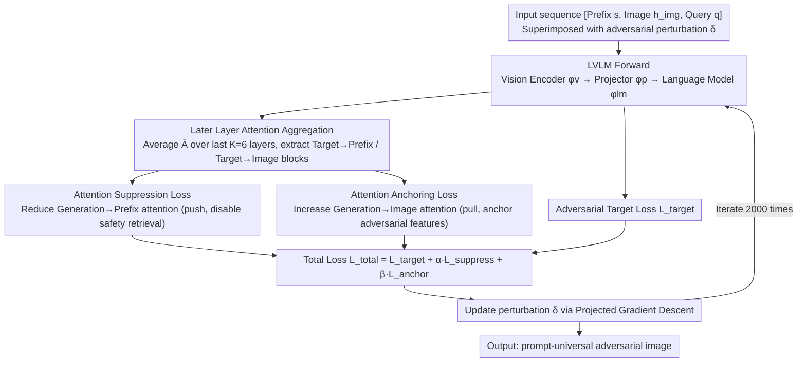

# Seeing No Evil: Blinding Large Vision-Language Models to Safety Instructions via Adversarial Attention Hijacking

**Conference**: ACL 2026  
**arXiv**: [2604.10299](https://arxiv.org/abs/2604.10299)  
**Code**: [github.com/Landsayy/AttentionJailbreak](https://github.com/Landsayy/AttentionJailbreak)  
**Area**: Multimodal VLM  
**Keywords**: Visual Jailbreaking Attack, Attention Manipulation, Safety Alignment, Gradient Conflict, Large Vision-Language Models

## TL;DR

The authors propose Attention-Guided Visual Jailbreaking, which bypasses rather than directly attacks safety alignment mechanisms by suppressing model attention to safety instructions and anchoring it to adversarial image features. This method achieves a 94.4% attack success rate on Qwen-VL while reducing gradient conflict by 45%.

## Background & Motivation

**Background**: Large Vision-Language Models (LVLMs) are widely deployed in safety-critical scenarios such as AI assistants and content moderation. Their safety alignment relies on the model continuously retrieving safety instructions from prefix regions through attention mechanisms during each decoding step.

**Limitations of Prior Work**: Existing adversarial attacks primarily optimize output logits to maximize the probability of harmful outputs but ignore where safety mechanisms are implemented within the model. This leads to severe **gradient conflict**—where adversarial gradients oppose safety retrieval gradients. Serious conflicts (cosine similarity $< -0.5$) occur in 20% of optimization iterations, causing optimization oscillation and slow convergence.

**Key Challenge**: Safety alignment is implemented in the intermediate layers of Transformers via attention mechanisms, while attacks are applied at the final output layer, creating a **functional position mismatch**.

**Goal**: Design an attack method that directly manipulates attention distribution to bypass safety retrieval mechanisms instead of confronting them.

**Key Insight**: The continuous high-dimensional nature of the visual modality enables gradient-based attention distribution carving, which is unfeasible in discrete combinatorial searches within the text modality.

**Core Idea**: Safety alignment is essentially an attention retrieval process of prefix tokens. If this attention is suppressed, the model does not "violate" safety rules but rather "fails to retrieve" them—resulting in safety blindness.

## Method

### Overall Architecture

The LVLM is decomposed into a vision encoder $\phi_v$, a multimodal projector $\phi_p$, and a language model $\phi_{lm}$. The input sequence is $x_{\text{seq}} = [s, h_{\text{img}}, q]$, where $s$ represents prefix tokens (system instructions and role markers), $h_{\text{img}}$ represents image tokens, and $q$ denotes query tokens. After each forward pass, attention matrices are aggregated from the later layers. Subsequently, suppression and anchoring auxiliary losses are applied alongside the standard adversarial target, forming a push-pull mechanism. Finally, adversarial perturbations $\delta$ are iteratively updated using Projected Gradient Descent (PGD).

### Key Designs

1.  **Suppression Loss**: This minimizes the attention weights of generated tokens toward prefix tokens: $\mathcal{L}_{\text{suppress}} = \frac{1}{|\mathcal{I}_{\text{gen}}|} \sum_{i \in \mathcal{I}_{\text{gen}}} \sum_{j \in \mathcal{I}_{\text{prefix}}} \bar{A}_{i,j}$. Its purpose is to block the channel through which the model retrieves safety instructions. The design motivation is that safety behavior is maintained via continuous retrieval through prefix attention; suppressing this attention disables the safety mechanism at its source.

2.  **Anchoring Loss**: This maximizes the attention of generated tokens toward image tokens: $\mathcal{L}_{\text{anchor}} = -\frac{1}{|\mathcal{I}_{\text{gen}}|} \sum_{i \in \mathcal{I}_{\text{gen}}} \sum_{j \in \mathcal{I}_{\text{img}}} \bar{A}_{i,j}$. Utilizing the competitive nature of softmax normalization, it ensures that the suppressed attention mass is redistributed to image tokens rather than query tokens, anchoring the generation process to adversarial visual features.

3.  **Later Layer Attention Aggregation**: The attention matrices of the last $K=6$ layers are averaged: $\bar{A} = \frac{1}{K} \sum_{\ell=L-K+1}^{L} \frac{1}{H} \sum_{h=1}^{H} A^{(\ell,h)}$. This is based on previous research evidence that refusal behavior is concentrated in the later Transformer layers. Binary position selectors are used to extract target→prefix and target→image attention blocks. The entire intervention is purely loss-driven and does not modify the model's forward computation.

### Loss & Training

The total loss is a weighted combination of three terms: $\mathcal{L}_{\text{total}} = \mathcal{L}_{\text{target}} + \alpha \cdot \mathcal{L}_{\text{suppress}} + \beta \cdot \mathcal{L}_{\text{anchor}}$. Image perturbations $\delta$ are optimized via PGD: $\delta^{(t+1)} = \Pi_{\|\cdot\|_\infty \leq \epsilon}[\delta^{(t)} - \eta \cdot \nabla_\delta \mathcal{L}_{\text{total}}]$. Default parameters are $\alpha=10, \beta=5, \eta=1/255, K=6$, with 2000 iterations. The attack is prompt-universal, allowing a single adversarial image to be used across different harmful queries.

## Key Experimental Results

### Main Results

| Method | ε | Qwen-VL AdvBench (G) | LLaVA-1.5 AdvBench (G) | Qwen-VL StrongREJECT (G) |
|------|---|---------------------|----------------------|-------------------------|
| VAE-JB | 32 | 68.8% | 57.9% | 55.6% |
| BAP | 32 | 4.2% | 54.8% | 9.3% |
| **Ours** | **32** | **94.4%** | **77.5%** | **90.4%** |
| **Ours** | **16** | **44.8%** | **62.3%** | **66.5%** |

### Ablation Study

| Configuration | α | β | AdvBench | StrongREJECT | HarmBench | JB | Average |
|------|---|---|---------|-------------|-----------|-----|------|
| $\mathcal{L}_{\text{target}}$ only | 0 | 0 | 55.0 | 47.0 | 70.5 | 69.0 | 60.4 |
| +Suppress | 10 | 0 | 63.3 | 70.0 | 72.0 | 73.0 | 69.6 |
| +Anchor | 0 | 5 | 57.5 | 44.1 | 72.5 | 70.0 | 61.0 |
| **Full** | **10** | **5** | **77.5** | **78.0** | **84.0** | **84.0** | **80.9** |

### Key Findings

-   The two losses exhibit a **synergistic effect**: while the sum of individual gains is 70.2%, the combination reaches 80.9%, exceeding a linear combination by 10.7%.
-   Successful attacks suppress system prompt attention by 80% and amplify image attention by 4.1×.
-   Causal intervention experiments: Restoring system attention on adversarial images ($b=2.0$) drops the ASR from 88.0% to 26.0%, proving that attention suppression is causally necessary for attack success.
-   Cross-model transferability: Adversarial images achieve 52.0% ASR on GPT-4o and 39.6% on Claude-3.5.

## Highlights & Insights

-   **Discovery of Safety Blindness Mechanism**: Attack success is not due to the model "violating" safety rules, but because it "cannot see" them. This perspective is highly insightful for understanding and improving safety alignment.
-   **Gradient Conflict Analysis**: This work provides the first quantification of the adversarial relationship between adversarial and safety gradients in output-oriented attacks, offering a principled explanation for optimization difficulties.
-   The push-pull design is simple and elegant; adding just two auxiliary losses significantly improves attack efficiency.
-   Improvements were observed across 13 safety scenarios in MM-SafetyBench, with an overall ASR of 47.38% (Qwen-VL), demonstrating the method's generality.

## Limitations & Future Work

-   The method relies on white-box gradient access; extending this to black-box scenarios is an important direction.
-   Hyperparameters ($\alpha, \beta$) use fixed values across all models; adaptive weighting strategies might further enhance performance.
-   The discovered safety blindness mechanism should inspire defense strategies: reinforcing safety redundancy at the attention level rather than relying solely on prefix instructions.
-   Performance on InternVL2 is weaker (white-box ASR ~18%), possibly because its safety mechanism does not rely entirely on prefix attention.
-   Adversarial images maintain a 59.0% ASR under tight perturbation budgets ($\epsilon=8/255$), outperforming the baseline's 45.7%.
-   Future work could explore adaptively combining attention intervention with output optimization, dynamically adjusting weights based on the attack phase.

## Related Work & Insights

-   **Superficial Alignment Hypothesis**: Safety alignment is primarily encoded in a few formatting tokens, explaining why suppressing prefix attention suffices to bypass safety mechanisms.
-   **Representation Engineering**: Safety behavior is a structured, retrievable signal rather than a diffuse side effect, supporting the feasibility of targeted attention intervention.
-   **Textual Adversarial Attacks** (GCG, PAIR, etc.): The continuity of the visual modality makes attention manipulation more efficient than discrete text searches.
-   Insights for LLM safety defense: There is a need to design safety mechanisms that are robust against attention manipulation.

## Rating

-   **Novelty**: ⭐⭐⭐⭐⭐ The concept of safety blindness and leveraging attention vulnerabilities is highly original.
-   **Experimental Thoroughness**: ⭐⭐⭐⭐⭐ Includes 5 benchmarks, 4 models, causal intervention analysis, gradient conflict quantification, and cross-model transferability; the experimental design is exceptionally rigorous.
-   **Writing Quality**: ⭐⭐⭐⭐⭐ Clear logic transitioning from problem diagnosis (gradient conflict) to the solution (attention-guided) and mechanism validation (causal analysis); the narrative is complete and fluid.
-   **Value**: ⭐⭐⭐⭐ This work advances the understanding of LVLM safety mechanisms and points toward new directions for defense research.

<!-- RELATED:START -->

## Related Papers

- [\[ACL 2026\] AutoRAN: Automated Hijacking of Safety Reasoning in Large Reasoning Models](autoran_automated_hijacking_of_safety_reasoning_in_large_reasoning_models.md)
- [\[ACL 2026\] Reasoning Hijacking: The Fragility of Reasoning Alignment in Large Language Models](reasoning_hijacking_the_fragility_of_reasoning_alignment_in_large_language_model.md)
- [\[ACL 2026\] Rethinking Jailbreak Detection of Large Vision Language Models with Representational Contrastive Scoring](rethinking_jailbreak_detection_of_large_vision_language_models_with_representati.md)
- [\[ICLR 2026\] AdPO: Enhancing the Adversarial Robustness of Large Vision-Language Models with Preference Optimization](../../ICLR2026/llm_safety/adpo_enhancing_the_adversarial_robustness_of_large_vision-language_models_with_p.md)
- [\[ICLR 2026\] Transferable and Stealthy Adversarial Attacks on Large Vision-Language Models](../../ICLR2026/llm_safety/transferable_and_stealthy_adversarial_attacks_on_large_vision-language_models.md)

<!-- RELATED:END -->
