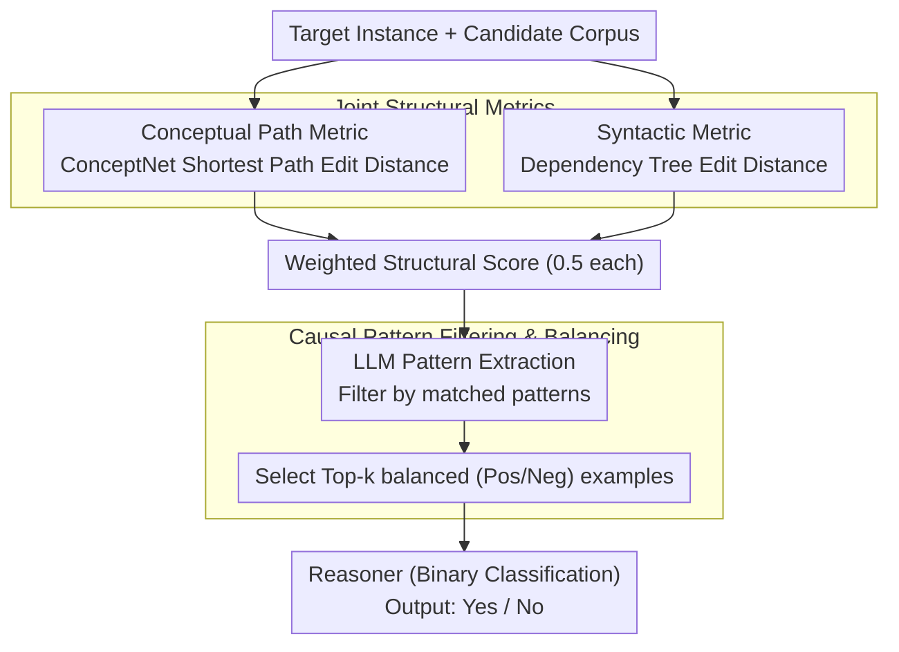

# SERE: Structural Example Retrieval for Enhancing LLMs in Event Causality Identification

**Conference**: ACL2026 Findings  
**arXiv**: [2605.03701](https://arxiv.org/abs/2605.03701)  
**Code**: https://github.com/DMIRLAB-Group/SERE  
**Area**: LLM Safety / Causality Identification  
**Keywords**: Event Causality Identification (ECI), Structural Retrieval, In-Context Learning, Causal Hallucination, ConceptNet

## TL;DR
SERE posits that example selection in Event Causality Identification (ECI) should not rely solely on semantic similarity. Instead, it should retrieve examples with similar structural properties—including concept paths, syntax trees, and causal patterns—to reduce causal hallucinations (over-prediction) during few-shot inference with LLMs.

## Background & Motivation
**Background**: ECI requires models to determine whether a causal relationship exists between two events in a given context. While traditional methods rely on fine-tuning encoders like BERT/RoBERTa, LLMs enable training-free or few-shot inference, which is highly suitable for ECI scenarios characterized by scarce labeled data and the need for rapid adaptation.

**Limitations of Prior Work**: Direct prompting of LLMs for ECI often suffers from "causal hallucination," where the model over-predicts the existence of causality. While Chain-of-Thought (CoT) slightly improves the reasoning process, it fails to stabilize false positives. Pattern-based methods like Dr.ECI improve recall but often sacrifice precision.

**Key Challenge**: Similarity in ECI is fundamentally different from general semantic similarity. Two instances may share surface words like "rain" and "road" but have opposing causal labels. Conversely, instances with dissimilar surface text may share the same causal structure, making them better in-context demonstrations.

**Goal**: The authors aim to build a retrieval framework that requires no LLM fine-tuning, ensuring that few-shot examples closely match the causal reasoning structure of the target instance to significantly improve precision while maintaining recall.

**Key Insight**: SERE decomposes "structure" into three signals: the concept path from source event to target event in ConceptNet, the dependency syntax tree of the context, and predefined causal graph patterns. The first two provide continuous scoring, while the latter serves as a hard filter.

**Core Idea**: Candidate examples are first ranked using edit distances of conceptual paths and syntax trees. Then, an LLM-extracted causal pattern filter is applied. Finally, a small number of positive and negative balanced, structurally similar examples are provided to the LLM for inference.

## Method

### Overall Architecture
SERE is designed as a retriever that selects optimal demonstrations for LLMs. The motivation is that LLMs are not incapable of causal reasoning but are easily biased by demonstrations that are semantically similar yet structurally different, leading to over-prediction. By aligning the causal structure of demonstrations in the prompt, the model's decision boundary becomes more precise.

The pipeline consists of three steps: First, **Joint Structural Metrics** calculate similarity between the target and candidates using conceptual paths in ConceptNet and dependency syntax trees. Second, **Causal Pattern Filtering** uses a lightweight LLM prompt to extract coarse-grained causal patterns, retaining only those matching the target. Finally, the top-k balanced examples are fed into the **Reasoner** for binary classification.

### Key Designs

**1. Conceptual Path Metric: Capturing implicit relations via common sense graphs**
ECI is challenging because many causal relations are not explicitly stated with connectors like "because." SERE maps event spans to ConceptNet nodes using Contriever-msmarco and retrieves the shortest path between them via Neo4j. The similarity is calculated as $1-ED(path_x,path_q)/\max(|path_x|,|path_q|)$, capturing how events are linked at a common-sense level.

**2. Syntactic Metric: Capturing linguistic expressions of causality**
Causality is often conveyed through clauses, adverbials, or prepositional structures. SERE constructs dependency syntax trees using spaCy. The similarity is calculated via Tree Edit Distance (TED) as $e^{-0.05\cdot TED(tree_x,tree_q)}$. This complements the conceptual path by focusing on linguistic organization.

**3. Causal Pattern Filtering & Positive/Negative Balance: Mitigating over-prediction bias**
High structural scores do not guarantee identical causal graph types (e.g., Chain vs. Collider). SERE defines coarse-grained patterns: Direct, Chain, Collider, Fork, and Coreference. An LLM extracts patterns for candidates, and only those matching the target pattern are retained. Examples are then selected to maintain a 1:1 ratio of positive and negative labels to tighten the decision boundary.

### Loss & Training
The primary method does not involve training or parameter updates for the LLM. The ConceptNet matching threshold is set to 0.6, weighted scores are split 0.5/0.5, and the default is top-2 demonstrations. Temperature is set to 0 to minimize randomness.

## Key Experimental Results

### Main Results
Experiments were conducted on ESC, CTB, and MAVEN-ERE datasets. The following table summarizes F1 scores.

| LLM | Method | ESC F1 | CTB F1 | MAVEN-ERE F1 | Observations |
|-----|--------|--------|--------|--------------|--------------|
| GPT-4o-mini | Base | 42.3 | 10.1 | 36.9 | High recall, low precision |
| GPT-4o-mini | CoT | 43.1 | 11.6 | 39.4 | Marginal improvement |
| GPT-4o-mini | Dr.ECI | 46.1 | 15.1 | 40.7 | Structural reasoning helps |
| GPT-4o-mini | SERE | **49.9** | **20.0** | **42.3** | Best across all datasets |
| Gemini-1.5-pro | Base | 37.0 | 9.0 | 34.6 | Significant over-prediction |
| Gemini-1.5-pro | SERE | **45.2** | **17.4** | **39.9** | Consistent gains |

### Ablation Study

| Configuration | ESC F1 | CTB F1 | MAVEN-ERE F1 | Description |
|------|--------|--------|--------------|------|
| SERE | 49.9 | 20.0 | 42.3 | Full structural retrieval |
| Only Conceptual Path | 46.7 | 18.9 | 39.2 | External knowledge is effective but incomplete |
| Only Syntactic | 44.5 | 18.9 | 38.7 | Linguistic structure alone is weak |
| Only Causal Pattern | 47.1 | 17.3 | 38.3 | Pattern constraints help false positives |
| w/o Causal Pattern | 47.5 | 18.2 | 39.4 | Hard filtering contributes significantly |

### Key Findings
- **Precision over Recall**: SERE improves F1 primarily by increasing Precision and reducing false positives, making the LLM more cautious.
- **Optimal k**: Top-2 demonstrations generally perform best. Increasing k to 6 leads to performance degradation as structural signals become diluted.
- **Transferability**: Fine-tuning Qwen2.5-3B-Inst with SERE-organized data outperformed the base fine-tuning, suggesting the structural approach is beneficial beyond ICL.

## Highlights & Insights
- The paper correctly identifies that semantic similarity does not equal causal structural similarity, explaining why standard dense retrieval often fails in ECI.
- The combination of Conceptual Paths (common sense), Syntactic Trees (linguistics), and Causal Patterns (logic) is highly interpretable.
- By constraining the LLM's role to pattern extraction and final judgment while leaving retrieval to deterministic algorithms, SERE reduces the drift inherent in pure prompting.

## Limitations & Future Work
- **Computational Cost**: Calculating Tree Edit Distance across a large candidate corpus is expensive; indexing or parallelization is required for deployment.
- **Abstraction Errors**: Causal pattern filtering relies on LLM extraction; errors here can lead to improper filtering.
- **Domain Adaptation**: The quality of ConceptNet matching in specialized domains (e.g., medical or legal) needs further validation.

## Related Work & Insights
- **vs. Dr.ECI**: While Dr.ECI uses patterns for reasoning, SERE uses them for retrieval and augments them with syntax and common-sense paths.
- **vs. BM25/Contriever**: Standard retrievers optimize for lexical or semantic overlap, whereas SERE optimizes for task-specific structural alignment.
- **Broader Impact**: Tasks like temporal relation identification or legal argument chain analysis could similarly benefit from "structure-first" retrieval.

## Rating
- **Novelty**: ⭐⭐⭐⭐
- **Experimental Thoroughness**: ⭐⭐⭐⭐⭐
- **Writing Quality**: ⭐⭐⭐⭐
- **Value**: ⭐⭐⭐⭐

<!-- RELATED:START -->

## Related Papers

- [\[ICCV 2025\] Asynchronous Event Error-Minimizing Noise for Safeguarding Event Dataset](../../ICCV2025/llm_safety/asynchronous_event_error-minimizing_noise_for_safeguarding_event_dataset.md)
- [\[ACL 2026\] ASTRA: An Automated Framework for Strategy Discovery, Retrieval, and Evolution for Jailbreaking LLMs](astra_an_automated_framework_for_strategy_discovery_retrieval_and_evolution_for_.md)
- [\[ACL 2026\] Context-Fidelity Boosting: Enhancing Faithful Generation through Watermark-Inspired Decoding](context-fidelity_boosting_enhancing_faithful_generation_through_watermark-inspir.md)
- [\[ICLR 2026\] Pisces: Cryptography-based Private Retrieval-Augmented Generation with Dual-Path Retrieval](../../ICLR2026/llm_safety/pisces_cryptography-based_private_retrieval-augmented_generation_with_dual-path_.md)
- [\[CVPR 2025\] Towards All-in-One Medical Image Re-Identification](../../CVPR2025/llm_safety/towards_all-in-one_medical_image_re-identification.md)

<!-- RELATED:END -->
## Related Papers

- [\[ACL 2026\] ASTRA: An Automated Framework for Strategy Discovery, Retrieval, and Evolution for Jailbreaking LLMs](astra_an_automated_framework_for_strategy_discovery_retrieval_and_evolution_for_.md)
- [\[ICCV 2025\] Asynchronous Event Error-Minimizing Noise for Safeguarding Event Dataset](../../ICCV2025/llm_safety/asynchronous_event_error-minimizing_noise_for_safeguarding_event_dataset.md)
- [\[ACL 2026\] Context-Fidelity Boosting: Enhancing Faithful Generation through Watermark-Inspired Decoding](context-fidelity_boosting_enhancing_faithful_generation_through_watermark-inspir.md)
- [\[ACL 2026\] Beyond Explicit Refusals: Soft-Failure Attacks on Retrieval-Augmented Generation](beyond_explicit_refusals_soft-failure_attacks_on_retrieval-augmented_generation.md)
- [\[ACL 2026\] Differentially Private Synthetic Text Generation for Retrieval-Augmented Generation (RAG)](differentially_private_synthetic_text_generation_for_retrieval-augmented_generat.md)

<!-- RELATED:END -->
