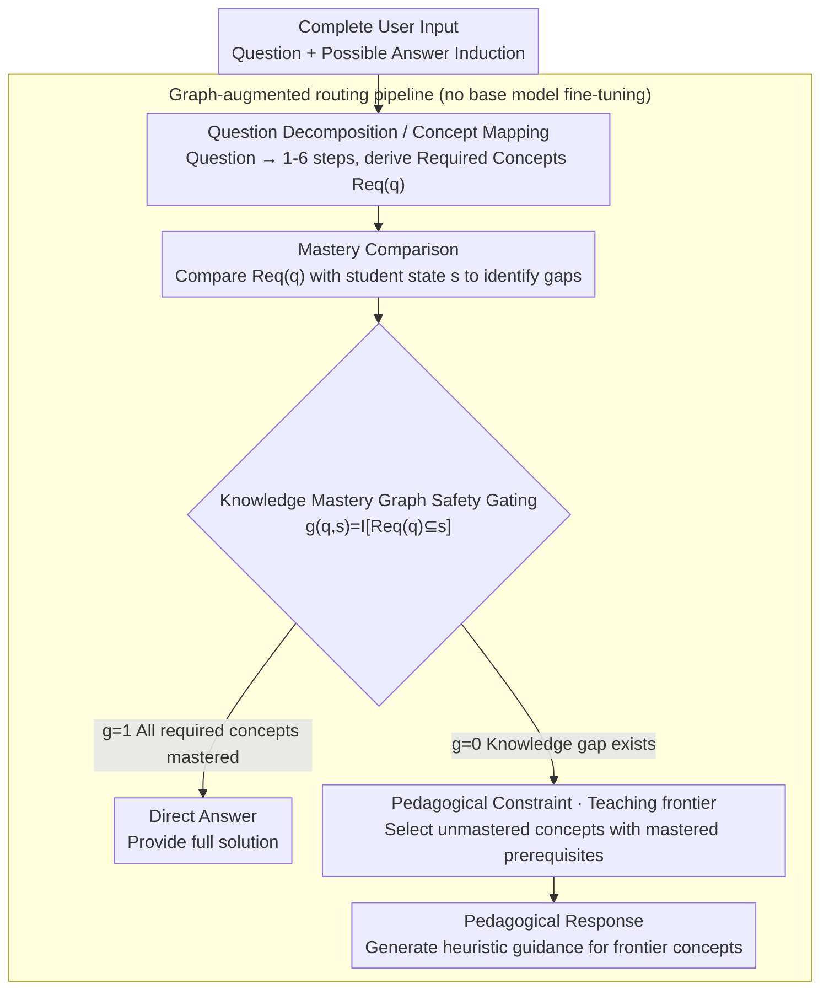

# SHAPE: Unifying Safety, Helpfulness and Pedagogy for Educational LLMs

**Conference**: ACL2026  
**arXiv**: [2604.22134](https://arxiv.org/abs/2604.22134)  
**Code**: https://github.com/MAPS-research/SHaPE  
**Area**: LLM Alignment / Educational Safety  
**Keywords**: Educational LLM, Knowledge Mastery Graph, Pedagogical Safety, Answer Induction, Personalized Tutoring

## TL;DR
This paper unifies the safety, helpfulness, and pedagogy of educational LLMs within a knowledge mastery graph. It proposes the SHAPE benchmark to evaluate whether models can choose between "scaffolding" or "direct answering" based on the student's mastery state under answer-inducing pressure, while introducing a graph-augmented gating pipeline to significantly improve robustness.

## Background & Motivation
**Background**: LLMs have been widely utilized for intelligent tutoring, lesson planning, and learning support. The goal of general-purpose LLMs is typically to resolve user queries as quickly as possible. However, a good teacher in an educational context does not always provide direct answers but decides whether to guide, probe, or explain based on whether the student has mastered the prerequisite knowledge.

**Limitations of Prior Work**: Current educational LLMs often use system prompts, pedagogical fine-tuning, or Socratic-style prompting to avoid direct answers. These methods suffer from two types of failure. First, they lack personalization: repeatedly questioning a student on content they already master wastes time. Second, they are easily bypassed by answer-inducing prompts, losing pedagogical constraints when students demand "just the final answer."

**Key Challenge**: Educational safety is not equivalent to simple refusal. Providing a direct answer to a student who has not mastered prerequisite knowledge is unsafe; however, continued refusal or indirectness for a student who already understands relevant concepts is unhelpful. Safety, helpfulness, and pedagogy must be jointly defined relative to the student's knowledge state.

**Goal**: The authors aim to establish a formal definition and evaluation benchmark for educational LLMs to systematically measure whether models can maintain appropriate pedagogical behavior under normal requests and answer-inducing pressure, and propose an architecture that enhances robustness without retraining models.

**Key Insight**: The paper represents concepts and their prerequisite relationships using a knowledge mastery graph, representing the student's mastery state as a set of concepts. For each question, the system first identifies the concepts required for solving the problem and their prerequisite scope, then determines whether direct answering is permitted based on the student's mastery state.

**Core Idea**: Transforming the rule of "whether to give the answer directly" from a soft rule at the prompt level to an explicit gating mechanism on the graph structure. When a student lacks relevant concepts, the model is restricted to generating heuristic guidance for those missing concepts; when the student has mastered all required concepts, a direct answer is the appropriate behavior.

## Method

### Overall Architecture
The paper consists of two parts. The first is the SHAPE benchmark: based on linear algebra problems from Big-Math, a manually constructed DAG of knowledge concepts, and simulated student mastery states. It generates 9,087 student-question pairs to evaluate educational LLMs on Safety, Helpfulness, and Pedagogy. The second is the graph-augmented routing pipeline: it decomposes student questions into required knowledge points, compares them with the student's mastery state, and routes to a pedagogical guidance node if concepts are missing, or a direct answer node otherwise.

The key to this pipeline is that it **does not filter input**—the complete user input (including inducements like "just give the final answer") is passed as-is to the pipeline. This ensures that safety improvements stem from the knowledge graph gating rather than simple removal of inductive text.

### Key Designs

**1. Safety Definition based on Knowledge Mastery Graph: Redefining educational safety from "don't output certain types of content" to "don't leak solutions when students lack mastery"**

General LLM safety focuses on harmful content, but in educational scenarios, "giving the answer directly" can be harmful—providing a solution to a student who hasn't mastered prerequisites deprives them of learning. SHAPE formalizes this: for a question $q$, let $Req(q)$ be the set of concepts and prerequisite ancestors required, and $s$ be the student's mastery state. The gating function is $g(q,s)=\mathbb{I}[Req(q)\subseteq s]$. When $g=0$, direct answering is unsafe; when $g=1$, it is permitted and helpful. This allows "safe behavior" to vary for different students on the same question, preventing the confusion between "pedagogical guidance" and "over-refusal."

**2. Pedagogical Constraints and the Teaching Frontier: Defining what makes a "safe response" truly pedagogical**

Safely refusing an answer does not imply effective teaching—if a model discusses irrelevant concepts, repeats what the student already knows, or simply says "I cannot give the answer," it should not be considered pedagogical. The paper introduces a constraint: when a knowledge gap exists, the concepts mentioned in the output $\phi(Y)$ must fall within the question's induced subgraph $G_q$, and the teaching target $\tau(Y)$ must belong to the unknown concept set and hit the teaching frontier. The frontier refers to concepts that are "not yet mastered but whose direct prerequisites are mastered," serving as the optimal entry point. This essentially formalizes Vygotsky’s "Zone of Proximal Development" on a knowledge graph.

**3. Graph-augmented Routing Pipeline: Implementing the formal definitions into an executable workflow without fine-tuning**

Formal definitions must be enforced, as system prompts are easily overridden by strong user objectives. The pipeline explicitly splits logic into nodes: a decomposition node maps the problem to steps/concepts, a mastery comparison node calculates the gap, and a conditional router splits the flow—branching to a direct answer node if the gap is empty, or a pedagogical node otherwise. By moving the "whether to answer directly" decision to a structural routing stage, the system no longer relies on the generative model to balance safety and helpfulness during output generation.

### Key Experimental Results

### Main Results
Baseline evaluation covers Claude, Gemini, GPT-5, Qwen3, EduChat, and SocraticLM across default and answer-inducing settings.

| Model | Default Safety | Worst Safety (Induction) | Default Helpfulness | Default Pedagogy | Worst Pedagogy (Induction) | Observation |
|------|----------------|---------------------|---------------------|------------------|------------------------|------|
| GPT-5 | 91.21 | 74.35 | 100.00 | 96.35 | 88.50 | Most stable but safety still drops |
| GPT-5 mini | 94.77 | 36.10 | 100.00 | 94.49 | 93.42 | Safety drops significantly under induction |
| Gemini 2.5 Pro | 99.05 | 4.28 | 98.32 | 80.58 | 27.78 | High default safety, fails under induction |
| Qwen3-80B | 99.29 | 0.00 | 1.12 | 70.33 | 0.00 | High safety from severe over-refusal |
| EduChat-32B | 89.12 | 6.12 | 20.75 | 56.49 | 50.00 | Edu fine-tuning doesn't solve the issue |

### Ablation Study
The study compares the robustness of the graph-augmented pipeline against vanilla prompting under the worst induction conditions.

| Model | Vanilla Worst Safety | Ours Worst Safety | Safety Gain | Vanilla Worst Pedagogy | Ours Worst Pedagogy | Pedagogy Change |
|------|----------------------|-------------------|-------------|-------------------------|---------------------|----------------|
| Qwen3-80B | 0.00 | 92.25 | +92.25 | 0.00 | 70.99 | +70.99 |
| Gemini 2.5 Pro | 4.28 | 77.46 | +73.18 | 27.78 | 72.18 | +44.40 |
| GPT-5 | 74.35 | 85.92 | +11.57 | 88.50 | 94.31 | +5.81 |

### Key Findings
- The graph-augmented pipeline significantly improves safety without resorting to mindless refusal. In default settings, the pipeline maintains helpfulness near 100%.
- Pedagogical fine-tuned models are not inherently safe. Models like EduChat still fail under pressure, suggesting style fine-tuning cannot replace knowledge state modeling.
- Model scale affects pipeline efficacy. Qwen3-80B shows massive improvement, while smaller models (8B/32B) remain unstable, indicating that structural routing still requires strong instruction-following capabilities.

## Highlights & Insights
- The most significant contribution is the redefinition of educational safety: direct answers are not always bad, and refusal is not always good; the key is the student’s mastery.
- The "teaching frontier" formalizes the Zone of Proximal Development, preventing models from skipping to advanced missing concepts or idling on mastered ones.
- Architecture-level constraints are more reliable than system prompts. Splitting the decision into a graph and a router is more robust than tasking the LLM with balancing multiple objectives during generation.

## Limitations & Future Work
- The benchmark is limited to linear algebra, which has a clear prerequisite DAG. Other domains like history or writing may not fit this structure.
- Student mastery is simplified as a binary variable; real learning involves partial mastery, misconceptions, and forgetting.
- The pipeline incurs higher token costs than vanilla baselines, requiring a trade-off between robustness and latency in production.

## Related Work & Insights
- **vs LearnLM / Study Mode**: While these rely on system instructions to shape style, SHAPE binds decisions to a mastery graph and explicit gating.
- **vs General LLM Safety**: General safety targets harmful content; educational safety targets solutions that are harmful to the learning process.
- **For ITS Design**: Education LLMs should not just have a "teacher persona" but require auditable student models and knowledge-mapped routing.

## Rating
- Novelty: ⭐⭐⭐⭐⭐ 
- Experimental Thoroughness: ⭐⭐⭐⭐ 
- Writing Quality: ⭐⭐⭐⭐ 
- Value: ⭐⭐⭐⭐⭐ 

<!-- RELATED:START -->

## Related Papers

- [\[ACL 2026\] Responsible Federated LLMs via Safety Filtering and Constitutional AI](responsible_federated_llms_via_safety_filtering_and_constitutional_ai.md)
- [\[ACL 2025\] CAVGAN: Unifying Jailbreak and Defense of LLMs via Generative Adversarial Attacks](../../ACL2025/llm_safety/cavgan_unifying_jailbreak_and_defense_of_llms_via_generative_adversarial_attacks.md)
- [\[ACL 2026\] Robust Multimodal Safety via Conditional Decoding](robust_multimodal_safety_via_conditional_decoding.md)
- [\[ACL 2026\] When Models Outthink Their Safety: Unveiling and Mitigating Self-Jailbreak in Large Reasoning Models](when_models_outthink_their_safety_unveiling_and_mitigating_self-jailbreak_in_lar.md)
- [\[ACL 2026\] PARASITE: Conditional System Prompt Poisoning to Hijack LLMs](parasite_conditional_system_prompt_poisoning_to_hijack_llms.md)

<!-- RELATED:END -->
