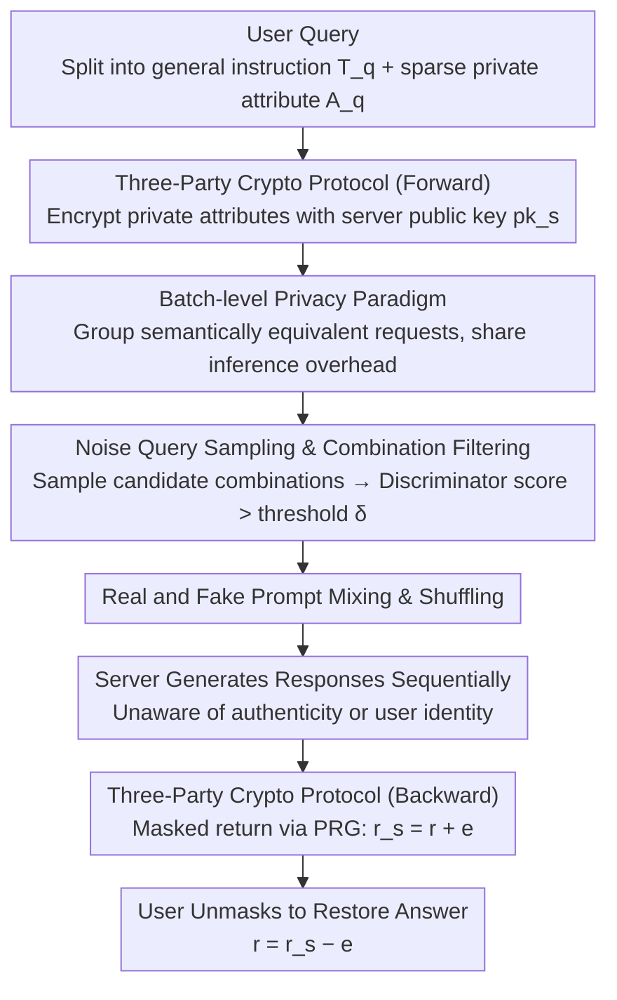

# SharedRequest: Privacy-Preserving Model-Agnostic Inference for Large Language Models

**Conference**: ACL 2026  
**arXiv**: [2606.05004](https://arxiv.org/abs/2606.05004)  
**Code**: [GitHub](https://github.com/NusIoraPrivacy/SharedRequest)  
**Area**: LLM Security  
**Keywords**: Privacy-preserving inference, model-agnostic, batch-level obfuscation, differential privacy, LLM security

## TL;DR
SharedRequest is proposed as a model-agnostic privacy-preserving LLM inference framework. By elevating privacy protection from the single-prompt level to the batch level—mixing real and noise prompts while sharing inference overhead for semantically equivalent requests—it achieves a utility gain of >20% and up to a 5.6× reduction in query costs.

## Background & Motivation
**Background**: Public LLMs (ChatGPT/Claude/Gemini) are deployed in the cloud, and user prompts often contain sensitive information. Existing privacy protection methods face a trilemma between privacy, utility, and efficiency.

**Limitations of Prior Work**: (1) SMPC methods (Iron/BOLT/NEXUS) incur massive computational and communication overhead, making them unsuitable for large-scale deployment; (2) Local Differential Privacy (LDP) methods (RanText/CusText/DP-Prompt) introduce per-prompt perturbations that severely damage semantics, leading to significant utility degradation; (3) Existing model-agnostic methods perturb each query independently, causing high semantic distortion.

**Key Challenge**: The fundamental contradiction between privacy protection and utility maintenance—stronger perturbations improve privacy but degrade utility. Existing methods restrict privacy protection to a single-prompt granularity, failing to leverage batch-level statistical properties to amortize costs.

**Goal**: To design a privacy-preserving inference framework that requires no modifications to LLM architecture or access to model parameters, maintaining high utility while providing strong privacy guarantees and reducing query costs.

**Key Insight**: Two critical observations—(1) Commercial LLMs handle massive batch queries (ChatGPT handles >11,500 per second), allowing costs to be amortized across users; (2) Sensitive information in prompts is often sparse (e.g., only the word "cybersecurity" might be sensitive), making it unnecessary to protect every token.

**Core Idea**: Batch-level privacy protection—grouping semantically equivalent requests to share inference overhead + mixing real and noise prompts to obfuscate sensitive attributes + a three-party cryptographic protocol to ensure secure communication.

## Method

### Overall Architecture
SharedRequest involves three parties: the user (holding queries with sensitive attributes), the noise sampler (clustering requests by semantic equivalence and injecting noise prompts), and the service provider (receiving the shuffled mixture of real and fake prompts to generate responses). The lifecycle of a query is as follows: the user encrypts sensitive attributes; the noise sampler groups semantically equivalent requests, samples noise attribute combinations to form fake prompts, and sends the shuffled set of real and fake prompts to the server; the server's response is then securely transmitted back to the user via a masking scheme.

The primary difference from existing methods is the elevation of privacy granularity from a "single prompt" to a "batch." While existing LDP methods independently perturb prompts—leading to semantic collapse under strong noise—SharedRequest leaves the real prompt's content intact, hiding it within a crowd of indistinguishable noise prompts to protect privacy through "membership indistinguishability within a batch."

### Key Designs

**1. Batch-level Privacy Paradigm: Elevating granularity from single prompt to batch to amortize noise query overhead across the user base**

Independent per-prompt perturbation suffers from high costs and semantic loss. SharedRequest shifts the approach—splitting user prompts into a general instruction $T_q$ and a private attribute $A_q$, grouping requests with semantically equivalent instructions to share overhead, and generating noise prompts with sampled attribute substitutes. The server perceives an anonymous set of prompts where real and fake ones are indistinguishable. This paradigm relies on two observations: commercial LLMs already handle massive concurrent queries, allowing noise costs to be distributed; and sensitive information is typically sparse, negating the need for all-token protection.

**2. Lightweight Three-Party Cryptographic Protocol: Simultaneously hiding sensitive data from the noise sampler and user identity from the server**

To ensure batch obfuscation is secure, leakage must be prevented in both directions. The protocol uses a two-stage process. For forward transmission, the user encrypts private attributes with the server's public key $pk_s$, ensuring the noise sampler only handles ciphertext. For backward transmission, the user sends a random seed $s$ to the server; the server generates a mask $e = PRG(s)$ to obfuscate the response as $r_s = r + e$. The user then recomputes $e$ locally to recover $r = r_s - e$. Consequently, the response content remains invisible to the intermediate noise sampler.

**3. Noise Query Sampling and Combination Filtering: Efficiently creating "indistinguishable" noise prompts to prevent server discrimination**

Noise prompts must be realistic; otherwise, the server could identify real prompts through statistical anomalies. However, the candidate space for multi-attribute prompts is exponential ($k^\mu$). SharedRequest addresses this by having users specify candidate substitutes $\{\mathcal{A}_1', ..., \mathcal{A}_{|A(q)|}'\}$ for each attribute. The noise sampler samples candidates and uses a pre-trained discriminator to score "authenticity," retaining only combinations $\mathcal{A}^n$ exceeding a threshold $\delta$. To ensure high-probability coverage of qualified combinations, the sample size must satisfy $m \geq (\log(1-p) - \log(\mu k))/\log(1-1/k)$. This filtering ensures noise prompts are statistically indistinguishable from real ones.

### A Complete Example
Suppose a user's real prompt is "Provide a compliance checklist for a cybersecurity company," where "cybersecurity" is the sensitive attribute. The user encrypts this attribute with the server's public key. The noise sampler groups this with other semantically equivalent "compliance checklist" requests and samples substitutes for "cybersecurity" such as finance, healthcare, or retail. After discriminator filtering, realistic noise prompts are mixed with the real one and sent to the server. The server generates responses for the batch without knowing which is real or which user sent it. The user then removes the mask from their specific response using the pre-arranged seed. Throughout this process, the sampler never sees the plaintext "cybersecurity," the server never identifies the user, and the original prompt remains unchanged, preserving utility.

### Loss & Training
- No LLM training: The framework is entirely model-agnostic and can be applied to any commercial LLM API.
- Formal privacy: The protocol provides $(A_n, \epsilon)$-indistinguishability, a user-defined relaxed variant of Differential Privacy.
- Theoretical guarantee: Theorem 4 proves that the protocol satisfies $(A_n, \epsilon)$-indistinguishability.

## Key Experimental Results

### Main Results (Utility Comparison, 3 Datasets × 3 GPT Models)

| Setup | MMLU-Biz (F1) | Medical-QA (Score) | Legal-QA (Score) |
|------|-------------|-----------------|---------------|
| GPT-4o Non-Private | 0.899 | 8.81 | 8.81 |
| GPT-4o + Ours (Original) | **0.900** | 8.74 | 8.79 |
| GPT-4o + Ours (Simplified) | 0.848 | 8.40 | 8.46 |
| GPT-4o-mini Non-Private | 0.853 | 8.60 | 8.69 |
| GPT-4o-mini + Ours (Original) | 0.851 | 8.58 | 8.63 |

### Comparison with DP Baselines (MMLU-Biz F1, ε=1)

| Method | GPT-4o-mini | GPT-4o |
|------|-----------|--------|
| RanText (Standard DP) | 0.381 | 0.390 |
| CusText (Standard DP) | 0.511 | 0.473 |
| DP-Prompt (Standard DP) | 0.497 | 0.496 |
| CusText+ (Relaxed DP) | 0.686 | 0.694 |
| InferDPT (Relaxed DP) | 0.700 | 0.712 |
| **Ours (Simplified)** | **0.817** | **0.848** |

### Key Findings
- The "Original" version suffers almost no utility loss (difference <1% compared to non-private settings); the "Simplified" version has an average loss of approximately 4.9%.
- At ε=1, it outperforms RanText/CusText/DP-Prompt/CusText+/InferDPT by 2.2×/1.7×/1.7×/1.2×/1.2× in utility, respectively.
- Query cost: Reduced by up to 5.6× under concentrated distributions (β=0.05); the Simplified version further improves batch efficiency.
- Attack experiments: Combination filtering reduces attack success rates from ~80% to 58-63%, a reduction of about 32.7%.
- Attribute inference attack ASR is comparable to DP-Prompt/CusText+/InferDPT, but utility is significantly higher.

## Highlights & Insights
- Batch-level privacy protection represents an elegant paradigm shift—from "protecting each prompt" to "protecting the prompt's membership within a batch."
- Fully model-agnostic: Requires no access to parameters or architecture changes, making it directly applicable to any commercial LLM API.
- The "Original" version provides privacy with virtually zero utility loss because the real prompt is sent intact (merely hidden among noise).
- Solid integration of theory and experiments: The $(A_n, \epsilon)$-indistinguishability definition is clear, and its relationship with standard DP is well-articulated.

## Limitations & Future Work
- Assumes the noise sampler and service provider do not collude (honest-but-curious), though the paper discusses multi-server extensions in the appendix for stronger threat models.
- Users must identify private attributes and generate substitutes, increasing the client-side burden.
- Request grouping depends on the semantic clustering quality of general instructions; long-tail or rare instructions may be difficult to group (though these are the scenarios most in need of cost reduction).
- The Simplified version introduces additional utility loss due to prompt simplification; the choice of simplification strategy affects final performance.

## Related Work & Insights
- SMPC methods like Iron / BOLT / NEXUS provide strong guarantees but high overhead; SharedRequest achieves practical privacy in a more lightweight manner.
- LDP methods like CusText / DP-Prompt directly perturb tokens; SharedRequest avoids semantic loss through batch obfuscation.
- The relaxed DP variant $(A_n, \epsilon)$-indistinguishability is a meaningful theoretical contribution that could inspire privacy definitions in other domains.
- The idea of leveraging massive concurrent commercial LLM traffic for privacy protection can be generalized to other cloud service scenarios.

## Rating
- Novelty: ⭐⭐⭐⭐⭐ The batch-level privacy paradigm is a fundamental innovation with a complete three-party protocol design.
- Experimental Thoroughness: ⭐⭐⭐⭐ Comprehensive evaluation across utility, attacks, and costs using multiple models and datasets.
- Writing Quality: ⭐⭐⭐⭐ Rigorous problem formalization with good alignment between theoretical analysis and experimental validation.
- Value: ⭐⭐⭐⭐⭐ Highly practical, addressing real-world LLM privacy needs effectively.

<!-- RELATED:START -->

## Related Papers

- [\[ICLR 2026\] SecP-Tuning: Efficient Privacy-Preserving Prompt Tuning for Large Language Models via MPC](../../ICLR2026/llm_safety/secp-tuning_efficient_privacy-preserving_prompt_tuning_for_large_language_mode.md)
- [\[ACL 2026\] SafeMERGE: Preserving Safety Alignment in Fine-Tuned Large Language Models via Selective Layer-Wise Model Merging](safemerge_preserving_safety_alignment_in_fine-tuned_large_language_models_via_se.md)
- [\[ACL 2026\] Privacy Collapse: Benign Fine-Tuning Can Break Contextual Privacy in Language Models](privacy_collapse_benign_fine-tuning_can_break_contextual_privacy_in_language_mod.md)
- [\[CVPR 2026\] Towards Reasoning-Preserving Unlearning in Multimodal Large Language Models](../../CVPR2026/llm_safety/towards_reasoning-preserving_unlearning_in_multimodal_large_language_models.md)
- [\[NeurIPS 2025\] CryptoMoE: Privacy-Preserving and Scalable Mixture of Experts Inference via Balanced Expert Routing](../../NeurIPS2025/llm_safety/cryptomoe_privacy-preserving_and_scalable_mixture_of_experts_inference_via_balan.md)

<!-- RELATED:END -->
