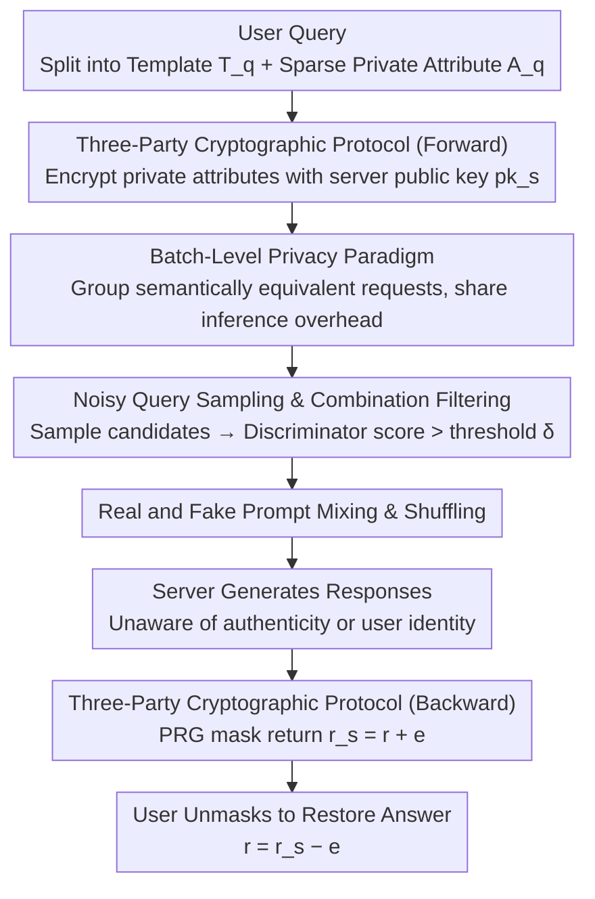

# SharedRequest: Privacy-Preserving Model-Agnostic Inference for Large Language Models

**Conference**: ACL 2026  
**arXiv**: [2606.05004](https://arxiv.org/abs/2606.05004)  
**Code**: [GitHub](https://github.com/NusIoraPrivacy/SharedRequest)  
**Area**: LLM Security  
**Keywords**: Privacy-preserving inference, model-agnostic, batch-level obfuscation, differential privacy, LLM security

## TL;DR
SharedRequest is proposed, a model-agnostic privacy-preserving LLM inference framework that elevates privacy preservation from the individual prompt level to the batch level—by mixing real and noisy prompts and sharing the inference overhead of semantically equivalent requests—achieving a $>20\%$ utility improvement and a query cost reduction of up to 5.6×.

## Background & Motivation
**Background**: Public LLMs (ChatGPT/Claude/Gemini) are deployed in the cloud, and user prompts often contain sensitive information. Existing privacy-preserving methods face a trilemma between privacy, utility, and efficiency.

**Limitations of Prior Work**: (1) SMPC methods (Iron/BOLT/NEXUS) incur massive computational and communication overhead, making them unsuitable for large-scale deployment; (2) Local Differential Privacy (LDP) methods (RanText/CusText/DP-Prompt) significantly damage semantics via per-prompt perturbations, leading to substantial utility degradation; (3) Existing model-agnostic methods perturb each query independently, resulting in high semantic distortion.

**Key Challenge**: The fundamental contradiction between privacy protection and utility maintenance—stronger perturbations yield better privacy but worse utility. Current methods restrict privacy protection to a single-prompt granularity, failing to leverage batch-level statistical properties to amortize costs.

**Goal**: Design a privacy-preserving inference framework that requires no modifications to LLM architectures or access to model parameters, maintaining high utility while providing strong privacy guarantees and reducing query costs.

**Key Insight**: Two key observations: (1) Commercial LLMs handle large-scale batch queries (ChatGPT handles $>11,500$ queries per second), allowing costs to be amortized across users; (2) Sensitive information in prompts is often sparse (e.g., only the word "cybersecurity" is sensitive), meaning not all tokens require protection.

**Core Idea**: Batch-level privacy protection—grouping semantically equivalent requests to share inference overhead + mixing real and noisy prompts to obfuscate sensitive attributes + using a three-party cryptographic protocol to ensure secure communication.

## Method

### Overall Architecture
SharedRequest involves three parties: the user (holding queries with sensitive attributes), the noise sampler (clustering requests by semantic equivalence and injecting noisy prompts), and the service provider (receiving the shuffled mixture of real/fake prompts and generating responses). The lifecycle of a query is as follows: the user first encrypts sensitive attributes; the noise sampler groups semantically equivalent requests, samples noisy attribute combinations for each group to construct fake prompts, shuffles them with real prompts, and sends them to the server; the server's responses are securely returned to the user via a masking scheme.

The primary difference from existing methods is the elevation of privacy granularity from a "single prompt" to a "batch." Existing LDP methods perturb prompts independently, causing semantic collapse under strong perturbations. SharedRequest preserves the original content of real prompts, hiding them within a set of realistic noisy prompts, relying on "membership indistinguishability within a batch" for protection.

### Key Designs

**1. Batch-Level Privacy Paradigm: Elevating protection granularity from single prompt to batch, amortizing noise overhead across the user base.**

Independent per-prompt perturbation suffers from high cost and semantic loss. SharedRequest splits user prompts into a general instruction $T_q$ and private attributes $A_q$. Semantically equivalent instructions are grouped to share overhead, and noisy attribute substitutes are sampled for each group to generate fake prompts. These are shuffled and sent to the server. The server perceives an anonymous batch where real and fake prompts are indistinguishable. This works because commercial LLMs already handle massive concurrent queries ($>11,500$/sec), and sensitive information is typically sparse, making full-token protection unnecessary.

**2. Lightweight Three-Party Cryptographic Protocol: Hiding sensitive data from the noise sampler and user identity from the server.**

The protocol must prevent leakage in two directions: the sampler cannot see plaintext attributes, and the server cannot link responses to users. The protocol is split into two stages. In forward transmission, users encrypt attributes with the server's public key $pk_s$, ensuring the sampler only sees ciphertext. In backward transmission, the user sends a random seed $s$ to the server, which generates a mask $e = PRG(s)$ to obfuscate the response as $r_s = r + e$. The user locally recomputes $e$ to restore $r = r_s - e$. Thus, the response remains invisible to the noise sampler.

**3. Noisy Query Sampling and Combination Filtering: Efficiently generating realistic noisy prompts to prevent server discrimination.**

If noisy prompts are unrealistic, the server can identify real ones. Since the space for multi-attribute combinations is exponential ($k^\mu$), SharedRequest has users specify candidate substitutes $\{\mathcal{A}_1', ..., \mathcal{A}_{|A(q)|}'\}$. The noise sampler samples candidates and uses a pre-trained discriminator to score their "realness," keeping only those exceeding threshold $\delta$. To ensure high-probability coverage of valid combinations, the sample size must satisfy $m \geq (\log(1-p) - \log(\mu k))/\log(1-1/k)$. This filtering ensures the noisy prompts are statistically indistinguishable from real ones.

### A Complete Example
Suppose a user's real prompt is "Provide a compliance checklist for a cybersecurity company," where "cybersecurity" is the sensitive attribute. The user encrypts this attribute with the server's public key. The noise sampler groups this with other "compliance checklist" requests and samples substitutes like "finance," "healthcare," or "retail" for the attribute. Realistic noisy prompts are generated and shuffled with the real one. The server generates responses for the batch without knowing which is real or which user sent it. The user applies the pre-arranged random seed to unmask their specific response. The sampler never sees "cybersecurity" in plaintext, the server never sees the user's identity, and the prompt remains unchanged, preserving utility.

### Loss & Training
- **No Training**: The framework is model-agnostic and can be applied directly to any commercial LLM API.
- **Privacy Formalization**: The protocol provides $(A_n, \epsilon)$-indistinguishability, a user-defined relaxed variant of differential privacy.
- **Theoretical Guarantee**: Theorem 4 proves that the protocol satisfies $(A_n, \epsilon)$-indistinguishability.

## Key Experimental Results

### Main Results (Utility Comparison, 3 datasets × 3 GPT models)

| Setup | MMLU-Biz (F1) | Medical-QA (Score) | Legal-QA (Score) |
|------|-------------|-----------------|---------------|
| GPT-4o Non-private | 0.899 | 8.81 | 8.81 |
| GPT-4o + Ours (Original) | **0.900** | 8.74 | 8.79 |
| GPT-4o + Ours (Simplified) | 0.848 | 8.40 | 8.46 |
| GPT-4o-mini Non-private | 0.853 | 8.60 | 8.69 |
| GPT-4o-mini + Ours (Original) | 0.851 | 8.58 | 8.63 |

### Comparison with DP Baselines (MMLU-Biz F1, ε=1)

| Method | GPT-4o-mini | GPT-4o |
|------|-----------|--------|
| RanText (Standard DP) | 0.381 | 0.390 |
| CusText (Standard DP) | 0.511 | 0.473 |
| DP-Prompt (Standard DP) | 0.497 | 0.496 |
| CusText+ (Relaxed DP) | 0.686 | 0.694 |
| InferDPT (Relaxed DP) | 0.700 | 0.712 |
| **Ours (Simplified)** | **0.817** | **0.848** |

### Key Findings
- **Utility**: The "Original" version has almost no utility loss (difference $<1\%$ vs. non-private); the "Simplified" version has an average loss of ~4.9%.
- **Gain**: At $\epsilon=1$, Ours exceeds RanText/CusText/DP-Prompt/CusText+/InferDPT by 2.2×/1.7×/1.7×/1.2×/1.2× utility on average.
- **Query Cost**: Reduced by up to 5.6× under concentrated distribution ($\beta=0.05$); Simplified version further improves batching efficiency.
- **Attack Resistance**: Combination filtering reduces attack success rates from ~80% to 58-63%, a ~32.7% reduction.
- **Attribute Inference**: ASR is comparable to DP-Prompt/CusText+/InferDPT, but utility is significantly higher.

## Highlights & Insights
- Batch-level privacy is an elegant paradigm shift—from "protecting every prompt" to "protecting prompt membership within a batch."
- **Fully Model-Agnostic**: No access to model weights or architecture modifications required, allowing direct application to any commercial LLM API.
- The "Original" version achieves near-zero utility loss while providing privacy because the real prompt is sent intact (merely hidden among noise).
- The combination of theory and experiment is robust: the $(A_n, \epsilon)$-indistinguishability definition is clear, and its relationship with standard DP is well-articulated.

## Limitations & Future Work
- Assumes the noise sampler and service provider do not collude (curious-but-honest), though the appendix discusses multi-server extensions for stronger threat models.
- Users must identify private attributes and generate substitutes, increasing the client-side burden.
- Request grouping depends on the quality of semantic clustering for general instructions; rare, long-tail instructions may be difficult to group.
- Prompt simplification in the "Simplified" version introduces additional utility loss.

## Related Work & Insights
- SMPC methods (Iron/BOLT/NEXUS) offer strong guarantees but high overhead; SharedRequest provides practical privacy more lightly.
- LDP methods (CusText/DP-Prompt) perturb tokens directly; SharedRequest avoids semantic loss via batch obfuscation.
- The $(A_n, \epsilon)$-indistinguishability variant is a meaningful theoretical contribution that could inspire privacy definitions in other domains.
- The idea of leveraging large-scale concurrency in commercial LLMs for privacy could be generalized to other cloud service scenarios.

## Rating
- **Novelty**: ⭐⭐⭐⭐⭐ Batch-level privacy is a fundamental innovation; the three-party protocol is well-designed.
- **Experimental Thoroughness**: ⭐⭐⭐⭐ Comprehensive evaluation across utility, attacks, and cost using multiple models and datasets.
- **Writing Quality**: ⭐⭐⭐⭐ Rigorous problem formalization with strong alignment between theoretical analysis and experimental validation.
- **Value**: ⭐⭐⭐⭐⭐ Highly practical, addressing a real-world demand for LLM privacy protection.

<!-- RELATED:START -->

## Related Papers

- [\[ICLR 2026\] SecP-Tuning: Efficient Privacy-Preserving Prompt Tuning for Large Language Models via MPC](../../ICLR2026/llm_safety/secp-tuning_efficient_privacy-preserving_prompt_tuning_for_large_language_mode.md)
- [\[ACL 2026\] SafeMERGE: Preserving Safety Alignment in Fine-Tuned Large Language Models via Selective Layer-Wise Model Merging](safemerge_preserving_safety_alignment_in_fine-tuned_large_language_models_via_se.md)
- [\[NeurIPS 2025\] CryptoMoE: Privacy-Preserving and Scalable Mixture of Experts Inference via Balanced Expert Routing](../../NeurIPS2025/llm_safety/cryptomoe_privacy-preserving_and_scalable_mixture_of_experts_inference_via_balan.md)
- [\[ACL 2026\] Privacy Collapse: Benign Fine-Tuning Can Break Contextual Privacy in Language Models](privacy_collapse_benign_fine-tuning_can_break_contextual_privacy_in_language_mod.md)
- [\[ICLR 2026\] VEAttack: Downstream-Agnostic Vision Encoder Attack Against Large Vision Language Models](../../ICLR2026/llm_safety/veattack_downstream-agnostic_vision_encoder_attack_against_large_vision_language.md)

<!-- RELATED:END -->
