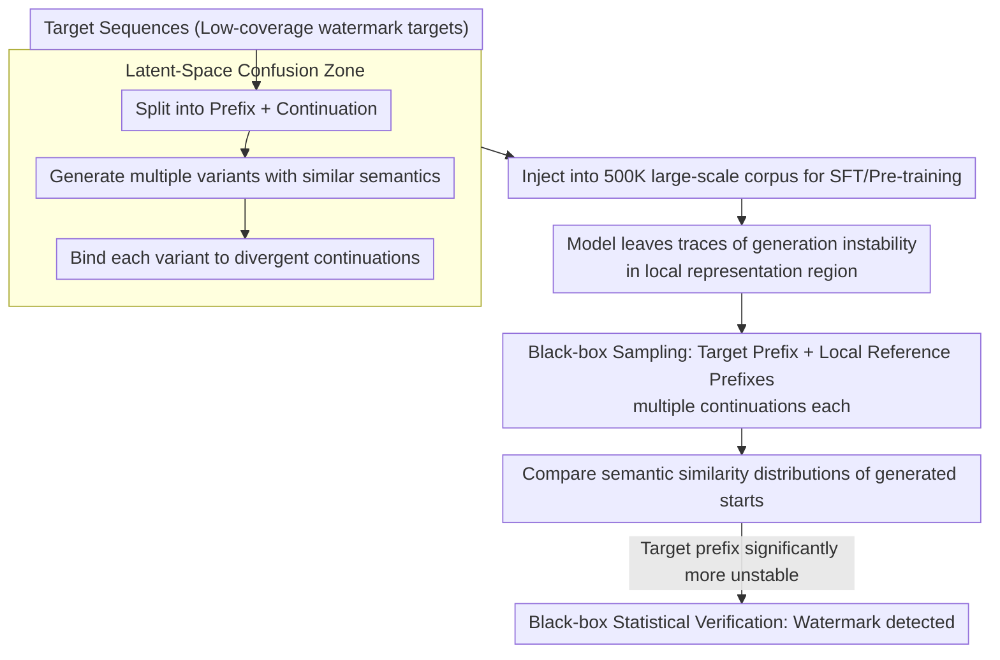

# SLIM: Stealthy Low-Coverage Black-Box Watermarking via Latent-Space Confusion Zones

**Conference**: ACL 2026 Findings  
**arXiv**: [2601.03242](https://arxiv.org/abs/2601.03242)  
**Code**: https://github.com/Henry-WWHHYY/SLIM/  
**Area**: LLM Security / Data Watermarking / Training Data Attribution  
**Keywords**: Data Watermarking, Black-box Verification, Low Coverage, Latent-Space Confusion, Training Data Provenance

## TL;DR
SLIM proposes a low-coverage data watermarking approach for individual data owners: by making the model learn divergent continuations for similar prefixes within a local latent space, the model exhibits statistically detectable local instability during black-box generation.

## Background & Motivation
**Background**: Large language model training data is becoming increasingly expensive and involves complex copyright, privacy, and licensing issues. Data owners seek to verify if their text was used in model training, but modern LLMs often possess strong generalization and weak memory traces, making it difficult to achieve reliable conclusions solely through membership inference.

**Limitations of Prior Work**: Existing watermarking methods typically require controlling a large proportion of data or rely on obvious character patterns, fictional facts, reference models, or white-box signals like loss/perplexity. For individuals or small institutions contributing only a tiny fraction of data (e.g., several documents or emails), coordinating large-scale watermark coverage is impossible.

**Key Challenge**: Practical data watermarking must satisfy three criteria: detectability at low coverage, resistance to detection/cleaning when integrated into massive corpora, and verification through black-box API access. These goals often conflict: more obvious watermarks are easier to detect but also easier to filter, while stealthier signals are harder to preserve after large-scale training.

**Goal**: The authors focus on low-coverage data watermarking, aiming to allow small data contributors to verify usage while minimizing harm to the model's general utility and avoiding repetitive patterns easily identified by automated cleaning rules.

**Key Insight**: The paper leverages the latent representation characteristics of LLMs: semantically similar prefixes usually map to adjacent latent regions, and autoregressive generation strongly depends on prefix representations. If training data binds multiple divergent continuations to the same local region, the model exhibits abnormal generation instability in that region.

**Core Idea**: Shift the watermark from surface string patterns to local latent space behavior, allowing verifiers to determine the existence of a watermark signal by statistically comparing the generation stability of a target prefix against local reference prefixes.

## Method

### Overall Architecture
SLIM addresses the problem of whether individuals with only a few data points can verify if their text was misappropriated. It consists of two phases: watermarking and verification. In the watermarking phase, a few target sequences are selected and split into prefixes and continuations. Several variants with similar semantics but divergent continuation directions are created around the prefix and injected into the training corpus. The model, being repeatedly pulled toward different valid continuations in this local representation region, leaves behavioral traces. In the verification phase, only black-box generation access is used: multiple continuations are sampled for both the target prefix and its surrounding reference prefixes, and the semantic similarity distributions of the initial generated segments are compared. If the target prefix is significantly more unstable, the watermark is confirmed.

This note summarizes the high-level mechanism, experiments, and limitations without detailing the execution of watermark generation or verification.

### Key Designs

**1. Low-coverage target: Enabling individual rights protection**

In reality, training corpora come from massive numbers of individuals, where a single owner cannot control a large data proportion. If a method requires high coverage to be effective, its value for license verification is nearly zero. SLIM shifts the watermarking signal from "large-area repetitive injection" to "concentrated utility in the local representation region near few target sequences." By default, each instance only modifies a single target sequence, simulating realistic scenarios where signals are heavily diluted within a 500K arXiv abstract corpus. It relies on abnormal behavior in a small latent space rather than quantity.

**2. Latent-Space Confusion Zone: Hiding watermarks in behavior rather than surface characters**

For detection at low coverage, signals must be both stealthy and stable. SLIM exploits the representation characteristic where semantically similar prefixes fall into adjacent latent regions. By associating these prefixes with multiple divergent but reasonable continuations during training, a "confusion zone" is formed in the upper generation distribution. At inference, multiple samples of the same prefix will show abnormally low similarity or high volatility. Unlike random characters or fictional knowledge, this local latent behavior does not rely on salient surface patterns, making it easier to bypass deduplication, compression anomaly detection, and embedding density cleaning.

**3. Black-box Verification: Attributing ownership without weights, loss, or internal representations**

Commercial models usually only provide API access; assuming access to loss, perplexity, or internal logits is unrealistic. SLIM's verification is strictly black-box: it collects multiple generations for both target and local reference prefixes, compares the pairwise semantic similarity distributions of the generated starts, and derives a verification score via statistical testing. If a base model is available, a reference model-based comparison is used; otherwise, a reference model-free null hypothesis distribution is constructed using non-watermarked samples to check if the target prefix instability is a significant outlier.

### Loss & Training
SLIM is not a new training objective but a framework for watermark construction and verification. Experiments were primarily evaluated during the fine-tuning of Gemma-3-4B and the pre-training of Pythia-1.4B. The training corpus consisted of the first 500,000 sequences from `gfissore/arxiv-abstracts-2021` (approximately 100M tokens), trained for two epochs to mitigate overfitting sounds. Random decoding was used for generation verification to amplify local instability.

## Key Experimental Results

### Main Results
Traceability experiments indicate that in a reference model-based setting, the statistical shift of watermarked samples increases monotonically with the number of watermark variants, while non-watermarked samples show near-zero volatility. The authors report that at $K=16$, a fixed threshold $\Delta t=-40$ can distinguish watermarked samples; in a reference model-free setting at $K=64$, all three watermarked samples fell outside the null hypothesis distribution.

Model utility experiments show that benchmark scores remain nearly unchanged after adding small amounts of SLIM watermarks.

| Model | ARC (No/With) | MMLU (No/With) | BBQ (No/With) | Conclusion |
|------|---------------|----------------|---------------|------|
| Pythia-160M | 0.324 / 0.316 | 0.246 / 0.245 | 0.469 / 0.488 | Change < 0.02, no systematic degradation |
| Llama-3.2-1B | 0.679 / 0.689 | 0.262 / 0.274 | 0.466 / 0.451 | Fluctuates slightly, overall impact minimal |
| Gemma-3-4B | 0.819 / 0.822 | 0.554 / 0.555 | 0.557 / 0.565 | Utility maintained on larger models |

Stealthiness experiments compared random characters, fictional knowledge, and SLIM. SLIM passed all three types of automated detection, while the control methods were identified by at least one rule.

| Method | N-Gram Filtering | Zlib Compression Anomaly | Embedding Similarity | Explanation |
|------|-------------|----------------|------------------|------|
| Random Char Insertion | Pass | Fail | Pass | High-entropy strings cause compression anomalies |
| Fictional Knowledge | Fail | Pass | Fail | Repeated semantics and surface patterns are obvious |
| SLIM | Pass | Pass | Pass | Surface is natural; semantic density is normal |

### Ablation Study
The paper further tested scalability and post-training robustness. When the corpus size increased from 200K to 500K, the watermark signal was diluted but remained detectable. For models ranging from 1B to 9B, signals in extremely small models were unstable, while larger models might require higher intensity to maintain margins. No significant interference was observed when multiple independent watermarks were present.

| Setting | Key Findings | Meaning |
|------|----------|------|
| Scale 200K→500K | Mean $\Delta t$ decays but stays below threshold | Larger data dilutes signals; may need more variants |
| Model 1B/4B/9B | 1B is less clear; 4B/9B are detectable | Confusion zones depend on capacity and structure |
| Multiple Watermarks (3/5/7) | Individual and mean $\Delta t$ remain detectable | No immediate conflict between low-coverage watermarks |
| Post-training (FT/LoRA/RLHF) | Samples remain detectable | Signal is persistent, but fine-tuning reduces magnitude |

In the post-training table, the $\Delta t$ for three watermarked samples without post-training were -141.300, -152.916, and -90.047. After RLHF, they were -134.951, -157.963, and -102.662, showing minimal impact. Full FT and LoRA weakened some samples (e.g., S2 became -64.704 after Full FT and -47.797 after LoRA) but remained within the detectable region.

### Key Findings
- Low coverage is the most significant constraint: the method assumes individuals can only modify a tiny amount of data rather than the whole training set.
- The watermark signal is local generation instability rather than surface repetition, making it stealthier against text-cleaning metrics.
- Verification is feasible under black-box access, which is more realistic for commercial APIs than relying on internal metrics.
- Data and model scale influence detection margins, suggesting SLIM intensity parameters need recalibration for real-world deployment.

## Highlights & Insights
- The paper refines the data watermarking problem to "whether tiny contributors can verify usage," which is highly relevant to reality.
- The Latent-Space Confusion Zone is a clever perspective: it doesn't force the model to memorize an explicit token but creates behavioral traces in the representation space.
- The evaluation is comprehensive, covering traceability, utility, stealthiness, scalability, and post-training persistence.
- Insight for data governance: future attribution systems may combine data-side marking with behavioral statistics and auditing, rather than relying on a single detection technology.

## Limitations & Future Work
- Experimental scales are still smaller than real-world frontier model training; 500K sequences and 1B-9B models only partially show trends.
- The method relies on assumptions regarding latent space adjacency and the formation of instability, which need further validation across different architectures and tokenizers.
- Watermarked samples might still appear unusual during manual inspection; stealthiness is mainly established for large-scale automated cleaning.
- Verification requires multiple black-box samples, which may be difficult for APIs with restricted sampling or low temperature.
- Statistical thresholds and false positive control are central to deployment; a single statistical signal should not be over-interpreted in legal disputes.

## Related Work & Insights
- **vs WATERFALL / STAMP / TRACE**: These radioactive watermarking methods often require higher coverage or reference model conditions, whereas SLIM focuses on individual-level low coverage and strict black-box access.
- **vs Random Character / Unicode Watermarks**: Surface watermarks are easily caught by compression anomalies or cleaning; SLIM hides signals in generative behavior.
- **vs Fictional Knowledge Watermarks**: Fictional facts work for QA but can create semantic repetitions; SLIM emphasizes local instability in open-ended generation.
- **Insight**: For LLM data governance, attribution may require a combination of data-side marking, behavioral statistics, and auditing processes.

## Rating
- Novelty: ⭐⭐⭐⭐⭐ Well-defined low-coverage problem; distinctive latent confusion zone approach.
- Experimental Thoroughness: ⭐⭐⭐⭐☆ Rich evaluation dimensions, though ultra-large models and complex corpora remain to be tested.
- Writing Quality: ⭐⭐⭐⭐☆ Clear narrative with adequate explanation of terms and settings.
- Value: ⭐⭐⭐⭐☆ Inspiring for provenance and ownership protection, though practical deployment requires more rigorous statistical and legal auditing support.

<!-- RELATED:START -->

## Related Papers

- [\[ACL 2026\] Compiling Activation Steering into Weights via Null-Space Constraints for Stealthy Backdoors](compiling_activation_steering_into_weights_via_null-space_constraints_for_stealt.md)
- [\[ACL 2026\] Rethinking LLM Watermark Detection in Black-Box Settings: A Non-Intrusive Third-Party Framework](rethinking_llm_watermark_detection_in_black-box_settings_a_non-intrusive_third-p.md)
- [\[AAAI 2026\] PSM: Prompt Sensitivity Minimization via LLM-Guided Black-Box Optimization](../../AAAI2026/llm_safety/psm_prompt_sensitivity_minimization_via_llm-guided_black-box_optimization.md)
- [\[AAAI 2026\] GraphTextack: A Realistic Black-Box Node Injection Attack on LLM-Enhanced GNNs](../../AAAI2026/llm_safety/graphtextack_a_realistic_black-box_node_injection_attack_on_llm-enhanced_gnns.md)
- [\[ICLR 2026\] Auditing Black-Box LLM APIs with a Rank-Based Uniformity Test](../../ICLR2026/llm_safety/auditing_black-box_llm_apis_with_a_rank-based_uniformity_test.md)

<!-- RELATED:END -->
