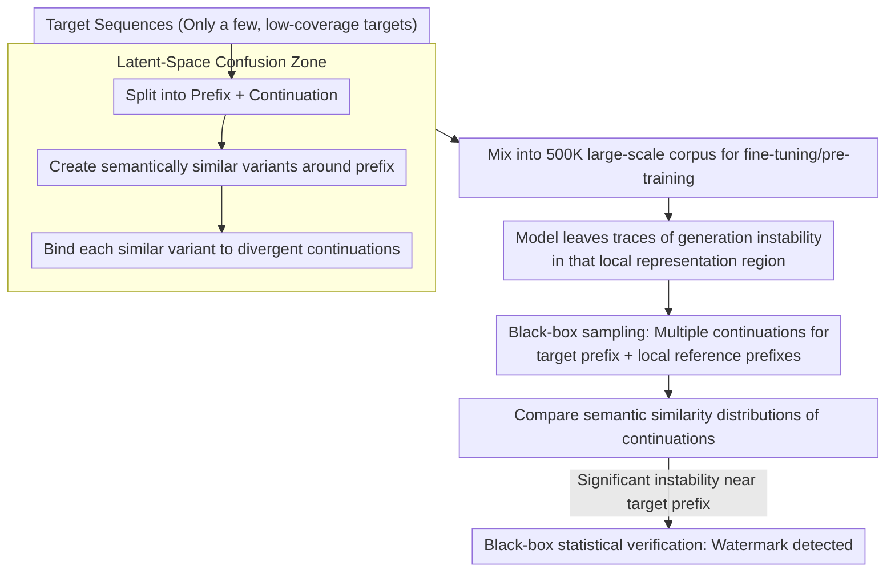

# SLIM: Stealthy Low-Coverage Black-Box Watermarking via Latent-Space Confusion Zones

**Conference**: ACL2026 Findings  
**arXiv**: [2601.03242](https://arxiv.org/abs/2601.03242)  
**Code**: https://github.com/Henry-WWHHYY/SLIM/  
**Area**: LLM Security / Data Watermarking / Training Data Attribution Verification  
**Keywords**: Data watermarking, black-box verification, low coverage, latent-space confusion, training data provenance

## TL;DR
SLIM proposes a low-coverage data watermarking approach for individual data owners: by making the model learn divergent continuations for similar prefixes in a local latent space, it eventually exhibits statistically detectable local instability during black-box generation.

## Background & Motivation
**Background**: Large model training data is becoming increasingly expensive and involves copyright, privacy, and data authorization issues. Data owners want to determine whether their text has been used for model training; however, modern LLMs often possess strong generalization and weak memory traces, making it difficult to reach reliable conclusions through membership inference alone.

**Limitations of Prior Work**: Existing data watermarking methods usually require control over a large proportion of the data or rely on obvious character patterns, fake facts, reference models, or white-box/semi-white-box signals like loss/perplexity. For ordinary individuals or small institutions, they typically contribute only a small fraction of the data—perhaps just a few documents or emails—and cannot coordinate watermark coverage on a large scale.

**Key Challenge**: Practical data watermarking must simultaneously satisfy three conditions: detectability even under low coverage, difficulty in being discovered or cleaned after mixing into large-scale corpora, and verifiability through black-box API access only. These three points conflict: the more obvious the watermark, the easier it is to detect but also the easier it is to filter; the more stealthy it is, the harder it is to retain verifiable signals after massive training.

**Goal**: The authors focus on low-coverage data watermarking, attempting to allow small-scale data contributors to verify whether a model has used their data without harming the model's general capabilities or introducing repetitive patterns easily identified by automated cleaning rules.

**Key Insight**: The paper leverages the latent representation properties of LLMs: semantically similar prefixes are usually mapped to adjacent latent regions, and autoregressive generation depends heavily on prefix representations. If training data binds multiple divergent continuations to the same local region, the model may generate abnormal instability in that region.

**Core Idea**: Shift the watermark from surface string patterns to local latent space behavior, allowing verifiers to determine the presence of a watermark signal by statistically comparing the generation stability of a target prefix against local reference prefixes.

## Method

### Overall Architecture
SLIM aims to solve the problem of "whether an individual with only a few pieces of data can verify if a model has stolen their text." It is divided into two phases: watermarking and verification. In the watermarking phase, a very small number of target sequences are selected and split into prefixes and continuations. Several variants with similar semantics but divergent continuations are then created around this prefix and quietly mixed into the training corpus. As the model is repeatedly pulled toward different reasonable continuations near these similar prefixes, it leaves behavioral traces in that local representation region. In the verification phase, only black-box generation access is used: multiple continuations are sampled for both the target prefix and its surrounding local reference prefixes to compare the semantic similarity distributions of the generated starters. If the generation near the target prefix is significantly more unstable, the watermark signal is judged to be present.

This note summarizes only the high-level mechanism, experiments, and limitations of the paper, without detailing the executable operational steps of the generated watermark samples or verification process.

### Key Designs

**1. Low-coverage watermarking target: Empowering individual rights protection**

In reality, training corpora come from a massive number of individuals, and single data owners cannot control a large proportion of the data. If a method only works under high coverage, its practical value for authorization verification is nearly zero. SLIM therefore shifts the watermark signal from "large-area repetitive injection" to "concentrated effects in the local representation regions of a few target sequences." It assumes that each watermark instance modifies only a single target sequence and simulates scenarios where this signal is heavily diluted within 500K arXiv abstract entries. In other words, it bets on abnormal behavior within a small patch of latent space rather than quantity.

**2. Latent-Space Confusion Zone: Hiding watermarks in local behavior rather than surface characters**

To be detectable under low coverage, the signal must be both stealthy and stable. SLIM exploits a representation characteristic of LLMs: semantically similar prefixes fall into adjacent areas of the latent space, and autoregressive generation is strongly dependent on prefix representations. By associating these similar prefixes with multiple highly divergent but reasonable continuations during training, the model's upper-level generation distribution in this local region forms a "confusion zone." During inference, multiple samplings of the same prefix will show abnormally low similarity or high volatility between the started continuations. Compared to random characters or fabricated facts, this local latent space behavior does not rely on any obvious surface patterns, making it easier to bypass conventional deduplication, compression anomaly detection, and embedding density cleaning.

**3. Black-box statistical verification: Attribution without touching weights, loss, or internal representations**

Commercial models usually only offer API access; assuming access to loss, perplexity, or internal logits is unrealistic. SLIM's verification is strictly black-box: it collects multiple generations for both target and local reference prefixes, compares the pairwise semantic similarity distributions of the generation starters, and uses statistical tests to derive a verification score. If a public or accessible base model is available, a reference model-based comparison can be used; otherwise, a reference model-free null hypothesis distribution is constructed using non-watermarked samples to see if the target prefix’s instability significantly exceeds the boundaries.

### Loss & Training
SLIM itself is not a new model training objective but a framework for data-side watermark construction and verification. Experiments were mainly evaluated during the fine-tuning phase of Gemma-3-4B and the pre-training phase of Pythia-1.4B. The training corpus consisted of the first 500,000 sequences (approx. 100M tokens) from `gfissore/arxiv-abstracts-2021`, trained for two epochs to reduce the impact of overfitting. Generation verification utilized random decoding to amplify local instability.

## Key Experimental Results

### Main Results
Traceability experiments show that in the reference model-based setting, the statistical offset of watermarked samples increases monotonically with the number of watermark variants, while non-watermarked samples show near-zero volatility. The authors report that at $K=16$, a fixed threshold of $\Delta t=-40$ can distinguish watermarked from non-watermarked samples. In the reference model-free setting, all three watermarked samples fell outside the null hypothesis distribution for non-watermarked samples at $K=64$.

Model utility experiments show that benchmark scores remain almost unchanged after adding a small amount of SLIM watermarks.

| Model | ARC (No/Ours) | MMLU (No/Ours) | BBQ (No/Ours) | Conclusion |
|------|---------------|----------------|---------------|------|
| Pythia-160M | 0.324 / 0.316 | 0.246 / 0.245 | 0.469 / 0.488 | Change < 0.02, no systematic degradation |
| Llama-3.2-1B | 0.679 / 0.689 | 0.262 / 0.274 | 0.466 / 0.451 | Fluctuations, overall impact is minimal |
| Gemma-3-4B | 0.819 / 0.822 | 0.554 / 0.555 | 0.557 / 0.565 | Utility maintained on large models |

Stealthiness experiments compared random characters, fabricated knowledge, and SLIM. SLIM passed all three types of automated detection, while the two control methods were identified by at least one rule.

| Method | N-Gram Filter | Zlib Compression Anomaly | Embedding Similarity | Explanation |
|------|-------------|----------------|------------------|------|
| Random Character Insertion | Pass | Fail | Pass | High-entropy strings cause compression anomalies |
| Fabricated Knowledge Injection | Fail | Pass | Fail | Repetitive semantics and lexical patterns are obvious |
| SLIM | Pass | Pass | Pass | Surface is natural; semantic density is not abnormal |

### Ablation Study
The paper further tests scalability and post-training robustness. When the corpus size increases from 200K to 500K, the watermark signal is diluted but remains within the detectable range. For models from 1B to 9B, signals in tiny models are unstable, while large models might require higher intensity to maintain the margin. No significant mutual interference was observed when multiple independent watermarks coexisted.

| Setting | Key Results | Meaning |
|------|----------|------|
| Data Scale 200K→500K | Average $\Delta t$ decays but remains below threshold | Signal dilutes as data grows; may need intensity boost |
| Model Scale Gemma 1B/4B/9B | Signal weak on 1B; detectable on 4B/9B with margin shifts | Latent confusion zones depend on capacity and structure |
| Injecting 3/5/7 watermarks | Individual and average $\Delta t$ remain detectable | Multiple low-coverage watermarks do not conflict much |
| Post-training Full FT / LoRA / RLHF | Three samples remain detectable after post-training | Signal has some persistence, but FT weakens magnitude |

In the post-training table, the $\Delta t$ for three watermarked samples without post-training were -141.300, -152.916, and -90.047, respectively. After RLHF, they were -134.951, -157.963, and -102.662, suggesting RLHF has little impact on the signal. Full FT and LoRA significantly weaken some samples (e.g., S2 becomes -64.704 after Full FT and -47.797 after LoRA) but remain within the authors' defined detectable region.

### Key Findings
- Low coverage is the most important realistic constraint: the method assumes individuals can only modify a tiny amount of data, rather than controlling the entire training set.
- The watermark signal is not a surface repetitive pattern but local generation instability, making it stealthier against common text cleaning metrics.
- The method remains verifiable under black-box access, which is closer to commercial API settings than relying on loss, perplexity, or internal logits.
- Both data scale and model scale change the detection margin, indicating that SLIM's intensity parameters need recalibration based on real-world deployment scales.

## Highlights & Insights
- The paper moves the key limitation of data watermarking from "can it be detected" to "can a contributor with minimal data detect it," providing a definition with significant practical relevance.
- The Latent-Space Confusion Zone is a clever perspective: it does not attempt to make the model remember an explicit token but rather makes the model leave behavioral traces in the local representation space.
- The experiments cover traceability, utility, stealthiness, scalability, and post-training persistence, providing a comprehensive evaluation.
- The insight for training data governance is that future data authorization systems may not rely solely on legal contracts or platform logs but can be complemented by statistical behavioral evidence, though false positives and interpretability must be strictly controlled.

## Limitations & Future Work
- The experimental scale is still smaller than real-world frontier model training; 500K sequences and 1B/4B/9B models only partially demonstrate trends.
- The method relies on two assumptions: "semantically similar prefixes are adjacent in latent space" and "divergent continuations form local instability," which require more validation across different architectures, tokenizers, and training recipes.
- Watermark samples might still appear abnormal under individual manual inspection; the paper's stealthiness is primarily established in large-scale mixing and automated cleaning scenarios.
- Verification requires multiple black-box samplings, which may be harder to implement for models that only provide low-temperature or restricted sampling APIs.
- Statistical thresholds and false positive control are central to actual deployment; especially in real authorization disputes, a single statistical signal should not be over-interpreted as decisive evidence.

## Related Work & Insights
- **vs WATERFALL / STAMP / TRACE**: These radioactive watermark methods usually rely more on higher coverage or reference model conditions; SLIM focuses on individual-level low coverage and strict black-box access.
- **vs Random Character / Unicode Watermarks**: Surface character watermarks are easily discovered by compression anomalies or text cleaning; SLIM attempts to hide the signal in generation behavior.
- **vs Fabricated Knowledge Watermarks**: Fabricated knowledge can be used for specific QA verification but tends to form semantic repetitions or context constraints; SLIM emphasizes local instability in open-ended text continuation.
- **Insight**: For LLM data governance, training data attribution verification may require a combination of "data-side marking + behavioral statistics + auditing processes," rather than relying on a single detection technology.

## Rating
- Novelty: ⭐⭐⭐⭐⭐ The problem definition of low-coverage black-box data watermarking is clear, and the Latent-Space Confusion Zone idea is distinctive.
- Experimental Thoroughness: ⭐⭐⭐⭐☆ Diverse evaluation dimensions, but still needs validation under real ultra-large models and more complex corpora.
- Writing Quality: ⭐⭐⭐⭐☆ Clear main storyline with sufficient explanations of terminology and experimental settings; some future model settings are slightly idealized.
- Value: ⭐⭐⭐⭐☆ Highly insightful for training data provenance and data ownership protection, though practical deployment requires stronger statistical rigor and legal auditing support.

<!-- RELATED:START -->

## Related Papers

- [\[ACL 2026\] Compiling Activation Steering into Weights via Null-Space Constraints for Stealthy Backdoors](compiling_activation_steering_into_weights_via_null-space_constraints_for_stealt.md)
- [\[ACL 2026\] Rethinking LLM Watermark Detection in Black-Box Settings: A Non-Intrusive Third-Party Framework](rethinking_llm_watermark_detection_in_black-box_settings_a_non-intrusive_third-p.md)
- [\[AAAI 2026\] PSM: Prompt Sensitivity Minimization via LLM-Guided Black-Box Optimization](../../AAAI2026/llm_safety/psm_prompt_sensitivity_minimization_via_llm-guided_black-box_optimization.md)
- [\[AAAI 2026\] GraphTextack: A Realistic Black-Box Node Injection Attack on LLM-Enhanced GNNs](../../AAAI2026/llm_safety/graphtextack_a_realistic_black-box_node_injection_attack_on_llm-enhanced_gnns.md)
- [\[CVPR 2026\] Omni-Attack: Adversarial Attacks on Open-Ended VQA in Black-Box Multimodal LLMs](../../CVPR2026/llm_safety/omni-attack_adversarial_attacks_on_open-ended_vqa_in_black-box_multimodal_llms.md)

<!-- RELATED:END -->
