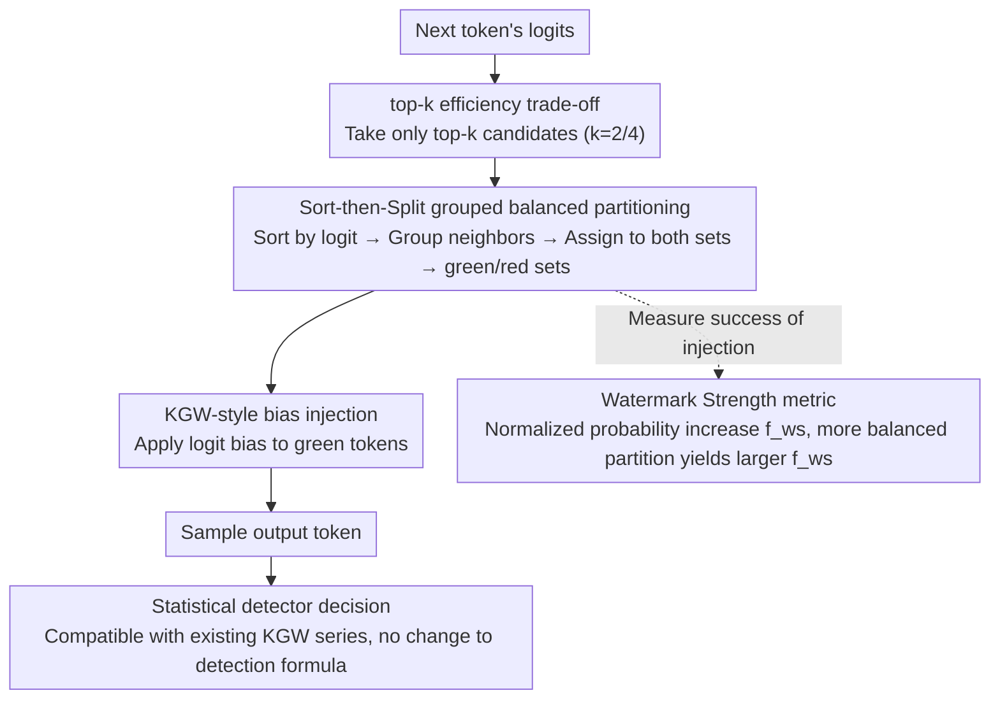

# SSG: Logit-Balanced Vocabulary Partitioning for LLM Watermarking

**Conference**: ACL 2026  
**arXiv**: [2604.22438](https://arxiv.org/abs/2604.22438)  
**Code**: https://github.com/AllenG-L/SSG  
**Area**: LLM Security / Text Watermarking / Content Provenance  
**Keywords**: LLM Watermarking, Low-Entropy Generation, logit-balanced partition, watermark strength, content attribution

## TL;DR
This paper analyzes why KGW-style LLM watermarking fails in low-entropy scenarios such as code generation and mathematical reasoning. It proposes a Watermark Strength metric and SSG (logit-balanced vocabulary partitioning) to distribute high-probability tokens more evenly across categories, significantly enhancing detectability without further compromising generation quality.

## Background & Motivation
**Background**: LLM watermarking is commonly used for content provenance, output attribution, and generative content governance. KGW is a representative logit-based scheme: it partitions the vocabulary into green/red sets and applies a logit bias to green tokens, embedding detectable statistical signals in the generated text.

**Limitations of Prior Work**: KGW performs well in general natural language generation but shows significantly degraded detection capabilities in low-entropy tasks like code generation, mathematical reasoning, or JSON/SQL generation. Next-token distributions in these tasks are typically extremely sharp, where output is dictated by a few high-probability tokens. If these tokens fall into the same set, logit bias fails to effectively shift the sampling distribution.

**Key Challenge**: Watermarking aims to inject statistical signals without damaging output quality, yet low-entropy distributions offer minimal overhead for adjustment. Simple increases in logit bias can strengthen the signal but at the cost of code correctness or mathematical accuracy.

**Goal**: The authors aim to improve the watermark injection stage rather than merely patching low-entropy issues during detection. The objective is to raise the lower bound of injectable statistical signals at each token position while maintaining compatibility with KGW-style detectors.

**Key Insight**: The paper introduces Watermark Strength to measure the normalized increase in the total probability of the green set caused by watermark bias. It demonstrates that random vocabulary partitioning leads to values near zero in low-entropy scenarios.

**Core Idea**: Instead of randomly partitioning high-probability tokens, they are sorted by logit and then grouped into adjacent pairs before being balanced across sets. This ensures the green/red sets are more balanced within high-probability regions.

## Method
The research focuses on content provenance and watermark reliability analysis. The following summarizes the high-level methodology, experimental conclusions, and limitations, omitting reproduction details for detection evasion.

### Overall Architecture
SSG is a vocabulary partitioning module that can be integrated into KGW-series watermarking frameworks. Before generating each token, the model outputs the next-token logits; SSG performs a more balanced green/red partitioning on the high-logit candidates, applies KGW-style bias to green tokens, and relies on compatible statistical detectors to determine if the text is watermarked. The key change lies not in the detection formula, but in "which tokens are assigned to the green set," which is critical for success in low-entropy scenarios.

### Key Designs

**1. Watermark Strength metric: Formalizing "Low-Entropy Watermarking Difficulty" as a token-level indicator**

The weakening of KGW in tasks like code and math was previously an empirical observation. SSG provides a quantitative definition: letting $p_g$ be the original green set probability and $\tilde{p}_g$ be the probability after bias, the normalized probability increase $f_{ws}$ measures the ability of bias to shift the sampling distribution. When $p_g$ approaches 0 or 1, the distribution has virtually no room for adjustment, and $f_{ws}$ approaches 0—exactly the case where high-probability tokens are all partitioned into one set. This shifts watermark failure from an abstract concept to a lower bound of injectable signal at each token position.

**2. Sort-then-Split by Groups strategy: Balancing high-probability tokens from the source**

Since the problem stems from high-probability tokens clustering in the same set, random partitioning is discarded. SSG sorts candidate tokens by logits and groups adjacent tokens to distribute them into different sets. This ensures that regions most influential to the sampling distribution are not severely unbalanced. Remaining low-probability tokens are partitioned randomly. This directly raises the lower bound of $p_g$ without requiring excessively large logit biases that could damage accuracy.

**3. top-k efficiency trade-off: Targeting only the decisive tokens**

Sorting the entire vocabulary at each step significantly slows down decoding, while only the top few tokens typically determine the output in low-entropy scenarios. SSG finds that performing sorted partitioning only on top-k high-probability tokens captures most detection gains, while other tokens can be partitioned randomly. Experiments with $k \in \{2, 4, 8, 16\}$ suggest that $k=2$ or $k=4$ provides the best trade-off between detection gain and speed. Moreover, this remains compatible with existing KGW-series detection methods.

### Loss & Training
SSG is a non-training method that does not modify model parameters or require fine-tuning; it operates solely during the vocabulary partitioning and logit bias injection stage of decoding. The authors integrate SSG with KGW, SWEET, and EWD to compare detection rates, F1 scores, and generation quality.

## Key Experimental Results

### Main Results

| Task / Model / Method | Quality P@1 | TPR@1 | F1@1 | TPR@5 | F1@5 | Observation |
|--------|------|------|------|------|------|------|
| HumanEval / Qwen2.5-Coder / KGW | 26.2 | 22.0 | 35.8 | 36.0 | 51.3 | KGW detection is weak in low-entropy code |
| HumanEval / Qwen2.5-Coder / KGW+SSG | 25.6 | 39.0 | 55.9 | 45.7 | 60.7 | Detection improved, P@1 remains similar |
| MBPP / Qwen2.5-Coder / KGW | 38.4 | 37.8 | 54.6 | 64.0 | 75.9 | Original method already has some signal |
| MBPP / Qwen2.5-Coder / KGW+SSG | 37.0 | 58.7 | 73.6 | 71.7 | 81.3 | Significant improvement in TPR@1 and F1@1 |
| GSM8K / DSMath-7B / KGW | 21.7 | 41.7 | 58.5 | 57.6 | 71.0 | Deficiencies remain in math low-entropy scenarios |
| GSM8K / DSMath-7B / KGW+SSG | 25.8 | 90.9 | 94.9 | 91.7 | 93.4 | Greatly enhanced detection with higher accuracy |
| GSM8K / LLaMA-3-8B / EWD | 35.6 | 74.2 | 84.8 | 95.5 | 95.5 | Strong detection baseline |
| GSM8K / LLaMA-3-8B / EWD+SSG | 35.6 | 99.2 | 99.2 | 99.2 | 97.4 | Near-perfect detection, no quality degradation |

### Ablation Study

| Analysis Item | Result | Description |
|------|------|------|
| Watermark Strength Distribution | KGW produces more near-zero strength tokens; SSG significantly reduces these. | SSG gains stem from more stable token-level injection strength. |
| top-k Selection | top-2 significantly improves detection; k>2 brings marginal gains. | k=2 or k=4 is the recommended trade-off; larger k slows decoding. |
| prompt-free Detection | SSG improves in some settings and loses in others. | The method depends on conditional logits under the original prompt; real-world usability is affected. |
| Rewrite Robustness | TPR decreases significantly for all methods; SSG is more stable on LLaMA-3 but weaker on DSMath. | Text rewriting weakens statistical signals; robustness remains an open problem. |
| High-Entropy Tasks | TPR and F1 also improve for KGW/SWEET/EWD on C4 and CNN/DailyMail. | Designed for low-entropy but not limited to it. |

### Key Findings
- SSG's improvement comes primarily from the injection side: by spreading high-probability tokens across sets, the same bias produces a more stable statistical shift.
- A fundamental trade-off persists between generation quality and detection strength. While watermarking generally lowers Pass@1, SSG does not cause further significant degradation compared to its respective baselines.
- Prompt-free detection and rewrite robustness are weaknesses: without the original prompt or when text is rewritten, SSG's advantages become unstable.

## Highlights & Insights
- Watermark Strength is a valuable analytical tool that concretizes "low-entropy difficulty" as a lower bound problem of injectable probability mass at each token position.
- SSG modifies vocabulary partitioning rather than the detector, proving that low-entropy watermarking can be addressed without relying solely on complex detection statistics.
- The top-k version is practical: processing only the most important high-logit tokens yields the majority of detection benefits, aligning with the probability structure of low-entropy tasks.

## Limitations & Future Work
- Evaluation was limited to HumanEval, MBPP, GSM8K, C4, and CNN/DailyMail. Further forms of low-entropy structural generation (e.g., SQL, JSON, configuration files, long-form code projects) require verification.
- Optimal detection for SSG relies on the original prompt because the partitioning is correlated with conditional logits; the unavailability of prompts in real scenarios may limit deployment.
- Robustness against text rewriting is still limited, as experiments show significant TPR drops for all methods after rewriting.
- Per-step sorting or top-k processing introduces decoding overhead; while top-k mitigates this, engineering optimization is needed for high-throughput API scenarios.

## Related Work & Insights
- **vs KGW**: KGW uses random partitioning, which allows high-probability tokens to cluster in one set; SSG uses logit-balanced partitioning to raise the lower bound of injection strength.
- **vs SWEET / EWD**: SWEET and EWD primarily improve low-entropy detection or weighting strategies; SSG serves as an injection-side module that can be stacked with these methods.
- **vs WaterMod / concurrent logit-balanced methods**: Related works also note the importance of token rank/probability balance; this work distinguishes itself through the Watermark Strength analysis and systematic experimentation.
- **Insight**: Decoded probability geometry is crucial for LLM security watermarking. Rather than focusing solely on detection statistics, one should optimize whether the "watermark signal is truly injected into the sampling distribution."

## Rating
- Novelty: ⭐⭐⭐⭐☆ logit-balanced partition is simple and effective; Watermark Strength clarifies the problem definition.
- Experimental Thoroughness: ⭐⭐⭐⭐☆ Covers code, math, high-entropy text, top-k, prompt-free, and rewrite robustness; more real-world deployment scenarios could be added.
- Writing Quality: ⭐⭐⭐⭐☆ Clear motivation, theory, and experimental narrative, though some tables are dense due to method combinations.
- Value: ⭐⭐⭐⭐☆ Highly relevant for watermark provenance in low-entropy tasks, though prompt dependency and rewrite robustness limit immediate deployment.

<!-- RELATED:START -->

## Related Papers

- [\[AAAI 2026\] WaterMod: Modular Token-Rank Partitioning for Probability-Balanced LLM Watermarking](../../AAAI2026/llm_safety/watermod_modular_token-rank_partitioning_for_probability-balanced_llm_watermarki.md)
- [\[ACL 2026\] STELA: A Linguistics-Aware LLM Watermarking via Syntactic Predictability](a_linguistics-aware_llm_watermarking_via_syntactic_predictability.md)
- [\[ACL 2026\] XMark: Reliable Multi-Bit Watermarking for LLM-Generated Texts](xmark_reliable_multi-bit_watermarking_for_llm-generated_texts.md)
- [\[ACL 2026\] AgentMark: Utility-Preserving Behavioral Watermarking for Agents](agentmark_utility-preserving_behavioral_watermarking_for_agents.md)
- [\[ICLR 2026\] Dual-Space Smoothness for Robust and Balanced LLM Unlearning](../../ICLR2026/llm_safety/dual-space_smoothness_for_robust_and_balanced_llm_unlearning.md)

<!-- RELATED:END -->
