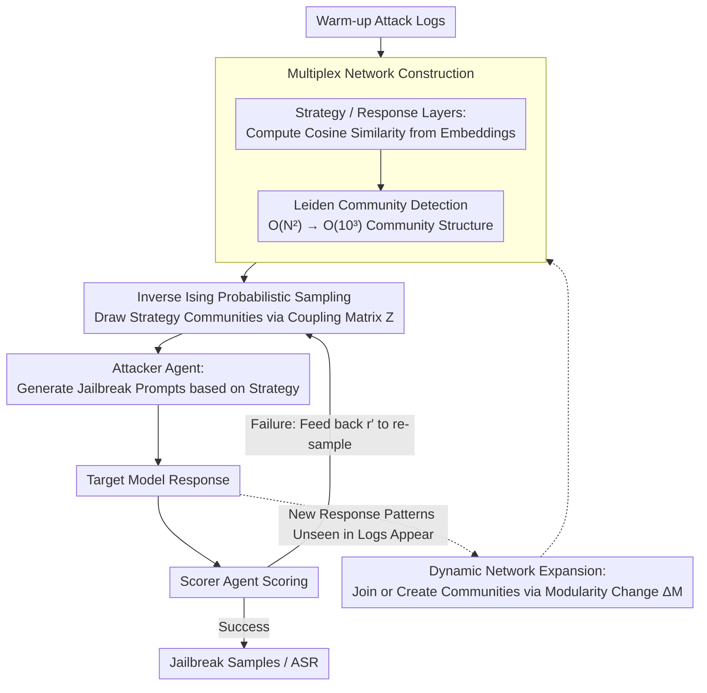

# STAR-Teaming: A Strategy-Response Multiplex Network Approach to Automated LLM Red Teaming

**Conference**: ACL 2026 Findings  
**arXiv**: [2604.18976](https://arxiv.org/abs/2604.18976)  
**Code**: [https://github.com/selectstar-ai/STAR-Teaming-paper](https://github.com/selectstar-ai/STAR-Teaming-paper)  
**Area**: LLM Alignment  
**Keywords**: Red Teaming, LLM Safety, Multiplex Network, Strategy Sampling, Jailbreak Attack

## TL;DR
This paper proposes STAR-Teaming, an automated red teaming framework based on a strategy-response multiplex network. By modeling attack strategy selection as a probabilistic optimization of the inverse Ising problem, it achieves an average Attack Success Rate (ASR) of 74.5% on HarmBench, outperforming the strongest baseline by 13.5% while significantly reducing computational overhead.

## Background & Motivation

**Background**: As LLMs are deployed in safety-sensitive domains, evaluating their robustness against jailbreak attacks has become critical. Automated red teaming has evolved from manual methods into two main categories: optimization-based (e.g., GCG, PAIR, TAP) and strategy-based (e.g., PAP, Rainbow Teaming, AutoDAN-Turbo).

**Limitations of Prior Work**: Existing methods face two key limitations. First, most methods require substantial computational resources (repeated queries or reinforcement learning optimization), limiting scalability. Second, although strategy-based methods introduce human-developed jailbreak patterns, they lack transparent explanations of "why certain strategies work"—they typically sample based on embedding similarity without analyzing causal patterns of success, making it difficult to understand model vulnerabilities.

**Key Challenge**: Strategy retrieval based on embedding similarity tends to over-sample certain strategies (with a single strategy accounting for up to 15%), resulting in low attack diversity and poor efficiency. Semantic similarity does not necessarily imply similar attack effectiveness; sampling needs to be guided by the statistical correlation between "strategies" and "responses."

**Goal**: To build an automated red teaming framework that balances high attack success rates, low computational costs, and high interpretability.

**Key Insight**: By modeling attack strategies and target model responses as a two-layer network, the high-dimensional search space can be reduced to a manageable community-level structure via community detection. An inverse Ising model is then used to learn the coupling relationships between communities to achieve probabilistic strategy sampling.

**Core Idea**: Reconstruct the intractable high-dimensional embedding search space into a tractable network community structure, and model the strategy-response association through the Boltzmann distribution in statistical physics to guide efficient sampling of attack strategies.

## Method

### Overall Architecture
STAR-Teaming aims to address the trilemma of "high ASR, low compute, and explainability." It consists of two components: a Multi-Agent System (MAS) comprising Attacker, Target Model, and Scorer LLM agents in an iterative loop; and a Strategy-Response Multiplex Network responsible for probabilistic strategy sampling based on historical logs. One attack iteration proceeds as follows: sample a strategy from the network → Attacker generates a jailbreak prompt → Target Model responds → Scorer assigns a grade → if failed, re-sample a new strategy from the network. The network acts as the brain, while the MAS serves as the limbs.

### Key Designs

**1. Multiplex Network Construction: Compressing High-Dimensional Search Space into Community Structures**

Searching for strategies directly in the original embedding space entails $O(N^2)$ parameters, making learning impractical. STAR-Teaming constructs a layer for strategies and a layer for responses. For each layer, text embeddings are extracted to compute a pairwise cosine similarity matrix $\mathbb{S}$. An adjacency matrix is generated based on a threshold $\alpha$, followed by community detection using the Leiden algorithm. Strategy community member vectors use a special encoding—the assigned community is marked as 1, while other positions are marked as $-\frac{1}{N_I-1}$. This negative term serves as regularization to prevent parameter divergence and ensures the probability distribution can be adjusted reasonably. This step reduces the parameter space from $O(N^2)$ to $O(N_I \times N_J) \approx O(10^3)$, greatly enhancing learning efficiency.

**2. Probabilistic Optimization and Sampling via Inverse Ising Model: Learning "Which Strategy Counters Which Response"**

With the community structure, the next step is to learn the coupling strengths between communities. The paper defines an energy function $E(r_p, s_q) = -\sum_{ij} Z_{ij} \mathbf{O}_{pq}^{ij}$, where $Z_{ij}$ represents the coupling parameter between strategy community $i$ and response community $j$. $Z$ is optimized by maximizing the log-likelihood of the Boltzmann distribution; this problem is convex with a unique solution. During sampling, given a new response $r'$, the probability of selecting strategy community $k$ is $P(\mathbf{H}(s_k) \mid \mathbf{G}(r'), Z) \propto \exp(\beta \sum_j Z_{kj} \mathbf{G}(r')_j)$. Gradient updates are scaled by a scoring function $f_{sc}(r^t)$ (positive for success, negative for failure), allowing the system to learn from failures. This probabilistic optimization replaces pure embedding similarity sampling, which often redundantly samples a single strategy up to 15% of the time, leading to poor diversity.

**3. Dynamic Network Expansion: Allowing the Network to Evolve During Confrontation**

Networks built from warm-up logs are static and cannot handle new defensive behaviors that emerge after deployment. STAR-Teaming allows the network to dynamically incorporate new patterns: when a new node appears, the modularity change $\Delta M$ determines whether it should join an existing community or form a new one. If $\Delta M < 0$, a new community is created; otherwise, it joins the most compatible existing community, with hyperparameter $\lambda$ controlling merging preferences. This step prevents the structure from being locked by the initial logs. Ablations show that dynamic expansion improves ASR from 71.0% to 77.3% and reduces the average number of attack turns.

### A Complete Example: Walkthrough of an Attack Iteration
Consider attacking a strongly aligned model. The system first samples an attack strategy from the strategy-response network. Because the coupling learned by the inverse Ising model concentrates probability—where the top-3 strategies carry about 80% of the mass—it is likely to pick a strategy from the community historically most effective against "refusal-type responses," rather than repeatedly picking the same 15%-weighted strategy as in embedding retrieval. The Attacker Agent uses this strategy to generate a jailbreak prompt, the target model responds, and the Scorer Agent grades the response. If it is a refusal (negative score), the system feeds this failed response $r'$ back into the network. It recomputes sampling probabilities via $P(\mathbf{H}(s_k) \mid \mathbf{G}(r'), Z) \propto \exp(\beta \sum_j Z_{kj} \mathbf{G}(r')_j)$ to avoid the failed direction and tries a new strategy. If a new response pattern arises, the dynamic expansion mechanism uses $\Delta M$ to decide its placement. Optimizing matrix $Z$ takes less than a second, making the cost of retries very low.

### Loss & Training
The mapping matrix $Z$ is optimized via gradient ascent to maximize log-likelihood. The gradient is the difference between empirical co-occurrence and model-expected co-occurrence, scaled by the scoring function $f_{sc}$. The entire optimization takes less than one second. The inverse temperature parameter $\beta$ is adaptively adjusted so that the top-3 strategies carry approximately 80% of the probability mass.

## Key Experimental Results

### Main Results

| Target Model | GCG | PAIR | TAP | AutoDAN-Turbo | STAR-Teaming |
|---------|-----|------|-----|---------------|-------------|
| Llama-2 7B | 32.5 | 9.3 | 9.3 | 36.6 | **71.0** |
| Llama-2 13B | 30.0 | 15.0 | 14.2 | 34.6 | **71.5** |
| Qwen3-4B | 32.0 | - | - | - | **72.5** |
| GPT-4o | - | 53.0 | 66.0 | 76.0 | **76.1** |
| Claude 3.5 Sonnet | - | 4.0 | 5.0 | 2.0 | **12.0** |
| Average | 44.3 | 37.3 | 44.8 | 61.0 | **74.5** |

### Ablation Study

| Configuration | ASR | Self-BLEU | Gini | Pearson |
|------|-----|-----------|------|---------|
| w/ Multiplex Network | 71.0% | 0.25 | 0.19 | 0.81 |
| w/o Multiplex Network | 65.0% | 0.46 | 0.36 | -0.08 |
| w/ Dynamic Expansion | 77.3% | - | - | - |

### Key Findings
- STAR-Teaming is the only method to exceed 10% ASR on Claude 3.5 Sonnet (reaching 12.0%), demonstrating effectiveness against strongly aligned closed-source models.
- The multiplex network makes strategy sampling more uniform (Gini index dropped from 0.36 to 0.19) and more biased toward efficient strategies (Pearson correlation increased from -0.08 to 0.81).
- On the StrongReject dataset, STAR-Teaming achieved an average score of 0.52, 0.41 points higher than the runner-up TAP.
- Switching the Attacker LLM (Gemma-7b vs. Llama3-8b) has almost no impact on final ASR, suggesting the framework's effectiveness is independent of the specific attack model.

## Highlights & Insights
- Introducing the inverse Ising model from statistical physics into red teaming strategy selection is a highly novel interdisciplinary application. The parameter space of $O(10^3)$ allows for sub-second optimization, balancing theoretical elegance with practical efficiency.
- The interpretability of the multiplex network is a major highlight: each element of the mapping matrix $Z$ directly quantifies the association strength between specific attack strategy types and response patterns, allowing researchers to intuitively see which strategies work against which defenses.
- The dynamic network expansion design reflects the insight that "attack and defense are dynamically evolving." Static networks cannot capture new defensive behaviors emerging post-deployment; dynamic expansion improves both ASR (+6.3pp) and efficiency (fewer attack turns).

## Limitations & Future Work
- The framework's effectiveness depends on the inherent capabilities of the LLM Agents (Attacker, Scorer, Strategy Extractor), requiring careful prompt engineering.
- Community centers are not retroactively re-optimized during long-term deployment, which could lead to concept drift.
- Currently focused only on the text modality; plans exist to extend to vision and multimodal red teaming.
- Relying on a single Scorer Agent is a potential vulnerability; integrating multiple heterogeneous LLM scorers could further improve judgment accuracy.

## Related Work & Insights
- **vs AutoDAN-Turbo (Liu et al., 2024)**: Both are strategy-based multi-agent frameworks, but AutoDAN-Turbo's use of embedding similarity for retrieval leads to over-sampling; STAR-Teaming uses network community structures and probabilistic optimization for more uniform and effective sampling, yielding a 13.5% higher average ASR.
- **vs TAP (Mehrotra et al., 2024)**: TAP uses branching and pruning to accelerate the iterative search of PAIR but shows limited effectiveness on strongly aligned models (only 5% on Claude); STAR-Teaming performs better across all models through structured exploration of the strategy space.

## Rating
- Novelty: ⭐⭐⭐⭐⭐ The introduction of multiplex networks and inverse Ising models to red teaming strategy selection is an original interdisciplinary innovation.
- Experimental Thoroughness: ⭐⭐⭐⭐ Covers multiple open and closed-source target models across two benchmarks with thorough network ablation.
- Writing Quality: ⭐⭐⭐⭐ Methodological derivations are clear, though many symbols require careful reading.
- Value: ⭐⭐⭐⭐⭐ Highly practical for automated vulnerability discovery in AI safety.

<!-- RELATED:START -->

## Related Papers

- [\[ACL 2026\] Red-Bandit: Test-Time Adaptation for LLM Red-Teaming via Bandit-Guided LoRA Experts](red-bandit_test-time_adaptation_for_llm_red-teaming_via_bandit-guided_lora_exper.md)
- [\[ICLR 2026\] Tree-based Dialogue Reinforced Policy Optimization for Red-Teaming Attacks (DialTree)](../../ICLR2026/llm_safety/tree-based_dialogue_reinforced_policy_optimization_for_red-teaming_attacks.md)
- [\[ICML 2026\] Stable-GFlowNet: Toward Diverse and Robust LLM Red-Teaming via Contrastive Trajectory Balance](../../ICML2026/llm_safety/stable-gflownet_toward_diverse_and_robust_llm_red-teaming_via_contrastive_trajec.md)
- [\[ACL 2026\] ASTRA: An Automated Framework for Strategy Discovery, Retrieval, and Evolution for Jailbreaking LLMs](astra_an_automated_framework_for_strategy_discovery_retrieval_and_evolution_for_.md)
- [\[ICML 2026\] FoeGlass: Simple In-Context Learning Is Enough for Red Teaming Audio Deepfake Detectors](../../ICML2026/llm_safety/foeglass_simple_in-context_learning_is_enough_for_red_teaming_audio_deepfake_det.md)

<!-- RELATED:END -->
