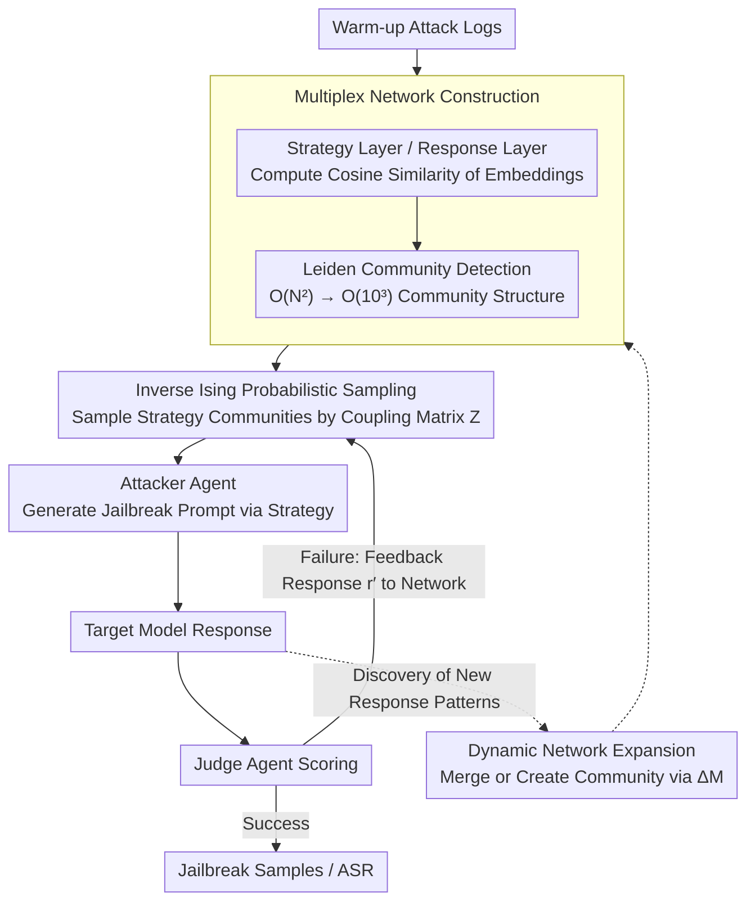

# STAR-Teaming: A Strategy-Response Multiplex Network Approach to Automated LLM Red Teaming

**Conference**: ACL 2026 Findings  
**arXiv**: [2604.18976](https://arxiv.org/abs/2604.18976)  
**Code**: [https://github.com/selectstar-ai/STAR-Teaming-paper](https://github.com/selectstar-ai/STAR-Teaming-paper)  
**Area**: LLM Alignment  
**Keywords**: Red Teaming, LLM Safety, Multiplex Network, Strategy Sampling, Jailbreak Attacks

## TL;DR
This paper proposes STAR-Teaming, an automated red teaming framework based on a strategy-response multiplex network. By modeling attack strategy selection as a probabilistic optimization of an inverse Ising problem, it achieves a 74.5% average attack success rate on HarmBench, surpassing the strongest baseline by 13.5% while significantly reducing computational overhead.

## Background & Motivation

**Background**: As LLMs are deployed in safety-sensitive domains, evaluating their robustness against jailbreak attacks has become critical. Automated red teaming has evolved from manual methods to two main categories: optimization-based (e.g., GCG, PAIR, TAP) and strategy-based (e.g., PAP, Rainbow Teaming, AutoDAN-Turbo).

**Limitations of Prior Work**: Existing methods face two key limitations. First, most require substantial computational resources (repeated queries or RL optimization), limiting scalability. Second, while strategy-based methods introduce human-developed jailbreak patterns, they lack transparent explanations for "why certain strategies work"—they typically sample based on embedding similarity without analyzing causal patterns of success, making model vulnerabilities difficult to understand.

**Key Challenge**: Strategy retrieval based on embedding similarity tends to over-sample certain strategies (up to 15% for a single strategy), resulting in low attack diversity and poor efficiency. Semantic similarity does not imply similar attack effectiveness; sampling needs guidance from the statistical correlation between "strategies" and "responses."

**Goal**: To build an automated red teaming framework that balances high attack success rate, low computational cost, and high interpretability.

**Key Insight**: Modeling attack strategies and target model responses as two layers of a network allows high-dimensional search spaces to be reduced into manageable community-level structures. An inverse Ising model can then learn the coupling relationships between communities to achieve probabilistic strategy sampling.

**Core Idea**: The intractable high-dimensional embedding search space is reconstructed into a tractable network community structure. The strategy-response association is modeled using the Boltzmann distribution from statistical physics to guide efficient strategy sampling.

## Method

### Overall Architecture
STAR-Teaming addresses the trilemma of "high attack success rate, low computation, and interpretability." It consists of two components: a multi-agent system (MAS) composed of an attacker, a target model, and a judge LLM agent forming an iterative loop; and a strategy-response multiplex network responsible for probabilistic strategy sampling based on historical attack logs. An attack round proceeds as follows: sample a strategy from the network → the attacker generates a jailbreak prompt → the target model responds → the judge scores the response → if failed, resample a new strategy from the network. The network acts as the "brain," while the MAS serves as the "execution."

### Key Designs

**1. Multiplex Network Construction: Compressing High-Dimensional Embedding Search into Tractable Community Structures**

Searching for strategies directly in the original embedding space entails $O(N^2)$ parameters, making learning difficult. STAR-Teaming constructs a layer for both strategies and responses: each layer extracts text embeddings, computes a pairwise cosine similarity matrix $\mathbb{S}$, generates an adjacency matrix based on a threshold $\alpha$, and applies the Leiden algorithm for community detection. Members of a strategy community are encoded as 1 for their community and $-\frac{1}{N_I-1}$ elsewhere. This negative term serves a dual purpose: as a regularizer to prevent parameter divergence and to ensure the probability distribution is adjusted appropriately. This compression reduces the parameter space from $O(N^2)$ to $O(N_I \times N_J) \approx O(10^3)$, greatly enhancing learning efficiency.

**2. Probabilistic Optimization and Sampling with Inverse Ising Model: Learning "Which Strategy Counters Which Response"**

Given the community structure, the coupling strength between communities must be learned to guide sampling. The energy function is defined as $E(r_p, s_q) = -\sum_{ij} Z_{ij} \mathbf{O}_{pq}^{ij}$, where $Z_{ij}$ is the coupling parameter between strategy community $i$ and response community $j$. $Z$ is optimized by maximizing the log-likelihood of the Boltzmann distribution; this problem is convex with a unique solution. During sampling, given a new response $r'$, the probability of selecting strategy community $k$ is $P(\mathbf{H}(s_k) \mid \mathbf{G}(r'), Z) \propto \exp(\beta \sum_j Z_{kj} \mathbf{G}(r')_j)$. The gradient update incorporates the scoring function $f_{sc}(r^t)$ (positive for success, negative for failure), allowing the system to learn from failures. This probabilistic optimization replaces pure embedding similarity sampling, which often results in a single strategy account for up to 15% of samples, leading to poor diversity.

**3. Dynamic Network Expansion: Allowing the Network to Evolve During Adversarial Confrontation**

The network constructed from warm-up logs is static and may not withstand new defensive behaviors emerging after deployment. STAR-Teaming allows the network to dynamically absorb new patterns: when a new node appears, the change in modularity $\Delta M$ determines whether it should join an existing community or form a new one—if $\Delta M < 0$, a new community is created; otherwise, it is merged into the most compatible community, with hyperparameter $\lambda$ controlling merging preference. This step prevents the structure from being constrained by the initial logs. Ablations show that dynamic expansion increases ASR from 71.0% to 77.3% while reducing average attack rounds.

### Key Experimental Results

#### Main Results

| Target Model | GCG | PAIR | TAP | AutoDAN-Turbo | STAR-Teaming |
|:---|:---:|:---:|:---:|:---:|:---:|
| Llama-2 7B | 32.5 | 9.3 | 9.3 | 36.6 | **71.0** |
| Llama-2 13B | 30.0 | 15.0 | 14.2 | 34.6 | **71.5** |
| Qwen3-4B | 32.0 | - | - | - | **72.5** |
| GPT-4o | - | 53.0 | 66.0 | 76.0 | **76.1** |
| Claude 3.5 Sonnet | - | 4.0 | 5.0 | 2.0 | **12.0** |
| Average | 44.3 | 37.3 | 44.8 | 61.0 | **74.5** |

#### Ablation Study

| Configuration | ASR | Self-BLEU | Gini | Pearson |
|:---|:---:|:---:|:---:|:---:|
| w/ Multiplex Network | 71.0% | 0.25 | 0.19 | 0.81 |
| w/o Multiplex Network | 65.0% | 0.46 | 0.36 | -0.08 |
| w/ Dynamic Expansion | 77.3% | - | - | - |

#### Key Findings
- STAR-Teaming is the only method to exceed 10% ASR on Claude 3.5 Sonnet (12.0%), demonstrating effectiveness against strongly aligned closed-source models.
- The multiplex network makes strategy sampling more uniform (Gini decreased from 0.36 to 0.19) and more biased toward efficient strategies (Pearson increased from -0.08 to 0.81).
- On the StrongReject dataset, STAR-Teaming achieved an average score of 0.52, 0.41 points higher than the runner-up TAP.
- Switching the attacker LLM (Gemma-7b vs Llama3-8b) had almost no impact on the final ASR, indicating the framework does not rely on specific attack models.

## Highlights & Insights
- Introducing the inverse Ising model from statistical physics into red teaming strategy selection is a highly novel interdisciplinary application. With a parameter space of only approximately $O(10^3)$ and optimization taking less than a second, it balances theoretical elegance with practical efficiency.
- The interpretability of the multiplex network is a major highlight: each element of the mapping matrix $Z$ directly quantifies the association strength between specific attack strategy types and response patterns, allowing researchers to understand which strategies are effective against which defenses.
- The design of the dynamic network expansion mechanism reflects the insight that "adversarial confrontation is dynamically evolving." Static networks cannot capture new defensive behaviors, whereas dynamic expansion improves both ASR (+6.3pp) and efficiency (reduced attack rounds).

## Limitations & Future Work
- The framework's effectiveness depends on the inherent capabilities of the various LLM agents (attacker, judge, strategy extractor), requiring careful prompt engineering.
- Community centers are not retroactively re-optimized during long-term deployment, which may lead to concept drift.
- The current focus is restricted to text modalities; future plans include extending to vision and multi-modal red teaming.
- Relying on a single judge agent is a potential vulnerability; integrating multiple heterogeneous LLM judges could further improve judgment accuracy.

## Related Work & Insights
- **vs AutoDAN-Turbo (Liu et al., 2024)**: Both are strategy-based multi-agent frameworks, but AutoDAN-Turbo uses embedding similarity for retrieval, leading to over-sampling. STAR-Teaming utilizes network community structures and probabilistic optimization for more uniform and effective sampling, yielding a 13.5% higher average ASR.
- **vs TAP (Mehrotra et al., 2024)**: TAP uses branching and pruning to accelerate PAIR's iterative search but has limited effectiveness on strongly aligned models (only 5% on Claude). STAR-Teaming performs better across all models through structured exploration of the strategy space.

## Rating
- Novelty: ⭐⭐⭐⭐⭐ Bringing multiplex networks and the inverse Ising model to red teaming strategy selection is an original interdisciplinary innovation.
- Experimental Thoroughness: ⭐⭐⭐⭐ Covers various open-source and closed-source target models across two benchmarks with comprehensive network ablation experiments.
- Writing Quality: ⭐⭐⭐⭐ Mathematical derivations in the method section are clear, though many symbols require careful reading.
- Value: ⭐⭐⭐⭐⭐ Highly practical for automated vulnerability discovery in AI safety.

<!-- RELATED:START -->

## Related Papers

- [\[ACL 2026\] Red-Bandit: Test-Time Adaptation for LLM Red-Teaming via Bandit-Guided LoRA Experts](red-bandit_test-time_adaptation_for_llm_red-teaming_via_bandit-guided_lora_exper.md)
- [\[ICLR 2026\] Auto-RT: Automatic Jailbreak Strategy Exploration for Red-Teaming Large Language Models](../../ICLR2026/llm_safety/auto-rt_automatic_jailbreak_strategy_exploration_for_red-teaming_large_language_.md)
- [\[ICLR 2026\] Tree-based Dialogue Reinforced Policy Optimization for Red-Teaming Attacks (DialTree)](../../ICLR2026/llm_safety/tree-based_dialogue_reinforced_policy_optimization_for_red-teaming_attacks.md)
- [\[ACL 2026\] ASTRA: An Automated Framework for Strategy Discovery, Retrieval, and Evolution for Jailbreaking LLMs](astra_an_automated_framework_for_strategy_discovery_retrieval_and_evolution_for_.md)
- [\[ICLR 2026\] ARMS: Adaptive Red-Teaming Agent against Multimodal Models with Plug-and-Play Attacks](../../ICLR2026/llm_safety/arms_adaptive_red-teaming_agent_against_multimodal_models_with_plug-and-play_att.md)

<!-- RELATED:END -->
