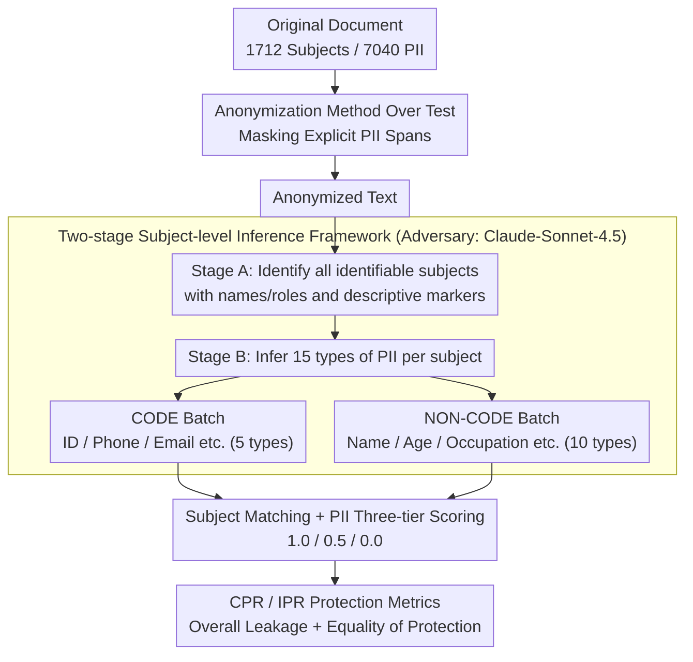

# Subject-level Inference for Realistic Text Anonymization Evaluation

**Conference**: ACL 2026  
**arXiv**: [2604.21211](https://arxiv.org/abs/2604.21211)  
**Code**: [https://github.com/maisonOP/spia.git](https://github.com/maisonOP/spia.git)  
**Area**: LLM Evaluation  
**Keywords**: Text Anonymization, Privacy Evaluation, Subject-level Inference, PII Reasoning, Multi-subject Protection

## TL;DR

SPIA proposes the first subject-level PII inference evaluation benchmark (675 documents, 1712 subjects, 7040 PII), revealing that even if 90%+ of PII spans are masked, the subject-level inference protection rate can be as low as 33%, and focusing anonymization on a single target subject causes non-target subjects to be more exposed.

## Background & Motivation

**Background**: Text anonymization prevents individual identification by modifying text, a core requirement of privacy regulations such as GDPR. Existing evaluation methods primarily use span-based metrics like Token Recall and Entity Recall to measure whether explicit PII mentions are masked. Existing benchmarks include i2b2/UTHealth (medical), TAB (legal), and WikiPII (Wikipedia).

**Limitations of Prior Work**: Two critical flaws exist. First, span-based metrics fail to capture inference risks—Staab et al. (2025) demonstrated that even after NER-based anonymization, 66.3% of personal attributes can still be inferred from context. Second, existing methods assume a document contains a single data subject, whereas real-world texts (legal judgments, medical records, online posts) typically involve multiple individuals. Current techniques primarily protect a main subject, leaving other mentioned individuals inadequately protected.

**Key Challenge**: Masking all explicit PII mentions (high span recall) does not equate to protecting all individuals (high inference protection). LLMs can infer masked personal information from contextual clues, and protection for non-target subjects in multi-subject documents is systematically neglected. This is a fundamental error in the unit of evaluation—it should shift from text fragments to individual persons.

**Goal**: Shift the unit of anonymization evaluation from text fragments to individuals, construct an inference-based evaluation benchmark covering multiple subjects and domains, and design new subject-level protection metrics.

**Key Insight**: Define a "subject" as any identifiable individual in a document and independently evaluate whether each subject's PII can be inferred from the anonymized text by an adversarial LLM.

**Core Idea**: Evaluation Unit = Individual Person (rather than text span); Protection Metric = Proportion of remaining inferable PII (rather than masking rate).

## Method

### Overall Architecture

SPIA addresses a question overlooked by existing evaluations: does masking explicit PII spans in a document truly protect everyone mentioned? It consists of two parts—a subject-level annotated benchmark and an adversarial inference-based evaluation pipeline. On the benchmark side, 675 documents were filtered from TAB (legal judgments) and PANORAMA (online text), with 1712 "subjects" (any identifiable individual) and 7040 PII across 15 categories labeled via human and LLM processes. The evaluation side is a three-stage pipeline: first, the anonymization method under test processes the original text; then, an adversarial LLM (Claude-Sonnet-4.5) performs two-stage inference on the anonymized text; finally, subject matching and PII scoring are conducted to calculate the CPR and IPR protection rates.

### Key Designs

**1. Two-stage Subject-level Inference Framework: Scaling "Single Author Profiling" to "Restoring Every Individual in a Document"**

Existing inference-based privacy evaluations (e.g., Staab et al. 2024) target only single-author profiling and cannot handle real-world scenarios where applicants, witnesses, and judges appear simultaneously. SPIA splits inference into two stages: Stage A identifies all identifiable subjects from anonymized text and attaches distinguishing descriptions like names or roles; Stage B then infers 15 categories of PII for each subject. The second stage is further split into two batches: CODE categories (5 types including ID numbers, phones, emails) and NON-CODE categories (10 types including name, age, occupation). This prevents the model from processing 15 categories at once, shortening prompt length and allowing appropriate processing for each type. The adversary was selected after benchmarking 11 LLMs; Claude-Sonnet-4.5 was chosen as the standard adversary due to its superior subject matching (96%) and inference accuracy (91%).

**2. CODE / NON-CODE PII Classification System: Segmenting 15 PII Categories by Structural Features**

The selection and organization of PII for inference evaluation determine whether the benchmark covers real leakage surfaces. SPIA categorizes 15 PII types into two groups by structural features: CODE types have fixed patterns (ID, Driver's License, Phone, Passport, Email), while NON-CODE types are free text (Name, Gender, Age, Location, Nationality, Education, Relationship, Occupation, Affiliation, Position). CODE types are included in inference because pattern-based NER often misses unseen formats; relying solely on masking rates would overestimate protection. Compared to traditional "Direct/Quasi-identifier" splits, which are context-dependent and ambiguous, structural feature-based splitting is more stable and aligns better with detection workflows.

**3. CPR and IPR Protection Metrics: Measuring Overall Leakage vs. Equitable Protection**

Subject-level and category-level inference results must be condensed into comparable figures that expose cases where "the whole seems safe, but some individuals are fully exposed." Two complementary metrics are proposed. CPR (Collective Protection Rate) is weighted by the number of PII, giving more weight to subjects with more PII:

$$\text{CPR} = 1 - \frac{\sum_i A_i}{\sum_i O_i}$$

IPR (Individual Protection Rate) averages across all subjects equally, penalized if any single person is fully exposed:

$$\text{IPR} = \frac{1}{N}\sum_i\left(1 - \frac{A_i}{O_i}\right)$$

where $O_i$ is the total PII for subject $i$ in the original text, and $A_i$ is the count still inferable by the adversary. A value of 1 indicates total protection; 0 indicates total exposure. CPR measures the overall scale of leakage, while IPR measures fairness in protection—a document may have high CPR but low IPR due to neglected non-target subjects.

### Loss & Training
This work presents an evaluation benchmark and framework; no model training is involved. The adversarial LLM uses Claude-Sonnet-4.5. PII scoring uses a three-tier system: 1.0 for exact match, 0.5 for partial match, and 0.0 for mismatch.

## Key Experimental Results

### Main Results (TAB Legal Dataset, Selected Anonymization Methods × Best Backbone)

| Method | Token Recall | Entity Recall (di) | CPR | IPR | Utility |
|------|-------------|-------------------|-----|-----|---------|
| Longformer | 0.940 | 0.997 | 0.330 | 0.325 | 0.874 |
| DeID-GPT (GPT-4.1) | 0.990 | 1.000 | 0.674 | 0.665 | 0.754 |
| DP-Prompt (Claude-Sonnet) | 0.789 | 0.450 | 0.452 | 0.446 | 0.764 |
| Adversarial (GPT-4.1) | 0.894 | 1.000 | 0.359 | 0.365 | 0.857 |

### Span-based vs Inference-based Delta

| Dataset | Highest Token Recall | Corresponding CPR | Gap |
|--------|------------------|----------|------|
| TAB | 0.990 | 0.674 | 31.6%p |
| TAB (Longformer) | 0.940 | 0.330 | 61.0%p |
| PANORAMA | 0.984 | 0.799 | 18.5%p |

### Key Findings
- **Span-based metrics significantly overestimate protection levels**: Longformer's Entity Recall reaches 99.7%, yet its CPR is only 33.0%, meaning nearly 2/3 of personal information can still be inferred even when almost all PII spans are masked.
- **Anonymization focusing on target subjects (Adversarial) exposes non-target subjects**: On TAB, 1-AAC (target subject protection) is significantly higher than CPR (overall protection), indicating that adversarial anonymization protects applicants while neglecting witnesses or judges.
- **Longer legal documents (TAB) show larger gaps than short online texts (PANORAMA)**: Rich context in legal documents provides more space for inference.
- Even under the best configuration (DeID-GPT + GPT-4.1), CPR on TAB is only 67.4%, leaving nearly 1/3 of PII inferable.
- Evaluation results remain robust across different adversarial models (GPT-4.1, Claude-Haiku-4.5) with Spearman ρ > 0.98.

## Highlights & Insights
- **The shift in evaluation unit from spans to individuals** is the most significant contribution. This simple yet profound observation changes the logical foundation of anonymization evaluation, exposing blind spots created by span-based metrics.
- **The discovery of differential exposure in multi-subject scenarios** is highly practical: adversarial anonymization protects the target but neglects others, posing a severe compliance risk under GDPR requirements to protect all identifiable individuals.
- The two-stage inference framework can be migrated to other privacy-related tasks, such as privacy auditing of anonymized text or PII detection in LLM training data.

## Limitations & Future Work
- Includes only English documents; PII inference difficulty may vary across languages and cultures.
- Benchmark scale is relatively small (675 documents), especially TAB with only 144.
- Advanced anonymization methods (e.g., generative methods combined with Differential Privacy) were not evaluated.
- CPR/IPR do not distinguish between PII categories—the privacy risk of leaking a name is clearly different from leaking an age.
- Future work could extend to multilingual and larger document sets and introduce weights for PII categories.

## Related Work & Insights
- **vs TAB**: TAB provides comprehensive PII coverage but lacks inference evaluation; SPIA adds an inference layer to TAB data.
- **vs PersonalReddit**: Supports inference evaluation but only for single authors. SPIA extends to multiple subjects.
- **vs PII-Bench**: Distinguishes subjects but remains limited to span evaluation. SPIA supports both multi-subject and inference evaluation.
- **vs Staab et al. (2024) AAC**: AAC only measures target subject protection; SPIA's CPR/IPR measure all subjects.

## Rating
- Novelty: ⭐⭐⭐⭐⭐ The shift in evaluation paradigm (span → individual) is an influential contribution, and the multi-subject perspective hits the core requirements of GDPR.
- Experimental Thoroughness: ⭐⭐⭐⭐ 4 anonymization methods × 6 backbones × 2 datasets, with robustness verification across adversaries.
- Writing Quality: ⭐⭐⭐⭐ The comparison of the three evaluation methods in Figure 1 is highly intuitive with clear conceptual layers.
- Value: ⭐⭐⭐⭐⭐ The finding that "90% masking results in 67% inferability" has a direct impact on privacy protection practices.

<!-- RELATED:START -->

## Related Papers

- [\[ACL 2026\] Adaptive Text Anonymization: Learning Privacy-Utility Trade-offs via Prompt Optimization](adaptive_text_anonymization_learning_privacy-utility_trade-offs_via_prompt_optim.md)
- [\[ICML 2026\] AliMark: Enhancing Robustness of Sentence-Level Watermarking Against Text Paraphrasing](../../ICML2026/llm_safety/alimark_enhancing_robustness_of_sentence-level_watermarking_against_text_paraphr.md)
- [\[ICML 2026\] From Weak Cues to Real Identities: Evaluating Inference-Driven De-Anonymization in LLM Agents](../../ICML2026/llm_safety/from_weak_cues_to_real_identities_evaluating_inference-driven_de-anonymization_i.md)
- [\[NeurIPS 2025\] Music Arena: Live Evaluation for Text-to-Music](../../NeurIPS2025/llm_safety/music_arena_live_evaluation_for_text-to-music.md)
- [\[ACL 2026\] PIArena: A Platform for Prompt Injection Evaluation](piarena_a_platform_for_prompt_injection_evaluation.md)

<!-- RELATED:END -->
