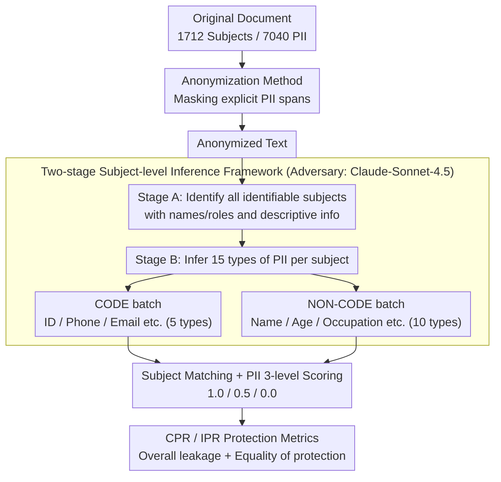

# Subject-level Inference for Realistic Text Anonymization Evaluation

**Conference**: ACL 2026  
**arXiv**: [2604.21211](https://arxiv.org/abs/2604.21211)  
**Code**: [https://github.com/maisonOP/spia.git](https://github.com/maisonOP/spia.git)  
**Area**: LLM Evaluation  
**Keywords**: Text anonymization, privacy evaluation, subject-level inference, PII inference, multi-subject protection

## TL;DR

SPIA proposes the first subject-level PII inference evaluation benchmark (675 documents, 1,712 subjects, 7,040 PII), revealing that even when 90%+ of PII spans are masked, the subject-level inference protection rate can be as low as 33%, and focusing anonymization on a single target subject leads to greater exposure of non-target subjects.

## Background & Motivation

**Background**: Text anonymization prevents personal identification by modifying text, which is a core requirement of privacy regulations such as GDPR. Existing evaluation methods primarily rely on span-based metrics like Token Recall and Entity Recall to measure whether explicit PII mentions are masked. Established benchmarks include i2b2/UTHealth (medical), TAB (legal), and WikiPII (Wikipedia).

**Limitations of Prior Work**: There are two critical flaws. First, span-based metrics fail to capture inference risks—Staab et al. (2025) demonstrated that even after NER anonymization, 66.3% of personal attributes can still be inferred from context. Second, existing methods assume a document contains only a single data subject, whereas real-world texts (legal judgments, medical records, online posts) typically involve multiple individuals. Current techniques primarily protect a main subject, leaving other mentioned individuals inadequately protected.

**Key Challenge**: Masking all explicit PII mentions (high span recall) does not equate to protecting all individuals (high inference protection). LLMs can infer masked personal information from contextual clues, and the protection of non-target subjects in multi-subject documents is systematically neglected. This is a fundamental error in the unit of evaluation—it should shift from text spans to individual persons.

**Goal**: To shift the unit of anonymization evaluation from text spans to individuals, build an inference-based evaluation benchmark covering multiple subjects and domains, and design new subject-level protection metrics.

**Key Insight**: Define a "subject" as any identifiable individual in a document and independently evaluate whether each subject's PII can be inferred by an adversarial LLM from the anonymized text.

**Core Idea**: Unit of evaluation = individual person (rather than text span); protection metric = proportion of PII remaining unknown after inference (rather than masking rate).

## Method

### Overall Architecture

SPIA aims to answer a question overlooked by existing anonymization evaluations: does masking explicit PII spans in a document truly protect every person within it? It consists of two parts—a benchmark with subject-level annotations and an evaluation pipeline based on adversarial inference. On the benchmark side, 675 documents were filtered from TAB (legal judgments) and PANORAMA (online text), with 1,712 "subjects" (any identifiable individual in the document) and 7,040 PII spanning 15 categories labeled via human + LLM efforts. The evaluation side is a three-stage pipeline: first, the anonymization method under test processes the original text; then, an adversarial LLM (Claude-Sonnet-4.5) performs two-stage inference on the anonymized text; finally, subject matching and PII scoring are conducted to calculate the CPR and IPR protection rates.

### Key Designs

**1. Two-stage Subject-level Inference Framework: Scaling "Single Author Profiling" to "Reconstructing Everyone in the Document"**

Existing inference-based privacy evaluations (e.g., Staab et al. 2024) target only single-author profiling and cannot handle real-world scenarios where applicants, witnesses, and judges appear simultaneously. SPIA splits inference into two stages: Stage A identifies all identifiable subjects from the anonymized text and attaches distinguishing descriptions like names or roles; Stage B then infers 15 PII categories for each subject. The second stage is further split into two independent inference batches—CODE (5 types like ID, phone, email) and NON-CODE (10 types like name, age, occupation). This prevents the model from being overwhelmed by 15 categories at once, shortens prompt length, and allows appropriate processing for each type. The adversary was chosen after benchmarking 11 LLMs, where Claude-Sonnet-4.5 proved strongest in subject matching (96%) and inference accuracy (91%).

**2. CODE / NON-CODE PII Classification: Partitioning 15 PII types by structural features rather than identification strength**

Determining which PII to include and how to organize them dictates whether a benchmark covers the real attack surface. SPIA groups 15 PII types by structural features: CODE types have fixed patterns (ID number, license, phone, passport, email), while NON-CODE types are free text (Name, Gender, Age, Location, Nationality, Education, Relationship, Occupation, Affiliation, Position). CODE types are included in inference evaluation because pattern-based NER often misses unseen formats, and relying solely on masking rates would overestimate protection. Compared to traditional "Direct Identifier / Quasi-identifier" splits (which are context-dependent and ambiguous), structural partitioning is more stable and aligns with actual detection processing.

**3. CPR and IPR Protection Metrics: Measuring overall leakage and equality of protection**

With subject-by-subject and category-by-category inference results, researchers need to compress them into comparable figures that expose cases where "the whole seems safe, but certain individuals are fully exposed." Two complementary metrics are proposed. CPR (Collective Protection Rate) is weighted by the number of PII, giving more weight to subjects with more PII:

$$\text{CPR} = 1 - \frac{\sum_i A_i}{\sum_i O_i}$$

IPR (Individual Protection Rate) averages all subjects equally; it is pulled down if even one person is completely exposed:

$$\text{IPR} = \frac{1}{N}\sum_i\left(1 - \frac{A_i}{O_i}\right)$$

Where $O_i$ is the total PII for subject $i$ in the original text, and $A_i$ is the number still inferable by the adversary. A value of 1 represents full protection and 0 represents full exposure. CPR measures the overall scale of leakage, while IPR measures whether protection is fair—a document might have a high CPR but a low IPR if specific non-target subjects are neglected, which is a common failure point in multi-subject anonymization.

### Loss & Training
This work represents an evaluation benchmark and framework and does not involving model training. The adversarial LLM uses Claude-Sonnet-4.5. PII scoring uses a three-level system: 1.0 for exact match, 0.5 for partial match, and 0.0 for mismatch.

## Key Experimental Results

### Main Results (TAB Legal Dataset, Various Anonymization Methods × Optimal Backbone)

| Method | Token Recall | Entity Recall (di) | CPR | IPR | Utility |
|------|-------------|-------------------|-----|-----|---------|
| Longformer | 0.940 | 0.997 | 0.330 | 0.325 | 0.874 |
| DeID-GPT (GPT-4.1) | 0.990 | 1.000 | 0.674 | 0.665 | 0.754 |
| DP-Prompt (Claude-Sonnet) | 0.789 | 0.450 | 0.452 | 0.446 | 0.764 |
| Adversarial (GPT-4.1) | 0.894 | 1.000 | 0.359 | 0.365 | 0.857 |

### Span-based vs Inference-based Gaps

| Dataset | Max Token Recall | Corresp. CPR | Gap |
|--------|------------------|----------|------|
| TAB | 0.990 | 0.674 | 31.6%p |
| TAB (Longformer) | 0.940 | 0.330 | 61.0%p |
| PANORAMA | 0.984 | 0.799 | 18.5%p |

### Key Findings
- **Span-based metrics severely overestimate protection levels**: Longformer achieves 99.7% Entity Recall but only 33.0% CPR, meaning even when almost all PII spans are masked, 2/3 of personal information remains inferable through context.
- **Anonymization focusing on target subjects (Adversarial) exposes non-target subjects**: On TAB, 1-AAC (target subject protection) is significantly higher than CPR (overall protection), indicating that adversarial anonymization overlooks witnesses and judges while protecting applicants.
- **Wider gaps in TAB (long legal docs) than PANORAMA (short online text)**: Legal documents provide rich context, creating more room for inference.
- Even in the best configuration (DeID-GPT + GPT-4.1), CPR on TAB is only 67.4%, meaning nearly 1/3 of PII can still be inferred.
- Spearman ρ > 0.98 across different adversary models (GPT-4.1, Claude-Haiku-4.5), confirming the robustness of the evaluation.

## Highlights & Insights
- **The shift from span-based to individual-based evaluation units** is the most significant contribution. This simple yet profound observation changes the logical foundation of anonymization evaluation, revealing blind spots where the field was misled by span metrics.
- **The discovery of protection disparity in multi-subject scenarios** is highly practical: adversarial anonymization protects the target subject but neglects others, posing major compliance risks under GDPR, which requires protection for all identifiable individuals.
- The two-stage inference framework is transferable to other privacy tasks, such as privacy auditing of anonymized text or PII detection in LLM training data.

## Limitations & Future Work
- Limited to English documents; PII inference difficulty may vary by language and culture.
- Benchmark scale is relatively small (675 docs), particularly TAB with only 144 docs.
- Advanced anonymization methods (e.g., generative methods combined with differential privacy) were not evaluated.
- CPR/IPR does not distinguish between PII categories—leaking a name clearly carries different risk than leaking an age.
- Future work could expand to multilingual and larger-scale document sets and introduce weights for PII categories.

## Related Work & Insights
- **vs TAB**: TAB provides comprehensive PII coverage but lacks inference evaluation; SPIA adds an inference layer to TAB data.
- **vs PersonalReddit**: Supports inference evaluation but only for a single author. SPIA extends this to multiple subjects.
- **vs PII-Bench**: Distinguishes subjects but remains at span-based evaluation. SPIA supports both multi-subject and inference evaluation.
- **vs Staab et al. (2024) AAC**: AAC measures only target subject protection; SPIA's CPR/IPR measures all subjects.

## Rating
- Novelty: ⭐⭐⭐⭐⭐ The evaluation paradigm shift (span → individual) is an impactful contribution, and the multi-subject perspective addresses core GDPR requirements.
- Experimental Thoroughness: ⭐⭐⭐⭐ 4 anonymization methods × 6 backbones × 2 datasets, with robustness checks using different adversaries.
- Writing Quality: ⭐⭐⭐⭐ The comparison of three evaluation modes in Figure 1 is very intuitive, with a clear conceptual hierarchy.
- Value: ⭐⭐⭐⭐⭐ The finding that "90% masking results in only 33% protection" has direct implications for privacy protection practices.

<!-- RELATED:START -->

## Related Papers

- [\[ACL 2026\] Adaptive Text Anonymization: Learning Privacy-Utility Trade-offs via Prompt Optimization](adaptive_text_anonymization_learning_privacy-utility_trade-offs_via_prompt_optim.md)
- [\[ACL 2026\] Look Twice before You Leap: A Rational Framework for Localized Adversarial Anonymization](look_twice_before_you_leap_a_rational_framework_for_localized_adversarial_anonym.md)
- [\[ACL 2026\] De-Anonymization at Scale via Tournament-Style Attribution](de-anonymization_at_scale_via_tournament-style_attribution.md)
- [\[NeurIPS 2025\] Music Arena: Live Evaluation for Text-to-Music](../../NeurIPS2025/llm_safety/music_arena_live_evaluation_for_text-to-music.md)
- [\[ACL 2026\] PIArena: A Platform for Prompt Injection Evaluation](piarena_a_platform_for_prompt_injection_evaluation.md)

<!-- RELATED:END -->
