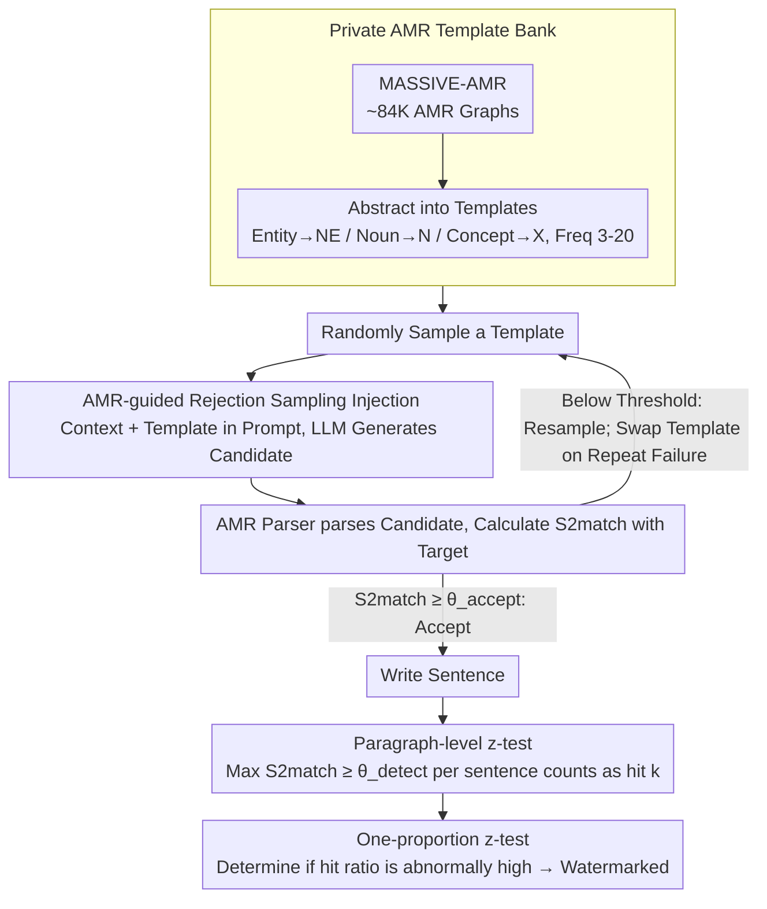

# SWAN: Semantic Watermarking with Abstract Meaning Representation

**Conference**: ACL2026  
**arXiv**: [2605.04305](https://arxiv.org/abs/2605.04305)  
**Code**: None  
**Area**: LLM Security / Text Watermarking / Semantic Representation  
**Keywords**: Semantic Watermarking, AMR, paraphrase robustness, S2match, text provenance  

## TL;DR
SWAN embeds watermarks into the semantic graph structure of sentences using Abstract Meaning Representation (AMR) templates rather than token or embedding regions. Consequently, after paraphrasing that preserves the original meaning, the watermark can still be detected through AMR parsing, template matching, and proportion z-testing.

## Background & Motivation
**Background**: LLM-generated text is becoming increasingly natural. Text watermarking has become an important technical route for identifying AI-generated content, tracing content sources, and mitigating large-scale misinformation.

**Limitations of Prior Work**: Prevailing token-level watermarks inject signals by altering token sampling preferences during generation to push more tokens toward a secret green list. These methods are simple to implement and easy to detect but quickly lose signals when encountering paraphrasing, synonym substitution, or slight rewriting.

**Key Challenge**: Watermarks must be both imperceptible and detectable while also withstanding semantic-preserving rewrites. Token-level signals are too superficial; while embedding-level semantic watermarks are more stable, detection still degrades if paraphrasing pushes sentence vectors into a different semantic region.

**Goal**: The authors aim to anchor watermarks to a level more stable than tokens or sentence embeddings: the abstract semantic structure of the sentence. As long as rewriting does not change core semantic relations like "who did what to whom," the watermark should remain.

**Key Insight**: Abstract Meaning Representation (AMR) represents sentence semantics as graphs, where nodes represent concepts or events and edges represent semantic roles. Since multiple surface-level paraphrases can map to the same or highly similar AMR graphs, it is naturally suitable for paraphrase-robust watermarking.

**Core Idea**: Build a private AMR template bank. During generation, each sentence is matched to a randomly sampled AMR template. During detection, the AMR of the text is parsed to count the proportion of sentences matching the private templates.

## Method

### Overall Architecture

The core change in SWAN is replacing the "watermark key" from vocabulary hashes or embedding partitions with a private AMR template bank. The method is training-free—it does not train a watermark model or access target LLM logits, relying instead on prompt guidance and rejection sampling to "nudge" sentences into the target semantic structure.

In the construction phase, starting from MASSIVE-AMR (approximately 84K AMR graphs corresponding to 1,685 information query statements), the authors further abstract original AMRs into templates: specific named entities are replaced with NE, common nouns with N, and unspecified concepts with X. Patterns with frequencies between 3 and 20 that contain at least 3 concept nodes are retained to form a private template bank.

In the generation phase, for each sentence generated, a template is randomly sampled from the private library. The current context and template are placed into the LLM prompt, requiring it to generate a sentence that is coherent, satisfies the user's intent, and fits the template's semantic structure. After generation, an AMR parser parses the candidate sentence into a graph, and its similarity to the target template is calculated using S2match. It is accepted if it exceeds an injection threshold; otherwise, it is resampled. If a template repeatedly fails in the current context, it is swapped to avoid incompatible structures. In the detection phase, the candidate paragraph is segmented into sentences and parsed. The maximum S2match between each sentence and all templates in the private bank is calculated. If it exceeds a detection threshold, it is marked as watermarked. Finally, a one-proportion z-test is performed on the ratio of watermarked sentences in the sequence.

### Key Designs

**1. Private AMR Template Bank: Replacing the key from "vocab/vector regions" to "abstract semantic graph structures"**

The key for token-level methods is a green-list vocabulary, and for embedding-level methods, it is a vector region. Both reside in superficial or continuous spaces and are easily shifted by paraphrasing. SWAN defines the key as a set of abstract semantic graphs: after extracting graph structures from MASSIVE-AMR, specific entities and lexical details are stripped, leaving only predicates, semantic roles, and conceptual relations. The frequency interval (3-20) is deliberate—patterns with low frequency are too rare and difficult to hit during generation, while those with high frequency are too common and increase false positives. As long as this bank remains secret, the detector can verify structural matches while attackers remain unaware of which AMR patterns to avoid.

**2. AMR-guided Rejection Sampling Injection: Nudging sentences toward target semantic structures without parameter or logit access**

Hard-inserting keywords into sentences disrupts fluency and is easily removed. SWAN instead requires the model to "write around the template": the prompt provides both historical context and a target AMR template, asking for a natural sentence that instantiates placeholder concepts like NE/N/X. Each candidate sentence is parsed into $\hat{g}$ and compared to the target $g$ via S2match. It is accepted only when $S2match(\hat{g}, g) \geq \theta_{accept}$. This hides the watermark in the predicate-argument structure while keeping the surface text natural; because it is black-box generation, it can be applied to closed-source API models.

**3. Paragraph-level z-test: Accumulating sentence-level template matches into paragraph-level provenance decisions**

Individual AMR parsing is noisy, and sentence-level false positives are unavoidable. SWAN calculates the maximum similarity to the bank for each sentence in a paragraph. If it exceeds $\theta_{detect}$, it is counted as a hit $k$. Given the total sentences $n$ and the random hit rate $\lambda$ under the null hypothesis, the statistic:

$$z = \frac{k - \lambda n}{\sqrt{n\lambda(1-\lambda)}}$$

is used to determine if the hit proportion is significantly high. This aggregates weak sentence-level signals into strong paragraph-level statistics, mirroring the logic of z-score detectors in token watermarking but replacing "token hits" with "semantic template hits."

### Loss & Training
SWAN has no training loss. Key hyperparameters come from generation and detection. The AMR bank size is 50 by default, with tests also conducted at 100, 500, and 800. Watermark generation uses DeepSeek-R1-Distill-Qwen-14B with temperature 0.6 and top_p 0.9, allowing up to 50 attempts per sentence (up to 10 templates, 5 generations each). Detection uses the `amrlib` `parse_xfm_bart_large` pipeline. Paraphrase attacks use Pegasus, Parrot, and Claude 3.7 Sonnet. Text quality is scored by Claude 3.7 across coherence, fluency, and diversity.

## Key Experimental Results

### Main Results
In scenarios without paraphrasing, SWAN's raw detectability is close to strong sentence-level baselines and outperforms the low FPR metrics of the token-level SynthID.

| Method | AUC↑ | TPR@1%↑ | TPR@5%↑ |
|------|------|----------|----------|
| SynthID | 97.0 | 64.8 | 84.8 |
| SemStamp | 99.4 | 96.8 | 100.0 |
| k-SemStamp | 99.1 | 96.8 | 96.4 |
| SWAN | 99.1 | 91.6 | 97.6 |

Regarding the critical paraphrase robustness, SWAN achieves the highest AUC under all three types of attacks, showing significant advantages particularly against strong LLM rewriting like Claude 3.7.

| Method | Pegasus AUC/TPR@1%/TPR@5% | Parrot AUC/TPR@1%/TPR@5% | Claude AUC/TPR@1%/TPR@5% |
|------|----------------------------|---------------------------|---------------------------|
| SemStamp | 97.6 / 87.2 / 97.6 | 94.8 / 69.2 / 97.6 | 84.4 / 36.8 / 84.8 |
| k-SemStamp | 97.3 / 88.8 / 88.4 | 92.8 / 68.0 / 66.8 | 87.6 / 53.6 / 53.2 |
| SWAN | 98.1 / 81.2 / 92.8 | 97.5 / 82.0 / 92.4 | 98.3 / 86.0 / 95.2 |

This table demonstrates the value of AMR semantic anchoring: while Claude rewriting significantly weakens SemStamp and k-SemStamp, SWAN maintains an AUC of 98.3.

### Ablation Study
The AMR bank size has a minimal impact on AUC, indicating that the method is not sensitive to the scale of the template library.

| AMR bank size | AUC↑ |
|---------------|------|
| 50 | 99.1 |
| 100 | 98.7 |
| 500 | 98.4 |
| 800 | 99.3 |

In terms of sampling efficiency, SWAN is slower than SemStamp, but most sentences converge quickly.

| Metric | SWAN | Comparison / Note |
|------|------|-------------|
| Avg. acceptance trials | 17.7 | SemStamp: 13.8 |
| Accepted within 10 trials | 42% | Many templates are easily satisfied |
| Accepted within 15 trials | 54% | Over half succeed within a low budget |
| Spike near max budget | 46-50 trials | Some templates are semantically incompatible |
| Generation Scale | 1,250 sentences | 250 samples × 5 sentences/para |

### Key Findings
- SWAN does not sacrifice detectability in original text scenarios, with AUC comparable to SemStamp/k-SemStamp.
- The gap widens significantly after paraphrasing; SWAN maintains an AUC of 98.3 under Claude rewriting, whereas SemStamp drops to 84.4.
- AUC remains 98+ as the AMR bank expands from 50 to 800, showing a stable balance between template coverage and false positives.
- Rejection sampling overhead exists, but 42% of sentences succeed within 10 trials, making the overhead acceptable. The real challenge lies in context-aware template selection.
- Text quality evaluation shows that all watermarking methods cause slight degradation, but SWAN is similar to sentence-level baselines and does not pay a significant extra quality price for robustness.

## Highlights & Insights
- SWAN’s most valuable insight is that "paraphasings preserve meaning, so the watermark should be written into the meaning representation." This is more natural than chasing paraphrases across tokens or embeddings.
- The AMR template bank transforms the watermark into an interpretable structural signal. Detection failure can be analyzed by identifying which predicate-argument structures failed to parse, rather than relying on an opaque embedding hash.
- The training-free and black-box generation approach makes the method easily applicable to closed-source or API-based models as it requires neither logit access nor model weight modifications.
- The paragraph-level z-test inherits statistical principles from traditional watermark detectors while effectively mapping "token hits" to "semantic template hits."

## Limitations & Future Work
- Detection is highly dependent on the quality of the AMR parser; parsing errors lead to misses or false positives. AMR parsing may be unstable in low-resource languages, technical texts, or non-news genres.
- The AMR bank serves as a private key; if an attacker guesses or leaks the library, they could deliberately rewrite semantic structures to bypass detection.
- The current evaluation is primarily on English RealNews, with limited language and domain coverage.
- Rejection sampling remains costly; repeated failures occur when templates are incompatible with context, necessitating more intelligent template-context matching.
- SWAN focuses on sentence-level AMR. In the face of attacks like sentence merging, splitting, or cross-sentence rewriting, the watermark structure may be reorganized. Future work could explore paragraph-level AMR or AMR subgraph watermarking.

## Related Work & Insights
- **vs SynthID / token-level watermark**: SynthID relies on token distribution perturbations, which are effective for low FPR detection but fragile against paraphrasing. SWAN constrains semantic structure rather than token preference to resist superficial rewriting.
- **vs SemStamp**: SemStamp partitions the sentence vector space into green buckets, providing some paraphrase robustness, but strong rewriting still shifts embeddings. SWAN uses AMR graph matching to maintain signals under semantically equivalent rewrites.
- **vs k-SemStamp**: k-SemStamp improves semantic region partitioning via clustering but remains in the continuous embedding space. SWAN’s discrete graph structure is more interpretable and closer to the definition of "invariant meaning."
- **vs PostMark / post-hoc watermark**: PostMark injects signals through paragraph semantics and watermark words, which is practical but may leave lexical traces. SWAN signals are hidden within predicate-argument combinations.

## Rating
- Novelty: ⭐⭐⭐⭐⭐ Using AMR graph structures for text watermarking is highly novel and distinct from token/embedding routes.
- Experimental Thoroughness: ⭐⭐⭐⭐☆ Detection, paraphrasing, bank size, sampling efficiency, and quality assessments are covered, though language and domain scope remain narrow.
- Writing Quality: ⭐⭐⭐⭐☆ Method descriptions are clear and experimental tables are direct, though AMR parsing errors and threshold selection could be explored further.
- Value: ⭐⭐⭐⭐⭐ Provides practical insights for robust text watermarking and AI-generated content provenance, particularly for semantic-level research.

<!-- RELATED:START -->

## Related Papers

- [\[ICLR 2026\] PMark: Towards Robust and Distortion-free Semantic-level Watermarking with Channel Constraints](../../ICLR2026/llm_safety/pmark_towards_robust_and_distortion-free_semantic-level_watermarking_with_channe.md)
- [\[ICLR 2026\] Distilling the Thought, Watermarking the Answer: A Principle Semantic Guided Watermark for Reasoning Large Language Models](../../ICLR2026/llm_safety/distilling_the_thought_watermarking_the_answer_a_principle_semantic_guided_water.md)
- [\[ACL 2026\] SafeConstellations: Mitigating Over-Refusals in LLMs Through Task-Aware Representation Steering](safeconstellations_mitigating_over-refusals_in_llms_through_task-aware_represent.md)
- [\[ACL 2026\] Representation-Guided Parameter-Efficient LLM Unlearning](representation-guided_parameter-efficient_llm_unlearning.md)
- [\[ACL 2026\] XMark: Reliable Multi-Bit Watermarking for LLM-Generated Texts](xmark_reliable_multi-bit_watermarking_for_llm-generated_texts.md)

<!-- RELATED:END -->
