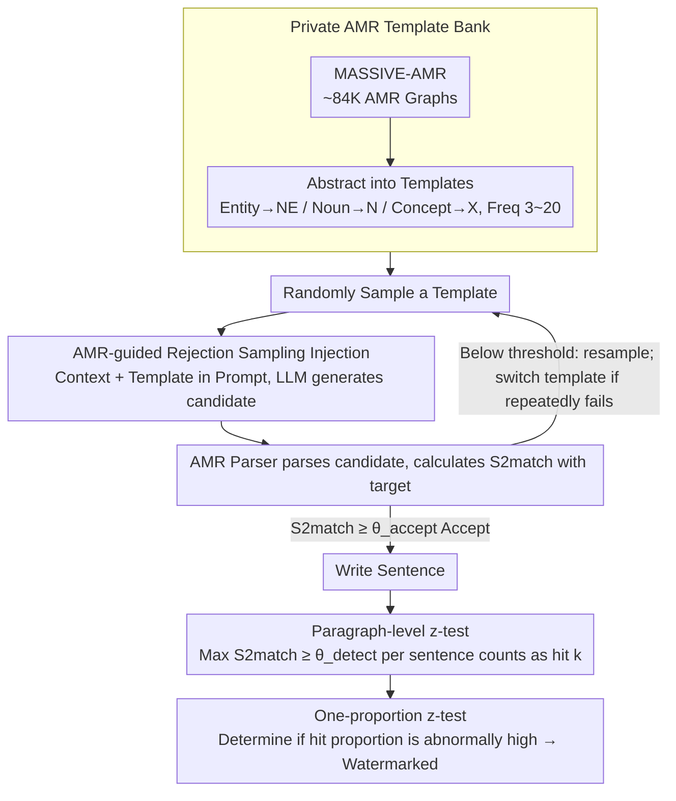

# SWAN: Semantic Watermarking with Abstract Meaning Representation

**Conference**: ACL2026  
**arXiv**: [2605.04305](https://arxiv.org/abs/2605.04305)  
**Code**: None  
**Area**: LLM Security / Text Watermarking / Semantic Representation  
**Keywords**: Semantic watermarking, AMR, paraphrase robustness, S2match, Text provenance  

## TL;DR
SWAN uses Abstract Meaning Representation templates to embed watermarks into the semantic graph structure of sentences rather than token or embedding regions. Consequently, the watermark remains detectable through AMR parsing, template matching, and proportion z-tests even after meaning-preserving paraphrasing.

## Background & Motivation
**Background**: As LLM-generated text becomes increasingly natural, text watermarking has emerged as a critical technical route for identifying AI-generated content, tracing content sources, and mitigating large-scale misinformation.

**Limitations of Prior Work**: Mainstream token-level watermarks change token sampling preferences during generation to push more tokens into a secret green list. While simple to implement and detect, these methods easily lose signals when encountering paraphrasing, synonymous replacement, or slight rewriting.

**Key Challenge**: Watermarks must be covert and detectable while simultaneously withstanding meaning-preserving rewriting. Token-level signals are too superficial; while embedding-level semantic watermarks are more stable, detection still degrades if paraphrasing pushes the sentence vector into a different semantic region.

**Goal**: The authors aim to anchor the watermark at a level more stable than tokens and sentence embeddings: the abstract semantic structure of the sentence. As long as rewriting does not alter core semantic relations (e.g., "who did what to whom"), the watermark should be preserved.

**Key Insight**: Abstract Meaning Representation (AMR) uses graphs to represent sentence semantics, where nodes represent concepts or events and edges represent semantic roles. Various linguistically different paraphrases can map to the same or highly similar AMR graphs, which is naturally suited for paraphrase-robust watermarking.

**Core Idea**: Build a private AMR template bank. During generation, each sentence is matched to a randomly selected AMR template. During detection, the AMR of the text is parsed, and the proportion of sentences matching the private templates is statistically analyzed.

## Method

### Overall Architecture

The core modification of SWAN is replacing the "watermark key" from vocabulary hashes or embedding partitions with a private AMR template library. The entire method is training-free—it does not train a watermark model or access the target LLM's logits; it relies solely on prompt guidance and rejection sampling to "squeeze" sentences into the target semantic structure.

During the construction phase, the authors start from MASSIVE-AMR (approximately 84K AMR graphs corresponding to 1685 information query statements) and further abstract the original AMRs into templates: specific named entities are replaced with NE, common nouns with N, and unspecified concepts with X. Only patterns with frequencies between 3 and 20 that contain at least 3 concept nodes are retained to form a private template bank.

In the generation phase, a template is randomly sampled from the private library for each sentence. The current context and the template are provided to the LLM via a prompt, requiring it to generate a sentence that is coherent, satisfies the user's original intent, and conforms to the template's semantic structure. After generation, an AMR parser converts the candidate sentence into a graph, and the similarity with the target template is calculated using S2match. If it exceeds the injection threshold, the sentence is accepted; otherwise, it is resampled. If a template repeatedly fails in the current context, it is replaced to avoid getting stuck on incompatible structures. In the detection phase, the candidate paragraph is split into sentences, and their AMRs are parsed sentence-by-sentence. The maximum S2match between each sentence and all templates in the private library is calculated. If it exceeds the detection threshold, the sentence is marked as watermarked. Finally, a one-proportion z-test is performed on the proportion of watermarked sentences in the entire paragraph.

### Key Designs

**1. Private AMR Template Bank: Changing the Watermark Key from "Vocabulary/Vector Regions" to "Abstract Semantic Graph Structures"**

The key for token-level methods is a green-list vocabulary, and for embedding-level methods, it is a vector region. Both exist in surface-level or continuous spaces and are easily shifted by paraphrasing. SWAN defines the key as a set of abstract semantic graphs: after extracting graph structures from MASSIVE-AMR, specific entities and lexical details are stripped, leaving only predicates, semantic roles, and conceptual relations. The template frequency interval (3–20) is deliberately chosen—patterns with low frequency are too rare and hard to hit during generation, while those with high frequency are too common and increase false positives. Moderate frequencies balance generativity and discriminability. As long as this bank remains private, the detector can verify structural matches while an attacker remains unaware of which AMR patterns to avoid.

**2. AMR-guided Rejection Sampling Injection: Pushing Sentences Toward Target Semantic Structures Without Parameter Tuning or Logit Access**

Hard-coding keywords into sentences destroys fluency and is easy to delete. SWAN instead forces the model to "write around the template": the prompt provides both the historical context and the target AMR template, requiring the generation of a natural sentence where placeholders like NE/N/X are instantiated. Each candidate sentence $\hat{g}$ is parsed and compared with the target template $g$ using S2match. It is accepted only when $S2match(\hat{g}, g) \geq \theta_{accept}$; otherwise, it is resampled. Thus, the watermark is hidden within the predicate-argument structure while the surface text remains natural. Since it does not rely on logits and utilizes black-box generation, the method can be directly applied to closed-source API models.

**3. Paragraph-level z-test: Accumulating Sentence-level Template Matching into Paragraph-level Provenance Decisions**

Single-sentence AMR parsing is inherently noisy, and single-sentence false positives are unavoidable. Analyzing one sentence is insufficient for a conclusion. SWAN calculates the maximum template similarity for each sentence in a paragraph against the bank. If it exceeds $\theta_{detect}$, it is counted as a hit $k$. Given the total number of sentences $n$ and the random hit rate $\lambda$ under the null hypothesis, the detection uses:

$$z = \frac{k - \lambda n}{\sqrt{n\lambda(1-\lambda)}}$$

to judge if the hit proportion is abnormally high. This aggregates weak sentence-level signals into strong paragraph-level statistics, following the same logic as the z-score detector in token watermarking, but replacing "token hits" with "semantic template hits."

### Loss & Training
SWAN has no training loss. Key hyperparameters come from the generation and detection processes. The default AMR bank size is 50, but the authors also tested settings of 100, 500, and 800. Watermark generation uses DeepSeek-R1-Distill-Qwen-14B with temperature 0.6 and top_p 0.9, attempting up to 50 trials per sentence (up to 10 templates, each with 5 generation attempts). Detection uses the `amrlib` `parse_xfm_bart_large` pipeline (based on BART-large, trained on AMR-3). Paraphrase attacks use Pegasus, Parrot, and Claude 3.7 Sonnet. Text quality is evaluated by Claude 3.7 using reference-free scoring across coherence, fluency, and diversity.

## Key Experimental Results

### Main Results
In scenarios without paraphrasing, the raw detectability of SWAN is close to strong sentence-level baselines and superior to the low FPR metrics of the token-level SynthID.

| Method | AUC↑ | TPR@1%↑ | TPR@5%↑ |
|------|------|----------|----------|
| SynthID | 97.0 | 64.8 | 84.8 |
| SemStamp | 99.4 | 96.8 | 100.0 |
| k-SemStamp | 99.1 | 96.8 | 96.4 |
| SWAN | 99.1 | 91.6 | 97.6 |

Regarding the critical paraphrase robustness, SWAN achieves the highest AUC under all three types of attacks, showing significant advantages particularly against strong LLM rewriting by Claude 3.7.

| Method | Pegasus AUC/TPR@1%/TPR@5% | Parrot AUC/TPR@1%/TPR@5% | Claude AUC/TPR@1%/TPR@5% |
|------|----------------------------|---------------------------|---------------------------|
| SemStamp | 97.6 / 87.2 / 97.6 | 94.8 / 69.2 / 97.6 | 84.4 / 36.8 / 84.8 |
| k-SemStamp | 97.3 / 88.8 / 88.4 | 92.8 / 68.0 / 66.8 | 87.6 / 53.6 / 53.2 |
| SWAN | 98.1 / 81.2 / 92.8 | 97.5 / 82.0 / 92.4 | 98.3 / 86.0 / 95.2 |

This table demonstrates the value of AMR semantic anchoring: while Claude's rewriting significantly weakens SemStamp and k-SemStamp, SWAN maintains an AUC of 98.3.

### Ablation Study
The size of the AMR bank has a minimal impact on AUC, indicating the method is not sensitive to the scale of the template library.

| AMR bank size | AUC↑ |
|---------------|------|
| 50 | 99.1 |
| 100 | 98.7 |
| 500 | 98.4 |
| 800 | 99.3 |

In terms of sampling efficiency, SWAN is slightly slower than SemStamp, but most sentences converge quickly.

| Metric | SWAN | Comparison / Description |
|------|------|-------------|
| Avg. attempts to accept | 17.7 | SemStamp is 13.8 |
| Acceptance rate within 10 trials | 42% | Indicates many templates are easily satisfied |
| Acceptance rate within 15 trials | 54% | Over half of sentences succeed within a low budget |
| Spike near max budget | 46-50 trials | Represents some templates being incompatible with context |
| Generation scale | 1,250 sentences | 250 samples × 5 sentences per paragraph |

### Key Findings
- SWAN does not sacrifice detectability in scenarios without rewriting, with AUC comparable to SemStamp/k-SemStamp.
- The gap widens significantly after paraphrasing; notably, under Claude's rewriting, SWAN's AUC is 98.3, whereas SemStamp is 84.4 and k-SemStamp is 87.6.
- AUC remains above 98 even when the AMR bank expands from 50 to 800, showing that the balance between template coverage and false positives is stable.
- Rejection sampling overhead exists, but 42% of sentences succeed within 10 trials, making the overall overhead acceptable. The real challenge lies in context-aware template selection.
- Text quality assessments show all watermarking methods cause a slight decline in quality, but SWAN is similar to sentence-level baselines, paying no significant extra price in quality for its robustness.

## Highlights & Insights
- The most valuable insight of SWAN is that "paraphrasing preserves meaning, so the watermark should be written into the meaning representation." This is more natural than chasing paraphrases at the token or embedding level.
- The AMR template bank transforms the watermark into an interpretable structural signal. Detection failure can be analyzed by identifying which predicate-argument structures were not parsed, rather than receiving an opaque embedding hash.
- The training-free and black-box generation approach makes the method easier to integrate with closed-source or API-based models, as it requires neither logit access nor model weight modification.
- The paragraph-level z-test inherits statistical concepts from traditional watermark detectors while replacing token hits with semantic template hits, representing a clean abstract migration.

## Limitations & Future Work
- Detection is highly dependent on AMR parser quality; parsing errors can lead to missed detections or false positives. AMR parsing may be unstable in low-resource languages, technical texts, or non-news genres.
- The AMR bank serves as a private key. If an attacker guesses or leaks the template library, they could deliberately rewrite semantic structures to bypass detection.
- The current method is primarily evaluated on English RealNews, with limited language and domain coverage.
- Rejection sampling still involves costs; repeated failures occur when templates are incompatible with the context. Smarter template-context matching is needed.
- SWAN focuses on sentence-level AMR. Against attacks like merging, splitting, or cross-sentence rewriting, the watermark structure might be reorganized. Future work could explore paragraph-level AMR or AMR subgraph watermarking.

## Related Work & Insights
- **vs SynthID / token-level watermark**: SynthID relies on token distribution perturbations, effective for low-FPR detection but fragile against paraphrasing. SWAN constrains semantic structure rather than token preferences, making it more resistant to surface rewriting.
- **vs SemStamp**: SemStamp partitions the sentence vector space into green buckets, providing some paraphrase robustness, but strong rewriting shifts embeddings. SWAN uses AMR graph matching, which maintains structural signals under semantically equivalent rewriting.
- **vs k-SemStamp**: k-SemStamp improves semantic region partitioning using clustering but still relies on continuous embedding regions. SWAN's discrete graph structure is more interpretable and closer to the definition of "invariant meaning."
- **vs PostMark / post-hoc watermark**: PostMark injects signals through paragraph semantics and watermark words. It is practical but may leave lexical traces. SWAN does not rely on fixed vocabularies; the signal is hidden in semantic role combinations.

## Rating
- Novelty: ⭐⭐⭐⭐⭐ Using AMR graph structures for text watermarking is highly novel and distinct from token/embedding routes.
- Experimental Thoroughness: ⭐⭐⭐⭐☆ Covers detection, paraphrasing, bank size, sampling efficiency, and quality evaluation, though language and domain scope remain narrow.
- Writing Quality: ⭐⭐⭐⭐☆ Methods are clearly explained and experimental tables are direct, though AMR parsing error and threshold selection could be further elaborated.
- Value: ⭐⭐⭐⭐⭐ Provides practical insights for robust text watermarking and AI-generated content provenance, especially for semantic-level provenance research.

<!-- RELATED:START -->

## Related Papers

- [\[ICLR 2026\] PMark: Towards Robust and Distortion-free Semantic-level Watermarking with Channel Constraints](../../ICLR2026/llm_safety/pmark_towards_robust_and_distortion-free_semantic-level_watermarking_with_channe.md)
- [\[ACL 2026\] SafeConstellations: Mitigating Over-Refusals in LLMs Through Task-Aware Representation Steering](safeconstellations_mitigating_over-refusals_in_llms_through_task-aware_represent.md)
- [\[ACL 2026\] Representation-Guided Parameter-Efficient LLM Unlearning](representation-guided_parameter-efficient_llm_unlearning.md)
- [\[ACL 2026\] AGSC: Adaptive Granularity and Semantic Clustering for Uncertainty Quantification in Long-text Generation](agsc_adaptive_granularity_and_semantic_clustering_for_uncertainty_quantification.md)
- [\[ACL 2026\] XMark: Reliable Multi-Bit Watermarking for LLM-Generated Texts](xmark_reliable_multi-bit_watermarking_for_llm-generated_texts.md)

<!-- RELATED:END -->
