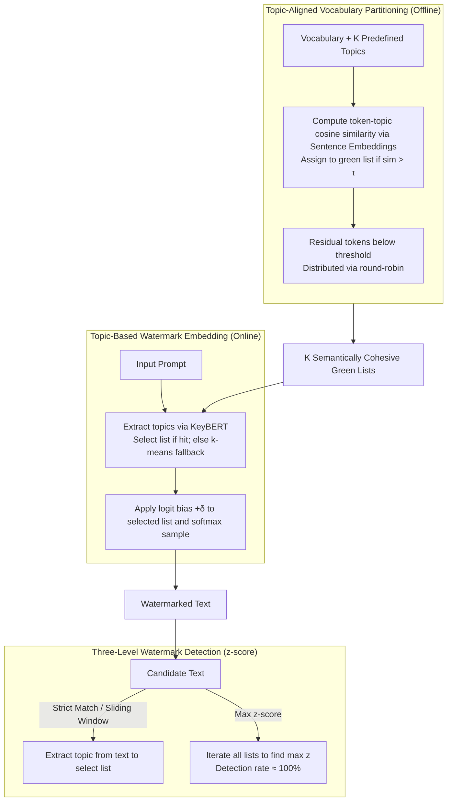

# Topic-Based Watermarks for Large Language Models

**Conference**: ACL 2026 Findings  
**arXiv**: [2404.02138](https://arxiv.org/abs/2404.02138)  
**Code**: [GitHub](https://github.com/ANCP2021/Topic-Based-Watermarks)  
**Area**: AI Safety / Text Watermarking  
**Keywords**: Text Watermarking, Topic Alignment, Semantic Partitioning, Paraphrastic Robustness, Lightweight Detection

## TL;DR

This paper proposes TBW, a lightweight topic-based watermarking scheme that clusters the vocabulary into "green lists" based on semantic topics rather than random partitioning. By selecting a semantically aligned topic list for logit biasing based on the input prompt, it maintains perplexity comparable to unwatermarked text while significantly enhancing robustness against paraphrasing and lexical perturbation attacks.

## Background & Motivation

**Background**: LLM-generated text is nearly indistinguishable from human writing, posing risks such as misinformation spread, copyright infringement, and model collapse (AI training on AI). Watermarking techniques identify AI-generated text by embedding detectable signatures during the generation process. A mainstream method, KGW, randomly partitions the vocabulary into "green" and "red" lists, biasing sampling towards green tokens.

**Limitations of Prior Work**: (1) **Fragility of Random Partitioning**: In KGW, tokens in the green list are semantically unrelated to the current context, allowing attackers to drastically reduce the green token ratio through paraphrasing. (2) **Quality-Robustness Trade-off**: Computationally intensive methods (EXP-Edit, ITS-Edit) improve robustness via multiple decodings at the cost of high latency; lightweight methods like SynthID are efficient but vulnerable to paraphrasing. (3) **Deployment Barriers**: Semantic watermarking schemes like SIR require decoder modifications or access to prompts, hindering deployment in large-scale commercial LLMs.

**Key Challenge**: Existing methods struggle to balance robustness, text quality, and computational efficiency; lightweight methods are weak against attacks, while robust methods are computationally expensive and degrade text quality.

**Goal**: Design a lightweight semantic-aware watermarking scheme that enhances both robustness and text quality without adding significant computational overhead.

**Key Insight**: Incorporate semantic information into vocabulary partitioning. Instead of random green/red lists, tokens are semantically clustered according to predefined topics. Tokens replaced during paraphrasing are highly likely to remain within the same topic list, preserving the watermark signal.

**Core Idea**: Topic-aligned vocabulary partitioning possesses "semantic cohesion." Tokens under the same topic are often synonyms or near-synonyms. Lexical substitutions in paraphrasing attacks are likely to fall into the same green list, thereby maintaining the watermark.

## Method

### Overall Architecture

TBW consists of three phases: (1) **Offline Vocabulary Partitioning**—tokens are assigned to $K$ topic lists based on semantic similarity; (2) **Online Watermark Embedding**—topics are extracted from the input prompt to select a corresponding green list, followed by logit biasing with $\delta$ during generation; (3) **Watermark Detection**—a $z$-score statistical test determines if the text is watermarked, supporting three detection strategies.

### Key Designs

**1. Topic-Aligned Vocabulary Partitioning: Semantic "Green Lists" Instead of Random Noise**

**Mechanism**: KGW splits the vocabulary randomly, making green list tokens semantically disjoint. TBW instead predefines $K$ high-level topics (e.g., {animals, technology, sports, medicine}) and uses the sentence embedding model all-MiniLM-L6-v2 to calculate the cosine similarity between each token $v$ and topic $t_i$: $\text{sim}(v, t_i) = e_v \cdot e_{t_i} / (\|e_v\| \|e_{t_i}\|)$. Tokens exceeding threshold $\tau$ are assigned to topic list $G_{t_i}$, while others are distributed via round-robin ($K=4$ results in a green list ratio of $\gamma \approx 0.25$).

**Design Motivation**: This ensures "semantic cohesion." Tokens within the same topic are synonyms or related. If an attacker replaces a green token with a synonym during paraphrasing, the new word likely falls into the same $G_{t_i}$, preserving the signal.

**2. Topic-Based Watermark Embedding: Context-Aware List Selection**

**Mechanism**: Given an input prompt $x^{\text{prompt}}$, KeyBERT extracts key topics. If a topic matches the predefined set, the corresponding $G_{t^*}$ is chosen; otherwise, $k$-means clustering on extracted embeddings selects the nearest predefined topic. During generation, only logits for $v \in G_{t^*}$ are biased by $\delta$ before softmax sampling. This requires only one topic extraction step and no additional decoding or re-ranking.

**Design Motivation**: Since the green tokens are aligned with the prompt's topic, the model is naturally inclined to select them. The logit bias causes minimal distribution perturbation, keeping perplexity close to unwatermarked baselines.

**3. Three-Level Watermark Detection: Eliminating Topic Extraction Failure**

The detection utilizes the statistical test $z = (g - \gamma \cdot n) / \sqrt{n \cdot \gamma \cdot (1-\gamma)}$ (where $g$ is the green token count and $n$ is total tokens).
- **Strict Topic Matching**: Extracts topics directly from the candidate text to select the list.
- **Sliding Window Detection**: Uses window-based extraction and majority voting for global topic selection.
- **Max $z$-score Detection**: Calculates $z$-scores for every predefined topic list and picks the maximum: $t^* = \arg\max_{t_i} z_i$.

The **Max $z$-score** strategy is critical as it allows the watermark signal to "identify" the correct list, bypassing topic extraction errors. This improves detection rates from 57.4% (strict) to nearly 100%.

## Key Experimental Results

### Main Results — Paraphrasing Robustness (ROC-AUC)

| Model | Attack | TBW | KGW | DiP | Unigram | SynthID | SIR |
|------|------|-----|-----|-----|---------|---------|-----|
| OPT-6.7B | No Attack | 1.000 | 1.000 | 0.999 | 1.000 | 0.999 | 0.995 |
| OPT-6.7B | PEGASUS | **0.990** | 0.975 | 0.824 | 0.987 | 0.910 | 0.971 |
| OPT-6.7B | DIPPER | 0.945 | 0.826 | 0.576 | **0.955** | 0.650 | 0.891 |
| Gemma-7B | PEGASUS | 0.981 | 0.983 | 0.836 | **0.985** | 0.912 | 0.952 |
| Gemma-7B | DIPPER | 0.871 | 0.825 | 0.546 | **0.911** | 0.656 | 0.822 |

### Ablation Study: Detection Comparison (OPT-6.7B)

| Detection Scheme | Detection Rate | Avg z-score | Topic Accuracy |
|------------------|----------------|-------------|----------------|
| Strict K-means   | 54.0%          | 6.32±10.80  | 54.2%          |
| Strict Embedding | 57.4%          | 7.05±10.68  | 62.4%          |
| Window Embedding | 56.6%          | 6.91±10.67  | 60.2%          |
| **Max z-score**  | **99.6%**      | **15.88±3.03** | **100%**    |

### Key Findings

- **Text Quality**: Perplexity of TBW is near the unwatermarked baseline, improving over Unigram by ~42% (OPT-6.7B) and ~48% (Gemma-7B).
- **Paraphrasing Robustness**: TPR@1%FPR reaches 91.0% under PEGASUS (OPT-6.7B), far exceeding KGW's 57.8%.
- **Lexical Perturbation**: TBW maintains high detection scores under random and targeted perturbations, whereas Unigram is more fragile to simple perturbations despite its paraphrasing resistance.
- **Efficiency**: TBW generation time is almost identical to the unwatermarked baseline, while EXP-Edit and SIR significantly increase latency.
- **Scalability**: Increasing $K$ from 4 to 32 reduces $z$-scores gracefully from ~11 to ~7 while remaining competitive.

## Highlights & Insights

- The **Max $z$-score detection scheme** is brilliant: it completely bypasses the unreliable topic extraction step during detection, allowing the signal to "auto-select" the correct list.
- **Semantic Cohesion** is the cornerstone of TBW's robustness: synonym replacement likely keeps tokens within the same list.
- **Ease of Deployment**: TBW requires no architectural changes, no multiple decodings, and no access to internal decoder parameters; it only applies bias at the logit level.

## Limitations & Future Work

- Using only four broad topics (animals, technology, sports, medicine) may limit precision for specific domain texts.
- The use of a random seed for round-robin distribution of residual tokens adds a security parameter but increases key management complexity.
- Robustness against human-expert paraphrasing remains untested.
- Detection requires knowledge of bias intensity $\delta$ and topic configurations, limiting cross-provider interoperability.
- Topic drift in long texts is partially addressed by sliding windows, but finer-grained paragraph-level detection is worth exploring.

## Related Work & Insights

- **vs KGW**: KGW uses random partitioning; TBW uses semantic clustering. Under PEGASUS, TBW achieves 91.0% TPR@1%FPR compared to KGW's 57.8%.
- **vs SynthID-Text**: Both are lightweight, but SynthID is weak against paraphrasing (ROC-AUC 0.650 under DIPPER), while TBW reaches 0.945.
- **vs Unigram**: While Unigram handles paraphrasing well, it is more fragile under simple lexical perturbations than TBW.
- **vs SIR**: SIR requires user context and decoder modifications; TBW is a "drop-in" logit-level solution.

## Rating

- **Novelty**: ⭐⭐⭐⭐ Introducing semantic topics into partitioning is a natural yet effective improvement; Max $z$-score detection is particularly clever.
- **Experimental Thoroughness**: ⭐⭐⭐⭐⭐ Comprehensive coverage of quality, robustness, efficiency, and scalability.
- **Writing Quality**: ⭐⭐⭐⭐ Clear structure and well-defined threat models, though some redundant details exist.
- **Value**: ⭐⭐⭐⭐ Practical with a low deployment threshold for AI text provenance.

<!-- RELATED:START -->

<!-- RELATED:END -->

## Related Papers

- [\[ACL 2025\] Ensemble Watermarks for Large Language Models](../../ACL2025/llm_safety/ensemble_watermarks_llm.md)
- [\[ACL 2026\] Jailbreaking Large Language Models with Morality Attacks](jailbreaking_large_language_models_with_morality_attacks.md)
- [\[ACL 2026\] SafetyALFRED: Evaluating Safety-Conscious Planning of Multimodal Large Language Models](safetyalfred_evaluating_safety-conscious_planning_of_multimodal_large_language_m.md)
- [\[ACL 2026\] SafeMERGE: Preserving Safety Alignment in Fine-Tuned Large Language Models via Selective Layer-Wise Model Merging](safemerge_preserving_safety_alignment_in_fine-tuned_large_language_models_via_se.md)
- [\[ACL 2026\] Multi-component Causal Tracing in Large Language Models](multi-component_causal_tracing_in_large_language_models.md)

<!-- RELATED:END -->
