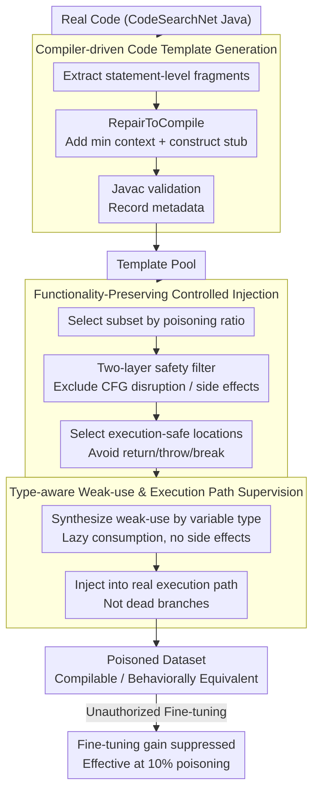

# Train in Vain: Functionality-Preserving Poisoning to Prevent Unauthorized Use of Code Datasets

**Conference**: ACL2026 Findings  
**arXiv**: [2604.22291](https://arxiv.org/abs/2604.22291)  
**Code**: To be confirmed (The paper claims open-source, but the repository URL is not provided in the local cache)  
**Area**: Code Large Language Models / Data Governance  
**Keywords**: Code Data Protection, Data Poisoning, Functionality Preserving, CodeLLM, Unauthorized Fine-tuning

## TL;DR
This paper proposes FunPoison, which injects execution-lazy weak-use fragments into real execution paths while keeping Java code compilable, executable, and functionally equivalent. Poisoning only 10% of the data significantly reduces the gains from unauthorized CodeLLM fine-tuning, demonstrating strong robustness against formatting, rewriting, static analysis, and detection-based cleaning.

## Background & Motivation
**Background**: The capabilities of CodeLLMs largely stem from large-scale public code datasets, such as CodeSearchNet and The Stack. Many authors do not authorize their data for model training; however, once data is crawled and used for fine-tuning, post-hoc accountability, copyright litigation, or watermark attribution often involves high costs, long cycles, and unstable results.

**Limitations of Prior Work**: Data poisoning can serve as proactive protection to prevent unauthorized training from yielding benefits. However, code data has specific requirements: ordinary users still need to compile, run, test, and integrate this code. Existing methods like CoProtector either break grammar or semantics, leading to a collapse in compilability, or only modify comments, resulting in weak poisoning effects that often require 100% poisoning to be effective.

**Key Challenge**: Protective poisoning must cause the model training to "learn incorrectly" without causing "failures" for human users. This requires poisoning fragments to generate distributional interference in the training token sequences while avoiding changes to observable program behavior and evading common cleaning and static analysis.

**Goal**: Ours aims to construct a functionality-preserving poisoning framework that can suppress unauthorized fine-tuning under realistic partial poisoning settings, while ensuring that normal code quality, compilation success rates, and execution behaviors remain unaffected.

**Key Insight**: FunPoison does not insert dead code or obviously "bad" code. Instead, it places short, compilable, and side-effect-free template fragments into the execution path and uses type-aware weak-use statements to ensure these fragments persist after static analysis and formatting. The key assumption is: fragments are lazy at runtime but not lazy during auto-regressive training, as the model must still learn these tokens.

**Core Idea**: Transforming "program-harmless" code fragments into "unauthorized model-harmful" training signals, allowing functionality preservation to coexist with training disruption.

## Method

### Overall Architecture
The threat model of FunPoison involves a data owner who releases code for normal use but does not authorize large-scale training. Attackers may collect this data, control the training process, and employ cleaning, formatting, static analysis, LLM rewriting, or supervised detection. The defense goal is not to make the poisoning undetectable, but to make it difficult for attackers to remove enough signals under reasonable false positive rates, semantic preservation, and cost constraints, thereby preventing unauthorized fine-tuning from significantly outperforming the base model.

The method consists of two main stages. Stage 1: Construction of a template pool. Statement-level fragments are extracted from real code, subjected to compilation repair, minimal context completion, type parsing, variable anonymization, and conflict metadata logging to retain portable templates. Stage 2: Controlled injection. A subset of data is selected based on the poisoning ratio, templates undergo safety filtering, execution-safe positions are identified in the host code, type-aware weak-uses are synthesized, and injection occurs after resolving naming conflicts. The resulting code remains compilable and functionally equivalent but exposes extra structural patterns to the model during training.

### Key Designs
1. **Compiler-driven Code Template Generation: Extracting compilable, transferable short fragments from real code.**
Simply copying code fragments often leads to compilation failure due to context dependencies; however, over-normalization makes patterns highly repetitive and easily detectable. FunPoison strikes a balance by extracting statement-level fragments from method bodies (rather than full functions) and using RepairToCompile to provide the necessary minimal context—importing standard library types, constructing lightweight stubs for non-JDK types, and rewriting isolated object constructions into forms received by variables. Finally, the fragments are verified using Javac. After verification, metadata such as variable/method/class names and placeholders are recorded for handling naming conflicts during injection. This ensures templates retain a realistic style while being capable of cross-project migration.

2. **Functionality-Preserving Controlled Injection: Inserting templates into host programs without altering observable behavior.**
Code data protection has a hard constraint: poisoning must not sacrifice the experience of developers. Compilation and runtime behavior must remain stable. FunPoison uses a two-layer safety filter: the conceptual layer excludes control-flow interruptions, reflection dependencies, and shared states, while the procedural layer excludes I/O, concurrency, process control, container mutations, and non-local assignments. Injection sites are chosen only in syntactically stable and semantically lazy locations within method bodies, avoiding `return`, `throw`, `break`, `continue`, boundary positions, or any observable side effects, with scope tracking and variable renaming implemented during injection.

3. **Type-aware Weak-use & Execution Path Supervision: Evading cleaning while interfering with training.**
If injected fragments are deleted as dead code by compilers, formatters, or static analysis, the poisoning fails. Conversely, if placed in `always-false` dead branches, the model cannot learn them. FunPoison synthesizes weak-use statements based on variable types, performing only lazy consumption (e.g., identity, metadata, or safety queries) to avoid side effects, and places these fragments in the real execution path. The underlying assumption is that the poisoning effect comes from the interference of the auto-regressive model's learning of the execution path's token distribution, rather than simply "seeing" template text. Mechanistic analysis supports this: weak-uses and template signatures highly co-occur in failed generations, whereas DeadBranchInsertion using the same template pool in dead branches fails to replicate the performance degradation.

### Loss & Training
FunPoison itself does not involve training a new model and thus lacks a new optimization loss. Experiments involve attackers fine-tuning CodeLLMs like DeepSeek-Coder, StarCoderBase, and CodeLlama. The evaluation assesses whether the poisoned dataset prevents the fine-tuned model from gaining improvements over the base model on HumanEval-X and MBPP. The primary metric is $\Delta Pass@k$, the difference in $Pass@k$ between the fine-tuned and base models; if the clean fine-tuning improvement disappears or becomes negative after FunPoison, the defense is considered effective.

## Key Experimental Results

### Main Results

| Setting | Metric | Base | Clean FT | FunPoison | Conclusion |
|--------|------|------|------|------|------|
| DeepSeek-Coder-1.3B / HumanEval-X | Pass@1, T=0.0 | 0.31 | 0.38 | 0.20 (10% poisoning) | 10% poisoning turns gains into degradation |
| CodeLlama-7B / HumanEval-X | Pass@1, T=0.0 | 0.29 | 0.31 | 0.23 (10% poisoning) | Gains suppressed at 7B scale |
| CodeLlama-7B-Instruct / HumanEval-X | Pass@1, T=0.0 | 0.30 | 0.38 | 0.30 (10% poisoning) | Gains essentially neutralized on instruct models |
| DeepSeek-1.3B / MBPP | Pass@1, T=0.0 | 0.31 | 0.41 | 0.16 (10% poisoning) | Strong degradation persists across benchmarks |

### Ablation Study

| Configuration | Poisoning Ratio | Pass@1 | Description |
|------|------|------|------|
| Base | - | 0.31 | Non-fine-tuned model |
| Clean fine-tuned | 0% | 0.38 | Normal fine-tuning yields gains |
| FunPoison | 10% | 0.20 | Significant degradation due to weak-use fragments |
| DeadBranchInsertion | 1% | 0.37 | Equivalent to clean FT with templates in dead branches |
| DeadBranchInsertion | 10% | 0.38 | Suggests template exposure alone is not the key |
| DeadBranchInsertion | 50% | 0.34 | High ratio still much weaker than FunPoison |
| DeadBranchInsertion | 100% | 0.35 | Full dead branch poisoning fails to replicate result |

| Functionality Metrics | Clean | FunPoison | Interpretation |
|------|------|------|------|
| Compilation success | 984/984 | 984/984 | 100% compilability maintained |
| p95 time overhead | Baseline | mean 2.29%, p95 25% | Low average time overhead |
| p95 memory overhead | Baseline | mean 0.09%, p95 2.41% | Minimal memory impact |
| Line coverage | 100% | 100% | Execution coverage unchanged |
| Execution jitter | 8.17% | 8.12% | Stability remains consistent |
| Behavior consistency | Preserved | Preserved | Outputs, exceptions, I/O remain identical |

| Defense/Cleaning Method | Key Results | Impact on FunPoison |
|------|------|------|
| LLM rewriting / CodeLlama | ACC 0.07, CodeBLEU 0.70, avg 76.42s | Low success rate and high cost |
| LLM rewriting / GPT-4 | ACC 0.06, CodeBLEU 0.56, avg 70.07s | Difficult even for stronger models to remove |
| CodeQL static analysis | Similar to clean, Rule 32: 4.3% | Standard rules cannot isolate poisoned samples |
| CodeBERT adaptive detector | FPR 100%, Accuracy 10.39% | Detector tends to over-report benign code |
| clang-format | Remains lower than clean FT and base | Layout changes do not remove training signals |

### Key Findings
- The most significant empirical result of FunPoison is the effectiveness of partial poisoning. While CoProtector usually requires 100% poisoning, FunPoison significantly suppresses fine-tuning gains at 10%.
- The DeadBranchInsertion ablation is compelling: identical templates placed outside the execution path lead to results similar to clean fine-tuning, proving that interference stems from execution-path supervision rather than the template text itself.
- Functionality preservation is thoroughly proven: all 984 tasks compile and run, and all 57,764 unit tests for Apache Commons Lang pass, showing the method does not rely on degrading code quality.
- Robustness experiments cover detection, cleaning, LLM rewriting, static analysis, and formatting. While they do not prove "irremediability," they show that common low-cost cleaning strategies have limited effects.

## Highlights & Insights
- The strongest point of the paper is the simultaneous optimization of "poisoning effectiveness" and "code availability." For code data governance, maintaining the experience of human users is a prerequisite for any mechanism.
- The explanation of the execution path supervision mechanism is vital. Fragments are harmless at runtime but serve as token supervisors during auto-regressive training, thereby affecting the code distribution learned by the model.
- The evaluation goes beyond $Pass@1$ to include dynamic analysis, real-project testing, rewriting attacks, and adaptive detectors, making it a comprehensive defense system assessment.

## Limitations & Future Work
- The paper systematically evaluates only Java. Other languages would require different parsers, compilers, weak-use designs, and side-effect filters. Transferability to Rust, Go, or C++ cannot be assumed.
- FunPoison depends on available insertion sites. While 80.3% of functions in CodeSearchNet Java had valid positions, highly compact or optimized code might lack space.
- The method is not theoretically unremovable. More aggressive training, pre-training from scratch, deduplication, semantic normalization, or RL-based adaptation might mitigate the effects.
- The method has dual-use potential. Responsible deployment requires transparent disclosure (e.g., via dataset cards or licenses), and it is not suitable for default deployment in open collaborative ecosystems.

## Related Work & Insights
- **vs CoProtector**: CoProtector disrupts code or comments via various transformations, often sacrificing compilability or requiring 100% poisoning; FunPoison treats functionality as a hard constraint and is effective at 10%.
- **vs Code Watermarking/Attribution**: Watermarking is typically post-hoc; FunPoison is a proactive deterrent to reduce fine-tuning gains.
- **vs Backdoor Attacks**: Many poisoning studies target specific misbehaviors; ours is untargeted deterrence with preserved code behavior.
- **Insight**: Technical disruption must be combined with access control and legal licensing to form a comprehensive data governance framework.

## Rating
- Novelty: ⭐⭐⭐⭐☆ Functionality-preserving code poisoning and execution path supervision are highly distinct from destructive methods.
- Experimental Thoroughness: ⭐⭐⭐⭐⭐ Comprehensive coverage of models, benchmarks, defenses, real projects, and dynamic analysis.
- Writing Quality: ⭐⭐⭐⭐☆ Clear structure with well-defined threat models and responsibility boundaries.
- Value: ⭐⭐⭐⭐☆ Provides significant insights into code data governance and unauthorized fine-tuning protection, though deployment requires caution.

<!-- RELATED:START -->

## Related Papers

- [\[ACL 2025\] Can LLM Watermarks Robustly Prevent Unauthorized Knowledge Distillation?](../../ACL2025/llm_safety/llm_watermark_distillation_robustness.md)
- [\[NeurIPS 2025\] ImageSentinel: Protecting Visual Datasets from Unauthorized Retrieval-Augmented Image Generation](../../NeurIPS2025/llm_safety/imagesentinel_protecting_visual_datasets_from_unauthorized_retrieval-augmented_i.md)
- [\[ACL 2026\] PARASITE: Conditional System Prompt Poisoning to Hijack LLMs](parasite_conditional_system_prompt_poisoning_to_hijack_llms.md)
- [\[ACL 2026\] AgentMark: Utility-Preserving Behavioral Watermarking for Agents](agentmark_utility-preserving_behavioral_watermarking_for_agents.md)
- [\[ACL 2026\] Knowledge Poisoning Attacks on Medical Multi-Modal Retrieval-Augmented Generation](knowledge_poisoning_attacks_on_medical_multi-modal_retrieval-augmented_generatio.md)

<!-- RELATED:END -->
