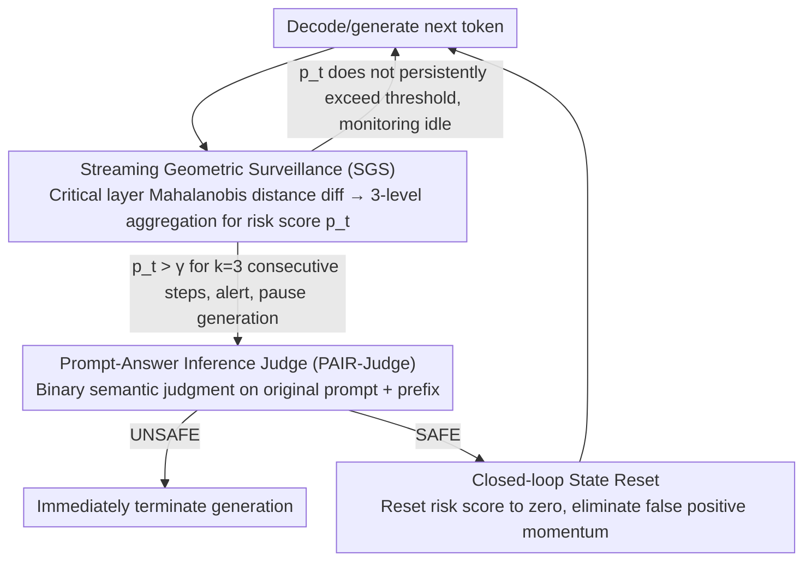

# TrajGuard: Streaming Hidden-state Trajectory Detection for Decoding-time Jailbreak Defense

**Conference**: ACL 2026 Findings  
**arXiv**: [2604.07727](https://arxiv.org/abs/2604.07727)  
**Code**: None  
**Area**: LLM Alignment / AI Safety  
**Keywords**: Jailbreak Defense, Hidden-state Trajectory, Decoding-time Detection, Real-time Safety, Training-free Defense

## TL;DR

This paper proposes TrajGuard, a training-free decoding-time jailbreak defense framework. By aggregating hidden-state trajectories from critical layers using a sliding window to quantify risk in real-time, it triggers a lightweight semantic judge only when the risk persistently exceeds a threshold. It achieves a 95% average defense rate across 12 jailbreak attacks, with a detection latency of only 5.2ms/token and a false positive rate below 1.5%.

## Background & Motivation

**Background**: LLMs are deeply integrated into real-world services, making their safety critical. Despite rigorous safety alignment training (e.g., RLHF), carefully constructed jailbreak attacks can still bypass safety guardrails, achieving high attack success rates even on RLHF-aligned models.

**Limitations of Prior Work**: Existing defenses primarily rely on static detection—either filtering prompts at the input stage (e.g., Llama Guard) or inspecting full responses at the output stage. Input filtering fails to detect semantically disguised jailbreak prompts, while output filtering, though more effective, requires complete response generation before review, introducing non-negligible end-to-end latency. Some methods utilizing internal activations still operate on static prompt representations and rely on high-dimensional geometric scores with poor interpretability.

**Key Challenge**: Jailbreak risk is not triggered instantaneously at a single moment but accumulates progressively through malicious intent within the context during the decoding process. Existing methods treat safety detection as a discrete binary classification task, ignoring the dynamic evolution of semantics during decoding—a critical blind spot in current defense paradigms.

**Goal**: Leverage the dynamic trajectory of hidden states during decoding to achieve real-time jailbreak detection without relying on additional trained safety models.

**Key Insight**: The authors found a "camouflaged-exposed" pattern through empirical analysis: jailbreak prompts are entangled with benign prompts in the latent space (semantic camouflage). However, once the model begins generating specific harmful steps, the hidden states continuously drift toward malicious regions. This drift appears in the early segments of decoding.

**Core Idea**: Use the temporal trajectory of hidden states during decoding as a jailbreak detection signal. A coarse-to-fine architecture consisting of "streaming geometric monitoring + on-demand semantic judgment" enables low-overhead, real-time jailbreak interception.

## Method

### Overall Architecture

TrajGuard aims to terminate generation at the moment a jailbreak is "about to be exposed" without retraining any safety models. It splits detection into two coarse-to-fine lines of defense: for every token generated, the lightweight **Streaming Geometric Surveillance (SGS)** monitors the hidden-state trajectory to calculate a risk score. Most benign interactions end here with nearly zero overhead. Only when the risk score remains abnormal and SGS triggers an alert is generation paused to wake the expensive **Semantic Judge (PAIR-Judge)** for a formal semantic verdict. If the judge rules UNSAFE, generation is terminated; if SAFE, the **Closed-loop State Reset** clears the accumulated risk in SGS and generation continues. Thus, the system only incurs high costs when "something suspicious happens," running in an inexpensive "monitor-only" mode otherwise.

### Key Designs

**1. Streaming Geometric Surveillance (SGS): Extracting a stable "drifting toward malicious" signal from jittery hidden states**

Analyzing hidden states per token is noisy; a single-step judgment can be easily misled by transient fluctuations. True jailbreaking involves hidden states persistently staying in high-risk zones. SGS uses MVD (Mean Vector Difference) to pick Top-K (K=8) critical layers most sensitive to benign vs. malicious patterns and fits Gaussian distributions for both modes on these layers. During decoding, it calculates the Mahalanobis distance difference $r_{l,t} = d^{\mathcal{B}}_{l,t} - d^{\mathcal{M}}_{l,t}$ for each token, where higher values indicate closer proximity to malicious regions. To suppress noise, $r_{l,t}$ undergoes three levels of aggregation: a sliding window (w=8) truncated mean within each layer to remove outliers, averaging across the K layers, and temporal smoothing via EWMA to obtain a stable risk score $p_t$. Crucially, the trigger condition is not "one step over the line" but requires $p_t$ to exceed the threshold $\gamma$ for **$k=3$ consecutive steps**. This delay mechanism filters out transient geometric noise.

**2. Prompt-Answer Inference Judge (PAIR-Judge): Geometric proximity does not equal semantic malice**

SGS provides distance signals in high-dimensional space. However, safe but sensitive topics (e.g., discussing cybersecurity) might also be geometrically close to malicious regions. To avoid false positives, PAIR-Judge pauses generation upon an alert, wraps the full context—original prompt $x$ and prefix $y_{\leq t}$—into a safety system prompt template $\mathcal{P}$, and passes it to a safety-aligned LLM for a binary verdict $d = \mathcal{M}_{judge}(\mathcal{P}(x, y_{\leq t}))$. This step translates abstract internal geometric signals into interpretable safety decisions.

**3. Closed-loop State Reset: Preventing a single scare from causing sequential false positives**

The risk score in SGS carries historical momentum due to EWMA. If benign content accidentally triggers the judge and is ruled SAFE, residual risk momentum could keep $p_t$ near the alert line for subsequent steps, causing repeated triggers. State Reset provides a safeguard: whenever the judge rules SAFE, the risk score $S_t$ is forced back to its initial safety value, clearing the accumulated momentum from the "false positive."

### Mechanism: Cutting off a GCG Jailbreak

Consider a jailbreak prompt optimized by GCG that appears benign via semantic camouflage. At $t=0$, its hidden states almost overlap with benign prompts in the latent space; SGS calculates a low $p_t$, and the system remains in "monitor-only" mode. As the model begins generating specific harmful steps, the hidden states drift towards the malicious centroid, $r_{l,t}$ turns positive, and $p_t$ rises. When $p_t$ exceeds $\gamma$ for **3 consecutive steps**, SGS alerts and pauses generation. PAIR-Judge takes over, judges the "prompt + harmful prefix" as UNSAFE, and generation is terminated. The cost of the semantic judge is only paid once at the moment of the trigger, resulting in an average latency of 5.2ms/token. In contrast, for a sensitive but legal query, any occasional $p_t$ spike triggering the judge is countered by a SAFE verdict and a subsequent State Reset, allowing the conversation to continue smoothly.

### Loss & Training

TrajGuard is entirely training-free. It requires one pre-processing step: using 8,000 benign instructions and 10,000 malicious instructions to estimate the distribution (centroids and covariance matrices) of safe/unsafe regions in the hidden space. Due to high dimensionality, shrinkage regularization $\widehat{\Sigma}_{\star,l} = \Sigma_{\star,l} + \lambda I$ is used for numerical stability. Afterward, it can be plugged into any open-source LLM without fine-tuning.

## Key Experimental Results

### Main Results

| Model | Defense Method | Avg. ASR (12 attacks) ↓ | Best Single Attack ASR |
|-----|-----|-----|-----|
| Llama-2-7B | No Defense | 0.52 | - |
| Llama-2-7B | Llama Guard 3 | 0.20 | GCG: 0.02 |
| Llama-2-7B | Qwen3Guard | 0.07 | GCG: 0.00 |
| Llama-2-7B | **TrajGuard** | **0.02** | Most attacks: 0.00 |
| Llama-3.1-8B | No Defense | 0.57 | - |
| Llama-3.1-8B | **TrajGuard** | **0.04** | - |
| Mistral-7B | No Defense | 0.75 | - |
| Mistral-7B | **TrajGuard** | **0.05** | - |

| Metric | TrajGuard Performance |
|-----|-----|
| Avg. Defense Rate | 95% |
| Detection Latency | 5.2 ms/token |
| False Positive Rate (XSTest) | < 1.5% |
| Alpaca Task Preservation | High |

### Ablation Study

| Configuration | Key Impact | Description |
|-----|-----|-----|
| Full TrajGuard | AVG ASR ≈ 0.02-0.05 | Full model |
| w/o PAIR-Judge | FPR Increase | Geometric monitoring alone misjudges safe but sensitive content |
| w/o State Reset | Sequential FP | Continuous alerts after the first false trigger |
| w/o Persistent Trigger | Increased Noise | Per-step judgment is easily affected by transient fluctuations |
| Window Size w | w=8 is optimal | Too small increases noise; too large increases latency |

### Key Findings

- **Hidden-state trajectories provide stronger and more stable signals than input prompts**: Jailbreak prompts overlap with benign ones at $t=0$ but drift toward malicious regions once decoding starts.
- **Significant differences in "drift latency" across models**: Llama-2-7B starts deteriorating only after 37 steps, while Vicuna-7B drops almost immediately, reflecting differences in alignment robustness.
- **TrajGuard reduces ASR to near 0 for most attacks**, particularly GCG, AutoDAN, and PAIR.
- Cipher-class attacks are the only type with a remaining success rate (ASR 0.10-0.25), likely because encrypted input patterns in hidden space differ from standard jailbreaks.

## Highlights & Insights

- **The "Camouflaged-Exposed" observation is insightful**: Semantic camouflage works at the input stage, but once a model generates harmful steps, internal representations inevitably drift toward malicious regions.
- **The coarse-to-fine hierarchical design is highly practical**: Most tokens only incur the light overhead of geometric monitoring (5.2ms/token), invoking the expensive semantic judge only during suspected risks.
- **The training-free nature** allows it to be plugged into any open-source LLM without additional data or fine-tuning costs.
- **The Closed-loop State Reset mechanism** can be transferred to other anomaly detection systems to solve the "serial false positive" problem.

## Limitations & Future Work

- It requires pre-constructing distribution estimates, depending on the quality and coverage of the 8K+10K labeled data.
- Defense against Cipher-style encrypted attacks is relatively weak, as hidden states may not fully expose the malicious intent of encrypted inputs.
- Only validated on 7B-8B scale open-source models; applicability to larger or closed-source models is unknown.
- PAIR-Judge uses the target model itself as a judge, which may lead to decreased quality if the model's own alignment is weak.

## Related Work & Insights

- **vs Llama Guard 3**: Static input/output filters cannot utilize dynamic information during decoding. TrajGuard significantly outperforms it on almost all attacks.
- **vs SafeDecoding (Xu et al., 2024)**: Requires training a safety expert model to re-weight decoding probabilities; TrajGuard uses the base model's hidden states without training.
- **vs ShieldHead (Xuan et al., 2025)**: Attaching token-level safety heads requires training and remains a static per-token judgment without temporal modeling.
- **vs Goal Prioritization (Zhang et al., 2024)**: Performs poorly on some models (AVG ASR 0.44 on Mistral-7B), suggesting prompt engineering lacks robustness against varied attacks.

## Rating

- Novelty: ⭐⭐⭐⭐⭐ First to use decoding-time hidden-state trajectories for jailbreak detection; "camouflaged-exposed" observation is compelling.
- Experimental Thoroughness: ⭐⭐⭐⭐⭐ Comprehensive evaluation across 12 attacks, 4 models, and multiple baselines.
- Writing Quality: ⭐⭐⭐⭐ Clear structure, natural motivation, and rich visualizations.
- Value: ⭐⭐⭐⭐⭐ High practical value as a training-free, low-latency, and high-defense real-time solution.

<!-- RELATED:START -->

## Related Papers

- [\[ICLR 2026\] Inference-Time Backdoors via Hidden Instructions in LLM Chat Templates](../../ICLR2026/llm_safety/inference-time_backdoors_via_hidden_instructions_in_llm_chat_templates.md)
- [\[ACL 2026\] Rethinking Jailbreak Detection of Large Vision Language Models with Representational Contrastive Scoring](rethinking_jailbreak_detection_of_large_vision_language_models_with_representati.md)
- [\[ACL 2026\] LeakDojo: Decoding the Leakage Threats of RAG Systems](leakdojo_decoding_the_leakage_threats_of_rag_systems.md)
- [\[ACL 2025\] CAVGAN: Unifying Jailbreak and Defense of LLMs via Generative Adversarial Attacks](../../ACL2025/llm_safety/cavgan_unifying_jailbreak_and_defense_of_llms_via_generative_adversarial_attacks.md)
- [\[ACL 2026\] Robust Multimodal Safety via Conditional Decoding](robust_multimodal_safety_via_conditional_decoding.md)

<!-- RELATED:END -->
