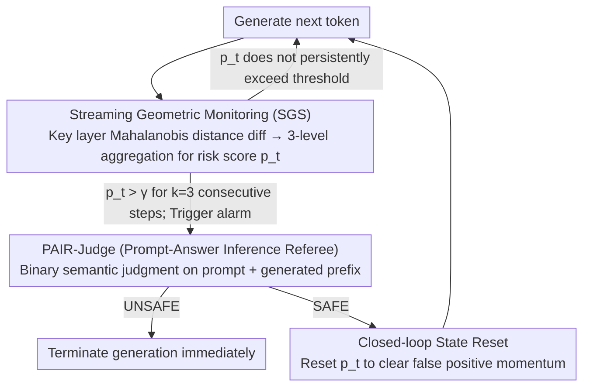

# TrajGuard: Streaming Hidden-state Trajectory Detection for Decoding-time Jailbreak Defense

**Conference**: ACL 2026 Findings  
**arXiv**: [2604.07727](https://arxiv.org/abs/2604.07727)  
**Code**: None  
**Area**: LLM Alignment / AI Safety  
**Keywords**: Jailbreak defense, Hidden-state trajectory, Decoding-time detection, Real-time safety, Training-free defense

## TL;DR

This paper proposes TrajGuard, a training-free decoding-time jailbreak defense framework. By aggregating key-layer hidden-state trajectories via a sliding window to quantify risk in real-time, it triggers a lightweight semantic judge only when risks persistently exceed a threshold. TrajGuard achieves a 95% average defense rate across 12 jailbreak attacks with a detection latency of only 5.2ms/token and a false positive rate below 1.5%.

## Background & Motivation

**Background**: LLMs are deeply integrated into real-world services, making their security critical. Despite rigorous safety alignment training (e.g., RLHF), carefully constructed jailbreak attacks can still bypass safety guardrails, achieving high attack success rates on RLHF-aligned models.

**Limitations of Prior Work**: Existing defenses primarily rely on static detection—either filtering prompts at the input stage (e.g., Llama Guard) or inspecting full responses at the output stage. Input filtering fails to detect semantically camouflaged jailbreak prompts, while output filtering, though more effective, requires generating the entire response before review, introducing non-negligible end-to-end latency. Some methods utilizing internal model activations still operate on static prompt representations and rely on high-dimensional geometric scores, which lack interpretability.

**Key Challenge**: Jailbreak risk is not triggered instantaneously at a single moment but is gradually accumulated through malicious intent within the context during the decoding process. Existing methods treat safety detection as a discrete binary classification task, ignoring the dynamic evolution of semantics during decoding—a critical blind spot in the current defense paradigm.

**Goal**: To utilize the dynamic trajectories of hidden states during the decoding process for real-time jailbreak detection without relying on additional trained safety models.

**Key Insight**: The authors' empirical analysis reveals a critical "Camouflage-Exposure" pattern: jailbreak prompts are entangled with benign prompts in the latent space (semantic camouflage). However, once the model begins generating specific harmful steps, the hidden states continuously drift toward malicious regions. This drift appears even in the early stages of decoding segments.

**Core Idea**: Use the temporal trajectory of hidden states during decoding as the jailbreak detection signal. Through a coarse-to-fine architecture of "Streaming Geometric Monitoring + On-demand Semantic Judge," real-time jailbreak interception is achieved with low overhead.

## Method

### Overall Architecture

TrajGuard aims to terminate generation the moment a jailbreak is "about to be exposed" without retraining any safety models. It splits detection into two coarse-to-fine lines of defense: for every token decoded, the lightweight **Streaming Geometric Monitoring (SGS)** first monitors the hidden state trajectory to calculate a risk score $p_t$. Most benign interactions terminate here with near-zero additional overhead. Only when the risk score remains persistently abnormal and the SGS triggers an alarm is generation paused to wake the expensive **Semantic Judge (PAIR-Judge)** for a formal semantic verdict. If the judge rules UNSAFE, generation is terminated immediately; if ruled SAFE, a **Closed-loop State Reset** clears the risk accumulated by the SGS and generation continues. Thus, the entire pipeline incurs high costs only when "something is suspected," while running in a cheap "monitoring-only" mode otherwise.

### Key Designs

**1. Streaming Geometric Monitoring (SGS): Extracting stable "malicious-leaning" signals from noisy hidden states**

Observing hidden states token-by-token is noisy—single-step judgments are easily biased by transient fluctuations. Genuine jailbreaking is not a sudden one-step event but a persistence of hidden states in high-risk regions. SGS identifies Top-K (K=8) key layers most sensitive to benign vs. malicious patterns using MVD (Mean Vector Difference) and fits Gaussian distributions for both modes. During decoding, it calculates the Mahalanobis distance difference for each token from the benign and malicious centroids: $r_{l,t} = d^{\mathcal{B}}_{l,t} - d^{\mathcal{M}}_{l,t}$. A larger difference indicates proximity to the malicious region. To suppress noise, $r_{l,t}$ undergoes three levels of aggregation: a sliding window ($w=8$) truncated mean within each layer to remove outliers, across-layer averaging for the K layers, and finally EWMA for temporal smoothing to obtain a stable risk score $p_t$. Crucially, the trigger condition is not "crossing the line once" but requiring $p_t$ to exceed the threshold $\gamma$ for **$k=3$ consecutive steps**. This lag mechanism filters out transient geometric noise, ensuring only a sustained drift toward malicious intent activates the expensive downstream judge.

**2. PAIR-Judge (Prompt-Answer Inference Referee): Geometric proximity does not equal semantic malice**

SGS provides distance signals in high-dimensional space. Safe yet sensitive topics (e.g., discussing cybersecurity) might geometrically approach malicious regions. Blocking these directly would cause false positives. Consequently, when an alarm is triggered, PAIR-Judge pauses generation, wraps the full context—original prompt $x$ and generated prefix $y_{\leq t}$—into a safety system prompt template $\mathcal{P}$, and queries a safety-aligned LLM for a binary judgment $d = \mathcal{M}_{judge}(\mathcal{P}(x, y_{\leq t}))$. This step translates abstract internal geometric signals into "understandable and clear" safety decisions, providing semantic verification while maintaining interpretability.

**3. Closed-loop State Reset: Preventing a single scare from causing cascading false positives**

SGS risk scores carry historical momentum (EWMA). If a benign piece of content accidentally grazes a high-risk region and is judged SAFE by PAIR-Judge, the residual momentum would keep the score near the alarm line for the next few steps, repeatedly triggering the judge. State Reset provides a failsafe: whenever the semantic judge rules SAFE, the SGS risk score $S_t$ is forcibly reset to its initial safe value, clearing the "false positive" momentum. This ensures a misfire does not evolve into a chain of false alarms—a logic that could be applied to other anomaly detection systems.

### Loss & Training

TrajGuard is entirely training-free. It requiring only a preprocessing step: using 8,000 benign instructions and 10,000 malicious instructions to estimate the distribution (centroids and covariance matrices) of safe/unsafe regions in the hidden space. Due to high dimensionality and numerical instability, shrinkage regularization $\widehat{\Sigma}_{\star,l} = \Sigma_{\star,l} + \lambda I$ is applied. TrajGuard can then be plugged into any open-source LLM without fine-tuning.

## Key Experimental Results

### Main Results

| Model | Defense Method | Avg ASR (12 attacks) ↓ | Best Single Attack ASR |
|------|---------|-----------------|-------------|
| Llama-2-7B | No Defense | 0.52 | - |
| Llama-2-7B | Llama Guard 3 | 0.20 | GCG: 0.02 |
| Llama-2-7B | Qwen3Guard | 0.07 | GCG: 0.00 |
| Llama-2-7B | **TrajGuard** | **0.02** | Most attacks: 0.00 |
| Llama-3.1-8B | No Defense | 0.57 | - |
| Llama-3.1-8B | **TrajGuard** | **0.04** | - |
| Mistral-7B | No Defense | 0.75 | - |
| Mistral-7B | **TrajGuard** | **0.05** | - |

| Metric | TrajGuard Performance |
|------|---------------|
| Avg Defense Rate | 95% |
| Detection Latency | 5.2 ms/token |
| False Positive Rate (XSTest) | < 1.5% |
| Alpaca Performance Retention | High (see paper) |

### Ablation Study

| Configuration | Key Impact | Description |
|------|---------|------|
| Full TrajGuard | AVG ASR ≈ 0.02-0.05 | Complete model |
| w/o PAIR-Judge | High False Positives | Geometric monitoring alone misjudges sensitive content |
| w/o State Reset | Cascading False Positives | Repeated alarms following a misfire |
| w/o Persistent Trigger | Increased Noise | Single-step judgments affected by transient spikes |
| Different window $w$ | $w=8$ is optimal | Small $w$ is noisy; large $w$ increases latency |

### Key Findings

- **Hidden-state trajectories provide stronger and more stable jailbreak signals than input prompts**: Jailbreak prompts are entangled with benign ones in latent space (overlapping at $t=0$), but hidden states continuously drift toward malicious regions once decoding begins.
- **Significant "Drift Latency" differences between models**: Llama-2-7B starts deteriorating only after 37 steps, whereas Vicuna-7B drops almost immediately, reflecting differences in safety alignment robustness.
- **TrajGuard reduces ASR to near zero on most attacks**, particularly excelling against GCG, AutoDAN, PAIR, etc.
- **Cipher-based attacks** are the only type retaining some success (ASR 0.10-0.25), possibly because encrypted inputs exhibit different representation patterns in hidden space compared to standard jailbreaks.

## Highlights & Insights

- **The "Camouflage-Exposure" observation is ingenious**: Semantic camouflage in jailbreak prompts is effective at the input stage, but once the model generates harmful steps, internal representations inevitably drift. This shifts jailbreak detection from a static classification problem to dynamic trajectory monitoring.
- **The coarse-to-fine hierarchical design is highly practical**: Most of the time, only lightweight geometric monitoring (5.2ms/token) is active, calling the expensive semantic judge only when risk is suspected, achieving an excellent balance of accuracy and efficiency.
- **Training-free** nature allows it to be plugged into any open-source LLM without additional safety data or fine-tuning costs.
- **The Closed-loop State Reset mechanism** can be transferred to other anomaly detection systems to solve the universal issue of "cascading false positives."

## Limitations & Future Work

- It requires pre-building distribution estimates of benign/malicious regions, depending on the quality and coverage of the 8K+10K labeled datasets.
- Defense against Cipher-based encryption attacks is relatively weak, as hidden states may not fully expose the malicious intent of encrypted inputs.
- Validated only on 7B-8B scale open-source models; applicability to larger or closed-source models is unknown.
- PAIR-Judge uses the target model itself as a referee; judging quality may drop if the model's own safety alignment is weak.

## Related Work & Insights

- **vs. Llama Guard 3**: Static filters cannot utilize dynamic decoding information. TrajGuard significantly outperforms them on almost all attacks.
- **vs. SafeDecoding (Xu et al., 2024)**: Requires training a safety expert model to re-weight probabilities; TrajGuard is training-free and uses the base model's own hidden states.
- **vs. ShieldHead (Xuan et al., 2025)**: Attaching token-level safety heads requires training and remains a per-token static judgment without temporal modeling.
- **vs. Goal Prioritization (Zhang et al., 2024)**: Performs poorly on some models (AVG ASR 0.44 on Mistral-7B), indicating prompt-engineering methods lack robustness against attacks.

## Rating

- Novelty: ⭐⭐⭐⭐⭐ First to use decoding-time hidden-state trajectories for jailbreak detection; "Camouflage-Exposure" observation is novel and convincing.
- Experimental Thoroughness: ⭐⭐⭐⭐⭐ Comprehensive evaluation across 12 attacks, 4 models, various baselines, and ablation studies.
- Writing Quality: ⭐⭐⭐⭐ Clear structure, natural motivation, and rich visualizations.
- Value: ⭐⭐⭐⭐⭐ Extremely high practical value as a training-free, low-latency, and high-defense-rate real-time solution.

<!-- RELATED:START -->

## Related Papers

- [\[ICLR 2026\] HiddenEcho: Mitigating Noise Amplification in Differentially Private LLMs with Hidden-State Correction](../../ICLR2026/llm_safety/hiddenecho_mitigating_noise_amplification_in_differentially_private_llms_with_hi.md)
- [\[ACL 2026\] LeakDojo: Decoding the Leakage Threats of RAG Systems](leakdojo_decoding_the_leakage_threats_of_rag_systems.md)
- [\[ACL 2026\] Rethinking Jailbreak Detection of Large Vision Language Models with Representational Contrastive Scoring](rethinking_jailbreak_detection_of_large_vision_language_models_with_representati.md)
- [\[ACL 2026\] Robust Multimodal Safety via Conditional Decoding](robust_multimodal_safety_via_conditional_decoding.md)
- [\[ICLR 2026\] GraphShield: Graph-Theoretic Modeling of Network-Level Dynamics for Robust Jailbreak Detection](../../ICLR2026/llm_safety/graphshield_graph-theoretic_modeling_of_network-level_dynamics_for_robust_jailbr.md)

<!-- RELATED:END -->
