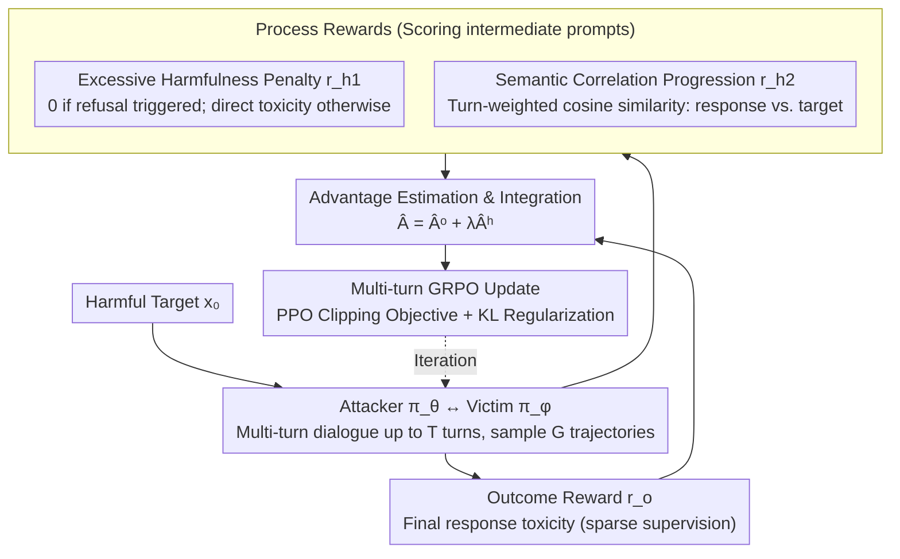

# TROJail: Trajectory-Level Optimization for Multi-Turn Large Language Model Jailbreaks with Process Rewards

**Conference**: ACL 2026  
**arXiv**: [2512.07761](https://arxiv.org/abs/2512.07761)  
**Code**: [GitHub](https://github.com/xxiqiao/TROJail)  
**Area**: AI Safety / LLM Reasoning  
**Keywords**: Multi-turn Jailbreak Attacks, Trajectory-Level Optimization, Process Rewards, Reinforcement Learning, Red Teaming

## TL;DR

This paper models automated multi-turn jailbreak attacks as a multi-turn reinforcement learning problem and proposes TROJail. By introducing two heuristic process rewards (penalty for excessive toxicity and semantic correlation progression), it alleviates the sparse supervision issue of outcome rewards, significantly improving attack success rates across multiple models and benchmarks.

## Background & Motivation

**Background**: LLMs face security threats from jailbreak attacks. Multi-turn jailbreak attacks have gained attention as they reflect real interaction scenarios. Existing training-based methods utilize DPO or rejection sampling fine-tuning to optimize the attacker LLM independently for each turn.

**Limitations of Prior Work**: (1) Per-turn optimization is short-sighted—maximizing the toxicity of immediate responses in each turn fails to learn cross-turn long-term attack strategies; (2) Early prompts that are seemingly harmless but strategically critical are undervalued because they do not trigger immediate harmful responses; (3) Training-free methods rely on manually designed strategies, requiring extensive trials and easily failing when the victim model deviates from expectations.

**Key Challenge**: Trajectory-level optimization is a natural solution, but relying solely on the toxicity of the final response as an outcome reward faces severe sparse supervision—the attacker cannot easily infer how intermediate prompts contribute to the final attack success.

**Goal**: Design richer intermediate feedback signals to estimate the utility of intermediate prompts, thereby supporting the learning of long-term attack strategies.

**Key Insight**: Controlled experiments reveal two empirical patterns: (1) Moderately harmful intermediate prompts are most effective, while excessively harmful ones trigger refusal mechanisms and lead to failure; (2) The semantic correlation of responses in successful trajectories increases progressively, whereas failed trajectories do not exhibit this pattern.

**Core Idea**: Introduce two process rewards—the excessive toxicity penalty $r_{h_1}$ and semantic correlation progression $r_{h_2}$—into a multi-turn GRPO framework. These are integrated into advantage estimation to provide fine-grained training signals for intermediate prompts.

## Method

### Overall Architecture

TROJail treats "automated multi-turn jailbreak" as a multi-turn reinforcement learning problem to train an attacker. Given a harmful target $x_0$, the attacker $\pi_\theta$ and victim model $\pi_\phi$ engage in back-and-forth dialogue for up to $T$ turns, sampling $G$ trajectories. The toxicity of the final response serves as the outcome reward $r_o$. The problem is that this reward only exists in the final turn, leaving intermediate "seemingly harmless yet strategically critical" foreshadowing prompts without any credit, resulting in extremely sparse supervision. TROJail's solution is to insert two additional **process rewards** $r_{h_1}$ and $r_{h_2}$ to score intermediate prompts. These are converted into process advantages and combined with the outcome advantage as $\hat{A}_{i,t} = \hat{A}_{i,t}^o + \lambda \hat{A}_{i,t}^h$, optimized via a multi-turn GRPO with a PPO-style clipping objective. This approach focuses on both the final breakthrough and providing fine-grained gradients for every preparatory step.

### Key Designs

**1. Excessive Harmfulness Penalty $r_{h_1}$: Preventing early detection by teaching the attacker "moderation"**

A common issue in per-turn optimization is blindly pushing every response toward maximum harmfulness, which often makes intermediate prompts too explicit and triggers the victim's refusal mechanism, causing the attack to fail immediately. Controlled experiments show an **inverted U-shape** relationship between intermediate prompt toxicity and final attack success—moderate harmfulness is optimal. $r_{h_1}$ incorporates this into the reward: if an intermediate response triggers a refusal, $r_{h_1} = 0$; otherwise, it takes the value of the direct toxicity $r(x_0, y_t)$. This encourages the attacker to maintain a level of "pushing forward without cross the line," rather than maximum toxicity in every turn.

**2. Semantic Correlation Progression $r_{h_2}$: Building momentum toward the target**

Harmfulness alone is insufficient as it often stays low until the final turn. Successful trajectories exhibit a more reliable signal: the semantic correlation between the response and the original harmful target **increases steadily**. TROJail calculates $r_{h_2}$ using the cosine similarity of sentence embeddings between the response and the original harmful prompt, weighted by the turn progression:

$$r_{h_2}(x_t) = \frac{t}{|\tau|} \cdot \text{cosine}(e(x_0), e(y_t))$$

Later turns receive higher weights, forcing the attacker to steadily pull the semantic content toward the target. Compared to outcome rewards, this signal provides progressive and differentiable guidance across the entire trajectory.

**3. Process Advantage Estimation & Integration: Accumulating heuristic rewards into future advantages**

TROJail converts $r_{h_1}$ and $r_{h_2}$ into normalized values within a set $\mathcal{D}_h$ and computes the cumulative future rewards to derive the normalized process advantage:

$$\hat{A}_{i,t}^h = \sum_{s=t}^{|\tau_i|} \frac{r_h(x_{i,s}) - \text{mean}(\mathcal{D}_h)}{\text{std}(\mathcal{D}_h)}$$

The final advantage $\hat{A}_{i,t} = \hat{A}_{i,t}^o + \lambda \hat{A}_{i,t}^h$ combines global direction from the outcome with local strategy from the process rewards, with $\lambda$ balancing the two. This "future accumulation" allows an early, seemingly harmless prompt to receive positive credit if it leads to subsequent semantic progression, enabling the model to learn "foreshadowing before triggering" strategies.

### Loss & Training

The model is optimized using a multi-turn GRPO with PPO-style clipping and KL regularization. The attacker is based on Qwen2.5-3B-Instruct, while victims include Llama-3.1-8B, Qwen2.5-7B, Gemma-2-9B, and Mistral-7B.

## Key Experimental Results

### Main Results

**Comparison of average Attack Success Rate (ASR) across models**

| Method | Type | Average ASR |
|------|------|---------|
| ActorAttack | Training-free multi-turn | ~60% |
| HARM | Training-based per-turn | ~58% |
| Siren (DPO) | Training-based per-turn | ~65% |
| **TROJail** | Training-based trajectory-level | **~72%** |

### Ablation Study

**Process Reward Ablation**

| Configuration | Description |
|------|------|
| w/o Both Process Rewards | Degenerates to pure MT-GRPO; ASR drops significantly |
| w/o Excessive Harmfulness Penalty | Attacker produces overly aggressive prompts, triggering more refusals |
| w/o Semantic Progression | Intermediate turns easily drift away from the target harmful content |

### Key Findings

- TROJail consistently outperforms per-turn optimization methods across all victim models and benchmarks.
- Both process rewards contribute substantially, though semantic progression is more critical for longer trajectories.
- Controlled experiments validate the inverted U-shape relationship—intermediate prompts of levels L3-L4 are most effective.
- Trajectory visualization shows that TROJail learns long-term "foreshadowing" strategy patterns.

## Highlights & Insights

- The discovery of two empirical patterns serves as the foundation—quantifying the utility of intermediate prompts through rigorous controlled experiments.
- Modeling multi-turn jailbreaks as a multi-turn RL problem is a natural and elegant perspective, with process reward designs supported by both theory and empirical evidence.
- While focusing on attacks, the findings directly inform defense by providing a better understanding of how sophisticated multi-turn strategies bypass safety guardrails.

## Limitations & Future Work

- Success evaluation relies on external toxicity classifiers, which may not be perfect.
- Evaluation is limited to 7-9B scale victim models; larger or newer models have not been tested.
- Process rewards are heuristic; more sophisticated intermediate signals may exist.
- Ethical considerations—public disclosure of attack methods could be misused and requires responsible disclosure.

## Related Work & Insights

- **vs Siren/MTSA (DPO per-turn)**: The latter optimizes each turn independently, failing to learn cross-turn strategies. TROJail's trajectory-level optimization discovers long-term patterns.
- **vs ActorAttack (Training-free)**: The latter relies on fixed templates and collapses when model behavior deviates; TROJail learns strategies automatically via RL.
- **vs MT-GRPO**: Pure outcome rewards suffer from sparse supervision; TROJail’s process rewards provide critical intermediate guidance.

## Rating

- Novelty: ⭐⭐⭐⭐ Innovative modeling of multi-turn jailbreaks as RL with process rewards.
- Experimental Thoroughness: ⭐⭐⭐⭐⭐ Comprehensive evaluation across 4 victims and 3 benchmarks plus detailed ablation.
- Writing Quality: ⭐⭐⭐⭐ Clear logic from empirical observation to methodological design.
- Value: ⭐⭐⭐⭐ Significant contribution to LLM safety research with implications for both attack and defense.

<!-- RELATED:START -->

## Related Papers

- [\[ACL 2026\] Multi-component Causal Tracing in Large Language Models](multi-component_causal_tracing_in_large_language_models.md)
- [\[ACL 2026\] SharedRequest: Privacy-Preserving Model-Agnostic Inference for Large Language Models](sharedrequest_privacy-preserving_model-agnostic_inference_for_large_language_mod.md)
- [\[ACL 2026\] Instant Personalized Large Language Model Adaptation via Hypernetwork](instant_personalized_large_language_model_adaptation_via_hypernetwork.md)
- [\[NeurIPS 2025\] Learning to Watermark: A Selective Watermarking Framework for Large Language Models via Multi-Objective Optimization](../../NeurIPS2025/llm_safety/learning_to_watermark_a_selective_watermarking_framework_for_large_language_mode.md)
- [\[ACL 2026\] Subject-level Inference for Realistic Text Anonymization Evaluation](subject-level_inference_for_realistic_text_anonymization_evaluation.md)

<!-- RELATED:END -->
