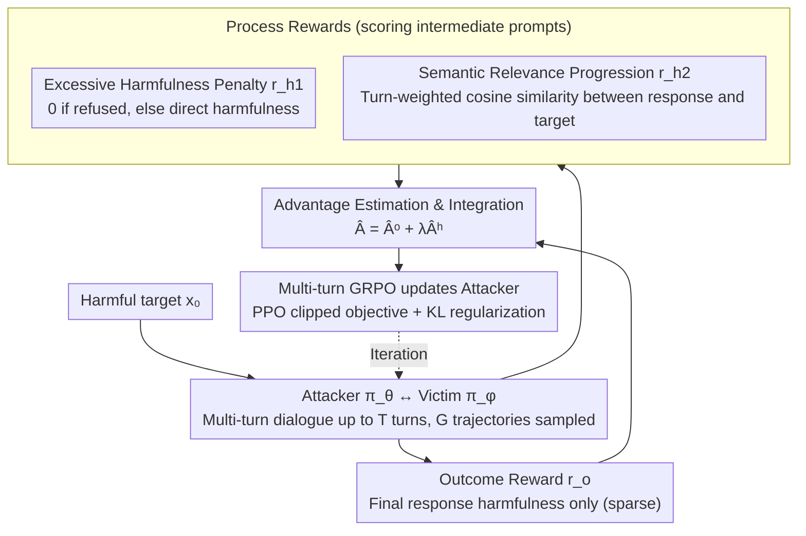

# TROJail: Trajectory-Level Optimization for Multi-Turn Large Language Model Jailbreaks with Process Rewards

**Conference**: ACL 2026  
**arXiv**: [2512.07761](https://arxiv.org/abs/2512.07761)  
**Code**: [GitHub](https://github.com/xxiqiao/TROJail)  
**Area**: AI Safety / LLM Reasoning  
**Keywords**: multi-turn jailbreak attacks, trajectory-level optimization, process rewards, reinforcement learning, red teaming

## TL;DR

This paper models automated multi-turn jailbreak attacks as a multi-turn reinforcement learning problem and proposes TROJail. By utilizing two heuristic process rewards (excessive harmfulness penalty and semantic relevance progression), it alleviates the sparse supervision issue inherent in outcome rewards, significantly improving attack success rates across multiple models and benchmarks.

## Background & Motivation

**Background**: LLMs face security threats from jailbreak attacks. Multi-turn jailbreak attacks have gained attention as they reflect real interaction scenarios. Existing training-based methods use DPO or rejection sampling fine-tuning to optimize the attacker LLM independently at each turn.

**Limitations of Prior Work**: (1) Turn-by-turn optimization is short-sighted—maximizing the immediate harmfulness of each response fails to learn long-term cross-turn attack strategies; (2) Seemingly harmless but strategically critical early prompts are undervalued because they do not trigger immediate harmful responses; (3) Training-free methods rely on human-designed strategies, requiring numerous trials and often collapsing when victim models deviate from expectations.

**Key Challenge**: Trajectory-level optimization is a natural solution, but relying solely on the harmfulness of the final response as an outcome reward faces severe sparse supervision—the attacker cannot infer how intermediate prompts contribute to the final attack success.

**Goal**: Design richer intermediate feedback signals to estimate the utility of intermediate prompts, thereby supporting the learning of long-term attack strategies.

**Key Insight**: Controlled experiments reveal two empirical patterns—(1) Moderately harmful intermediate prompts are most effective, while excessively harmful ones trigger refusal mechanisms and lead to failure; (2) Semantic relevance of responses in successful trajectories increases progressively, a pattern not exhibited in failed trajectories.

**Core Idea**: Introduce two process rewards—excessive harmfulness penalty $r_{h_1}$ and semantic relevance progression $r_{h_2}$—into a multi-turn GRPO framework. Integrating these into advantage estimation provides fine-grained training signals for intermediate prompts.

## Method

### Overall Architecture

TROJail treats "automated multi-turn jailbreaking" as a multi-turn reinforcement learning problem to train the attacker. Given a harmful target $x_0$, the attacker $\pi_\theta$ and victim model $\pi_\phi$ engage in a dialogue for up to $T$ turns, sampling $G$ trajectories. The harmfulness of the final response serves as the outcome reward $r_o$. The problem is that only the last turn receives this reward; intermediate prompts that are "seemingly harmless yet strategically critical" receive no credit, leading to extremely sparse supervision. TROJail's solution is to incorporate two **process rewards**, $r_{h_1}$ and $r_{h_2}$, to score intermediate prompts. These are converted into process advantages and combined with the outcome advantage: $\hat{A}_{i,t} = \hat{A}_{i,t}^o + \lambda \hat{A}_{i,t}^h$. Optimization is performed using a multi-turn GRPO with a PPO-style clipped objective—targeting final success while providing fine-grained gradients for every step.

### Key Designs

**1. Excessive Harmfulness Penalty $r_{h_1}$: Preventing early detection by learning "moderation"**

A common issue with turn-by-turn optimization is pushing every response toward maximum harmfulness. This causes intermediate prompts to be too explicit, triggering the victim model's refusal mechanism and causing the attack to fail immediately. The authors' controlled experiments show an **inverted U-shape** relationship between intermediate prompt harmfulness and final success—moderate harmfulness is optimal. $r_{h_1}$ encodes this: if an intermediate response triggers a refusal, $r_{h_1} = 0$; otherwise, it equals the direct harmfulness $r(x_0, y_t)$. This encourages the attacker to maintain a level of harmfulness that progresses the attack without alerting safety guardrails.

**2. Semantic Relevance Progression $r_{h_2}$: Successive jailbreaks steer the topic toward the target**

Harmfulness alone is insufficient because it only spikes in the final turn, providing little guidance for intermediate steps. The authors observed a more reliable signal in successful trajectories: the semantic relevance between responses and the original harmful target **increases steadily**. $r_{h_2}$ calculates the cosine similarity between the sentence embeddings of the intermediate response and the original harmful prompt, weighted by the turn ratio:

$$r_{h_2}(x_t) = \frac{t}{|\tau|} \cdot \text{cosine}(e(x_0), e(y_t))$$

Later turns receive higher weights, forcing the attacker to steadily align the semantics with the target. Compared to outcome rewards, this signal provides gradual, differentiable intermediate guidance across the entire trajectory.

**3. Process Advantage Estimation and Integration: Converting heuristic rewards into "future-cumulative" advantages**

After defining $r_{h_1}$ and $r_{h_2}$, they must be integrated into trajectory-level optimization. TROJail aggregates heuristic rewards from all trajectories and turns into a set $\mathcal{D}_h$ for normalization. It then computes the prefix sum of future rewards from each position to obtain normalized process advantages:

$$\hat{A}_{i,t}^h = \sum_{s=t}^{|\tau_i|} \frac{r_h(x_{i,s}) - \text{mean}(\mathcal{D}_h)}{\text{std}(\mathcal{D}_h)}$$

The final advantage $\hat{A}_{i,t} = \hat{A}_{i,t}^o + \lambda \hat{A}_{i,t}^h$ allows the outcome advantage to handle global direction while the process advantage manages local tactics, with $\lambda$ balancing the two. This "future-cumulative" formulation allows early, seemingly harmless setup prompts to receive positive credit for the semantic progression they enable, allowing the model to learn long-term "setup-then-trigger" strategies.

### Loss & Training

The method adopts multi-turn GRPO using a PPO-style clipped objective with KL regularization. The attacker is based on Qwen2.5-3B-Instruct, while victim models include Llama-3.1-8B, Qwen2.5-7B, Gemma-2-9B, and Mistral-7B.

## Key Experimental Results

### Main Results

**Comparison of Average Attack Success Rate (ASR) Across Models**

| Method | Type | Average ASR |
|------|------|---------|
| ActorAttack | Training-free Multi-turn | ~60% |
| HARM | Training-based Turn-by-turn | ~58% |
| Siren (DPO) | Training-based Turn-by-turn | ~65% |
| **TROJail** | Training-based Trajectory-level | **~72%** |

### Ablation Study

**Process Reward Ablation**

| Configuration | Description |
|------|------|
| w/o Both process rewards | Degenerates to pure MT-GRPO; ASR drops significantly |
| w/o Excessive harmfulness penalty | Attacker tends to generate overly aggressive prompts, triggering more refusals |
| w/o Semantic progression | Intermediate turns drift away from the target harmful content |

### Key Findings

- TROJail consistently outperforms turn-by-turn optimization methods across all victim models and benchmarks.
- Both process rewards contribute equally to performance, though semantic progression is more critical for longer trajectories.
- Controlled experiments validate the inverted U-shape relationship—intermediate prompts at L3-L4 levels of harmfulness are most effective.
- Trajectory visualizations reveal that TROJail effectively learns long-term "setup-then-trigger" strategic patterns.

## Highlights & Insights

- The discovery of the two empirical patterns is the cornerstone of the paper, quantifying the utility of intermediate prompts through rigorous controlled experiments.
- Modeling multi-turn jailbreaking as a multi-turn RL problem is a natural and elegant perspective, with process reward designs supported by both theory and empirical evidence.
- While focusing on attacks, the findings directly inform defense; understanding attack strategies is essential for designing better security mechanisms.

## Limitations & Future Work

- Success evaluation relies on external harmfulness classifiers, which may themselves be imperfect.
- Evaluations were conducted only on 7-9B scale victim models, without testing larger or newer models.
- Process rewards are heuristic designs; more effective intermediate feedback signals may exist.
- Ethical considerations—the disclosure of attack methods could be misused and requires responsible handling.

## Related Work & Insights

- **vs Siren/MTSA (DPO Turn-by-turn)**: These optimize each turn independently and cannot learn cross-turn strategies; TROJail’s trajectory-level optimization discovers long-term "setup-then-trigger" patterns.
- **vs ActorAttack (Training-free)**: The latter relies on preset strategies and may fail when victim models deviate from expectations; TROJail automatically learns strategies via RL.
- **vs MT-GRPO**: Pure outcome rewards suffer from sparse supervision; TROJail’s process rewards provide critical intermediate guidance.

## Rating

- Novelty: ⭐⭐⭐⭐ Modeling multi-turn jailbreaking as multi-turn RL with process rewards is an innovative approach.
- Experimental Thoroughness: ⭐⭐⭐⭐⭐ Comprehensive evaluation across 4 victim models, 3 benchmarks, controlled experiments, and detailed ablations.
- Writing Quality: ⭐⭐⭐⭐ Logical flow from empirical patterns to methodological design is clear.
- Value: ⭐⭐⭐⭐ Significant contribution to LLM security research with insights relevant to both attack and defense.

<!-- RELATED:START -->

## Related Papers

- [\[ACL 2026\] Multi-component Causal Tracing in Large Language Models](multi-component_causal_tracing_in_large_language_models.md)
- [\[ICML 2026\] PRPO: Paragraph-level Policy Optimization for Vision-Language Deepfake Detection](../../ICML2026/llm_safety/prpo_paragraph-level_policy_optimization_for_vision-language_deepfake_detection.md)
- [\[ACL 2026\] SharedRequest: Privacy-Preserving Model-Agnostic Inference for Large Language Models](sharedrequest_privacy-preserving_model-agnostic_inference_for_large_language_mod.md)
- [\[ACL 2026\] Instant Personalized Large Language Model Adaptation via Hypernetwork](instant_personalized_large_language_model_adaptation_via_hypernetwork.md)
- [\[NeurIPS 2025\] Learning to Watermark: A Selective Watermarking Framework for Large Language Models via Multi-Objective Optimization](../../NeurIPS2025/llm_safety/learning_to_watermark_a_selective_watermarking_framework_for_large_language_mode.md)

<!-- RELATED:END -->
