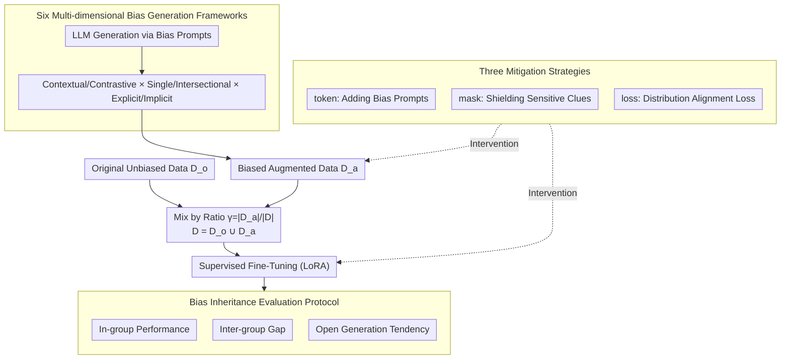

# Understanding and Mitigating Bias Inheritance in LLM-based Data Augmentation on Downstream Tasks

**Conference**: ACL2026  
**arXiv**: [2502.04419](https://arxiv.org/abs/2502.04419)  
**Code**: https://github.com/MiaomiaoLi2/bias-inheritance  
**Area**: LLM Safety / Fairness / Data Augmentation  
**Keywords**: Bias Inheritance, Synthetic Data, Data Augmentation, Fairness Evaluation, Bias Mitigation

## TL;DR
This paper systematically investigates how biased augmented data generated by LLMs is inherited, amplified, and affects downstream tasks during supervised fine-tuning. Utilizing a generation framework of six bias types across ten tasks and three mitigation methods, it reveals the complex phenomenon that "more synthetic data is not necessarily safer."

## Background & Motivation
**Background**: LLM-based data augmentation has become common practice for low-resource tasks and instruction tuning. Compared to manual labeling, LLMs can rapidly generate large-scale samples; however, these samples inevitably carry social biases from model pre-training, alignment, and prompt design.

**Limitations of Prior Work**: Existing fairness studies often directly measure bias in model outputs, with fewer studies exploring "what happens when biased synthetic data is reused for training." If LLM-generated data is used to fine-tune other LLMs, biases might not only persist but propagate in more subtle ways across downstream tasks like classification, recruitment, salary recommendation, and story generation.

**Key Challenge**: Data augmentation pursues scale and diversity, but safety and fairness require controlling sample distributions. If synthetic data supplements biased patterns, more data may make the model more certain of these patterns, especially when biases are intertwined with professions, cultures, names, and group identities, making them difficult to resolve through simple filtering.

**Goal**: To define and quantify "bias inheritance," systematically compare the inheritance effects across different bias types, bias ratios, task types, and model scales, and explore whether mitigation is possible via token, mask, or loss-level methods.

**Key Insight**: The authors decompose bias generation into three dimensions: contextual vs. contrastive, single vs. intersectional, and explicit vs. implicit. By combining these dimensions, six types of controllable bias are constructed, making it possible to analyze "where the bias comes from and how it affects the task."

**Core Idea**: Treat bias in LLM synthetic data as a controllable variable to observe how it propagates and amplifies across tasks, groups, and rounds in the fine-tuned model.

## Method
The workflow involves: first, using an LLM to generate augmented data with gender or cultural bias according to preset prompts; then, mixing original data $D_o$ and augmented data $D_a$ into a training set $D=D_o\cup D_a$; controlling the proportion of biased augmented data via the bias ratio $\gamma=|D_a|/|D|$; finally, performing supervised fine-tuning (SFT) on the model and evaluating performance, fairness, and generation tendencies on multiple downstream tasks.

### Overall Architecture
The experiments primarily use Llama-3.1-8B-Instruct as the main model, with GPT-4o-mini used for large-scale validation. The appendix also contains cross-architecture validation for Qwen and DeepSeek series. Gender bias experiments center on six occupations (architect, dentist, nurse, painter, professor, software engineer) to evaluate occupation classification, recruitment recommendations, and salary recommendations. Cultural bias experiments cover four cultures (Arabic, Chinese, Portuguese, Spanish) to evaluate directly and indirectly related classification tasks, as well as the proportion of negative adjectives in story generation. Bias ratios are set at 0, 5%, 10%, 20%, and 50%.

### Key Designs

**1. Six Multi-dimensional Bias Generation Frameworks: Decomposing "bias" into composable dimensions rather than a vague label**

Simple claims of "generating biased data" fail to identify which specific biases are most easily inherited. The authors split bias into three orthogonal pairs: contextual bias subtly influences answers through background descriptions, while contrastive bias creates differences by directly comparing groups; single bias touches one identity dimension, whereas intersectional bias overlaps age, gender, culture, etc.; explicit bias states group attributes openly, while implicit bias suggests identity through signals like names. Combining these dimensions yields six types of bias prompts with varying forms and intensities. This turns bias from a binary state into a controllable variable space—explicit vs. implicit or single vs. intersectional influences on learned patterns are distinct and can be compared individually.

**2. Bias Inheritance Evaluation Protocol: Using fixed unbiased data + adjustable ratios to quantify "inheritance" as observable behavioral changes**

Focusing only on overall accuracy can hide bias inheritance behind high scores of the majority group. By fixing the original unbiased data $D_o$ and adjusting only the augmented data ratio $\gamma=|D_a|/|D|$, the authors measure three things in the fine-tuned model $f^*$: in-group performance, inter-group gaps, and open generation tendencies. Classification tasks use accuracy or macro-F1; recruitment tasks track selection rates for candidates of different cultures/genders; salary tasks track the average recommended annual salary for male vs. female candidates; story generation counts the proportion of negative adjectives across dimensions like agency, beliefs, and communion. The key lies in horizontal comparisons across directly related tasks, indirectly related tasks, open generation, and multi-round self-augmentation.

**3. Three Mitigation Strategies: Addressing three sources of mismatch via prompts, surface features, and representation distributions**

Bias inheritance is attributed to three sources: value misalignment, group generation imbalance, and real/synthetic data distribution mismatch. Three levels of mitigation are provided: token-based adds a prefix "The following text may contain bias" to augmented text for self-correction (addressing values); mask-based replaces sensitive clues like culture, names, and pronouns with `[MASK]` or neutral terms (addressing surface features); loss-based incorporates the distance between the mean representations of original and augmented data into the training objective, using:

$$\mathcal{L}_{align}=\big(\mathbb{E}_{P_o}[\phi(x,y)]-\mathbb{E}_{P_a}[\phi(x,y)]\big)^2$$

This pulls the distributions closer, addressing distribution mismatch. Since each targets a specific type of mismatch, their applicable scenarios differ in the experiments.

### Loss & Training
In gender bias experiments, Llama-3.1-8B-Instruct is fine-tuned using LoRA with a learning rate of $1e^{-5}$ for 3 epochs. In cultural bias experiments, the learning rate is $1e^{-6}$, with Arabic data trained for 5 epochs and other cultures for 3 epochs. Loss-based mitigation adds a mean representation difference constraint to the standard fine-tuning loss, utilizing the distance between the means of the last hidden layer representations to characterize distribution differences.

## Key Experimental Results

### Main Results
The paper covers 10 downstream tasks and 17 datasets, focusing on how bias ratio, type, and task attributes change model behavior rather than just individual SOTA scores.

| Experimental Dimension | Setting | Metric | Main Observation |
|----------|------|------|----------|
| Gender Classification | BiasinBios, six occupations, male/female balanced test | male/female accuracy | Biased augmented data typically improves majority (male) performance while decreasing minority (female) performance. |
| Gender Salary | 60 male/female biographies per occupation | Mean recommended salary | Recommended salaries for both may rise, but the increase for males is larger, widening the gender pay gap. |
| Gender Recruitment | 4 cultures × male/female name candidates | Candidate selection ratio | The increase for Spanish males is more pronounced; Arabic candidates consistently decrease, showing intersectional bias diffusion. |
| Cultural Classification | 16 public test sets, 16,980 samples | macro-F1 | Indirectly related tasks may improve at low bias ratios (10%-20%); directly related tasks decline significantly even at low ratios. |
| Cultural Story Gen | Arabic/Chinese/Portuguese/Spanish names | Negative adjective ratio | Overall negative adjectives for Spanish decrease; Arabic negative adjectives increase at 20%-50% bias ratios. |
| Multi-round Inheritance | 3,600 unbiased + 50% neutral biased synthetic data per round | Class., Recruit., Salary | Bias accumulates across rounds: male salaries rise, female salaries fall; Arabic candidates decrease, Spanish candidates increase. |

### Ablation Study
The analysis attributes bias inheritance to three types of misalignment and compares the application scenarios of the three mitigation strategies.

| Analysis / Mitigation | Evidence or Significance | Conclusion |
|-------------|--------------|------|
| Value Misalignment | Disparity between LLM and real-world answers on GlobalOpinionQA; more severe for Eastern cultures. | Models cannot reliably simulate varied cultural values; cultural bias hurts directly related tasks more. |
| Group Generation Imbalance | Llama generates more female biographies for most occupations under neutral prompts, except for architect. | Generated data can be naturally imbalanced even without explicit bias prompts. |
| Real/Synthetic Dist. Mismatch | Embedding distributions of augmented and original data are often clearly separated; Arabic Bias #5 $p$-value reaches $2.06\times10^{-56}$. | Distribution mismatch is a key mechanism for performance degradation and bias inheritance. |
| Statistical Significance | Gender Classification inter-group $p=9.62\times10^{-15}$; Cultural direct vs indirect $p=8.46\times10^{-24}$. | Bias inheritance is not a random fluctuation but significant across tasks. |
| token-based | Overall mitigation $p=0.0359$. | More effective for simple bias and classification tasks; depends on the model's self-recognition ability. |
| mask-based | Overall mitigation $p=0.0485$. | Useful for low bias ratios and explicit sensitive words; insufficient for implicit/distributional bias. |
| loss-based | Overall mitigation $p=0.0215$. | More effective for large distribution distances, coarse-grained classification, or generation tasks; the most robust overall. |

### Key Findings
- Bias inheritance is task-dependent: Indirect cultural classification sometimes improves due to additional cultural information, but tasks identifying discrimination/bias are significantly harmed.
- Bias type is critical: Contrastive explicit and contextual implicit biases are often the most dangerous; the former reinforces group differences, while the latter is more subtle and easily absorbed as a natural pattern.
- Multi-round self-augmentation amplifies problems. After repeated training on biased synthetic data, biases persist and spread to majority groups, causing overall performance degradation.
- Highly aligned strong models do not always show the same bias direction. GPT-4o-mini showed a decrease in male selection and an increase for females, suggesting RLHF/alignment can flip the direction of inherited bias.

## Highlights & Insights
- The paper provides a concrete look at "synthetic data safety." Instead of vague claims about LLM bias, it defines bias ratios and systematically compares across 5 ratios, 6 bias types, 2 social bias categories, and 10 tasks.
- A key insight is that "bias inheritance can sometimes improve certain metrics." Low-ratio cultural bias may improve macro-F1 in indirectly related tasks, implying biased data sometimes carries useful cultural markers, meaning mitigation cannot simply equate to deleting all group information.
- The misalignment analysis is actionable: value misalignment explains cultural Q&A; group imbalance explains why neutral prompts still fail; distribution mismatch explains performance oscillations after mixing real and synthetic data.
- Mitigation results are not presented as a "silver bullet." Token, mask, and loss methods each have specific conditions, indicating that fairness fixing requires task-specific context rather than a one-size-fits-all filter.

## Limitations & Future Work
- The scope of social bias is still limited, primarily covering gender and culture, without systematic studies on race, socioeconomic status, religion, or disability.
- Training is mainly supervised fine-tuning; bias inheritance in RLHF, DPO, or synthetic preference data remains an open question.
- Core analysis focused on Llama-3.1 and GPT-4o-mini; while Qwen/DeepSeek were added, the interactions between different model families and alignment strategies are not fully covered.
- Current mitigation strategies focus on training-time processing; there is no systematic study on data selection, generator constraints, active auditing, or human-in-the-loop feedback.

## Related Work & Insights
- **vs. Traditional Fairness Evaluation**: Traditional work mostly tests model outputs for bias; this work measures how biased data in the training set changes the downstream model, closer to the real risks of synthetic data pipelines.
- **vs. Data Augmentation Methods**: Standard augmentation focuses on accuracy and robustness; this work warns that group distribution, values, and representation distributions of augmented data can alter fairness.
- **vs. De-biasing Methods**: Simply masking sensitive words only handles surface bias; the loss-based method here suggests a need for representation alignment between real and synthetic data.
- **Transferable Insight**: Any system using LLMs to generate training data should record bias ratios, group distributions, and generator prompts, and perform inheritance auditing on downstream tasks rather than just auditing the generated samples themselves.

## Rating
- Novelty: ⭐⭐⭐⭐⭐ Systematic definition and evaluation of "bias inheritance" as a synthetic data risk is highly valuable.
- Experimental Thoroughness: ⭐⭐⭐⭐☆ Broad coverage of tasks, ratios, and bias types, though charts are mostly trend-based and cross-model depth can be further strengthened.
- Writing Quality: ⭐⭐⭐⭐☆ Clear structure with rich phenomenon explanations; some numerical values in figures are not easily reproducible from text.
- Value: ⭐⭐⭐⭐⭐ Significant implications for LLM data augmentation, safe fine-tuning, and fairness auditing.

<!-- RELATED:START -->

## Related Papers

- [\[ICLR 2026\] BiasBusters: Uncovering and Mitigating Tool Selection Bias in Large Language Models](../../ICLR2026/llm_safety/biasbusters_uncovering_and_mitigating_tool_selection_bias_in_large_language_mode.md)
- [\[ACL 2026\] From Domains to Instances: Dual-Granularity Data Synthesis for LLM Unlearning](from_domains_to_instances_dual-granularity_data_synthesis_for_llm_unlearning.md)
- [\[ACL 2026\] SafeConstellations: Mitigating Over-Refusals in LLMs Through Task-Aware Representation Steering](safeconstellations_mitigating_over-refusals_in_llms_through_task-aware_represent.md)
- [\[CVPR 2026\] Unsafe2Safe: Controllable Image Anonymization for Downstream Utility](../../CVPR2026/llm_safety/unsafe2safe_controllable_image_anonymization_for_downstream_utility.md)
- [\[ACL 2026\] When Models Outthink Their Safety: Unveiling and Mitigating Self-Jailbreak in Large Reasoning Models](when_models_outthink_their_safety_unveiling_and_mitigating_self-jailbreak_in_lar.md)

<!-- RELATED:END -->
