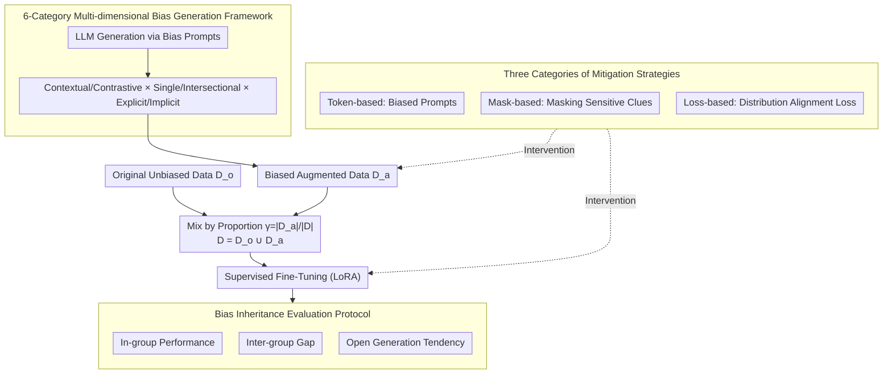

# Understanding and Mitigating Bias Inheritance in LLM-based Data Augmentation on Downstream Tasks

**Conference**: ACL2026  
**arXiv**: [2502.04419](https://arxiv.org/abs/2502.04419)  
**Code**: https://github.com/MiaomiaoLi2/bias-inheritance  
**Area**: LLM Safety / Fairness / Data Augmentation  
**Keywords**: Bias Inheritance, Synthetic Data, Data Augmentation, Fairness Evaluation, Bias Mitigation

## TL;DR
This paper systematically investigates how biased augmented data generated by LLMs is inherited and amplified during supervised fine-tuning (SFT), impacting downstream tasks. Using six types of bias generation frameworks across ten tasks and three categories of mitigation methods, it reveals the complex phenomenon that "more synthetic data does not necessarily mean higher safety."

## Background & Motivation
**Background**: LLM-based data augmentation has become a common practice for low-resource tasks and instruction fine-tuning. Compared to manual annotation, LLMs can rapidly generate large-scale samples; however, these samples inevitably carry social biases from pre-training, alignment, and prompt design.

**Limitations of Prior Work**: Existing fairness studies often directly measure biases in model outputs but rarely explore what happens when biased synthetic data is reused for training. If LLM-generated data is used to fine-tune other LLMs, biases may not only persist but also propagate in subtle ways across downstream tasks such as classification, recruitment, salary recommendation, and story generation.

**Key Challenge**: Data augmentation pursues scale and diversity, while safety and fairness require controlling sample distribution. If synthetic data reinforces biased patterns, more data might instead make the model more certain of these patterns. This is particularly difficult to solve via simple filtering when biases are intertwined with occupations, cultures, names, and group identities.

**Goal**: To define and quantify "bias inheritance," systematically compare the inheritance effects across different bias types, proportions, task types, and model scales, and explore the effectiveness of mitigation methods at the token, mask, and loss levels.

**Key Insight**: The authors decompose bias generation into three dimensions: contextual vs. contrastive, single vs. intersectional, and explicit vs. implicit. By combining these dimensions, they construct six categories of controllable bias, making it possible to analyze "where the bias comes from and how it affects tasks."

**Core Idea**: Treat biases in LLM synthetic data as controllable variables to observe how they propagate and amplify across tasks, groups, and iterations in fine-tuned models.

## Method
The workflow involves: generating augmented data with gender or cultural biases using LLMs with preset prompts; mixing original data $D_o$ and augmented data $D_a$ to form a training set $D=D_o\cup D_a$; controlling the proportion of biased augmented data via $\gamma=|D_a|/|D|$; and conducting SFT on the model to evaluate performance, fairness, and generation tendencies across multiple downstream tasks.

### Overall Architecture
Experiments primarily use Llama-3.1-8B-Instruct, with GPT-4o-mini used for large-scale validation. Cross-architecture validation on Qwen and DeepSeek series is included in the appendix. Gender bias experiments focus on six occupations (architect, dentist, nurse, painter, professor, software engineer) to evaluate occupational classification, recruitment, and salary recommendations. Cultural bias experiments cover four cultures (Arabic, Chinese, Portuguese, Spanish) to evaluate directly and indirectly related classification tasks, as well as the proportion of negative adjectives in story generation. Bias proportions are set at 0, 5%, 10%, 20%, and 50%.

### Key Designs

**1. Six-category Multidimensional Bias Generation Framework: Decomposing "bias" into composable dimensions rather than a vague label**
Instead of general "biased generation," the authors split bias along three orthogonal dimensions: contextual bias implicitly influences answers through background descriptions; contrastive bias creates differences by directly comparing groups; single bias touches one identity dimension, while intersectional bias overlays multiple identities (e.g., age, gender, culture); explicit bias explicitly mentions group attributes, while implicit bias uses signals like names. These combinations yield six distinct bias prompts with adjustable intensity, allowing for a systematic analysis of how different bias forms affect inheritance.

**2. Bias Inheritance Evaluation Protocol: Quantifying "inheritance" as observable behavioral changes across tasks**
By fixing original unbiased data $D_o$ and adjusting the augmentation ratio $\gamma=|D_a|/|D|$, the authors measure three metrics on the fine-tuned model $f^*$: in-group performance, inter-group gap, and open-ended generation tendency. Key metrics include accuracy/Macro-F1 for classification, selection rates for recruitment, average recommended salary, and negative adjective ratios in story generation (across dimensions like agency, beliefs, and communion). This reveals how bias spreads from injection points to unrelated tasks and groups.

**3. Three Categories of Mitigation Strategies: Targeting three sources of mismatch**
Biased inheritance is attributed to three sources: value misalignment, group generation imbalance, and real/generated data distribution mismatch. 
- **Token-based**: Adds "The following text may contain bias" before augmented text for self-correction.
- **Mask-based**: Replaces sensitive clues (names, pronouns) with `[MASK]` or neutral terms.
- **Loss-based**: Minimizes the mean distance between original and augmented data in the representation space:
$$\mathcal{L}_{align}=\big(\mathbb{E}_{P_o}[\phi(x,y)]-\mathbb{E}_{P_a}[\phi(x,y)]\big)^2$$
using the last-layer hidden representation to pull the distributions closer.

### Loss & Training
For gender bias experiments, Llama-3.1-8B-Instruct is fine-tuned using LoRA for 3 epochs with a learning rate of $1e^{-5}$. For cultural bias, the learning rate is $1e^{-6}$, with 5 epochs for Arabic data and 3 epochs for others. Loss-based mitigation adds the distribution constraint to the standard SFT loss.

## Key Experimental Results

### Main Results
The study covers 10 downstream tasks and 17 datasets, focusing on how bias proportions and types alter model behavior.

| Exp. Dimension | Setting | Metrics | Main Observation |
|----------|------|------|----------|
| Gender Classification | BiasinBios, 6 jobs, balanced test | male/female accuracy | Biased augmentation often increases majority (male) performance while decreasing minority (female) performance. |
| Gender Salary | 60 male/female bios per job | Mean recommended salary | Recommended salaries for both may rise, but the increase for males is larger, widening the gender pay gap. |
| Gender Recruitment | 4 cultures × male/female names | Candidate selection ratio | Spanish males see a significant increase; Arabic candidates consistently decrease; biases exhibit cross-diffusion. |
| Cultural Classification | 16 datasets, 16,980 samples | Macro-F1 | Indirectly related tasks may improve at low bias ratios (10-20%); directly related tasks drop even at low ratios. |
| Cultural Story Gen | Names from 4 cultures | Negative adjective ratio | Spanish negative adjectives decrease; Arabic negative adjectives increase at 20-50% bias ratios. |
| Multi-round Inheritance | 3,600 unbiased + 50% neutral biased data | Classification, Recruitment, Salary | Bias accumulates over rounds: male salaries rise, female salaries drop; Arabic recruitment drops, Spanish rises. |

### Ablation Study
The analysis attributes bias inheritance to three types of misalignment and compares mitigation strategies.

| Analysis / Mitigation | Evidence or Significance | Conclusion |
|-------------|--------------|------|
| Value Misalignment | Discrepancy between LLM GlobalOpinionQA answers and real population data (worse for Eastern cultures). | Models cannot reliably simulate different cultural values; cultural bias harms directly related tasks more. |
| Group Imbalance | Llama generates more female bios for most occupations under neutral prompts (except architect). | Bias can emerge naturally in generated data even without explicit biased prompts. |
| Dist. Mismatch | Augmented and original data show clear separation in embedding space; p-value $2.06\times10^{-56}$ for Arabic Bias #5. | Distribution mismatch is a key mechanism for performance degradation and bias inheritance. |
| Significance | Group difference $p=9.62\times10^{-15}$ (Gender); direct vs indirect $p=8.46\times10^{-24}$ (Culture). | Bias inheritance is a significant phenomenon, not random fluctuation. |
| Token-based | Mitigation overall $p=0.0359$ | Effective for simple bias and classification; depends on model's self-recognition ability. |
| Mask-based | Mitigation overall $p=0.0485$ | Useful for low bias ratios and explicit sensitive words; insufficient for implicit bias. |
| Loss-based | Mitigation overall $p=0.0215$ | Most robust; effective for large distribution distances and generative tasks like salary. |

### Key Findings
- **Task Dependence**: Indirect cultural classification might benefit from extra cultural context, but tasks requiring the identification of discrimination/bias are significantly impaired.
- **Bias Type Matters**: Contrastive explicit and contextual implicit biases are most dangerous; the former reinforces differences directly, while the latter is absorbed as a "natural" pattern.
- **Amplification via Self-Augmentation**: Repeated training on biased synthetic data causes biases to persist and spread, leading to overall performance degradation for the majority group eventually.
- **Alignment Direction**: Strong aligned models (like GPT-4o-mini) may show different bias directions (e.g., increased female selection), indicating that RLHF/Alignment affects the direction of inherited bias.

## Highlights & Insights
- Defines "bias ratio" specifically, systematically comparing 5 proportions and 6 bias types across various tasks.
- **Insight**: Low-ratio cultural bias can improve Macro-F1 in indirectly related tasks, implying biased data sometimes carries useful cultural cues. Mitigation therefore cannot simply be equated with deleting all group information.
- The three misalignment categories provide actionable explanations: value misalignment (cultural Q&A), group imbalance (neutral prompts), and distribution mismatch (performance jitter during mixed training).
- Mitigation results are presented as context-dependent rather than a silver bullet, emphasizing that fairness fixes depend on the task and bias type.

## Limitations & Future Work
- Social biases are limited to gender and culture; race, socioeconomic status, religion, and disability are not yet covered.
- Training is limited to SFT; bias inheritance in RLHF, DPO, or synthetic preference data remains an open question.
- Primary analysis focuses on Llama/GPT; cross-family interactions with different alignment strategies need further exploration.
- Current mitigation focuses on training-time data processing rather than data selection or generator constraints.

## Related Work & Insights
- **vs. Traditional Fairness**: Moves beyond measuring output bias to measuring how biased training data alters downstream models in synthetic data pipelines.
- **vs. Data Augmentation**: Reminds researchers that the group distribution and values of augmented data change fairness, not just accuracy and robustness.
- **vs. Debiasing**: Simple masking only handles surface bias; the loss-based approach shows the necessity of representation alignment.
- **Transferable Insight**: Any system using LLM-generated training data should log bias ratios and group distributions and perform "inheritance auditing" on downstream tasks.

## Rating
- **Novelty**: ⭐⭐⭐⭐⭐ Systematic definition and evaluation of "bias inheritance" as a risk in synthetic data re-training.
- **Experimental Thoroughness**: ⭐⭐⭐⭐☆ Extensive coverage of tasks and bias types, though cross-model depth could be further extended.
- **Writing Quality**: ⭐⭐⭐⭐☆ Clear structure and rich explanations; some chart values are difficult to reproduce directly from text.
- **Value**: ⭐⭐⭐⭐⭐ Direct warning for LLM data augmentation, safe fine-tuning, and fairness auditing.

<!-- RELATED:START -->

## Related Papers

- [\[ICLR 2026\] BiasBusters: Uncovering and Mitigating Tool Selection Bias in Large Language Models](../../ICLR2026/llm_safety/biasbusters_uncovering_and_mitigating_tool_selection_bias_in_large_language_mode.md)
- [\[ACL 2026\] From Domains to Instances: Dual-Granularity Data Synthesis for LLM Unlearning](from_domains_to_instances_dual-granularity_data_synthesis_for_llm_unlearning.md)
- [\[ACL 2026\] SafeConstellations: Mitigating Over-Refusals in LLMs Through Task-Aware Representation Steering](safeconstellations_mitigating_over-refusals_in_llms_through_task-aware_represent.md)
- [\[ICML 2025\] Invariance Makes LLM Unlearning Resilient Even to Unanticipated Downstream Fine-Tuning](../../ICML2025/llm_safety/invariance_makes_llm_unlearning_resilient_even_to_unanticipated_downstream_fine-.md)
- [\[ACL 2026\] When Models Outthink Their Safety: Unveiling and Mitigating Self-Jailbreak in Large Reasoning Models](when_models_outthink_their_safety_unveiling_and_mitigating_self-jailbreak_in_lar.md)

<!-- RELATED:END -->
