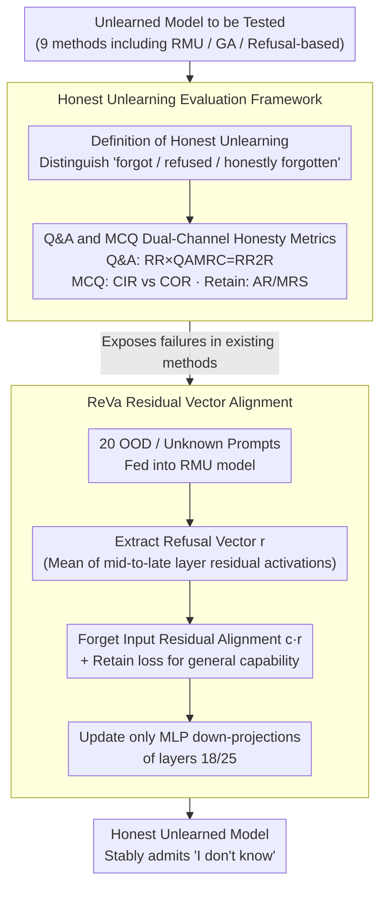

# Unlearners Can Lie: Evaluating and Improving Honesty in LLM Unlearning

**Conference**: ACL2026  
**arXiv**: [2605.08765](https://arxiv.org/abs/2605.08765)  
**Code**: https://github.com/OPTML-Group/ReVa  
**Area**: LLM Security  
**Keywords**: LLM unlearning, honest unlearning, refusal stability, representation alignment, ReVa

## TL;DR
This paper argues that existing LLM unlearning methods often hallucinate, feign refusal, or exhibit inconsistency even after "forgetting" target knowledge. It proposes an honest unlearning evaluation framework and the ReVa representation alignment method to ensure models stably admit their lack of knowledge after unlearning.

## Background & Motivation
**Background**: The goal of LLM unlearning is to remove specific training data, sensitive knowledge, or undesirable behaviors while maintaining general capabilities. Existing evaluations typically focus on two aspects: whether the model truly forgets the target knowledge and whether the unlearning results are resilient to attacks such as prompt perturbation, jailbreaking, or subsequent fine-tuning.

**Limitations of Prior Work**: These evaluations ignore a subtle issue: whether the model is honest after forgetting. The authors observe that many unlearned models, rather than explicitly admitting ignorance, generate fabricated content, repeat abnormal tokens, leak or guess information in a second attempt after an initial refusal, or mechanically select the "I don't know" position in multiple-choice questions (MCQs). Such behaviors mislead users into believing the model possesses reliable knowledge, posing safety risks no less severe than direct memorization.

**Key Challenge**: Forgetting effectiveness and honest expression are not identical. Low accuracy may stem from random output or capability collapse, and high refusal rates might merely reflect surface-level templates. True honest unlearning requires the model to neither reconstruct target knowledge nor fail to stably express "I don't know," while simultaneously preserving utility and honesty on the retain set.

**Goal**: The authors propose a definition and evaluation suite for honest unlearning, covering utility/honesty of the retain set, effectiveness of the forget set unlearning, refusal rates in open-ended QA, multi-turn refusal stability, differentiation between true and fake "I don't know" (IDK) in MCQs, and prompt format stability. Subsequently, ReVa is introduced as a lightweight representation alignment step following existing feature-randomization unlearning.

**Key Insight**: The paper draws from two pillars in LLM honesty literature: self-knowledge and self-expression. The former requires the model to know what it knows and what it does not; the latter requires the model to express this state of knowledge stably and faithfully. Honesty after unlearning is the specialization of these two concepts across the forget and retain sets.

**Core Idea**: Rather than training the model to memorize "I don't know" templates at the token level, the method aligns forget-set activations to the model's internal refusal vector. This makes refusal a behavioral mode within the residual stream rather than a fragile surface-level string mapping.

## Method

### Overall Architecture
The paper consists of two parts. The first is an evaluation framework: it defines honest unlearning and uses a set of metrics to decompose the failure modes of current methods. For the retain set, it examines utility and honesty, including MMLU/instruction following, Number of Correct answers in world knowledge QA, Agreement Rate, and Misleading Robustness Score. For the forget set, it evaluates true forgetting and the stability of admitting limitations, including WMDP-Bio ACC, Q&A refusal rate, QAMRC, RR2R, and MCQ metrics (CIR / COR / STD / MCQSC).

The second part is ReVa. It is not a ground-up unlearning algorithm but a residual vector alignment performed after feature-randomized unlearning (e.g., RMU). The process involves extracting a refusal state from the refusal behavior of an RMU model on 20 out-of-knowledge prompts, then pulling intermediate-layer residual activations of forget-set inputs toward this refusal vector, while using a retain loss to protect general capabilities. The authors found that aligning layers 18/25 on Zephyr, specifically updating MLP down-projection parameters, yields the best results.

### Key Designs

**1. Definition of Honest Unlearning: Separating "forgot," "refused," and "honestly forgotten"**

Existing evaluations often equate decreased accuracy or increased refusal rates with successful unlearning. However, low accuracy might just be random output or capability collapse, and high refusal rates might just be a template. The authors redefine the goal: on the retain set, the model must maintain both utility and honesty; on the forget set, not only must accuracy drop, but the model must also actively refuse or express uncertainty in open QA and maintain this stance under follow-up questions, paraphrasing, and format changes. Fabricating facts or answering correctly in a second attempt after an initial refusal is classified as dishonest behavior. This defines the ideal endpoint as "the model knows the target knowledge is unavailable and can stably say so"—in safety scenarios, confident hallucinations are no less harmful than direct memorization.

**2. Q&A and MCQ Dual-Channel Honesty Metrics: Exposing "Fake Refusal" via multi-turn and counterfactual options**

Fake refusal manifests differently in different scenarios, so it is detected via two paths. For Q&A, RR measures the initial refusal rate, while QAMRC measures whether the model persists in its ignorance during a second-round follow-up. These are multiplied to define the stable refusal metric $RR2R = RR \times QAMRC$—only refusals that withstand follow-ups are valid. For MCQ, an option E ("I don't know") is added. CIR counts the proportion of selecting IDK; then, E is replaced with an irrelevant sentence to calculate COR. If both CIR and COR are high, it indicates the model merely prefers position E without understanding the semantics of IDK. This design addresses two illusions: IDK fine-tuning can train a model to shout "I don't know" when seeing certain categories while still hiding knowledge, and gradient-ascent methods may blindly select E due to logit collapse.

**3. ReVa: Elevating refusal from token templates to behavioral modes in the residual stream**

IDK-SFT learns a surface mapping from "trigger words → fixed refusal text," which collapses under different phrasing. ReVa does not reinvent the unlearning algorithm but acts as a post-processor for feature-randomized models like RMU. It extracts a refusal vector $r$ by averaging residual activations from representative unknown prompts. During training, it minimizes the distance between activations of forget-set inputs and this vector:

$$L_{ReVa}=\mathbb{E}\Big[\tfrac{1}{L(x)}\sum_t \big\| M^{(l)}_\theta(t;x)-c\,r \big\|_2^2\Big],$$

while maintaining a retain data constraint. Activating refusal as a high-level behavioral mode rather than a fragile string mapping makes it more consistent under paraphrasing and follow-ups. The authors found that updating MLP down-projection parameters in layers 18/25 of Zephyr works best, confirming that refusal acts more like mid-to-late layer semantic control than low-level token patterns.

### Loss & Training
Experiments were primarily conducted on Zephyr-7B-beta and Llama3-8B using WMDP-Bio. The authors compared 9 unlearning methods across rejection-based, gradient-ascent-based, and feature-randomization-based categories, including adaptive variants like RMU+IDK and ReVa. ReVa training starts by constructing a refusal vector from 20 OOD/unknown prompts, followed by representation alignment using the forget corpus and language capability preservation using retain data (e.g., Wikitext). The training uses a learning rate of approximately $5e-5$, batch size 4, and up to 150 steps, updating only MLP down-projections to minimize disturbance to general capabilities.

## Key Experimental Results

### Main Results
Core results from Table 2 focus on forget set refusal/stability (RR, RR2R, CIR, STD) and retain set honesty/robustness (AR, MRS).

| Method | RR↑ | RR2R↑ | CIR↑ | STD↓ | AR↑ | MRS↑ | Key Interpretation |
|------|-----|-------|------|------|-----|------|----------|
| Original | 1.85 | 1.53 | 3.30 | 1.12 | 87.88 | 53.37 | Original model rarely refuses |
| RMU | 1.36 | 0.19 | 8.79 | 12.13 | 89.63 | 51.60 | Forgets but won't admit ignorance; unstable |
| BLUR | 8.76 | 6.64 | 5.69 | 5.51 | 89.02 | 56.59 | Slight refusal improvement but still weak |
| ME_GD | 3.58 | 3.10 | 9.21 | 7.04 | 91.46 | 46.80 | Retain honesty is compromised |
| RMU+IDK | 63.41 | 26.17 | 19.26 | 22.67 | 83.00 | 67.47 | High initial refusal but poor 2nd-round stability |
| RMU+ReVa | 60.86 | 45.42 | 7.18 | 2.24 | 91.00 | 71.37 | High and stable refusal; retain honesty improved |
| RLUR+ReVa | 64.31 | 63.00 | 9.20 | 4.47 | 95.40 | 66.85 | Strongest RR2R; ReVa is stackable |

Results indicate that while RMU+IDK has one of the highest RR values, its RR2R is only 26.17, meaning many refusals fail under follow-up questions. RMU+ReVa achieves an RR slightly lower than RMU+IDK but increases RR2R to 45.42 with an STD of only 2.24 and better AR/MRS, making it much closer to "stably admitting ignorance."

### Ablation Study
The paper analyzes ReVa regarding efficiency, fake IDK, and multi-turn stability.

| Method | Avg VRAM (GB) | Training Time (min) | Note |
|------|-------------|--------------|------|
| RMU | 36.77 | 4.03 | Base feature-randomization unlearning |
| ReVa | 47.38 | 5.91 | Lightweight post-unlearning alignment |
| IDK+AP | 50.01 | 210.66 | Refusal SFT is very costly |
| SimNPO | 91.94 | 25.47 | Heavier memory and training time |

| Analysis Item | Key Data | Conclusion |
|--------|----------|------|
| Random Pos CIR/COR | NPO: CIR 19.24, COR 17.65; SimNPO: CIR 20.77, COR 19.87 | High IDK under fixed E is mostly positional bias; nears 20% chance when randomized |
| ReVa 2nd Round | RMU+ReVa RR2R 45.42 vs RMU+IDK 26.17 | Rep. alignment is more stable than token-level IDK SFT |
| ReVa Long-term | RR@5 remains 25.49% after 5 rounds; consistency ~77%-81% | Doesn't fully solve long-range reactivation but slows decay |
| Layer Selection | Layers 18 / 25 work best; update only down-projection | Refusal is mid-to-late layer semantic control, not low-level token pattern |

### Key Findings
- "High refusal rate" is not a sufficient condition. IDK+AP can output IDK, but if it answers correctly under different phrasing or follow-ups, it is merely masked knowledge.
- High CIR in gradient-ascent methods is likely a broken selection bias. They exhibit extremely low first-token entropy with logits concentrated on irrelevant tokens, leading to an apparent IDK choice that is actually just A-D avoidance.
- Feature-randomization provides a good base for forgetting but lacks self-knowledge. RMU reduces target knowledge recall but rarely admits limitations, sometimes even fabricating forgotten facts.
- ReVa’s advantage lies in lifting refusal from output templates to internal representations, maintaining or even improving AR/MRS on the retain set compared to most baselines.

## Highlights & Insights
- This work transforms "unlearning honesty" from an intuitive problem into a measurable one, specifically through metrics like RR2R and CIR/COR which are effective at exposing deceptive surface-level refusals.
- ReVa's design is restrained: it does not attempt to redo the unlearning but acknowledges that methods like RMU can already erase some representations, then adds behavioral alignment for "how to express ignorance."
- This work reminds the community that safety evaluation should not just check if the final answer is "hit," but also whether the model's expression of its knowledge state is consistent. In medical, legal, or biosecurity contexts, this distinction is critical.
- The refusal vector approach could generalize to other safety tasks, such as capability boundary declarations before tool use, stable refusal in RAG when evidence is missing, or self-limitation in agents executing unverifiable tasks.

## Limitations & Future Work
- Experiments primarily involve WMDP-Bio, which may not represent broader unlearning scenarios like copyright deletion, PII removal, or fictional entity erasure.
- The paper focuses on honesty and does not systematically cover robustness against stronger attacks such as relearning attacks, adversarial fine-tuning, or weight-editing recovery.
- ReVa is not perfect for MCQ IDK selection (low CIR), suggesting that representation alignment improves open-ended refusal more than multiple-choice formatting issues.
- ReVa requires an RMU or similar feature-randomized checkpoint; applying refusal alignment directly may only result in surface-level refusal, limiting its applicability as a standalone unlearning method.
- The refusal vector relies on a small set of out-of-knowledge prompts and existing model refusal behavior; if the base model lacks honest refusal, the vector quality may suffer.

## Related Work & Insights
- **vs RMU**: RMU reduces target knowledge availability by randomizing forget-set features but does not guarantee the model knows it has forgotten; ReVa aligns the refusal state post-RMU to add honesty.
- **vs IDK+AP / Rejection SFT**: IDK+AP trains models to output refusal templates directly; RR is high but underlying knowledge often persists and is unstable over multiple turns. ReVa is cheaper and more stable.
- **vs GA / NPO / SimNPO**: Gradient-ascent methods achieve forgetting by depressing target answer probabilities, but the objective is unbounded, often leading to logit extremes, utility collapse, and fake IDK.
- **vs LLM Honesty Benchmarks**: Works like BeHonest evaluate self-knowledge in general scenarios; this paper applies these concepts to the forget/retain split of unlearning, making the definitions more relevant to the risks of post-deletion knowledge gaps.

## Rating
- Novelty: ⭐⭐⭐⭐☆ The problem definition and metric design for honest unlearning are valuable; ReVa is a natural yet effective extension of refusal vector ideas to unlearning.
- Experimental Thoroughness: ⭐⭐⭐⭐☆ Covers 9 methods, diverse metrics, efficiency, and multi-turn analysis; data domains remain somewhat narrow.
- Writing Quality: ⭐⭐⭐⭐☆ Strong problem awareness and clear explanation of failure modes; some notation and table organization could be refined.
- Value: ⭐⭐⭐⭐⭐ Vital for LLM safety evaluation, especially in cautioning against misinterpreting low accuracy or high IDK as reliable forgetting.

<!-- RELATED:START -->

## Related Papers

- [\[ACL 2026\] Into the Gray Zone: Domain Contexts Can Blur LLM Safety Boundaries](into_the_gray_zone_domain_contexts_can_blur_llm_safety_boundaries.md)
- [\[ACL 2026\] Evaluating Answer Leakage Robustness of LLM Tutors against Adversarial Student Attacks](evaluating_answer_leakage_robustness_of_llm_tutors_against_adversarial_student_a.md)
- [\[ICLR 2026\] LLM Unlearning with LLM Beliefs](../../ICLR2026/llm_safety/llm_unlearning_with_llm_beliefs.md)
- [\[ACL 2026\] Modeling LLM Unlearning as an Asymmetric Two-Task Learning Problem](modeling_llm_unlearning_as_an_asymmetric_two-task_learning_problem.md)
- [\[ICML 2025\] Improving LLM Safety Alignment with Dual-Objective Optimization](../../ICML2025/llm_safety/improving_llm_safety_alignment_with_dual-objective_optimization.md)

<!-- RELATED:END -->
