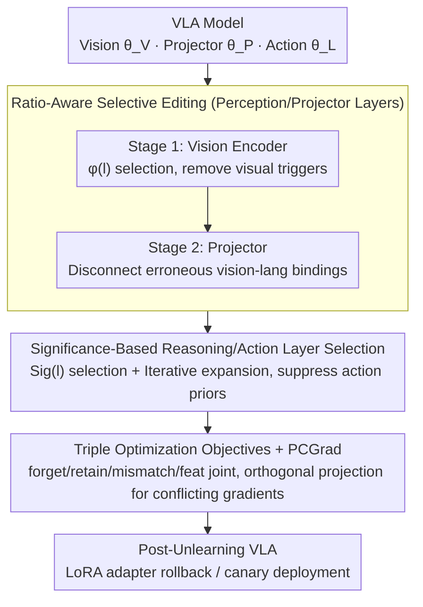

# VLA-Forget: Vision-Language-Action Unlearning for Embodied Foundation Models

**Conference**: ACL 2026  
**arXiv**: [2604.03956](https://arxiv.org/abs/2604.03956)  
**Code**: [GitHub](https://github.com/raviranjan-ai/VLA-Forget)  
**Area**: Multimodal VLM  
**Keywords**: Machine Unlearning, VLA Models, Embodied AI, Multimodal Unlearning, Selective Editing

## TL;DR
VLA-Forget is proposed as the first hybrid unlearning framework for Vision-Language-Action (VLA) models. By employing ratio-aware selective editing for perception/cross-modal layers and significance-based selective editing for reasoning/action layers, it achieves target behavior removal while maintaining perception accuracy (+22%) and task success rate (+9%).

## Background & Motivation

**Background**: VLA models (e.g., OpenVLA) serve as embodied foundation models, directly transforming natural language instructions and visual observations into robot actions. OpenVLA integrates DINOv2 and SigLIP visual encoders with a Llama 2 backbone to achieve 7-DoF robotic arm control via action token prediction.

**Limitations of Prior Work**: Deployed VLA policies may retain unsafe behaviors, privacy-sensitive content, or spurious shortcuts. Errors in robotics translate into physical actions, carrying far more severe consequences than text or image models. Existing unlearning methods (e.g., SSD, SalUn) are designed for single modalities and fail to address the distributed encoding of undesirable behaviors across perception, alignment, and action layers in VLAs.

**Key Challenge**: Undesirable behaviors in VLA models may be simultaneously encoded in visual features $\theta_V$, cross-modal projections $\theta_P$, and action priors $\theta_L$. Editing only the visual layer may leave action priors intact, while editing only the language layer may preserve harmful perceptual shortcuts.

**Goal**: Design a component-aware unlearning framework to simultaneously optimize three objectives: unlearning efficacy, perception specificity, and reasoning utility.

**Key Insight**: VLA unlearning is decomposed into three stages—perception unlearning, cross-modal unlearning, and reasoning/action unlearning—with distinct layer selection strategies for each stage.

**Core Idea**: Ratio-aware scoring selects perception layers that significantly impact unlearning with minimal gradient conflict with retained tasks; significance ratio selects critical reasoning layers; and stage-wise adapter updates ensure rollback capability.

## Method

### Overall Architecture
The framework employs a three-stage layered unlearning pipeline: (1) the visual encoder stage removes visual triggers, (2) the projector stage disconnects erroneous vision-language bindings, and (3) the upper Transformer stage suppresses instruction-conditioned action priors. Ratio-Aware layer selection is used for the first two perception-related stages, while Significance-Based selection is applied to the reasoning/action stage. All updates are applied to LoRA adapters to support rollback and canary deployment, stabilized by triple optimization objectives combined with PCGrad to handle multi-objective gradient conflicts.

### Key Designs

**1. Ratio-Aware Selective Editing (Perception/Projector): Targeting layers with high unlearning contribution and low retention interference**

Global editing of vision and projector parameters can lead to collateral damage in normal perception. A trade-off score $\phi(l)$ is calculated for each layer $l$, considering both unlearning importance and conflict with retained tasks:

$$\phi(l) = \frac{\|g_l^f\|_2}{\|\theta_l\|_2 + \epsilon} \cdot \big(1 - \cos(g_l^f, g_l^r)\big)^\alpha,$$

where $g_l^f$ and $g_l^r$ represent the unlearning and retention gradients, respectively. A large gradient norm indicates the layer's importance for unlearning, while a low cosine similarity indicates that updates will not significantly interfere with retained tasks. Updating the top-K layers ensures targeted removal of harmful parameters with minimal impact on clean tasks.

**2. Significance-Based Reasoning/Action Layer Selection: Achieving sufficient unlearning with minimal updates**

Action priors are distributed across multiple Transformer blocks. An iterative strategy uses a significance ratio:

$$Sig(l) = \frac{\|\nabla_{\theta_l} L_{forget}\|_2}{\|\nabla_{\theta_l} L_{retain}\|_2 + \epsilon},$$

Layers with high $Sig(l)$ are ideal for editing. The process starts with top-k layers and iteratively expands the set if unlearning is insufficient, balancing efficacy with minimal model modification.

**3. Triple Optimization Objectives + PCGrad Stabilization: Ensuring precise and controlled unlearning**

Unlearning is constrained by multiple objectives to prevent performance collapse:

$$\min_\theta\; L_{retain} + \lambda_{feat} L_{feat} - \lambda_f L_{forget} - \lambda_m L_{mismatch},$$

where $L_{forget}$ uses gradient ascent to suppress target behaviors, $L_{retain}$ uses CE + KL to anchor non-target behaviors, $L_{mismatch}$ uses KL divergence to push the model away from original responses, and $L_{feat}$ distills visual representations to maintain grounding. PCGrad projects conflicting gradients onto orthogonal directions to ensure stable joint optimization.

### Loss & Training
LoRA adapters are updated stage-wise (Vision $\rightarrow$ Projector $\rightarrow$ Reasoning/Action). Unlearning efficacy is evaluated after each stage to determine if further layer expansion is necessary. PCGrad handles multi-objective conflicts. Post-quantization recovery risks are evaluated after training.

## Key Experimental Results

### Main Results

| Method | FC↑ | RC↑ | FAD↑ | RAD↓ | TSR↑ | SVR↓ |
|------|-----|-----|------|------|------|------|
| SSD | 78 | 83 | 0.70 | 0.28 | 68 | 17 |
| SalUn | 89 | 88 | 0.76 | 0.26 | 71 | 12 |
| GA | 93 | 60 | 0.89 | 0.45 | 40 | 5 |
| NPO | 90 | 88 | 0.83 | 0.23 | 74 | 8 |
| Ours | **93** | **91** | **0.88** | **0.21** | **78** | **5** |

### Ablation Study

| Configuration | FC↑ | RC↑ | TSR↑ | Description |
|------|-----|-----|------|------|
| Ours (Full) | 93 | 91 | 78 | Full three-stage pipeline |
| Vision-only Unlearning | ~85 | ~87 | ~70 | Residual behaviors remain in action priors |
| Language-only Unlearning (GA) | 93 | 60 | 40 | Effective unlearning but utility collapse |
| w/o PCGrad | - | - | - | Training instability due to gradient conflict |

### Key Findings
- Efficacy increased by 10%, perception specificity improved by 22%, utility retention improved by 9%, and post-quantization recovery (SVR) decreased by 55%.
- Pure gradient ascent (GA) achieves high unlearning (FC=93) but catastrophic utility loss (RC=60, TSR=40), proving global editing is unfeasible for VLAs.
- Stage-wise design is critical; editing only the vision layer fails to remove residual behaviors in action priors.
- Mismatch loss effectively reduces the risk of behavior recovery after model quantization.

## Highlights & Insights
- Introduces machine unlearning to VLA embodied models, revealing the challenge of distributed behavior encoding across multimodal components.
- The Ratio-aware layer selection is more precise than simple top-k gradient selection by accounting for interference with retained tasks.
- The adapter-first design allows for reversible unlearning, facilitating safety audits in practical deployments.

## Limitations & Future Work
- As an approximate unlearning method, it does not provide certified erasure guarantees.
- Currently validated on OpenVLA-7B and pi0fast-base; testing on larger models is required.
- Hyperparameters ($\lambda_f, \lambda_m, \lambda_{feat}$) require tuning for different scenarios.
- Evaluation was primarily conducted in simulation; real-world robot validation is needed.

## Related Work & Insights
- **vs SSD/SalUn**: Vision-centric methods that fail to address cross-modal behavior distribution in VLAs.
- **vs GA/NPO**: Language-centric methods; GA is too aggressive, while NPO lacks component awareness.
- **vs SCRUB**: Improves trade-offs but does not handle multimodal entanglement.

## Rating
- Novelty: ⭐⭐⭐⭐⭐ First to introduce unlearning to VLA models with original problem formulation.
- Experimental Thoroughness: ⭐⭐⭐⭐ Extensive baselines and ablations, though real-robot evaluation is absent.
- Writing Quality: ⭐⭐⭐⭐ Clear methodology and logical stage-wise flow.
- Value: ⭐⭐⭐⭐ High utility as safe unlearning becomes essential for VLA deployment.

<!-- RELATED:START -->

## Related Papers

- [\[ACL 2026\] Forget What Matters, Keep the Rest: Selective Unlearning of Informative Tokens](forget_what_matters_keep_the_rest_selective_unlearning_of_informative_tokens.md)
- [\[CVPR 2026\] Designing to Forget: Deep Semi-parametric Models for Unlearning](../../CVPR2026/llm_safety/designing_to_forget_deep_semi-parametric_models_for_unlearning.md)
- [\[CVPR 2026\] Which Concepts to Forget and How to Refuse? Decomposing Concepts for Continual Unlearning in Large Vision-Language Models](../../CVPR2026/llm_safety/which_concepts_to_forget_and_how_to_refuse_decomposing_concepts_for_continual_un.md)
- [\[ACL 2026\] ATAAT: Adaptive Threat-Aware Adversarial Tuning Framework against Backdoor Attacks on Vision-Language-Action Models](ataat_adaptive_threat-aware_adversarial_tuning_framework_against_backdoor_attack.md)
- [\[CVPR 2026\] VL-Eraser: Vacuum Distillation for Machine Unlearning in Vision-Language Models](../../CVPR2026/llm_safety/vl-eraser_vacuum_distillation_for_machine_unlearning_in_vision-language_models.md)

<!-- RELATED:END -->
