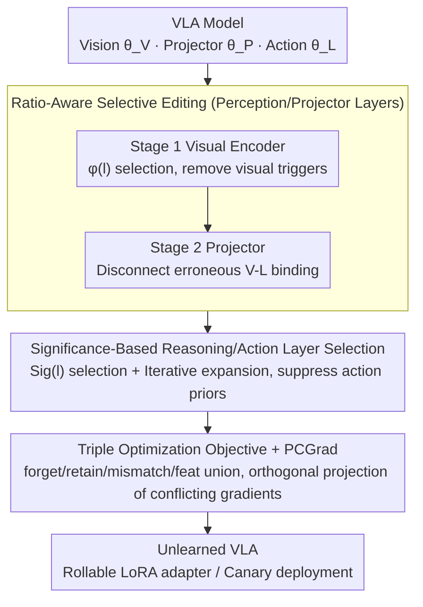

# VLA-Forget: Vision-Language-Action Unlearning for Embodied Foundation Models

**Conference**: ACL 2026  
**arXiv**: [2604.03956](https://arxiv.org/abs/2604.03956)  
**Code**: [GitHub](https://github.com/raviranjan-ai/VLA-Forget)  
**Area**: Multimodal VLM  
**Keywords**: Machine Unlearning, VLA Models, Embodied Intelligence, Multimodal Unlearning, Selective Editing

## TL;DR
Ours proposes VLA-Forget, the first hybrid unlearning framework for Vision-Language-Action (VLA) models. By employing ratio-aware selective editing for perception/cross-modal layers and significance-based selective editing for reasoning/action layers, it achieves target behavior removal while maintaining perception accuracy (+22%) and task success rate (+9%).

## Background & Motivation

**Background**: VLA models (e.g., OpenVLA) serve as embodied foundation models, directly transforming natural language instructions and visual observations into robotic actions. OpenVLA integrates DINOv2+SigLIP visual encoders with a Llama 2 backbone to achieve 7-DoF robotic arm control via action token prediction.

**Limitations of Prior Work**: Deployed VLA policies may retain unsafe behaviors, privacy-sensitive content, or spurious shortcuts. Since errors in robotics translate into physical actions, the consequences are far more severe than in text or image models. Existing unlearning methods (e.g., SSD, SalUn) are designed for single modalities and struggle to handle the distributed encoding of undesirable behaviors across perception, alignment, and action layers in VLAs.

**Key Challenge**: Undesirable behaviors in VLA models may be simultaneously encoded in visual features $\theta_V$, cross-modal projections $\theta_P$, and action priors $\theta_L$. Editing only visual layers might leave action priors intact, while editing only language layers might preserve harmful perceptual shortcuts.

**Goal**: Design a component-aware unlearning framework that simultaneously optimizes three objectives: target unlearning (efficacy), perception maintenance (specificity), and reasoning retention (utility).

**Key Insight**: VLA unlearning is decomposed into three stages—perceptual unlearning, cross-modal unlearning, and reasoning/action unlearning—using different layer selection strategies for each stage.

**Core Idea**: Ratio-aware score selection identifies perceptual layers that significantly impact unlearning with minimal conflict with retention gradients. Significance ratio selection identifies reasoning layers critical for unlearning. Stage-wise adapter updates ensure the process remains rollable.

## Method

### Overall Architecture
A three-stage hierarchical unlearning workflow: (1) Visual encoder stage to remove visual triggers, (2) Projector stage to disconnect erroneous vision-language bindings, and (3) Upper Transformer stage to suppress instruction-conditioned action priors. The first two perception-related stages share Ratio-Aware layer selection, while the third reasoning/action stage utilizes Significance-Based selection. All updates are applied to LoRA adapters to support rollbacks and canary deployments, stabilized by a triple optimization objective combined with PCGrad to handle multi-objective gradient conflicts.

### Key Designs

**1. Ratio-Aware Selective Editing (Perception/Projector Layers): Modifying only layers with high unlearning contribution and low retention interference**

Global editing of vision and projector parameters can inadvertently damage normal perception, leading to collateral damage more critical than the unlearning itself. A trade-off score is calculated for each layer $l$, considering both "unlearning importance" and "conflict with retention tasks":

$$\phi(l) = \frac{\|g_l^f\|_2}{\|\theta_l\|_2 + \epsilon} \cdot \big(1 - \cos(g_l^f, g_l^r)\big)^\alpha,$$

where $g_l^f$ and $g_l^r$ are the unlearning and retention gradients for that layer, respectively. A large gradient norm indicates the layer's importance for unlearning, while low cosine similarity between gradients suggests that modification will not disrupt retention. Updating the top-K layers effectively targets those encoding undesirable behaviors while staying away from normal perception.

**2. Significance-Based Reasoning/Action Layer Selection: Achieving sufficient unlearning with minimal update sets**

Action priors are distributed across multiple upper Transformer blocks rather than concentrated in a single layer. Modifying too many layers is risky, while too few may result in incomplete unlearning. A significance ratio is calculated for each upper block:

$$Sig(l) = \frac{\|\nabla_{\theta_l} L_{forget}\|_2}{\|\nabla_{\theta_l} L_{retain}\|_2 + \epsilon},$$

Layers with large numerators and small denominators are ideal editing points. The process begins by editing top-k layers and iteratively expands the set if unlearning remains insufficient. This strategy automatically balances sufficient unlearning and minimal interference.

**3. Triple Optimization Objective + PCGrad Stabilization: Constraining unlearning as a precise, controllable process**

Naive gradient ascent causes overall performance collapse; thus, unlearning must be constrained by multiple objectives. The unified objective is:

$$\min_\theta\; L_{retain} + \lambda_{feat} L_{feat} - \lambda_f L_{forget} - \lambda_m L_{mismatch},$$

where $L_{forget}$ suppresses target behaviors via gradient ascent, $L_{retain}$ anchors non-target behaviors using CE and KL divergence, $L_{mismatch}$ uses KL divergence to push the model away from original unlearning responses to prevent recovery, and $L_{feat}$ preserves non-target visual grounding through representation distillation. PCGrad is utilized to project conflicting gradients into orthogonal directions, ensuring stable joint descent.

### Loss & Training
LoRA adapters are updated stage-wise (Vision → Projector → Reasoning/Action). Unlearning efficacy is evaluated at the end of each stage to decide whether to expand the updated layers. PCGrad handles multi-objective conflicts. Post-training evaluation includes post-quantization recovery risk assessment.

## Key Experimental Results

### Main Results

| Method | FC↑ | RC↑ | FAD↑ | RAD↓ | TSR↑ | SVR↓ |
|------|-----|-----|------|------|------|------|
| SSD | 78 | 83 | 0.70 | 0.28 | 68 | 17 |
| SalUn | 89 | 88 | 0.76 | 0.26 | 71 | 12 |
| GA | 93 | 60 | 0.89 | 0.45 | 40 | 5 |
| NPO | 90 | 88 | 0.83 | 0.23 | 74 | 8 |
| VLA-Forget | **93** | **91** | **0.88** | **0.21** | **78** | **5** |

### Ablation Study

| Configuration | FC↑ | RC↑ | TSR↑ | Note |
|------|-----|-----|------|------|
| VLA-Forget (Full) | 93 | 91 | 78 | Full three-stage process |
| Vision Only | ~85 | ~87 | ~70 | Failed to remove residues in action priors |
| Language Only (GA) | 93 | 60 | 40 | Effective unlearning but severe utility collapse |
| w/o PCGrad | - | - | - | Training instability due to gradient conflict |

### Key Findings
- Gain in unlearning efficacy by 10%, perception specificity by 22%, and reasoning utility by 9%. Post-quantization recovery rate decreased by 55%.
- GA (pure gradient ascent) achieves the most thorough unlearning (FC=93) but suffers from utility collapse (RC=60, TSR=40), proving global editing is unfeasible for VLAs.
- The three-stage hierarchical design is critical; editing only visual layers cannot eliminate residual behaviors in action priors.
- Post-quantization recovery (SVR) poses a real threat to VLA deployment; the mismatch loss effectively mitigates this risk.

## Highlights & Insights
- This work introduces the machine unlearning problem to VLA embodied models for the first time, revealing the unique challenge of distributed encoding of undesirable behaviors across components. This is significantly more complex than text/image unlearning as it requires evaluating physical execution.
- The Ratio-aware layer selection is practical—considering both unlearning importance and retention interference is more precise than simple top-k gradient selection.
- The adapter-first design allows unlearning to be rollable, making it suitable for security auditing in production.

## Limitations & Future Work
- As an approximate unlearning method, it does not provide certified removal guarantees.
- Validation was limited to OpenVLA-7B and pi0fast-base; larger VLA models require further testing.
- Hyperparameters ($\lambda_f, \lambda_m, \lambda_{feat}$) require tuning for different scenarios.
- Evaluation was primarily conducted in simulation; real-world robot deployment validation is needed.
- Future work could explore multi-turn interactive unlearning and the integration of continual learning with unlearning.

## Related Work & Insights
- **vs SSD/SalUn**: These visual-side unlearning methods cannot handle undesirable behaviors distributed across modalities in VLAs.
- **vs GA/NPO**: These language-side unlearning methods are either too aggressive (GA) causing collapse or are not sufficiently component-aware (NPO).
- **vs SCRUB**: While it improves the unlearning-retention trade-off, it does not address multimodal entanglement.

## Rating
- Novelty: ⭐⭐⭐⭐⭐ First to introduce machine unlearning to VLA models with original problem definition and design.
- Experimental Thoroughness: ⭐⭐⭐⭐ Extensive baseline comparisons and ablations, though real-robot evaluation is missing.
- Writing Quality: ⭐⭐⭐⭐ Clear methodological exposition and logical flow of the three-stage process.
- Value: ⭐⭐⭐⭐ Secure unlearning will become a necessity as VLA model deployment grows.

<!-- RELATED:START -->

## Related Papers

- [\[ACL 2026\] Forget What Matters, Keep the Rest: Selective Unlearning of Informative Tokens](forget_what_matters_keep_the_rest_selective_unlearning_of_informative_tokens.md)
- [\[CVPR 2026\] Designing to Forget: Deep Semi-parametric Models for Unlearning](../../CVPR2026/llm_safety/designing_to_forget_deep_semi-parametric_models_for_unlearning.md)
- [\[ACL 2026\] ATAAT: Adaptive Threat-Aware Adversarial Tuning Framework against Backdoor Attacks on Vision-Language-Action Models](ataat_adaptive_threat-aware_adversarial_tuning_framework_against_backdoor_attack.md)
- [\[CVPR 2026\] SineProject: Machine Unlearning for Stable Vision–Language Alignment](../../CVPR2026/llm_safety/sineproject_machine_unlearning_for_stable_vision_language_alignment.md)
- [\[ACL 2026\] Rethinking Jailbreak Detection of Large Vision Language Models with Representational Contrastive Scoring](rethinking_jailbreak_detection_of_large_vision_language_models_with_representati.md)

<!-- RELATED:END -->
