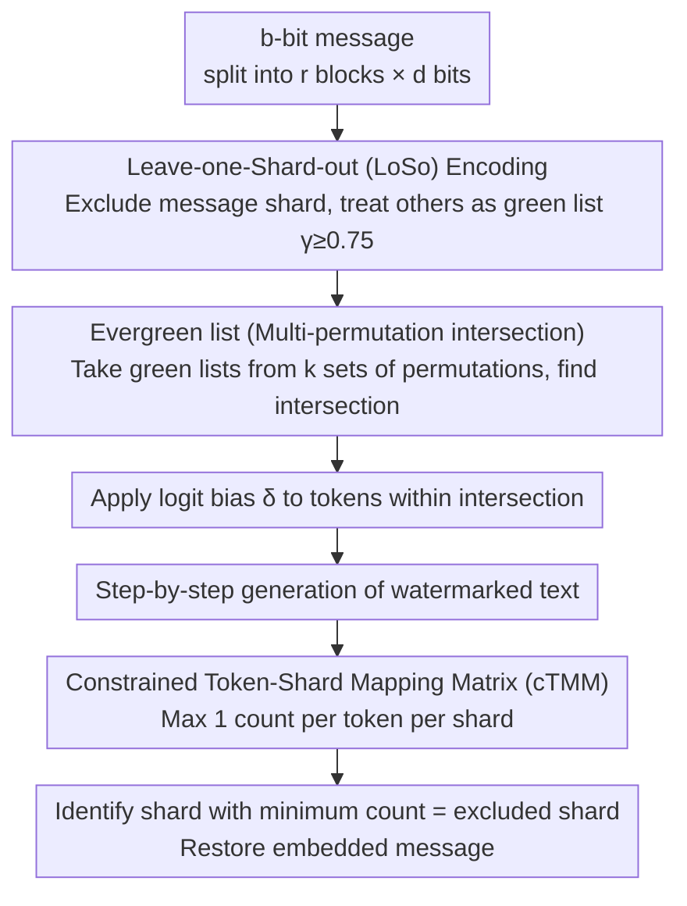

# XMark: Reliable Multi-Bit Watermarking for LLM-Generated Texts

**Conference**: ACL 2026  
**arXiv**: [2604.05242](https://arxiv.org/abs/2604.05242)  
**Code**: [https://github.com/JiiahaoXU/XMark](https://github.com/JiiahaoXU/XMark)  
**Area**: Text Watermarking  
**Keywords**: Multi-bit watermarking, LLM text detection, digital watermarking, text provenance, logit perturbation

## TL;DR

Ours proposes XMark, a multi-bit text watermarking method based on the Leave-one-Shard-out (LoSo) strategy and evergreen lists. By intersecting green lists arranged across multiple vocabulary permutations and constraining the token-shard mapping matrix, it significantly improves decoding accuracy under limited token conditions while maintaining text quality.

## Background & Motivation

**Background**: Multi-bit text watermarking can embed extractable binary information, such as user IDs and timestamps, into LLM-generated text for provenance and attribution of malicious use. Existing methods are categorized into distortion-free methods (watermarked text follows the same distribution as unwatermarked text) and logit perturbation methods (embedding information by modifying logits).

**Limitations of Prior Work**: (1) Early methods (CycleShift, CTWL, DepthW) require brute-force enumeration of all candidate messages during decoding, making long messages computationally infeasible; (2) MPAC adopts block-based encoding/decoding to solve the feasibility issue, but limits the green list ratio to $\gamma \leq 0.25$, leading to severe distortion in token sampling probabilities and significant degradation in text quality; (3) StealthInk improves text quality but weakens the watermark signal, reducing decoding accuracy; (4) **All methods suffer a sharp drop in decoding accuracy when the number of available tokens is limited**, whereas short texts are common in practical scenarios.

**Key Challenge**: A fundamental trade-off exists between text quality and decoding accuracy—a larger green list reduces distributional distortion but weakens the watermark signal, while a smaller green list strengthens the signal but severely impacts quality. This contradiction is particularly acute under limited token conditions.

**Goal**: Simultaneously improve the quality of watermarked text and decoding accuracy under limited token conditions.

**Key Insight**: Inverting the green list selection strategy—instead of using the shard corresponding to the encoded message as the green list (as in MPAC), exclude that shard and use all remaining shards as the green list, increasing the green list ratio from $\leq 0.25$ to $\geq 0.75$.

**Core Idea**: Use Leave-one-Shard-out to improve text quality, use the intersection of multiple permuted evergreen lists to increase the number of observations per token to compensate for signal intensity, and use a constrained TMM to prevent counter explosion in unperturbed shards.

## Method

### Overall Architecture

XMark aims to simultaneously address two persistent issues in multi-bit watermarking: the degradation of text quality caused by small green lists and the inaccuracy of decoding under limited token counts due to weak signals. It follows the block encoding/decoding paradigm—partitioning a $b$-bit message into $r$ blocks of $d$ bits each, where each token embeds information from one block during generation, and blocks are recovered sequentially from suspect text during detection. The primary novelty lies in three components: the encoding side first uses Leave-one-Shard-out to invert green list selection for quality preservation, then uses multiple permuted evergreen lists to recover the weakened watermark signal, while the decoding side uses a constrained mapping matrix (cTMM) to block counting biases introduced by multiple permutations. These three components are interconnected and mutually dependent.

### Key Designs

**1. Leave-one-Shard-out (LoSo) Encoding: Inverting green list selection to minimize distributional distortion**

The root cause of quality degradation is the small size of the green list. Methods like MPAC treat the shard corresponding to the message value $[\mathbf{m}_i]_{10}$ as the green list for perturbation, where the green list ratio $\gamma = 2^{-d} \leq 0.25$—meaning only a quarter of the vocabulary remains unchanged, severely distorting the logit distribution. LoSo simply reverses this choice: instead of "selecting" the message shard, it "excludes" it and treats all other shards as the green list. Thus, $\gamma = 1 - 2^{-d} \geq 0.75$, leaving the distribution of over three-quarters of the vocabulary intact, making the generated text nearly identical to the unwatermarked version. During detection, the operation is reversed—the shard with the fewest tokens is identified as the excluded one, corresponding to the embedded message. For example, if $d=2$ and $\mathbf{m}_i = 11$, $\mathcal{S}_3$ is excluded while $\mathcal{S}_0, \mathcal{S}_1, \mathcal{S}_2$ are perturbed; the decoder recovers 11 if $\mathcal{S}_3$ has the lowest count.

**2. Evergreen list (Multi-permutation intersection): Amplifying the information contribution of each token by $k$ times while maintaining a large green list**

Using LoSo alone has a drawback: the large green list dilutes the watermark signal, leading to lower bit accuracy under a single permutation compared to MPAC. XMark compensates for this by generating $k$ sets of vocabulary permutations using $k$ different hash keys. For each set, a green list $\mathcal{G}_j$ is obtained via LoSo, and their intersection is used as the actual evergreen list for perturbation:

$$\mathcal{E} = \bigcap_{j=0}^{k-1} \mathcal{G}_j, \qquad \mathbb{E}[\gamma] \approx (1-2^{-d})^k$$

Logit bias is only applied to tokens falling within $\mathcal{E}$. In this way, the expected green list ratio remains controllable (shrinking with $k$ but not collapsing as small as MPAC), while each token can be observed once in each of the $k$ permutations during decoding. Thus, $T$ tokens provide up to $kT$ observations—increasing the number of observations by $k$ times, which compensates for the signal loss in LoSo and restores reliability under limited tokens. The hyperparameter $k$ serves as a "knob" between quality and accuracy.

**3. Constrained Token-Shard Mapping Matrix (cTMM): Plugging the loophole of overcounting unperturbed shards caused by multi-permutations**

The evergreen list introduces a side effect: during standard TMM statistics, a single token might be mapped to the same unperturbed shard across all $k$ permutations, causing that shard to be overcounted up to $k$ times. This can overwhelm the expected gap between "perturbed vs. unperturbed" shards, leading to incorrect decoding. The cTMM fix is straightforward—constraining each token to contribute at most 1 count to each shard:

$$\mathbf{A}^t[i,:] - \mathbf{A}^{t-1}[i,:] \in \{0,1\}^{2^d}$$

With this constraint, tokens that do not belong to any green list contribute only once to an unperturbed shard, regardless of how many permutations they span. This preserves the relative advantage of perturbed shards, allowing the signals accumulated by LoSo and the evergreen list to be correctly extracted.

### Loss & Training

XMark is a training-free inference-time watermarking method. Encoding involves adding a positive bias $\delta$ to the logits of tokens in the evergreen list during step-by-step LLM generation; default $d=2$ (2 bits per block), with $k$ as the hyperparameter for the quality-accuracy trade-off.

## Key Experimental Results

### Main Results

Text completion task (LLaMA-2-7B, C4 dataset, b=8 bits):

| Method | T=150 BA↑ | T=300 BA↑ | Avg. PPL↓ | Description |
|------|----------|----------|----------|------|
| MPAC | 94.00 | 98.25 | 5.08 | Small green list, poor quality |
| StealthInk | 85.00 | 92.50 | 4.13 | Good quality but low accuracy |
| CycleShift | 95.25 | 98.25 | 5.06 | Requires brute force |
| XMark | **98.75** | **100.00** | **4.61** | Superior quality and accuracy |

The PPL of unwatermarked text is 3.97; XMark's PPL is the closest.

### Ablation Study

| Configuration | T=100 BA↑ | Description |
|------|----------|------|
| LoSo (k=1) | 74.12 | Signal too weak |
| MPAC | 83.62 | Small green list but strong signal |
| XMark (LoSo+evergreen+cTMM) | ~95+ | Synergy of the triple design |
| XMark using TMM instead of cTMM | Decrease | Unperturbed shard count explosion |

### Key Findings

- XMark outperforms all baselines in both accuracy and text quality across all token budgets (T=150-300).
- **Greatest advantage under limited token conditions**: At T=150, XMark achieves a BA of 98.75% vs. MPAC's 94.00%, a 4.75% Gain.
- The advantage is even more pronounced on harder tasks like text summarization—XMark BA 79.81% vs. MPAC 76.94%, with a PPL 1.28 lower.
- The hyperparameter $k$ effectively controls the quality-accuracy trade-off: increasing $k$ improves accuracy but slightly increases PPL.

## Highlights & Insights

- The **"inversion" thinking of the LoSo strategy** is very elegant—simply inverting the green list selection increases $\gamma$ from $\leq 0.25$ to $\geq 0.75$, significantly reducing distributional distortion. This approach is similar to the "parity bit" concept in error-correcting codes.
- The **constraint design of cTMM** precisely solves the decoding bias introduced by the evergreen list—ensuring each token contributes at most once to each shard prevents the counting explosion caused by multiple permutations.
- The three designs (LoSo, evergreen list, cTMM) form a tightly coupled whole—LoSo addresses quality but loses signal, the evergreen list restores signal but introduces bias, and cTMM eliminates the bias.

## Limitations & Future Work

- Validated only on LLaMA-2-7B; performance on larger or newer models is unknown.
- Limited robustness analysis against editing attacks (paraphrasing, deletion, etc.).
- The choice of $k$ needs to be tuned for each specific scenario.
- Security analysis of multi-bit watermarking (whether it can be maliciously extracted or forged) was not discussed in depth.

## Related Work & Insights

- **vs MPAC**: MPAC uses the shard corresponding to the message as the green list ($\gamma=2^{-d}$), while XMark inverts this to exclude that shard ($\gamma=1-2^{-d}$). Combined with the evergreen list and cTMM, Ours surpasses MPAC in both quality and accuracy.
- **vs StealthInk**: StealthInk improves quality by directly increasing the probability of tokens with large logits but weakens the signal. XMark provides a more fundamental solution by enhancing the signal through the intersection of multiple permutations while maintaining a large green list.

## Rating

- Novelty: ⭐⭐⭐⭐ The combined design of LoSo + evergreen list + cTMM is creative, though the technical complexity of individual components is moderate.
- Experimental Thoroughness: ⭐⭐⭐⭐ Sufficient comparison across multiple tasks and baselines; analysis under different token budgets is valuable, but model diversity is lacking.
- Writing Quality: ⭐⭐⭐⭐⭐ Rigorous mathematical derivation, clear design motivation, and helpful illustrations.
- Value: ⭐⭐⭐⭐ High practical value for limited token scenarios, though competition in the watermarking field is intense.

<!-- RELATED:START -->

## Related Papers

- [\[ICML 2025\] Robust Multi-bit Text Watermark with LLM-based Paraphrasers](../../ICML2025/llm_safety/robust_multi-bit_text_watermark_with_llm-based_paraphrasers.md)
- [\[ACL 2026\] STELA: A Linguistics-Aware LLM Watermarking via Syntactic Predictability](a_linguistics-aware_llm_watermarking_via_syntactic_predictability.md)
- [\[ACL 2026\] SSG: Logit-Balanced Vocabulary Partitioning for LLM Watermarking](ssg_logit-balanced_vocabulary_partitioning_for_llm_watermarking.md)
- [\[ICLR 2026\] Reliable Weak-to-Strong Monitoring of LLM Agents](../../ICLR2026/llm_safety/reliable_weak-to-strong_monitoring_of_llm_agents.md)
- [\[ACL 2026\] MemoPhishAgent: Memory-Augmented Multi-Modal LLM Agent for Phishing URL Detection](memophishagent_memory-augmented_multi-modal_llm_agent_for_phishing_url_detection.md)

<!-- RELATED:END -->
